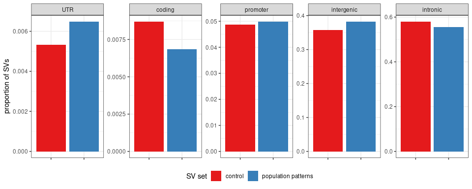
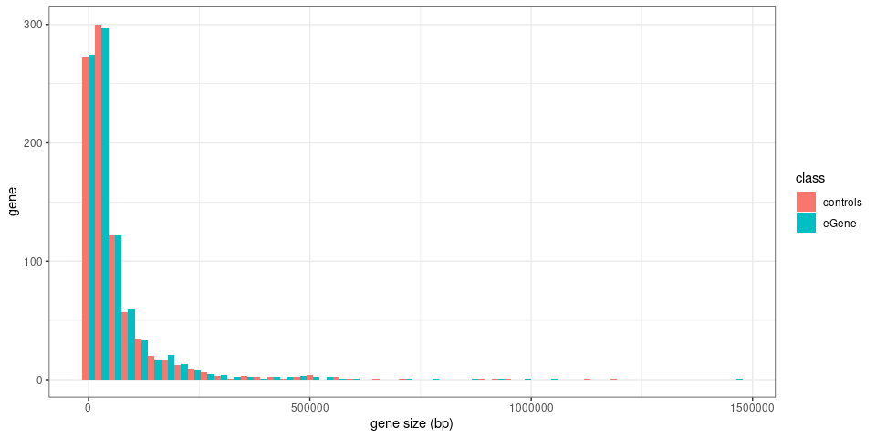
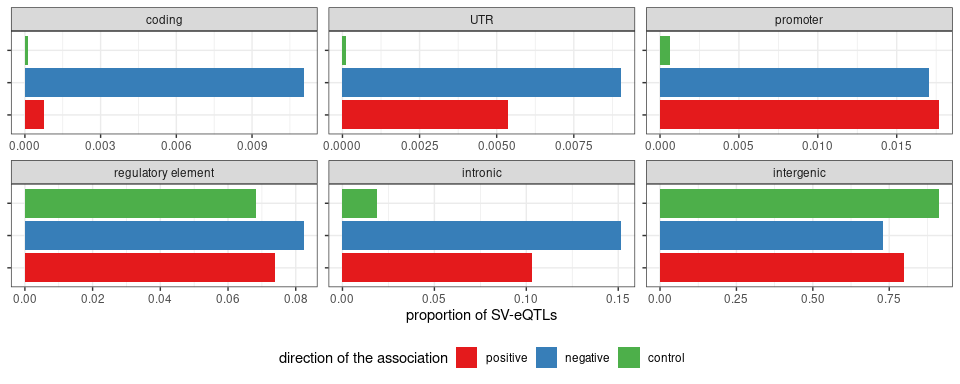

Annotate SVs with functional information
================

  - [Gene annotation](#gene-annotation)
  - [SVs genotyped in 2,504 samples from 1000 Genomes
    Project](#svs-genotyped-in-2504-samples-from-1000-genomes-project)
  - [Coding SVs](#coding-svs)
  - [SVs with different frequency across
    populations](#svs-with-different-frequency-across-populations)
  - [Novel (compared to
    gnomAD-SV/1000GP)](#novel-compared-to-gnomad-sv1000gp)
  - [eQTLs](#eqtls)
  - [Example: population-specific, novel and
    coding](#example-population-specific-novel-and-coding)
  - [Examples: population-specific, novel and
    eQTL](#examples-population-specific-novel-and-eqtl)
  - [Examples: novel and eQTL in coding/promoter/UTR region of the
    associated
    gene](#examples-novel-and-eqtl-in-codingpromoterutr-region-of-the-associated-gene)
  - [Figures](#figures)

``` r
library(dplyr)
library(sveval)
library(GenomicRanges)
library(ggplot2)
library(gridExtra)
library(knitr)
library(rtracklayer)
## list of graphs
ggp = list()
```

## Gene annotation

``` r
if(!file.exists('gencode.v35.annotation.gtf.gz')){
  download.file('ftp://ftp.ebi.ac.uk/pub/databases/gencode/Gencode_human/release_35/gencode.v35.annotation.gtf.gz', 'gencode.v35.annotation.gtf.gz')
}

genc = import('gencode.v35.annotation.gtf.gz')

types.ranked = c('CDS', 'UTR', 'promoter', 'gene')
types.labels = c('coding', 'UTR', 'promoter', 'intronic')
genc = subset(genc, type %in% types.ranked)
prom = promoters(subset(genc, type=='gene'))
prom$type = 'promoter'
genc = c(genc, prom)
mcols(genc) = mcols(genc)[,c('type', 'gene_name', 'gene_type', 'gene_id')]
genc$gene_id = gsub('\\..*', '', genc$gene_id)
```

## SVs genotyped in 2,504 samples from 1000 Genomes Project

``` r
## SVs grouped by site ('svsite' and 'clique' columns)
kgp = read.table('svs.2504kgp.svsite80al.tsv.gz', as.is=TRUE, header=TRUE)

## stats for each SV locus
## use the most frequent allele (and then the largest) for ac/af/size
## also saves sum/max/min across all alleles
kgp.s = kgp %>% arrange(desc(af), desc(size)) %>%
  group_by(seqnames, svsite, type, clique) %>%
  summarize(start=start[1], end=end[1], ac=ac[1], af=af[1], size=size[1], .groups='drop') %>%
  filter(size>=50) %>% makeGRangesFromDataFrame(keep.extra.columns=TRUE)
```

## Coding SVs

``` r
genc.pc.cds = subset(genc, type=='CDS' & gene_type=='protein_coding')
ol.cds = findOverlaps(kgp.s, genc.pc.cds) %>% as.data.frame %>%
  mutate(gene=genc.pc.cds$gene_name[subjectHits]) %>%
  group_by(queryHits) %>% summarize(gene=paste(unique(sort(gene)), collapse=';'))

kgp.cds = kgp.s[ol.cds$queryHits]
kgp.cds$gene = ol.cds$gene

length(kgp.cds)
```

    ## [1] 1599

## SVs with different frequency across populations

``` r
freq.all = read.table('2504kgp.svsite80al.superpopfreq.tsv.gz', as.is=TRUE, header=TRUE)
pop.spec = read.table('pops-freq-1kgp-med1.tsv', as.is=TRUE, header=TRUE)
kgp.ps = subset(kgp.s, svsite %in% pop.spec$svsite)
```

### SVs in coding/promoter/UTR/intronic regions

``` r
length(subsetByOverlaps(kgp.ps, subset(genc, gene_type=='protein_coding')))
```

    ## [1] 10617

### Overlap with gene annotation and enrichment

``` r
## overlap pop=spec SVs with gene annotation
ol.genc = findOverlaps(kgp.ps, genc) %>% as.data.frame %>%
  mutate(svsite=kgp.ps$svsite[queryHits],
         gene.name=genc$gene_name[subjectHits],
         gene=genc$gene_id[subjectHits],
         gene_type=genc$gene_type[subjectHits],
         impact=genc$type[subjectHits],
         impact=factor(impact, levels=types.ranked, labels=types.labels)) %>%
  arrange(impact) %>% 
  group_by(svsite, gene, gene.name, gene_type) %>%
  summarize(impact=head(impact, 1))
ps.ol = merge(pop.spec, ol.genc, all.x=TRUE) %>%
  mutate(impact=ifelse(is.na(impact), 'intergenic', as.character(impact)))

## control: SVs with similar frequencies
null = merge(freq.all, pop.spec, all.x=TRUE) %>%
  mutate(target=!is.na(af.med), af.c=cut(af, seq(0,1,.01))) %>%
  group_by(Superpopulation, af.c) %>% mutate(n=sum(target)) %>%
  filter(!target, n>0) %>% 
  group_by(Superpopulation, af.c) %>% do({sample_n(., n[1])})
kgp.null = subset(kgp.s, svsite %in% null$svsite)
ol.genc = findOverlaps(kgp.null, genc) %>% as.data.frame %>%
  mutate(svsite=kgp.null$svsite[queryHits],
         gene.name=genc$gene_name[subjectHits],
         gene=genc$gene_id[subjectHits],
         gene_type=genc$gene_type[subjectHits],
         impact=genc$type[subjectHits],
         impact=factor(impact, levels=types.ranked, labels=types.labels)) %>%
  arrange(impact) %>% 
  group_by(svsite, gene, gene.name, gene_type) %>%
  summarize(impact=head(impact, 1))
ps.ol.null = merge(null, ol.genc, all.x=TRUE) %>%
  mutate(impact=ifelse(is.na(impact), 'intergenic', as.character(impact)))

ps.enr = rbind(ps.ol,
               ps.ol.null %>% select(-af.c, -n, -target)) %>%
  mutate(exp=ifelse(is.na(af.med), 'control', 'population patterns')) %>%
  group_by(exp, impact) %>% summarize(n=n()) %>%
  group_by(exp) %>% mutate(prop=n/sum(n)) %>%
  mutate(impact=reorder(impact, prop, sum)) %>% 
  arrange(exp, desc(impact))

kable(ps.enr)
```

| exp                 | impact     |     n |      prop |
| :------------------ | :--------- | ----: | --------: |
| control             | intronic   | 22418 | 0.5590803 |
| control             | intergenic | 15313 | 0.3818894 |
| control             | promoter   |  1845 | 0.0460123 |
| control             | coding     |   308 | 0.0076812 |
| control             | UTR        |   214 | 0.0053369 |
| population patterns | intronic   | 22316 | 0.5538843 |
| population patterns | intergenic | 15434 | 0.3830727 |
| population patterns | promoter   |  2004 | 0.0497394 |
| population patterns | coding     |   276 | 0.0068503 |
| population patterns | UTR        |   260 | 0.0064532 |

``` r
ggp$ps = ggplot(ps.enr, aes(x=exp, y=prop, fill=exp)) +
  geom_bar(stat='identity') +
  facet_wrap(~impact, scales='free', ncol=5) +
  theme_bw() +
  ylab('proportion of SVs') +
  xlab('SV set') +
  scale_fill_brewer(palette='Set1', name='SV set') + 
  theme(axis.title.x=element_blank(),
        axis.text.x=element_blank(),
        legend.position='bottom')
ggp$ps
```

<!-- -->

## Novel (compared to gnomAD-SV/1000GP)

``` r
novel = read.table('svsite.2504kgp.novel.tsv', as.is=TRUE, header=TRUE)
```

## eQTLs

### eQTLs for the joint EUR+YRI analysis

``` r
eqtls.all = read.table('../eqtl/eqtl-svs.tsv', as.is=TRUE, header=TRUE, sep='\t')
eqtls = eqtls.all %>% filter(pop=='EUR + YRI') %>% select(-pop)
```

### Regulatory regions in LCL

``` r
if(!file.exists('ENCFF590IMH.bed.gz')){
  download.file('https://www.encodeproject.org/files/ENCFF590IMH/@@download/ENCFF590IMH.bed.gz', 'ENCFF590IMH.bed.gz')
}
cres = read.table('ENCFF590IMH.bed.gz', sep='\t')
cres = reduce(GRanges(cres[,1], IRanges(cres[,2], cres[,3])))
```

### Overlap SV-eQTLs with gene annotation and regulatory regions

``` r
kgp.eqtl = subset(kgp.s, svsite %in% eqtls$svid)
svids.cres = subsetByOverlaps(kgp.eqtl, cres)$svsite
ol.genc = findOverlaps(kgp.eqtl, genc) %>% as.data.frame %>%
  mutate(svid=kgp.eqtl$svsite[queryHits],
         gene.name=genc$gene_name[subjectHits],
         gene=genc$gene_id[subjectHits],
         gene_type=genc$gene_type[subjectHits],
         impact=genc$type[subjectHits],
         impact=factor(impact, levels=types.ranked, labels=types.labels)) %>%
  arrange(impact) %>% 
  group_by(svid, gene, gene.name, gene_type) %>%
  summarize(impact=head(impact, 1))
eqtls.ol = merge(eqtls, ol.genc, all.x=TRUE) %>%
  mutate(impact=ifelse(is.na(impact), 'intergenic', as.character(impact)),
         impact=ifelse(impact=='intergenic' & svid %in% svids.cres, 'regulatory element', impact))
```

### Control genes and SVs

What do we expect from SV ditribution around similar genes (size-wise)?

``` r
sampleControlGenes <- function(genes, genc){
  genes = unique(genes)
  gene.sizes = subset(genc, type=='gene' & gene_type=='protein_coding') %>%
    as.data.frame %>% select(gene_id, width) %>%
    mutate(width.q=cut(width, quantile(width, probs=seq(0,1,.01))), target=gene_id %in% genes) %>%
    group_by(width.q) %>% mutate(n=sum(target)) %>% filter(!target) %>%
    do({sample_n(., n[1])})
  gene.sizes$gene_id
}
set.seed(123)
genc.null = subset(genc, gene_id %in% sampleControlGenes(eqtls$gene, genc))

## check that control genes have similar sizes
subset(genc, type=='gene' & gene_type=='protein_coding') %>% as.data.frame %>%
  select(gene_id, width) %>% mutate(class=ifelse(gene_id %in% eqtls$gene, 'eGene', NA),
                                    class=ifelse(gene_id %in% genc.null$gene_id, 'controls', class)) %>%
  filter(!is.na(class)) %>% 
  ggplot(aes(x=width, fill=class)) + geom_histogram(position='dodge', bins=50) + theme_bw() +
  xlab('gene size (bp)') + ylab('gene')
```

<!-- -->

``` r
## Find common SVs around control genes
kgp.c = subset(kgp.s, af>.05)
svids.cres = subsetByOverlaps(kgp.c, cres)$svsite
kgp.null = findOverlaps(kgp.c, genc.null, maxgap=1e6) %>%
  as.data.frame %>%
  mutate(svid=kgp.c$svsite[queryHits], gene=genc.null$gene_id[subjectHits]) %>% 
  select(svid, gene) %>% unique

null.ol = findOverlaps(kgp.c, genc.null) %>% as.data.frame %>%
  mutate(svid=kgp.c$svsite[queryHits],
         gene.name=genc.null$gene_name[subjectHits],
         gene=genc.null$gene_id[subjectHits],
         gene_type=genc.null$gene_type[subjectHits],
         impact=genc.null$type[subjectHits],
         impact=factor(impact, levels=types.ranked, labels=types.labels)) %>%
  arrange(impact) %>% 
  group_by(svid, gene, gene.name, gene_type) %>%
  summarize(impact=head(impact, 1))

eqtl.ol.null = merge(kgp.null, null.ol, all.x=TRUE) %>%
  mutate(statistic=NA,
         impact=ifelse(is.na(impact), 'intergenic', as.character(impact)),
         impact=ifelse(impact=='intergenic' & svid %in% svids.cres, 'regulatory element', impact))
```

### Merge eQTLs and controls

``` r
## merge eQTL and controls
eqtl.enr = rbind(eqtls.ol %>% select(statistic, impact),
                 eqtl.ol.null %>% select(statistic, impact)) %>%
  mutate(direction=ifelse(statistic>0, 'positive', 'negative'),
         direction=ifelse(is.na(statistic), 'control', direction),
         direction=factor(direction, levels=c('positive', 'negative', 'control'))) %>%
  group_by(direction, impact) %>% summarize(n=n()) %>%
  group_by(direction) %>% mutate(prop=n/sum(n)) %>%
  mutate(impact=reorder(impact, prop, sum)) %>% 
  arrange(direction, desc(impact))

kable(eqtl.enr)
```

| direction | impact             |     n |      prop |
| :-------- | :----------------- | ----: | --------: |
| positive  | intergenic         |   850 | 0.7848569 |
| positive  | intronic           |   121 | 0.1117267 |
| positive  | regulatory element |    83 | 0.0766390 |
| positive  | promoter           |    21 | 0.0193906 |
| positive  | UTR                |     7 | 0.0064635 |
| positive  | coding             |     1 | 0.0009234 |
| negative  | intergenic         |   723 | 0.7407787 |
| negative  | intronic           |   139 | 0.1424180 |
| negative  | regulatory element |    80 | 0.0819672 |
| negative  | promoter           |    16 | 0.0163934 |
| negative  | UTR                |     9 | 0.0092213 |
| negative  | coding             |     9 | 0.0092213 |
| control   | intergenic         | 30814 | 0.9074685 |
| control   | intronic           |   750 | 0.0220874 |
| control   | regulatory element |  2320 | 0.0683237 |
| control   | promoter           |    34 | 0.0010013 |
| control   | UTR                |    24 | 0.0007068 |
| control   | coding             |    14 | 0.0004123 |

``` r
ggp$eqtl = ggplot(eqtl.enr, aes(x=direction, y=prop, fill=direction)) +
  geom_bar(stat='identity') +
  facet_wrap(~impact, scales='free', ncol=3) +
  theme_bw() +
  ylab('proportion of SV-eQTLs') +
  xlab('direction of the association') +
  scale_fill_brewer(palette='Set1', name='direction of the association') + 
  theme(axis.title.y=element_blank(),
        axis.text.y=element_blank(),
        legend.position='bottom') +
  coord_flip()
ggp$eqtl
```

<!-- -->

### Overlap SV-eQTL with simple repeats

``` r
## simple repeats
if(!file.exists('simpleRepeat.hg38.txt.gz')){
  download.file('https://hgdownload.soe.ucsc.edu/goldenPath/hg38/database/simpleRepeat.txt.gz', 'simpleRepeat.hg38.txt.gz')
}
sr = read.table('simpleRepeat.hg38.txt.gz', as.is=TRUE)
sr = reduce(GRanges(sr$V2, IRanges(sr$V3, sr$V4)))
sr$repClass = 'Simple_repeat'
## repeat masker with low-complexity regions
if(!file.exists('rmsk.txt.gz')){
  download.file('https://hgdownload.soe.ucsc.edu/goldenPath/hg38/database/rmsk.txt.gz', 'rmsk.txt.gz')
}
rm = read.table('rmsk.txt.gz', as.is=TRUE,
                colClasses=c(rep("NULL", 5), 'character', 'integer', 'integer',
                             rep('NULL', 3), 'character',  rep('NULL', 5)))
colnames(rm) = c('chr', 'start', 'end', 'repClass')
rm = subset(rm, repClass %in% c('Low_complexity', 'Simple_repeat', 'Satellite'))
rm = makeGRangesFromDataFrame(rm, keep.extra.columns=TRUE)
rm = c(rm, sr)

olRep <- function(gr, rm.r){
  rm.r = reduce(rm.r)
  findOverlaps(gr, rm.r) %>% as.data.frame %>%
    mutate(sv.w=width(gr[queryHits]), ol.w=width(pintersect(gr[queryHits], rm.r[subjectHits])),
           ol.prop=ol.w/sv.w) %>%
    group_by(queryHits) %>% summarize(ol.prop=sum(ol.prop), .groups='drop')
}

ol.df = olRep(kgp.eqtl, rm)
kgp.eqtl$sr = 0
kgp.eqtl$sr[ol.df$queryHits] = ol.df$ol.prop

mean(kgp.eqtl$sr>=.5)
```

    ## [1] 0.4601701

## Example: population-specific, novel and coding

``` r
ex.df = pop.spec %>% filter(svsite %in% kgp.cds$svsite,
                            svsite %in% novel$svsite, 
                            af.med<.05) %>%
  arrange(desc(abs(af-af.med))) 
```

``` r
tmp = lapply(1:min(10, nrow(ex.df)), function(ii){
  subset(kgp.cds, svsite==ex.df$svsite[ii]) %>% as.data.frame %>%
    mutate(coord=paste0('[', seqnames, ':', start, '-', end,
                        '](https://genome.ucsc.edu/cgi-bin/hgTracks?db=hg38&position=',
                        seqnames, '%3A', start, '%2D', end, ')')) %>% 
    select(coord, svsite, type, size, af, gene) %>% 
    kable %>% cat(sep='\n')
  cat('\n\n')
  freq.all %>% filter(svsite==ex.df$svsite[ii]) %>% arrange(desc(af)) %>% kable %>% cat(sep='\n')
  cat('\n\n')
})
```

| coord                                                                                                              | svsite         | type | size |        af | gene   |
| :----------------------------------------------------------------------------------------------------------------- | :------------- | :--- | ---: | --------: | :----- |
| [chr6:166585488-166586678](https://genome.ucsc.edu/cgi-bin/hgTracks?db=hg38&position=chr6%3A166585488%2D166586678) | sv\_1468829\_0 | DEL  | 1190 | 0.1291933 | RAMACL |

| svsite         | Superpopulation |        af |
| :------------- | :-------------- | --------: |
| sv\_1468829\_0 | AFR             | 0.4659607 |
| sv\_1468829\_0 | AMR             | 0.0403458 |
| sv\_1468829\_0 | SAS             | 0.0020450 |
| sv\_1468829\_0 | EUR             | 0.0009940 |
| sv\_1468829\_0 | EAS             | 0.0000000 |

| coord                                                                                                                | svsite        | type | size |        af | gene   |
| :------------------------------------------------------------------------------------------------------------------- | :------------ | :--- | ---: | --------: | :----- |
| [chr12:132262607-132262607](https://genome.ucsc.edu/cgi-bin/hgTracks?db=hg38&position=chr12%3A132262607%2D132262607) | sv\_873684\_0 | INS  |   77 | 0.0924521 | GALNT9 |

| svsite        | Superpopulation |        af |
| :------------ | :-------------- | --------: |
| sv\_873684\_0 | AFR             | 0.2919818 |
| sv\_873684\_0 | AMR             | 0.0288184 |
| sv\_873684\_0 | EUR             | 0.0268390 |
| sv\_873684\_0 | EAS             | 0.0168651 |
| sv\_873684\_0 | SAS             | 0.0132924 |

| coord                                                                                                              | svsite         | type | size |        af | gene   |
| :----------------------------------------------------------------------------------------------------------------- | :------------- | :--- | ---: | --------: | :----- |
| [chr1:145305072-145305132](https://genome.ucsc.edu/cgi-bin/hgTracks?db=hg38&position=chr1%3A145305072%2D145305132) | sv\_2069116\_0 | DEL  |   60 | 0.0547125 | NBPF20 |

| svsite         | Superpopulation |        af |
| :------------- | :-------------- | --------: |
| sv\_2069116\_0 | AMR             | 0.1801153 |
| sv\_2069116\_0 | AFR             | 0.0378215 |
| sv\_2069116\_0 | EUR             | 0.0377734 |
| sv\_2069116\_0 | SAS             | 0.0327198 |
| sv\_2069116\_0 | EAS             | 0.0287698 |

| coord                                                                                                            | svsite        | type | size |       af | gene   |
| :--------------------------------------------------------------------------------------------------------------- | :------------ | :--- | ---: | -------: | :----- |
| [chr16:15363751-15363819](https://genome.ucsc.edu/cgi-bin/hgTracks?db=hg38&position=chr16%3A15363751%2D15363819) | sv\_573421\_0 | DEL  |   68 | 0.057508 | NPIPA5 |

| svsite        | Superpopulation |        af |
| :------------ | :-------------- | --------: |
| sv\_573421\_0 | EAS             | 0.1706349 |
| sv\_573421\_0 | AMR             | 0.0763689 |
| sv\_573421\_0 | SAS             | 0.0296524 |
| sv\_573421\_0 | EUR             | 0.0228628 |
| sv\_573421\_0 | AFR             | 0.0083207 |

| coord                                                                                                        | svsite        | type | size |        af | gene |
| :----------------------------------------------------------------------------------------------------------- | :------------ | :--- | ---: | --------: | :--- |
| [chr11:1017241-1017241](https://genome.ucsc.edu/cgi-bin/hgTracks?db=hg38&position=chr11%3A1017241%2D1017241) | sv\_895682\_0 | INS  | 1011 | 0.0427316 | MUC6 |

| svsite        | Superpopulation |        af |
| :------------ | :-------------- | --------: |
| sv\_895682\_0 | AFR             | 0.1399395 |
| sv\_895682\_0 | AMR             | 0.0230548 |
| sv\_895682\_0 | SAS             | 0.0061350 |
| sv\_895682\_0 | EAS             | 0.0039683 |
| sv\_895682\_0 | EUR             | 0.0029821 |

| coord                                                                                                              | svsite         | type | size |       af | gene |
| :----------------------------------------------------------------------------------------------------------------- | :------------- | :--- | ---: | -------: | :--- |
| [chr3:195780789-195780885](https://genome.ucsc.edu/cgi-bin/hgTracks?db=hg38&position=chr3%3A195780789%2D195780885) | sv\_1820058\_0 | DEL  |   96 | 0.048722 | MUC4 |

| svsite         | Superpopulation |        af |
| :------------- | :-------------- | --------: |
| sv\_1820058\_0 | AFR             | 0.1686838 |
| sv\_1820058\_0 | EUR             | 0.0526839 |
| sv\_1820058\_0 | EAS             | 0.0357143 |
| sv\_1820058\_0 | AMR             | 0.0317003 |
| sv\_1820058\_0 | SAS             | 0.0306748 |

| coord                                                                                                    | svsite        | type | size |       af | gene  |
| :------------------------------------------------------------------------------------------------------- | :------------ | :--- | ---: | -------: | :---- |
| [chr11:223786-223858](https://genome.ucsc.edu/cgi-bin/hgTracks?db=hg38&position=chr11%3A223786%2D223858) | sv\_883447\_0 | DEL  |   72 | 0.067492 | SIRT3 |

| svsite        | Superpopulation |        af |
| :------------ | :-------------- | --------: |
| sv\_883447\_0 | AFR             | 0.1717095 |
| sv\_883447\_0 | AMR             | 0.0475504 |
| sv\_883447\_0 | EAS             | 0.0466270 |
| sv\_883447\_0 | SAS             | 0.0214724 |
| sv\_883447\_0 | EUR             | 0.0099404 |

## Examples: population-specific, novel and eQTL

``` r
ex.df = pop.spec %>% filter(svsite %in% novel$svsite,
                            svsite %in% eqtls$svid,
                            af.med<.05) %>%
  arrange(desc(abs(af-af.med))) 
```

``` r
tmp = lapply(1:min(20, nrow(ex.df)), function(ii){
  subset(kgp.s, svsite==ex.df$svsite[ii]) %>% as.data.frame %>%
    mutate(coord=paste0('[', seqnames, ':', start, '-', end,
                        '](https://genome.ucsc.edu/cgi-bin/hgTracks?db=hg38&position=',
                        seqnames, '%3A', start, '%2D', end, ')')) %>%
    dplyr::rename(svid=svsite) %>% 
    merge(eqtls.all) %>% 
    select(coord, svid, type, size, af, gene, beta, FDR, pop) %>% 
    kable %>% cat(sep='\n')
  cat('\n\n')
  freq.all %>% filter(svsite==ex.df$svsite[ii]) %>% arrange(desc(af)) %>% kable %>% cat(sep='\n')
  cat('\n\n')
})
```

| coord                                                                                                              | svid           | type | size |        af | gene            |     beta |      FDR | pop       |
| :----------------------------------------------------------------------------------------------------------------- | :------------- | :--- | ---: | --------: | :-------------- | -------: | -------: | :-------- |
| [chr2:231352865-231352865](https://genome.ucsc.edu/cgi-bin/hgTracks?db=hg38&position=chr2%3A231352865%2D231352865) | sv\_1940057\_0 | INS  |   61 | 0.1986821 | ENSG00000224376 | 1.044565 | 0.000771 | EUR + YRI |

| svsite         | Superpopulation |        af |
| :------------- | :-------------- | --------: |
| sv\_1940057\_0 | AFR             | 0.6558245 |
| sv\_1940057\_0 | AMR             | 0.0792507 |
| sv\_1940057\_0 | EUR             | 0.0477137 |
| sv\_1940057\_0 | SAS             | 0.0235174 |
| sv\_1940057\_0 | EAS             | 0.0019841 |

| coord                                                                                                              | svid           | type | size |        af | gene            |     beta |       FDR | pop       |
| :----------------------------------------------------------------------------------------------------------------- | :------------- | :--- | ---: | --------: | :-------------- | -------: | --------: | :-------- |
| [chr2:231353466-231353466](https://genome.ucsc.edu/cgi-bin/hgTracks?db=hg38&position=chr2%3A231353466%2D231353466) | sv\_1940062\_0 | INS  |  206 | 0.1920927 | ENSG00000224376 | 1.005177 | 0.0009211 | EUR + YRI |

| svsite         | Superpopulation |        af |
| :------------- | :-------------- | --------: |
| sv\_1940062\_0 | AFR             | 0.6323752 |
| sv\_1940062\_0 | AMR             | 0.0749280 |
| sv\_1940062\_0 | EUR             | 0.0487078 |
| sv\_1940062\_0 | SAS             | 0.0235174 |
| sv\_1940062\_0 | EAS             | 0.0019841 |

| coord                                                                                                          | svid           | type | size |        af | gene            |      beta | FDR | pop       |
| :------------------------------------------------------------------------------------------------------------- | :------------- | :--- | ---: | --------: | :-------------- | --------: | --: | :-------- |
| [chr9:35364132-35364313](https://genome.ucsc.edu/cgi-bin/hgTracks?db=hg38&position=chr9%3A35364132%2D35364313) | sv\_1085201\_0 | DEL  |  181 | 0.1018371 | ENSG00000198853 | 0.1003113 |   0 | EUR + YRI |

| svsite         | Superpopulation |        af |
| :------------- | :-------------- | --------: |
| sv\_1085201\_0 | AFR             | 0.3494705 |
| sv\_1085201\_0 | SAS             | 0.0245399 |
| sv\_1085201\_0 | AMR             | 0.0172911 |
| sv\_1085201\_0 | EAS             | 0.0079365 |
| sv\_1085201\_0 | EUR             | 0.0039761 |

| coord                                                                                                              | svid           | type | size |        af | gene            |     beta |      FDR | pop       |
| :----------------------------------------------------------------------------------------------------------------- | :------------- | :--- | ---: | --------: | :-------------- | -------: | -------: | :-------- |
| [chr5:178041853-178041853](https://genome.ucsc.edu/cgi-bin/hgTracks?db=hg38&position=chr5%3A178041853%2D178041853) | sv\_1618254\_0 | INS  | 2549 | 0.0834665 | ENSG00000160867 | 1.052554 | 0.008933 | EUR + YRI |

| svsite         | Superpopulation |        af |
| :------------- | :-------------- | --------: |
| sv\_1618254\_0 | AFR             | 0.2844175 |
| sv\_1618254\_0 | AMR             | 0.0432277 |
| sv\_1618254\_0 | EUR             | 0.0069583 |
| sv\_1618254\_0 | EAS             | 0.0029762 |
| sv\_1618254\_0 | SAS             | 0.0020450 |

| coord                                                                                                            | svid          | type | size |        af | gene            |      beta | FDR | pop       |
| :--------------------------------------------------------------------------------------------------------------- | :------------ | :--- | ---: | --------: | :-------------- | --------: | --: | :-------- |
| [chr19:50004928-50004983](https://genome.ucsc.edu/cgi-bin/hgTracks?db=hg38&position=chr19%3A50004928%2D50004983) | sv\_335313\_0 | DEL  |   55 | 0.0634984 | ENSG00000204666 | 0.1971778 |   0 | YRI       |
| [chr19:50004928-50004983](https://genome.ucsc.edu/cgi-bin/hgTracks?db=hg38&position=chr19%3A50004928%2D50004983) | sv\_335313\_0 | DEL  |   55 | 0.0634984 | ENSG00000204666 | 0.1938535 |   0 | EUR + YRI |

| svsite        | Superpopulation |        af |
| :------------ | :-------------- | --------: |
| sv\_335313\_0 | AFR             | 0.2299546 |
| sv\_335313\_0 | AMR             | 0.0201729 |
| sv\_335313\_0 | EUR             | 0.0000000 |
| sv\_335313\_0 | EAS             | 0.0000000 |
| sv\_335313\_0 | SAS             | 0.0000000 |

| coord                                                                                                            | svid          | type | size |        af | gene            |      beta | FDR | pop       |
| :--------------------------------------------------------------------------------------------------------------- | :------------ | :--- | ---: | --------: | :-------------- | --------: | --: | :-------- |
| [chr19:50005185-50005185](https://genome.ucsc.edu/cgi-bin/hgTracks?db=hg38&position=chr19%3A50005185%2D50005185) | sv\_335314\_0 | INS  |  124 | 0.0628994 | ENSG00000204666 | 0.1971778 |   0 | YRI       |
| [chr19:50005185-50005185](https://genome.ucsc.edu/cgi-bin/hgTracks?db=hg38&position=chr19%3A50005185%2D50005185) | sv\_335314\_0 | INS  |  124 | 0.0628994 | ENSG00000204666 | 0.1938535 |   0 | EUR + YRI |

| svsite        | Superpopulation |        af |
| :------------ | :-------------- | --------: |
| sv\_335314\_0 | AFR             | 0.2276853 |
| sv\_335314\_0 | AMR             | 0.0201729 |
| sv\_335314\_0 | EUR             | 0.0000000 |
| sv\_335314\_0 | EAS             | 0.0000000 |
| sv\_335314\_0 | SAS             | 0.0000000 |

| coord                                                                                                          | svid           | type | size |        af | gene            |      beta | FDR | pop       |
| :------------------------------------------------------------------------------------------------------------- | :------------- | :--- | ---: | --------: | :-------------- | --------: | --: | :-------- |
| [chr1:16660726-16662486](https://genome.ucsc.edu/cgi-bin/hgTracks?db=hg38&position=chr1%3A16660726%2D16662486) | sv\_2033160\_0 | DEL  | 1760 | 0.0898562 | ENSG00000228549 | 0.3322655 |   0 | EUR + YRI |

| svsite         | Superpopulation |        af |
| :------------- | :-------------- | --------: |
| sv\_2033160\_0 | AFR             | 0.2428139 |
| sv\_2033160\_0 | SAS             | 0.0490798 |
| sv\_2033160\_0 | AMR             | 0.0417867 |
| sv\_2033160\_0 | EUR             | 0.0337972 |
| sv\_2033160\_0 | EAS             | 0.0178571 |

| coord                                                                                                            | svid          | type | size |        af | gene            |      beta |   FDR | pop       |
| :--------------------------------------------------------------------------------------------------------------- | :------------ | :--- | ---: | --------: | :-------------- | --------: | ----: | :-------- |
| [chr19:50086740-50086740](https://genome.ucsc.edu/cgi-bin/hgTracks?db=hg38&position=chr19%3A50086740%2D50086740) | sv\_336029\_0 | INS  |  126 | 0.0559105 | ENSG00000204666 | 0.1873643 | 8e-07 | YRI       |
| [chr19:50086740-50086740](https://genome.ucsc.edu/cgi-bin/hgTracks?db=hg38&position=chr19%3A50086740%2D50086740) | sv\_336029\_0 | INS  |  126 | 0.0559105 | ENSG00000204666 | 0.1751253 | 0e+00 | EUR + YRI |

| svsite        | Superpopulation |        af |
| :------------ | :-------------- | --------: |
| sv\_336029\_0 | AFR             | 0.1989410 |
| sv\_336029\_0 | AMR             | 0.0187320 |
| sv\_336029\_0 | EUR             | 0.0019881 |
| sv\_336029\_0 | EAS             | 0.0019841 |
| sv\_336029\_0 | SAS             | 0.0000000 |

| coord                                                                                                            | svid           | type | size |        af | gene            |        beta |       FDR | pop       |
| :--------------------------------------------------------------------------------------------------------------- | :------------- | :--- | ---: | --------: | :-------------- | ----------: | --------: | :-------- |
| [chr10:73417831-73418163](https://genome.ucsc.edu/cgi-bin/hgTracks?db=hg38&position=chr10%3A73417831%2D73418163) | sv\_1005153\_0 | DEL  |  332 | 0.0541134 | ENSG00000182180 |  10.3360132 | 0.0000053 | EUR + YRI |
| [chr10:73417831-73418163](https://genome.ucsc.edu/cgi-bin/hgTracks?db=hg38&position=chr10%3A73417831%2D73418163) | sv\_1005153\_0 | DEL  |  332 | 0.0541134 | ENSG00000166321 | \-0.4044242 | 0.0074758 | EUR + YRI |
| [chr10:73417831-73418163](https://genome.ucsc.edu/cgi-bin/hgTracks?db=hg38&position=chr10%3A73417831%2D73418163) | sv\_1005153\_0 | DEL  |  332 | 0.0541134 | ENSG00000182180 |  11.2053155 | 0.0083991 | YRI       |

| svsite         | Superpopulation |        af |
| :------------- | :-------------- | --------: |
| sv\_1005153\_0 | AFR             | 0.1807867 |
| sv\_1005153\_0 | AMR             | 0.0230548 |
| sv\_1005153\_0 | EUR             | 0.0099404 |
| sv\_1005153\_0 | SAS             | 0.0061350 |
| sv\_1005153\_0 | EAS             | 0.0000000 |

| coord                                                                                                    | svid          | type | size |        af | gene            |      beta |     FDR | pop       |
| :------------------------------------------------------------------------------------------------------- | :------------ | :--- | ---: | --------: | :-------------- | --------: | ------: | :-------- |
| [chr11:520297-520297](https://genome.ucsc.edu/cgi-bin/hgTracks?db=hg38&position=chr11%3A520297%2D520297) | sv\_890795\_0 | INS  |  198 | 0.0628994 | ENSG00000099834 | 0.0406173 | 5.0e-06 | EUR + YRI |
| [chr11:520297-520297](https://genome.ucsc.edu/cgi-bin/hgTracks?db=hg38&position=chr11%3A520297%2D520297) | sv\_890795\_0 | INS  |  198 | 0.0628994 | ENSG00000099834 | 0.0432450 | 6.5e-06 | EUR       |

| svsite        | Superpopulation |        af |
| :------------ | :-------------- | --------: |
| sv\_890795\_0 | AMR             | 0.1873199 |
| sv\_890795\_0 | EUR             | 0.1013917 |
| sv\_890795\_0 | SAS             | 0.0398773 |
| sv\_890795\_0 | AFR             | 0.0219365 |
| sv\_890795\_0 | EAS             | 0.0148810 |

| coord                                                                                                                | svid          | type | size |        af | gene            |     beta |       FDR | pop       |
| :------------------------------------------------------------------------------------------------------------------- | :------------ | :--- | ---: | --------: | :-------------- | -------: | --------: | :-------- |
| [chr14:105162565-105162798](https://genome.ucsc.edu/cgi-bin/hgTracks?db=hg38&position=chr14%3A105162565%2D105162798) | sv\_707905\_0 | DEL  |  233 | 0.0527157 | ENSG00000260792 | 0.021914 | 0.0037429 | EUR + YRI |

| svsite        | Superpopulation |        af |
| :------------ | :-------------- | --------: |
| sv\_707905\_0 | AFR             | 0.1580938 |
| sv\_707905\_0 | AMR             | 0.0244957 |
| sv\_707905\_0 | EUR             | 0.0188867 |
| sv\_707905\_0 | SAS             | 0.0112474 |
| sv\_707905\_0 | EAS             | 0.0079365 |

| coord                                                                                                            | svid          | type | size |        af | gene            |      beta |      FDR | pop       |
| :--------------------------------------------------------------------------------------------------------------- | :------------ | :--- | ---: | --------: | :-------------- | --------: | -------: | :-------- |
| [chr19:50006123-50006123](https://genome.ucsc.edu/cgi-bin/hgTracks?db=hg38&position=chr19%3A50006123%2D50006123) | sv\_336023\_0 | INS  |   51 | 0.0371406 | ENSG00000204666 | 0.1797031 | 2.52e-05 | YRI       |
| [chr19:50006123-50006123](https://genome.ucsc.edu/cgi-bin/hgTracks?db=hg38&position=chr19%3A50006123%2D50006123) | sv\_336023\_0 | INS  |   51 | 0.0371406 | ENSG00000204666 | 0.1712758 | 0.00e+00 | EUR + YRI |

| svsite        | Superpopulation |        af |
| :------------ | :-------------- | --------: |
| sv\_336023\_0 | AFR             | 0.1361573 |
| sv\_336023\_0 | AMR             | 0.0086455 |
| sv\_336023\_0 | EUR             | 0.0000000 |
| sv\_336023\_0 | EAS             | 0.0000000 |
| sv\_336023\_0 | SAS             | 0.0000000 |

| coord                                                                                                            | svid          | type | size |        af | gene            |      beta |       FDR | pop       |
| :--------------------------------------------------------------------------------------------------------------- | :------------ | :--- | ---: | --------: | :-------------- | --------: | --------: | :-------- |
| [chr14:23925313-23925366](https://genome.ucsc.edu/cgi-bin/hgTracks?db=hg38&position=chr14%3A23925313%2D23925366) | sv\_674030\_0 | DEL  |   53 | 0.0369409 | ENSG00000225766 | 0.3241265 | 0.0058277 | EUR + YRI |

| svsite        | Superpopulation |        af |
| :------------ | :-------------- | --------: |
| sv\_674030\_0 | AFR             | 0.1255673 |
| sv\_674030\_0 | SAS             | 0.0102249 |
| sv\_674030\_0 | AMR             | 0.0100865 |
| sv\_674030\_0 | EUR             | 0.0009940 |
| sv\_674030\_0 | EAS             | 0.0009921 |

| coord                                                                                                              | svid           | type | size |        af | gene            |      beta |       FDR | pop       |
| :----------------------------------------------------------------------------------------------------------------- | :------------- | :--- | ---: | --------: | :-------------- | --------: | --------: | :-------- |
| [chr1:226134217-226134283](https://genome.ucsc.edu/cgi-bin/hgTracks?db=hg38&position=chr1%3A226134217%2D226134283) | sv\_2092112\_0 | DEL  |   66 | 0.0413339 | ENSG00000185155 | 0.6849976 | 0.0064526 | EUR + YRI |

| svsite         | Superpopulation |        af |
| :------------- | :-------------- | --------: |
| sv\_2092112\_0 | AFR             | 0.1172466 |
| sv\_2092112\_0 | AMR             | 0.0331412 |
| sv\_2092112\_0 | EUR             | 0.0139165 |
| sv\_2092112\_0 | SAS             | 0.0112474 |
| sv\_2092112\_0 | EAS             | 0.0039683 |

## Examples: novel and eQTL in coding/promoter/UTR region of the associated gene

``` r
ex.df = eqtls.ol %>% filter(svid %in% novel$svsite,
                            impact %in% c('UTR', 'promoter', 'coding')) %>%
  arrange(FDR, abs(beta))
```

``` r
tmp = lapply(1:min(20, nrow(ex.df)), function(ii){
  subset(kgp.s, svsite==ex.df$svid[ii]) %>% as.data.frame %>%
    mutate(coord=paste0('[', seqnames, ':', start, '-', end,
                        '](https://genome.ucsc.edu/cgi-bin/hgTracks?db=hg38&position=',
                        seqnames, '%3A', start, '%2D', end, ')')) %>%
    dplyr::rename(svid=svsite) %>% 
    merge(eqtls.ol) %>% 
    select(coord, svid, type, size, af, gene.name, impact, beta, FDR) %>% 
    kable %>% cat(sep='\n')
  cat('\n\n')
})
```

| coord                                                                                                            | svid          | type | size |        af | gene.name | impact   |     beta | FDR |
| :--------------------------------------------------------------------------------------------------------------- | :------------ | :--- | ---: | --------: | :-------- | :------- | -------: | --: |
| [chr12:92428637-92428637](https://genome.ucsc.edu/cgi-bin/hgTracks?db=hg38&position=chr12%3A92428637%2D92428637) | sv\_814160\_0 | INS  |  319 | 0.1236022 | CLLU1-AS1 | promoter | 3.867418 |   0 |

| coord                                                                                                          | svid           | type | size |        af | gene.name | impact     |         beta |       FDR |
| :------------------------------------------------------------------------------------------------------------- | :------------- | :--- | ---: | --------: | :-------- | :--------- | -----------: | --------: |
| [chr6:32591521-32591646](https://genome.ucsc.edu/cgi-bin/hgTracks?db=hg38&position=chr6%3A32591521%2D32591646) | sv\_1415450\_0 | DEL  |  125 | 0.2681709 | NA        | intergenic | \-110.994905 | 0.0000000 |
| [chr6:32591521-32591646](https://genome.ucsc.edu/cgi-bin/hgTracks?db=hg38&position=chr6%3A32591521%2D32591646) | sv\_1415450\_0 | DEL  |  125 | 0.2681709 | HLA-DRB1  | promoter   | \-137.251163 | 0.0000000 |
| [chr6:32591521-32591646](https://genome.ucsc.edu/cgi-bin/hgTracks?db=hg38&position=chr6%3A32591521%2D32591646) | sv\_1415450\_0 | DEL  |  125 | 0.2681709 | NA        | intergenic |   \-2.254314 | 0.0000052 |
| [chr6:32591521-32591646](https://genome.ucsc.edu/cgi-bin/hgTracks?db=hg38&position=chr6%3A32591521%2D32591646) | sv\_1415450\_0 | DEL  |  125 | 0.2681709 | NA        | intergenic |     2.347123 | 0.0005782 |
| [chr6:32591521-32591646](https://genome.ucsc.edu/cgi-bin/hgTracks?db=hg38&position=chr6%3A32591521%2D32591646) | sv\_1415450\_0 | DEL  |  125 | 0.2681709 | NA        | intergenic |    22.082149 | 0.0000000 |
| [chr6:32591521-32591646](https://genome.ucsc.edu/cgi-bin/hgTracks?db=hg38&position=chr6%3A32591521%2D32591646) | sv\_1415450\_0 | DEL  |  125 | 0.2681709 | NA        | intergenic | \-118.410515 | 0.0000000 |

| coord                                                                                                            | svid          | type | size |        af | gene.name  | impact   |        beta | FDR |
| :--------------------------------------------------------------------------------------------------------------- | :------------ | :--- | ---: | --------: | :--------- | :------- | ----------: | --: |
| [chr11:65182181-65182181](https://genome.ucsc.edu/cgi-bin/hgTracks?db=hg38&position=chr11%3A65182181%2D65182181) | sv\_921978\_0 | INS  |   56 | 0.3632188 | AP003068.2 | promoter | \-0.4150062 |   0 |

| coord                                                                                                            | svid          | type | size |        af | gene.name | impact |     beta | FDR |
| :--------------------------------------------------------------------------------------------------------------- | :------------ | :--- | ---: | --------: | :-------- | :----- | -------: | --: |
| [chr19:48110531-48110531](https://genome.ucsc.edu/cgi-bin/hgTracks?db=hg38&position=chr19%3A48110531%2D48110531) | sv\_333676\_0 | INS  |   54 | 0.7334265 | PLA2G4C   | UTR    | 1.061249 |   0 |

| coord                                                                                                          | svid           | type | size |        af | gene.name | impact     |        beta |       FDR |
| :------------------------------------------------------------------------------------------------------------- | :------------- | :--- | ---: | --------: | :-------- | :--------- | ----------: | --------: |
| [chr6:28176184-28176184](https://genome.ucsc.edu/cgi-bin/hgTracks?db=hg38&position=chr6%3A28176184%2D28176184) | sv\_1412617\_0 | INS  | 2035 | 0.6074281 | NA        | intergenic |   0.1111964 | 0.0000000 |
| [chr6:28176184-28176184](https://genome.ucsc.edu/cgi-bin/hgTracks?db=hg38&position=chr6%3A28176184%2D28176184) | sv\_1412617\_0 | INS  | 2035 | 0.6074281 | NA        | intergenic | \-0.2809262 | 0.0012383 |
| [chr6:28176184-28176184](https://genome.ucsc.edu/cgi-bin/hgTracks?db=hg38&position=chr6%3A28176184%2D28176184) | sv\_1412617\_0 | INS  | 2035 | 0.6074281 | ZNF603P   | promoter   |   0.0667277 | 0.0000000 |

| coord                                                                                                          | svid           | type | size |        af | gene.name | impact |       beta | FDR |
| :------------------------------------------------------------------------------------------------------------- | :------------- | :--- | ---: | --------: | :-------- | :----- | ---------: | --: |
| [chr1:25329165-25329587](https://genome.ucsc.edu/cgi-bin/hgTracks?db=hg38&position=chr1%3A25329165%2D25329587) | sv\_2038106\_0 | DEL  |  422 | 0.0595048 | RHD       | UTR    | \-0.049444 |   0 |

| coord                                                                                                          | svid           | type | size |        af | gene.name | impact     |         beta |       FDR |
| :------------------------------------------------------------------------------------------------------------- | :------------- | :--- | ---: | --------: | :-------- | :--------- | -----------: | --------: |
| [chr6:32561647-32561822](https://genome.ucsc.edu/cgi-bin/hgTracks?db=hg38&position=chr6%3A32561647%2D32561822) | sv\_1415209\_0 | DEL  |  175 | 0.3238818 | NA        | intergenic | \-102.355350 | 0.0000000 |
| [chr6:32561647-32561822](https://genome.ucsc.edu/cgi-bin/hgTracks?db=hg38&position=chr6%3A32561647%2D32561822) | sv\_1415209\_0 | DEL  |  175 | 0.3238818 | NA        | intergenic |  \-53.677034 | 0.0005902 |
| [chr6:32561647-32561822](https://genome.ucsc.edu/cgi-bin/hgTracks?db=hg38&position=chr6%3A32561647%2D32561822) | sv\_1415209\_0 | DEL  |  175 | 0.3238818 | NA        | intergenic |  \-88.834762 | 0.0000000 |
| [chr6:32561647-32561822](https://genome.ucsc.edu/cgi-bin/hgTracks?db=hg38&position=chr6%3A32561647%2D32561822) | sv\_1415209\_0 | DEL  |  175 | 0.3238818 | HLA-DRB6  | promoter   |    15.211474 | 0.0000000 |
| [chr6:32561647-32561822](https://genome.ucsc.edu/cgi-bin/hgTracks?db=hg38&position=chr6%3A32561647%2D32561822) | sv\_1415209\_0 | DEL  |  175 | 0.3238818 | NA        | intergenic |     2.201711 | 0.0000385 |
| [chr6:32561647-32561822](https://genome.ucsc.edu/cgi-bin/hgTracks?db=hg38&position=chr6%3A32561647%2D32561822) | sv\_1415209\_0 | DEL  |  175 | 0.3238818 | NA        | intergenic |    19.867723 | 0.0000000 |
| [chr6:32561647-32561822](https://genome.ucsc.edu/cgi-bin/hgTracks?db=hg38&position=chr6%3A32561647%2D32561822) | sv\_1415209\_0 | DEL  |  175 | 0.3238818 | NA        | intergenic |   \-2.062649 | 0.0000003 |

| coord                                                                                                          | svid           | type | size |        af | gene.name | impact     |         beta |       FDR |
| :------------------------------------------------------------------------------------------------------------- | :------------- | :--- | ---: | --------: | :-------- | :--------- | -----------: | --------: |
| [chr6:32561151-32561312](https://genome.ucsc.edu/cgi-bin/hgTracks?db=hg38&position=chr6%3A32561151%2D32561312) | sv\_1415208\_0 | DEL  |  161 | 0.3246805 | NA        | intergenic |  \-89.507261 | 0.0000000 |
| [chr6:32561151-32561312](https://genome.ucsc.edu/cgi-bin/hgTracks?db=hg38&position=chr6%3A32561151%2D32561312) | sv\_1415208\_0 | DEL  |  161 | 0.3246805 | NA        | intergenic |  \-54.815866 | 0.0004319 |
| [chr6:32561151-32561312](https://genome.ucsc.edu/cgi-bin/hgTracks?db=hg38&position=chr6%3A32561151%2D32561312) | sv\_1415208\_0 | DEL  |  161 | 0.3246805 | NA        | intergenic |    20.009042 | 0.0000000 |
| [chr6:32561151-32561312](https://genome.ucsc.edu/cgi-bin/hgTracks?db=hg38&position=chr6%3A32561151%2D32561312) | sv\_1415208\_0 | DEL  |  161 | 0.3246805 | NA        | intergenic |   \-2.084959 | 0.0000003 |
| [chr6:32561151-32561312](https://genome.ucsc.edu/cgi-bin/hgTracks?db=hg38&position=chr6%3A32561151%2D32561312) | sv\_1415208\_0 | DEL  |  161 | 0.3246805 | HLA-DRB6  | promoter   |    15.106373 | 0.0000000 |
| [chr6:32561151-32561312](https://genome.ucsc.edu/cgi-bin/hgTracks?db=hg38&position=chr6%3A32561151%2D32561312) | sv\_1415208\_0 | DEL  |  161 | 0.3246805 | NA        | intergenic |     2.206279 | 0.0000457 |
| [chr6:32561151-32561312](https://genome.ucsc.edu/cgi-bin/hgTracks?db=hg38&position=chr6%3A32561151%2D32561312) | sv\_1415208\_0 | DEL  |  161 | 0.3246805 | NA        | intergenic | \-102.817634 | 0.0000000 |

| coord                                                                                                              | svid           | type | size |        af | gene.name | impact   |      beta | FDR |
| :----------------------------------------------------------------------------------------------------------------- | :------------- | :--- | ---: | --------: | :-------- | :------- | --------: | --: |
| [chr2:113602824-113602824](https://genome.ucsc.edu/cgi-bin/hgTracks?db=hg38&position=chr2%3A113602824%2D113602824) | sv\_1902178\_0 | INS  |   95 | 0.0666933 | DDX11L2   | promoter | 0.2533526 |   0 |

| coord                                                                                                            | svid          | type | size |        af | gene.name | impact     |        beta |       FDR |
| :--------------------------------------------------------------------------------------------------------------- | :------------ | :--- | ---: | --------: | :-------- | :--------- | ----------: | --------: |
| [chr22:45327999-45328327](https://genome.ucsc.edu/cgi-bin/hgTracks?db=hg38&position=chr22%3A45327999%2D45328327) | sv\_112623\_0 | DEL  |  328 | 0.5569089 | FAM118A   | coding     | \-4.0081850 | 0.0000000 |
| [chr22:45327999-45328327](https://genome.ucsc.edu/cgi-bin/hgTracks?db=hg38&position=chr22%3A45327999%2D45328327) | sv\_112623\_0 | DEL  |  328 | 0.5569089 | NA        | intergenic | \-0.2811653 | 0.0002824 |

| coord                                                                                                          | svid           | type | size |        af | gene.name | impact     |        beta |       FDR |
| :------------------------------------------------------------------------------------------------------------- | :------------- | :--- | ---: | --------: | :-------- | :--------- | ----------: | --------: |
| [chr6:32590726-32590726](https://genome.ucsc.edu/cgi-bin/hgTracks?db=hg38&position=chr6%3A32590726%2D32590726) | sv\_1415449\_0 | INS  | 1111 | 0.3256789 | NA        | intergenic |   20.509239 | 0.0000000 |
| [chr6:32590726-32590726](https://genome.ucsc.edu/cgi-bin/hgTracks?db=hg38&position=chr6%3A32590726%2D32590726) | sv\_1415449\_0 | INS  | 1111 | 0.3256789 | NA        | intergenic |   12.507571 | 0.0000000 |
| [chr6:32590726-32590726](https://genome.ucsc.edu/cgi-bin/hgTracks?db=hg38&position=chr6%3A32590726%2D32590726) | sv\_1415449\_0 | INS  | 1111 | 0.3256789 | NA        | intergenic |    2.035391 | 0.0010161 |
| [chr6:32590726-32590726](https://genome.ucsc.edu/cgi-bin/hgTracks?db=hg38&position=chr6%3A32590726%2D32590726) | sv\_1415449\_0 | INS  | 1111 | 0.3256789 | NA        | intergenic | \-85.959598 | 0.0000001 |
| [chr6:32590726-32590726](https://genome.ucsc.edu/cgi-bin/hgTracks?db=hg38&position=chr6%3A32590726%2D32590726) | sv\_1415449\_0 | INS  | 1111 | 0.3256789 | HLA-DRB1  | promoter   | \-75.631188 | 0.0000000 |
| [chr6:32590726-32590726](https://genome.ucsc.edu/cgi-bin/hgTracks?db=hg38&position=chr6%3A32590726%2D32590726) | sv\_1415449\_0 | INS  | 1111 | 0.3256789 | NA        | intergenic | \-84.671845 | 0.0000000 |
| [chr6:32590726-32590726](https://genome.ucsc.edu/cgi-bin/hgTracks?db=hg38&position=chr6%3A32590726%2D32590726) | sv\_1415449\_0 | INS  | 1111 | 0.3256789 | NA        | intergenic |  \-1.593274 | 0.0024317 |

| coord                                                                                                            | svid          | type | size |       af | gene.name | impact   |     beta |   FDR |
| :--------------------------------------------------------------------------------------------------------------- | :------------ | :--- | ---: | -------: | :-------- | :------- | -------: | ----: |
| [chr17:18364779-18364779](https://genome.ucsc.edu/cgi-bin/hgTracks?db=hg38&position=chr17%3A18364779%2D18364779) | sv\_477123\_0 | INS  | 9584 | 0.370607 | SHMT1     | promoter | 1.462704 | 1e-07 |

| coord                                                                                                            | svid          | type | size |       af | gene.name | impact |       beta |   FDR |
| :--------------------------------------------------------------------------------------------------------------- | :------------ | :--- | ---: | -------: | :-------- | :----- | ---------: | ----: |
| [chr16:11295166-11295293](https://genome.ucsc.edu/cgi-bin/hgTracks?db=hg38&position=chr16%3A11295166%2D11295293) | sv\_573192\_0 | DEL  |  127 | 0.081869 | RMI2      | UTR    | \-4.951149 | 1e-07 |

| coord                                                                                                          | svid           | type | size |        af | gene.name | impact             |      beta |   FDR |
| :------------------------------------------------------------------------------------------------------------- | :------------- | :--- | ---: | --------: | :-------- | :----------------- | --------: | ----: |
| [chr6:32556012-32562117](https://genome.ucsc.edu/cgi-bin/hgTracks?db=hg38&position=chr6%3A32556012%2D32562117) | sv\_1415199\_0 | DEL  | 6105 | 0.2895367 | NA        | regulatory element | 128.92220 | 0e+00 |
| [chr6:32556012-32562117](https://genome.ucsc.edu/cgi-bin/hgTracks?db=hg38&position=chr6%3A32556012%2D32562117) | sv\_1415199\_0 | DEL  | 6105 | 0.2895367 | HLA-DRB6  | promoter           |  15.69571 | 1e-07 |

| coord                                                                                                            | svid          | type | size |        af | gene.name  | impact   |      beta |   FDR |
| :--------------------------------------------------------------------------------------------------------------- | :------------ | :--- | ---: | --------: | :--------- | :------- | --------: | ----: |
| [chr17:82716513-82716593](https://genome.ucsc.edu/cgi-bin/hgTracks?db=hg38&position=chr17%3A82716513%2D82716593) | sv\_511960\_0 | DEL  |   80 | 0.1871006 | AC024361.2 | promoter | 0.0253574 | 1e-07 |

| coord                                                                                                          | svid           | type | size |        af | gene.name | impact             |      beta |     FDR |
| :------------------------------------------------------------------------------------------------------------- | :------------- | :--- | ---: | --------: | :-------- | :----------------- | --------: | ------: |
| [chr6:29722750-29722856](https://genome.ucsc.edu/cgi-bin/hgTracks?db=hg38&position=chr6%3A29722750%2D29722856) | sv\_1412651\_0 | DEL  |  106 | 0.2036741 | HLA-F     | UTR                | 25.287604 | 2.9e-06 |
| [chr6:29722750-29722856](https://genome.ucsc.edu/cgi-bin/hgTracks?db=hg38&position=chr6%3A29722750%2D29722856) | sv\_1412651\_0 | DEL  |  106 | 0.2036741 | NA        | regulatory element |  2.911802 | 1.6e-06 |

| coord                                                                                                            | svid          | type | size |        af | gene.name  | impact   |     beta |      FDR |
| :--------------------------------------------------------------------------------------------------------------- | :------------ | :--- | ---: | --------: | :--------- | :------- | -------: | -------: |
| [chr10:27243112-27243112](https://genome.ucsc.edu/cgi-bin/hgTracks?db=hg38&position=chr10%3A27243112%2D27243112) | sv\_982824\_0 | INS  |   59 | 0.5443291 | AL160291.1 | promoter | 0.038988 | 1.54e-05 |

| coord                                                                                                              | svid           | type | size |        af | gene.name | impact |        beta |       FDR |
| :----------------------------------------------------------------------------------------------------------------- | :------------- | :--- | ---: | --------: | :-------- | :----- | ----------: | --------: |
| [chr3:100451756-100451756](https://genome.ucsc.edu/cgi-bin/hgTracks?db=hg38&position=chr3%3A100451756%2D100451756) | sv\_1782017\_0 | INS  |   57 | 0.4932109 | LNP1      | coding | \-0.1094549 | 0.0001733 |

| coord                                                                                                        | svid          | type | size |        af | gene.name | impact   |      beta |       FDR |
| :----------------------------------------------------------------------------------------------------------- | :------------ | :--- | ---: | --------: | :-------- | :------- | --------: | --------: |
| [chr19:2818069-2818184](https://genome.ucsc.edu/cgi-bin/hgTracks?db=hg38&position=chr19%3A2818069%2D2818184) | sv\_306535\_0 | DEL  |  115 | 0.0626997 | ZNF554    | promoter | 0.1226006 | 0.0003072 |

| coord                                                                                                          | svid           | type | size |        af | gene.name | impact |     beta |       FDR |
| :------------------------------------------------------------------------------------------------------------- | :------------- | :--- | ---: | --------: | :-------- | :----- | -------: | --------: |
| [chr1:45330022-45330022](https://genome.ucsc.edu/cgi-bin/hgTracks?db=hg38&position=chr1%3A45330022%2D45330022) | sv\_2051369\_0 | INS  |  327 | 0.3694089 | MUTYH     | UTR    | 1.432601 | 0.0003282 |

## Figures

``` r
pdf('figs/fig-sv-functional-summary.pdf', 9, 4)
ggp
```

    ## $ps

    ## 
    ## $eqtl

``` r
dev.off()
```

    ## png 
    ##   2
