Examples of SV sites
================

``` r
library(sveval)
library(GenomicRanges)
library(dplyr)
library(ggplot2)
library(gridExtra)
library(knitr)
library(RColorBrewer)
library(msa)
library(igraph)
set.seed(123)

## ggplot graph for a MSA object
ggplotMsa <- function(msa.o){
  msa.o = as.matrix(msa.o)
  consSeq <- function(x) head(names(sort(table(x), decreasing=TRUE)), 1)
  df = lapply(1:ncol(msa.o), function(alc.ii){
    alc = msa.o[,alc.ii]
    tibble(position=alc.ii, seqn=rownames(msa.o), seq=alc, cons=alc==consSeq(alc))
  }) %>% bind_rows
  df = df %>% mutate(seqn=factor(seqn, levels=unique(seqn)),
                     seq=factor(seq, levels=c('A','T','C','G','-')))
  pal = c(brewer.pal(4, 'Set1'), 'black')
  ggplot(df, aes(x=position, y=seqn)) +
    geom_tile(aes(fill=seq, alpha=cons)) +
    scale_alpha_manual(values=c(1,.3)) +
    guides(alpha=FALSE) +
    scale_fill_manual(values=pal, breaks=levels(df$seq)) +
    xlab('alignment position') + 
    theme_bw() +
    theme(axis.title.y=element_blank())
}
## combined graph for a subset of SVs (e.g. SVs in particular locus)
plotSVs <-function(svs.cl, ol.th=.8, panel3=c('msa', 'size'), label.svs=TRUE){
  ## ranges representation
  ggp.r = plot_ranges(list(svs.cl), show.svids=label.svs) + theme(legend.position='top')
  if(panel3[1] == 'msa'){
    ## MSA
    seqs = ifelse(svs.cl$type=='INS', svs.cl$alt , svs.cl$ref)
    seqs = substr(seqs, 2, nchar(seqs)) # remove padding base
    seqs = DNAStringSet(seqs)
    names(seqs) = svs.cl$svid
    ## flag non-canonical SVs that might appear similar in MSA
    canonical = nchar(ifelse(svs.cl$type=='INS', svs.cl$ref , svs.cl$alt)) == 1
    names(seqs) = ifelse(canonical, names(seqs), paste0(names(seqs), '*'))
    capture.output({msa.o = msa(seqs, gapOpening=-1)})
    ggp.3 = ggplotMsa(msa.o)
    if(any(!canonical)){
      ggp.3 = ggp.3 + labs(caption='*non-canonical SV')
    }
    if(!label.svs){
      ggp.3 = ggp.3 + theme(axis.text.y=element_blank(), axis.title.y=element_text()) + ylab('SV')
    }
  }
  if(panel3[1] == 'size'){
    ggp.3 = svs.cl %>% as.data.frame %>%
      ggplot(aes(x=reorder(svid, size), y=size)) + geom_point() +
    theme_bw() +
    ylab('size (bp)') + 
      theme(axis.title.x=element_blank(), axis.text.x=element_text(angle=45, hjust=1))
    ggp.3
    if(!label.svs){
      ggp.3 = ggp.3 + theme(axis.text.x=element_blank(), axis.title.x=element_text()) + xlab('SV')
    }
  }
  ## allele frequencies
  ggp.af = svs.cl %>% as.data.frame %>%
    ggplot(aes(x=reorder(svid, af), y=af)) + geom_bar(stat='identity') +
    theme_bw() +
    ylab('allele frequency') + 
    theme(axis.title.x=element_blank(), axis.text.x=element_text(angle=45, hjust=1))
  if(!label.svs){
    ggp.af = ggp.af + theme(axis.text.x=element_blank(), axis.title.x=element_text()) + xlab('SV')
  }
  ## combine graphs
  grid.arrange(grobs=list(ggp.r, ggp.af, ggp.3), widths=c(2,1), heights=c(3,1),
               layout_matrix=matrix(c(1,3,2,3),2))
}
```

## Read population stats for each SV allele

``` r
## SVs grouped by site ('svsite' and 'clique' columns)
svs = read.table('svs.mesa2k.svsite80al.tsv.gz', as.is=TRUE, header=TRUE)
svs = makeGRangesFromDataFrame(svs, keep.extra.columns=TRUE)

## stats for each SV locus
## use the most frequent allele (and then the largest) for ac/af/size
## also saves sum/max/min across all alleles
locs = svs %>% as.data.frame %>% arrange(desc(af), desc(size)) %>%
  group_by(seqnames, svsite, type, clique) %>%
  summarize(ac.tot=sum(ac), ac=ac[1],
            af.tot=sum(af), af.top2=tail(head(af, 2), 1), af=af[1],
            af.top.fc=ifelse(af.top2==0, 10, af/af.top2),
            loc.n=n(),
            size.min=min(size), size.max=max(size), size=size[1],
            .groups='drop') %>%
  filter(size.max>=50)
```

## Deletions in clique formation

``` r
locs %>% filter(type=='DEL', clique) %>% .$loc.n %>% summary
```

    ##    Min. 1st Qu.  Median    Mean 3rd Qu.    Max. 
    ##   1.000   1.000   1.000   1.223   1.000  18.000

``` r
## locus with 3 deletions
ex.site = locs %>% filter(type=='DEL', clique, loc.n==3) %>% sample_n(1) %>% .$svsite
subset(svs, svsite==ex.site) %>% plotSVs
```

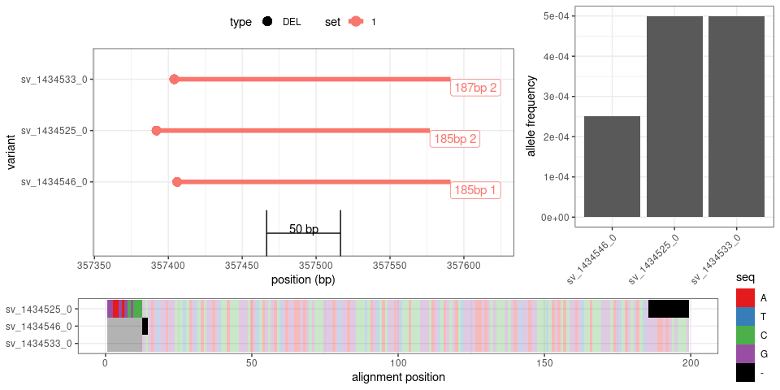<!-- -->

``` r
## locus with 4 deletions
ex.site = locs %>% filter(type=='DEL', clique, loc.n==4) %>% sample_n(1) %>% .$svsite
subset(svs, svsite==ex.site) %>% plotSVs
```

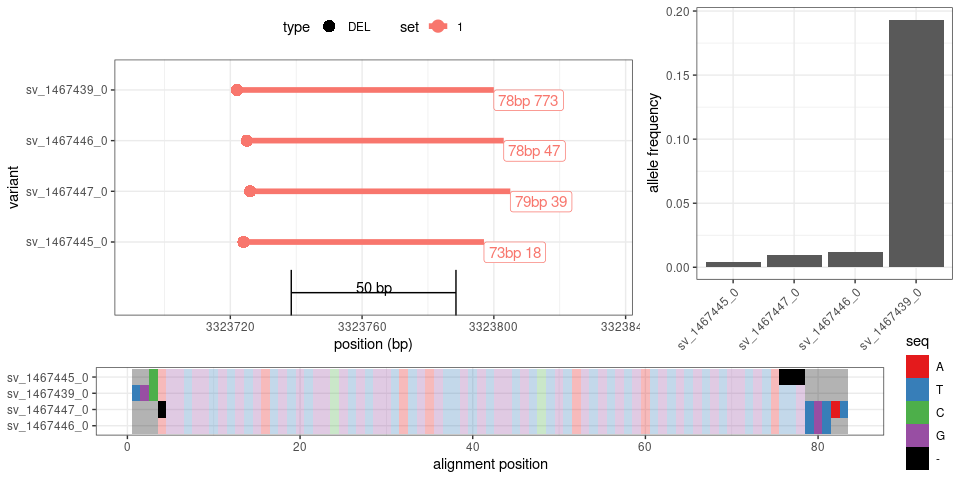<!-- -->

``` r
## locus with 5 deletions
ex.site = locs %>% filter(type=='DEL', clique, loc.n==5) %>% sample_n(1) %>% .$svsite
subset(svs, svsite==ex.site) %>% plotSVs
```

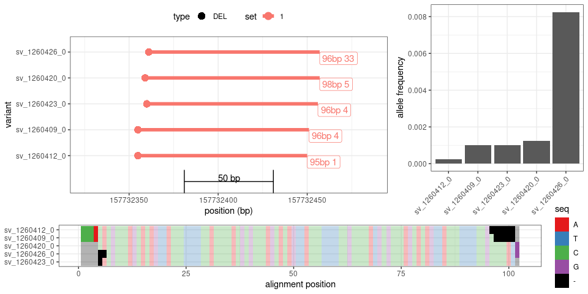<!-- -->

``` r
## locus with 10 deletions
ex.site = locs %>% filter(type=='DEL', clique, loc.n==10) %>% sample_n(1) %>% .$svsite
subset(svs, svsite==ex.site) %>% plotSVs
```

<!-- -->

``` r
## largest locus
ex.site = locs %>% filter(type=='DEL', clique) %>% arrange(desc(loc.n)) %>% head(1) %>% .$svsite
subset(svs, svsite==ex.site) %>% plotSVs(label.svs=FALSE)
```

<!-- -->

### Deletions with one major allele

``` r
ex.site = locs %>% filter(type=='DEL', clique, loc.n<10, af>.1, af.top2<.01) %>% sample_n(3) %>% .$svsite

tmp = lapply(ex.site, function(es){
  subset(svs, svsite==es) %>% plotSVs
})
```

<!-- -->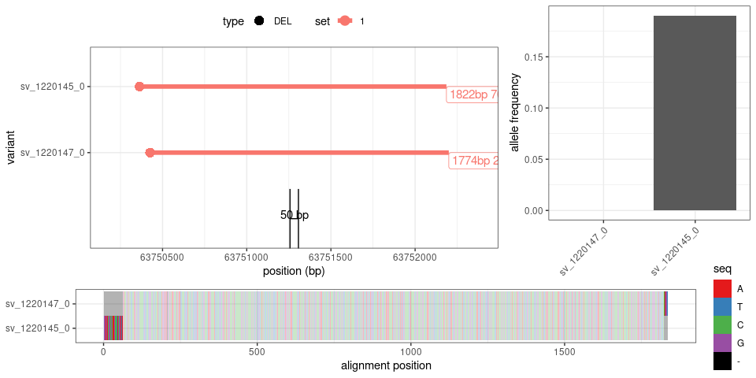<!-- -->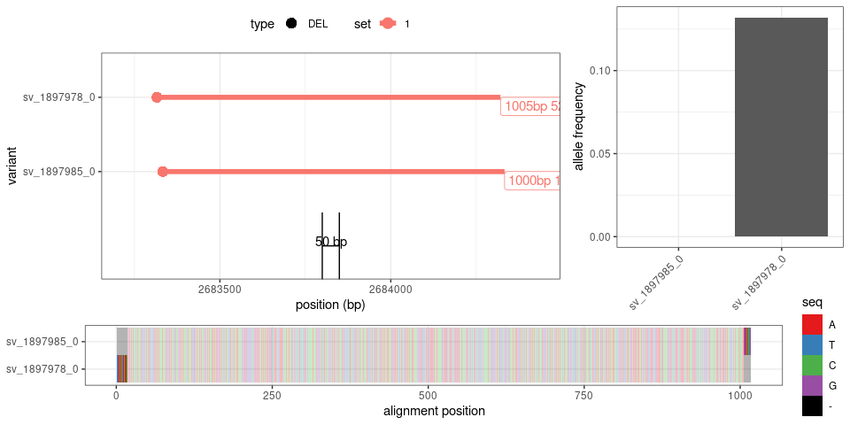<!-- -->

## Deletions not in clique formation

``` r
locs %>% filter(type=='DEL', !clique) %>% .$loc.n %>% summary
```

    ##    Min. 1st Qu.  Median    Mean 3rd Qu.    Max. 
    ##    3.00    4.00    6.00   18.13   10.00 1876.00

``` r
## locus with 3 deletions
ex.site = locs %>% filter(type=='DEL', !clique, loc.n==3) %>% sample_n(1) %>% .$svsite
subset(svs, svsite==ex.site) %>% plotSVs
```

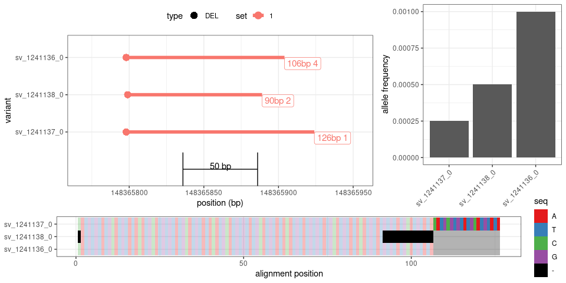<!-- -->

``` r
## locus with 4 deletions
ex.site = locs %>% filter(type=='DEL', !clique, loc.n==4) %>% sample_n(1) %>% .$svsite
subset(svs, svsite==ex.site) %>% plotSVs
```

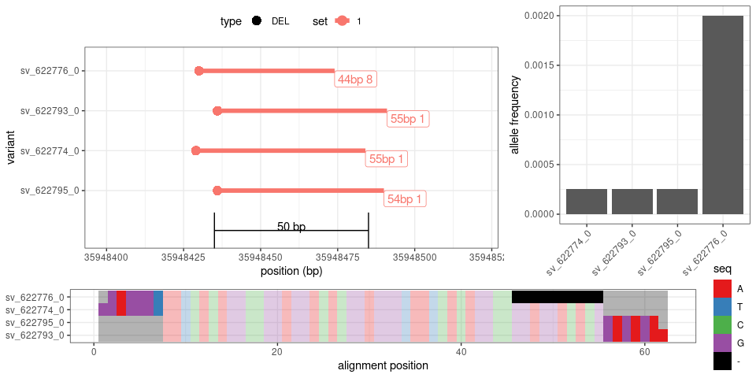<!-- -->

``` r
## locus with 5 deletions
ex.site = locs %>% filter(type=='DEL', !clique, loc.n==5) %>% sample_n(1) %>% .$svsite
subset(svs, svsite==ex.site) %>% plotSVs
```

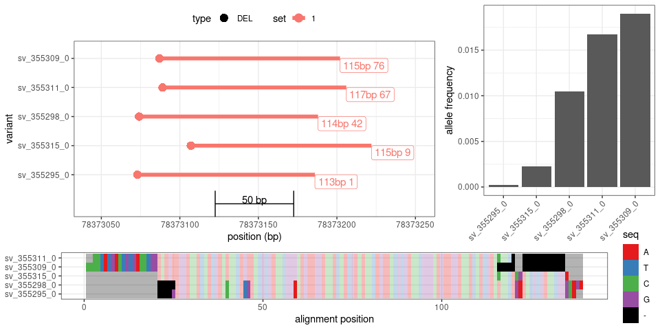<!-- -->

``` r
## locus with 10 deletions
ex.site = locs %>% filter(type=='DEL', !clique, loc.n==10) %>% sample_n(1) %>% .$svsite
subset(svs, svsite==ex.site) %>% plotSVs
```

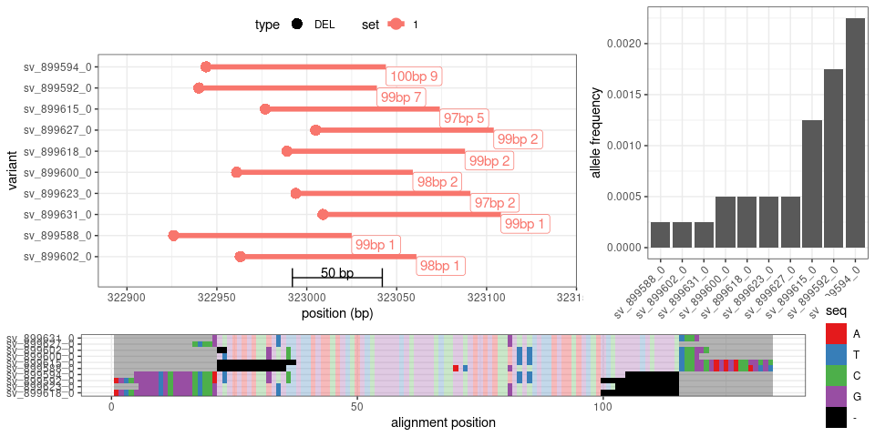<!-- -->

``` r
## more than 100 deletions
ex.site = locs %>% filter(type=='DEL', !clique, loc.n>100, loc.n<200) %>% sample_n(1) %>% .$svsite
subset(svs, svsite==ex.site) %>% plotSVs(panel3='size', label.svs=FALSE)
```

<!-- -->

``` r
## more than 1000 deletions
ex.site = locs %>% filter(type=='DEL', !clique, loc.n>1000) %>% sample_n(1) %>% .$svsite
subset(svs, svsite==ex.site) %>% plotSVs(panel3='size', label.svs=FALSE)
```

<!-- -->

## Insertions in clique formation

``` r
locs %>% filter(type=='INS', clique) %>% .$loc.n %>% summary
```

    ##     Min.  1st Qu.   Median     Mean  3rd Qu.     Max. 
    ##    1.000    1.000    1.000    3.205    1.000 1923.000

``` r
## locus with 3 insertions
ex.site = locs %>% filter(type=='INS', clique, loc.n==3) %>% sample_n(1) %>% .$svsite
subset(svs, svsite==ex.site) %>% plotSVs
```

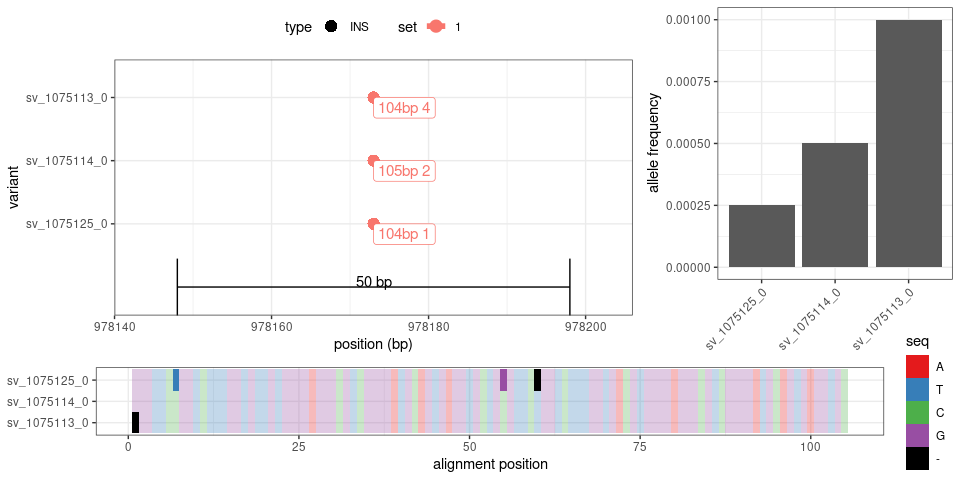<!-- -->

``` r
## locus with 4 insertions
ex.site = locs %>% filter(type=='INS', clique, loc.n==4) %>% sample_n(1) %>% .$svsite
subset(svs, svsite==ex.site) %>% plotSVs
```

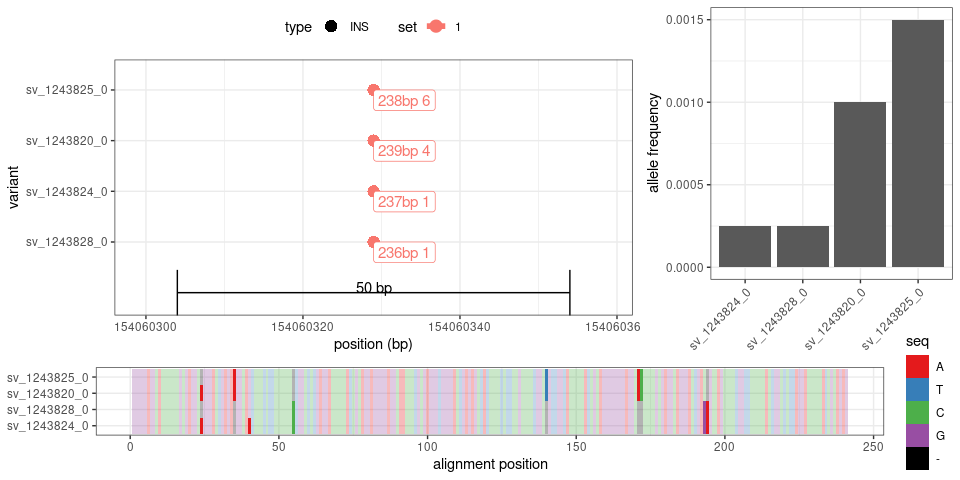<!-- -->

``` r
## locus with 5 insertions
ex.site = locs %>% filter(type=='INS', clique, loc.n==5) %>% sample_n(1) %>% .$svsite
subset(svs, svsite==ex.site) %>% plotSVs
```

<!-- -->

``` r
## locus with 10 insertions
ex.site = locs %>% filter(type=='INS', clique, loc.n==10) %>% sample_n(1) %>% .$svsite
subset(svs, svsite==ex.site) %>% plotSVs
```

<!-- -->

``` r
## locus with 100-200 insertions
ex.site = locs %>% filter(type=='INS', clique, loc.n>100, loc.n<200) %>% sample_n(1) %>% .$svsite
subset(svs, svsite==ex.site) %>% plotSVs(panel3='size', label.svs=FALSE)
```

<!-- -->

``` r
## locus with >1000 insertions
ex.site = locs %>% filter(type=='INS', clique, loc.n>1000) %>% sample_n(1) %>% .$svsite
subset(svs, svsite==ex.site) %>% plotSVs(panel3='size', label.svs=FALSE)
```

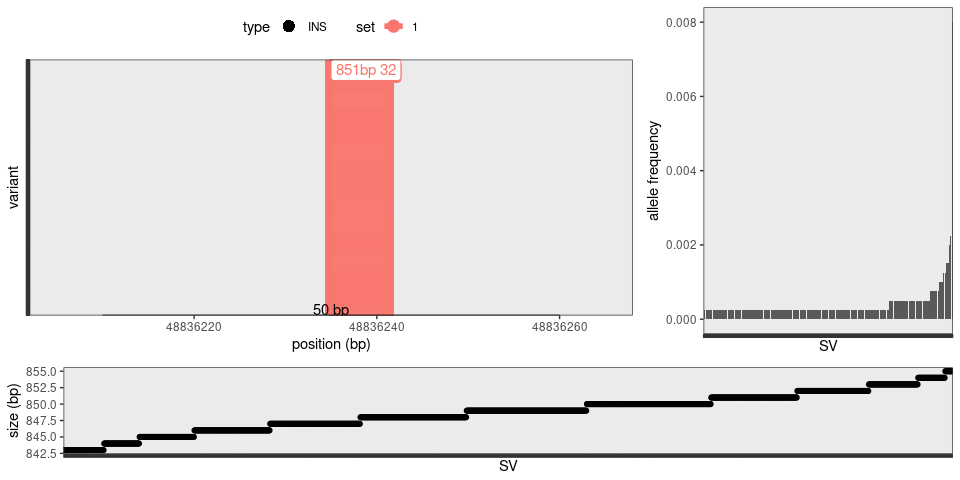<!-- -->

### Insertions with one major allele

``` r
ex.site = locs %>% filter(type=='INS', clique, loc.n<10, af>.1, af.top2<.01) %>% sample_n(3) %>% .$svsite

tmp = lapply(ex.site, function(es){
  subset(svs, svsite==es) %>% plotSVs
})
```

<!-- -->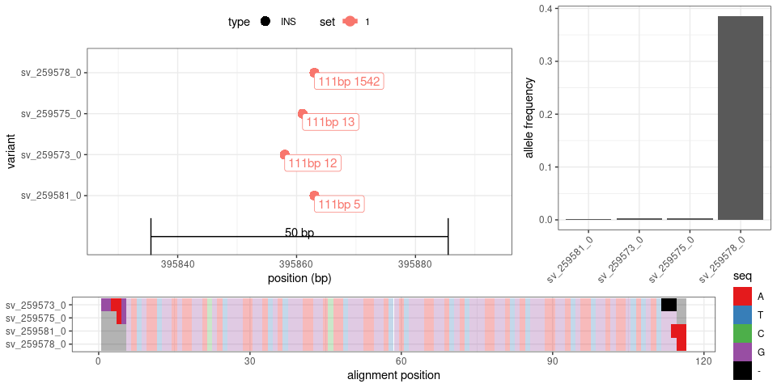<!-- -->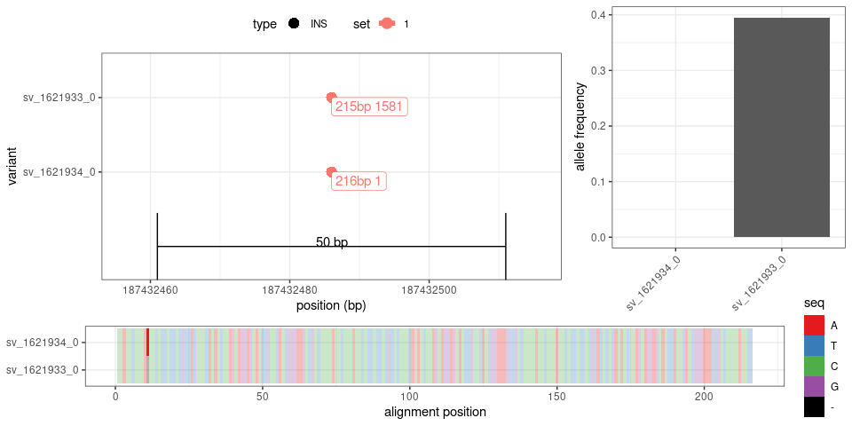<!-- -->

## Insertions not in clique formation

``` r
locs %>% filter(type=='INS', !clique) %>% .$loc.n %>% summary
```

    ##    Min. 1st Qu.  Median    Mean 3rd Qu.    Max. 
    ##     3.0     7.0    18.0   112.1    69.0  4659.0

``` r
## locus with 3 insertions
ex.site = locs %>% filter(type=='INS', !clique, loc.n==3) %>% sample_n(1) %>% .$svsite
subset(svs, svsite==ex.site) %>% plotSVs
```

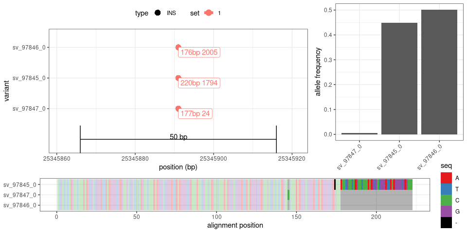<!-- -->

``` r
## locus with 4 insertions
ex.site = locs %>% filter(type=='INS', !clique, loc.n==4) %>% sample_n(1) %>% .$svsite
subset(svs, svsite==ex.site) %>% plotSVs
```

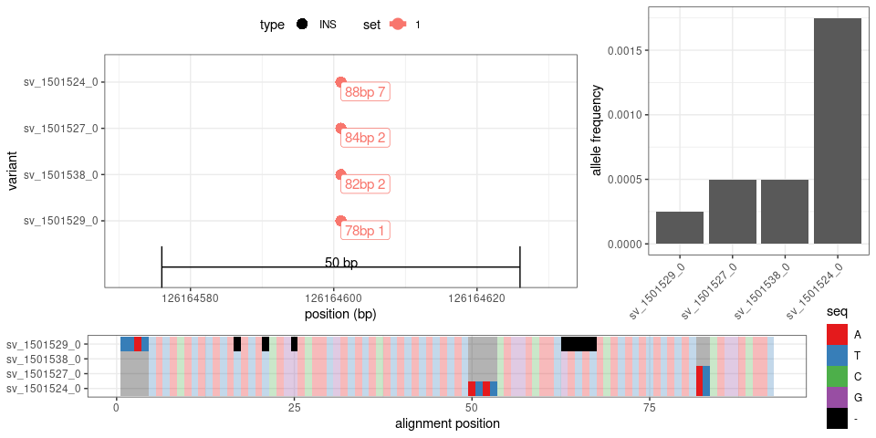<!-- -->

``` r
## locus with 5 insertions
ex.site = locs %>% filter(type=='INS', !clique, loc.n==5) %>% sample_n(1) %>% .$svsite
subset(svs, svsite==ex.site) %>% plotSVs
```

<!-- -->

``` r
## locus with 10 insertions
ex.site = locs %>% filter(type=='INS', !clique, loc.n==10) %>% sample_n(1) %>% .$svsite
subset(svs, svsite==ex.site) %>% plotSVs
```

<!-- -->

``` r
## locus with 100-200 insertions
ex.site = locs %>% filter(type=='INS', !clique, loc.n>100, loc.n<200) %>% sample_n(1) %>% .$svsite
subset(svs, svsite==ex.site) %>% plotSVs(panel3='size', label.svs=FALSE)
```

<!-- -->

``` r
## locus with >1000 insertions
ex.site = locs %>% filter(type=='INS', !clique, loc.n>1000) %>% sample_n(1) %>% .$svsite
subset(svs, svsite==ex.site) %>% plotSVs(panel3='size', label.svs=FALSE)
```

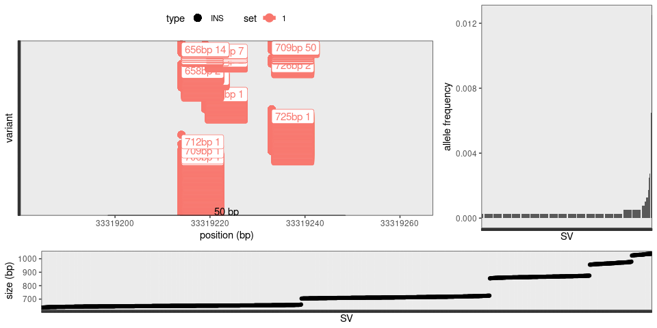<!-- -->

## For figures

``` r
ex.l = list()

## 5 insertions in clique formation with mostly one frequent allele called
ex.l$ins.5.maj = locs %>% filter(type=='INS', clique, loc.n==5, size>100) %>%
  arrange(desc(af.top.fc)) %>% head(1) %>% .$svsite

## 5 insertions in clique formation with mutilple frequent alleles
ex.l$ins.5.poly = locs %>% filter(type=='INS', clique, loc.n==5, size>100, af>.1) %>%
  arrange(af.top.fc) %>% head(1) %>% .$svsite

## VNTR-like insertions
ex.l$ins.vntr = locs %>% filter(type=='INS', !clique, loc.n==10, af>.1) %>%
  arrange(size.min-size.max) %>% head(1) %>% .$svsite

## VNTR-like deletions
ex.l$del.vntr = locs %>% filter(type=='DEL', !clique, loc.n==10, af>.1, size<1000) %>%
  arrange(size.min-size.max) %>% head(1) %>% .$svsite

tmp = lapply(ex.l, function(site) subset(svs, svsite==site) %>% plotSVs)
```

<!-- --><!-- --><!-- -->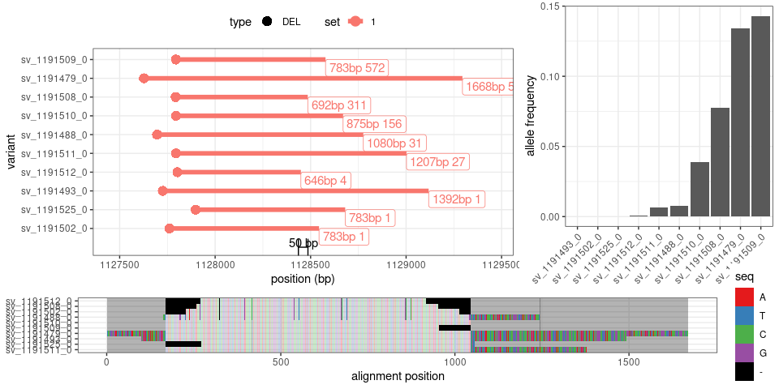<!-- -->

``` r
pdf('figs/examples-svsites-mesa.pdf', 8, 6)
tmp = lapply(ex.l, function(site) subset(svs, svsite==site) %>% plotSVs)
dev.off()
```

    ## png 
    ##   2
