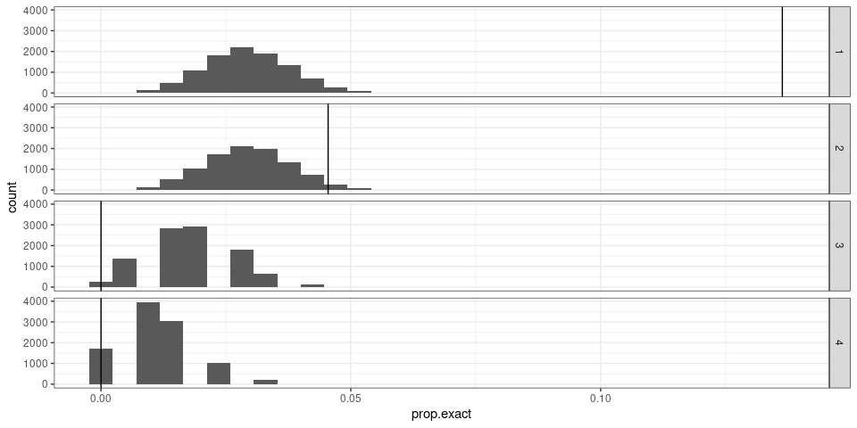

Evaluate the frequency-based fine-tuning
================

``` r
library(dplyr)
library(ggplot2)
library(GenomicRanges)
library(sveval)
library(knitr)
```

## GIAB truthset

``` r
## normalized VCF
giab = readSVvcf('giab5-truth-baseline.norm.vcf.gz')
```

## Prepare SV sites and the fine-tuned alleles

``` r
## SVs grouped by site ('svsite' and 'clique' columns)
svs = read.table('svs.mesa2k.svsite80al.tsv.gz', as.is=TRUE, header=TRUE)

locs = svs %>% arrange(desc(af), desc(size)) %>%
  group_by(seqnames, svsite, type, clique) %>%
  summarize(start=start[1], end=end[1],
            ac.tot=sum(ac), ac=ac[1],
            af.tot=sum(af), af.top2=tail(head(af, 2), 1), af=af[1],
            af.top.fc=ifelse(af.top2==0, 10, af/af.top2),
            loc.n=n(),
            size.min=min(size), size.max=max(size), size=size[1],
            .groups='drop') %>%
  filter(size.max>=50)
```

## Overlap SVs and GIAB

``` r
svs.gr = svs %>% mutate(seqnames=gsub('chr', '', seqnames)) %>%
  makeGRangesFromDataFrame(keep.extra.columns=TRUE)

ol = svOverlap(svs.gr, giab)

## keep best overlap and flag is it matches exactly (pos+size)
ol.df = ol %>% as.data.frame %>%
  arrange(desc(olScore)) %>%
  group_by(queryHits) %>% do(head(., 1)) %>%
  ungroup %>% 
  mutate(svid=svs.gr$svid[queryHits],
         exact.match=start(svs.gr)[queryHits]==start(giab)[subjectHits] & end(svs.gr)[queryHits]==end(giab)[subjectHits] & svs.gr$size[queryHits]==giab$size[subjectHits])

## merge back to SVs
ol.df = ol.df %>% select(svid, exact.match)
ol.df = svs %>% select(svsite, svid, af, size) %>% merge(ol.df, all.x=TRUE)
```

## Rank alleles by frequencies and count exact match with GIAB

``` r
## keep SV sites with more than one allele and at least one allele in GIAB
ol.df = ol.df %>% group_by(svsite) %>% filter(any(!is.na(exact.match)), n()>1) %>%
    mutate(exact.match=ifelse(is.na(exact.match), FALSE, exact.match))

## rank the alleles by frequency. rk=1 is the "fine-tuned" alleles (most frequent)
ol.o = ol.df %>% 
  arrange(desc(af), desc(size)) %>%
  group_by(svsite) %>% 
  mutate(rk=1:n()) %>% do({head(., 4)})

## fine-tuned sites: top allele much more frequent than second allele
ft.sites = locs %>% filter(af>=.01, af.top.fc>3, af.top2<.01)

## Summary of the observations
ol.ft.o = ol.o %>% filter(svsite %in% ft.sites$svsite) %>% 
  group_by(rk) %>% summarize(n.tot=n(), n.exact=sum(exact.match), prop.exact=mean(exact.match))
ol.ft.o
```

    ## # A tibble: 4 x 4
    ##      rk n.tot n.exact prop.exact
    ##   <int> <int>   <int>      <dbl>
    ## 1     1    22       3     0.136 
    ## 2     2    22       1     0.0455
    ## 3     3    11       0     0     
    ## 4     4     7       0     0

## Permutations

``` r
## permute the frequencies (or just assign random ranks)
perm.df = lapply(1:10000, function(pp){
  ol.df %>% 
    group_by(svsite) %>% sample_frac(1) %>% 
    mutate(rk=1:n()) %>% filter(rk<=4) %>%
    group_by(rk) %>% summarize(prop.exact=mean(exact.match)) %>%
    mutate(perm=pp)
}) %>% bind_rows()

## distributions of the permuted values
ggplot(perm.df, aes(x=prop.exact)) + geom_histogram() + facet_grid(rk~.) +
  theme_bw() + geom_vline(aes(xintercept=prop.exact), data=ol.ft.o)
```

<!-- -->

``` r
## permutation p-value
ol.ft.o %>% select(rk, prop.exact) %>% merge(perm.df, by='rk', suffixes=c('.obs', '.null')) %>%
  group_by(rk) %>% summarize(mean=mean(prop.exact.null),
                             pv=as.numeric((sum(prop.exact.null>=prop.exact.obs)+1)/(1+n())))
```

    ## # A tibble: 4 x 3
    ##      rk   mean       pv
    ##   <int>  <dbl>    <dbl>
    ## 1     1 0.0294 0.000100
    ## 2     2 0.0294 0.0359  
    ## 3     3 0.0188 1       
    ## 4     4 0.0113 1
