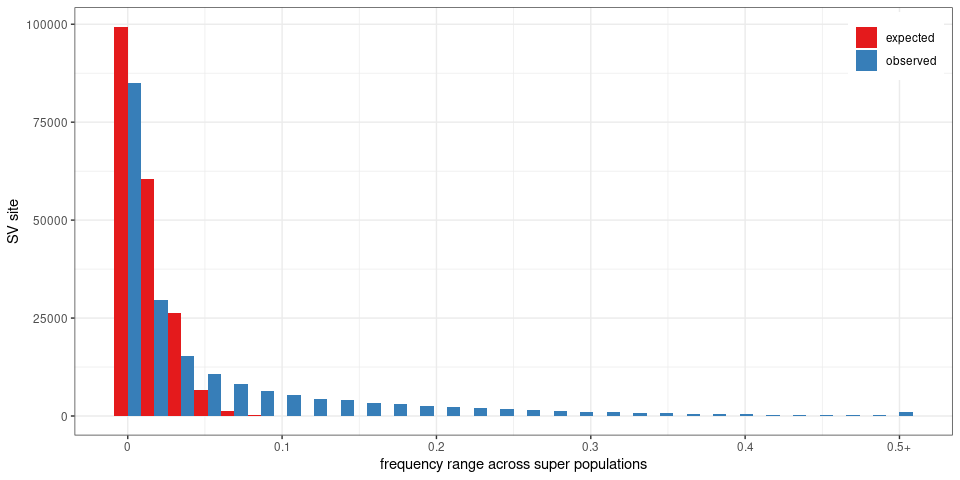
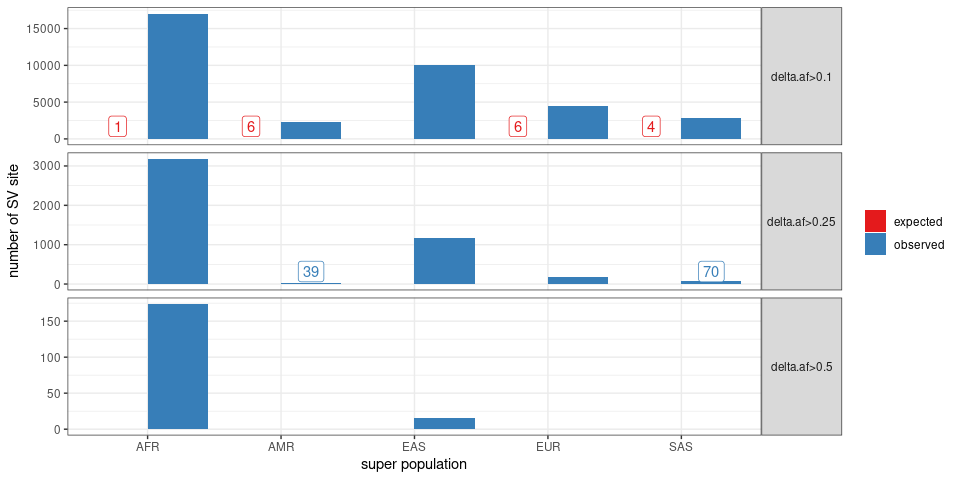
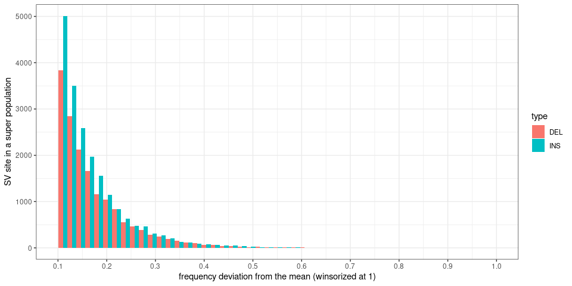
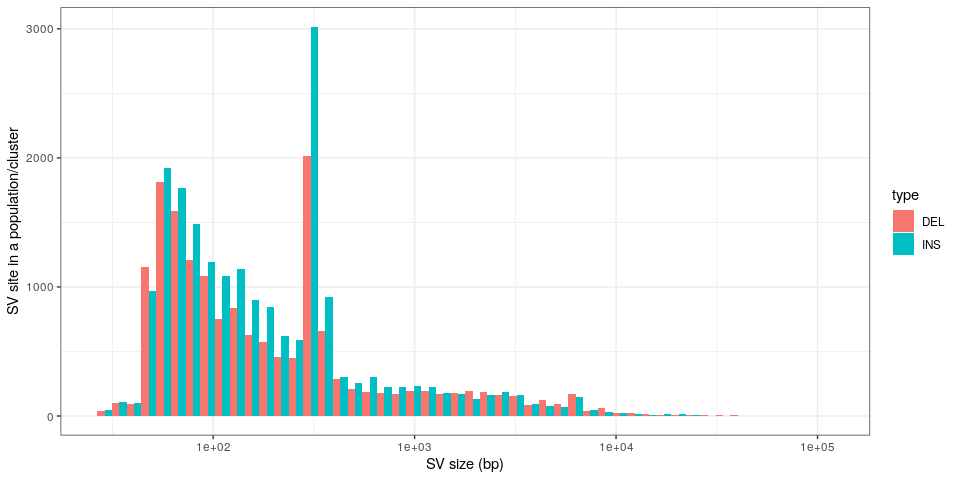
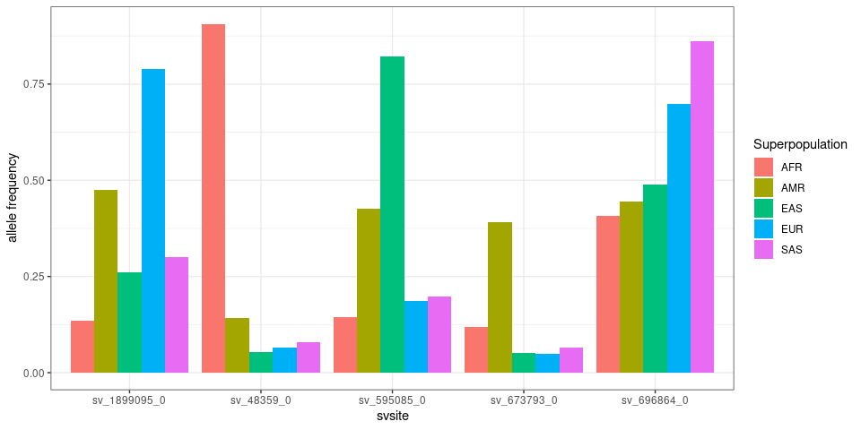
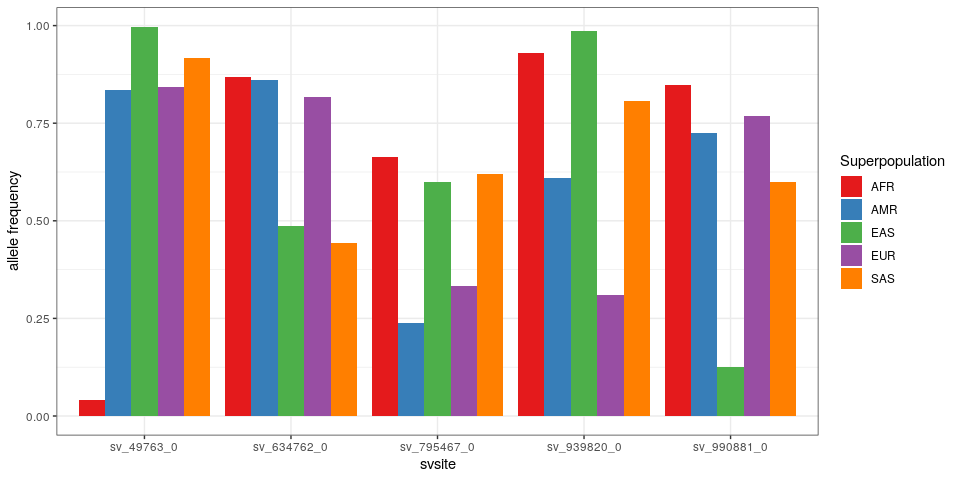
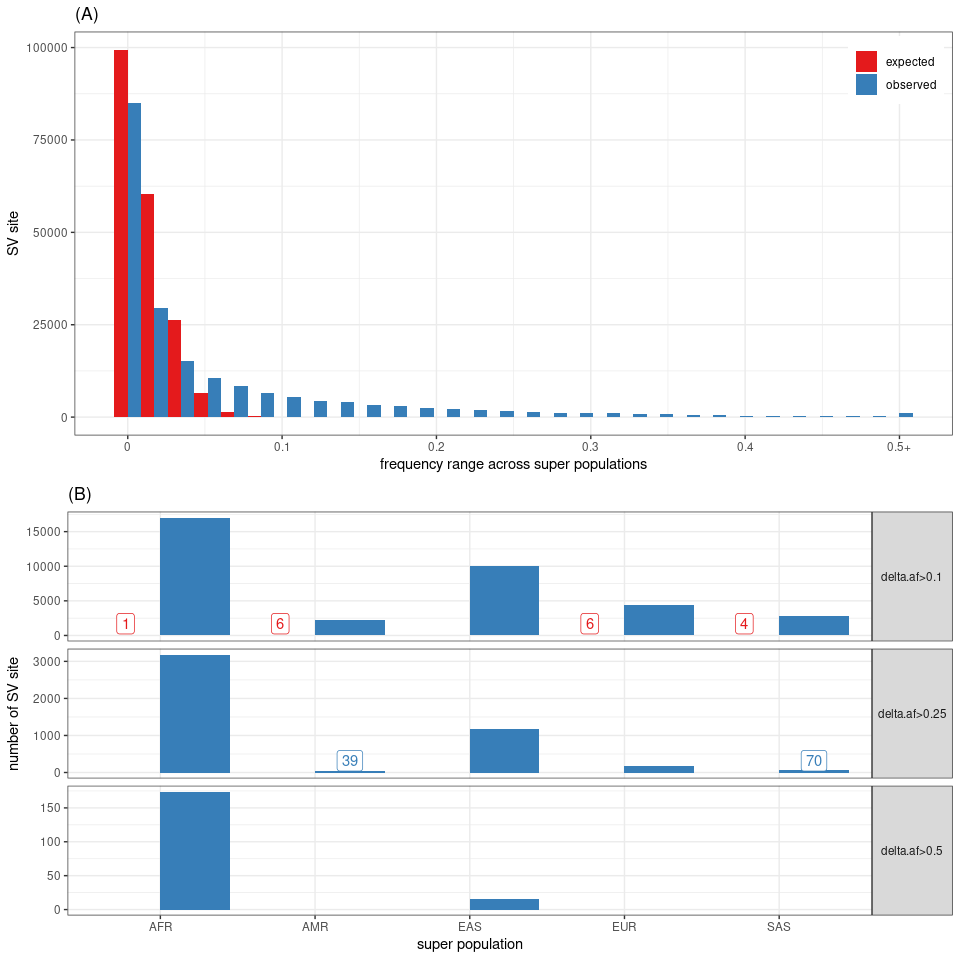

Frequency in populations from the 1000 Genomes Project
================

``` r
library(dplyr)
library(ggplot2)
library(tidyr)
library(gridExtra)
library(knitr)
winsor <- function(x, u){
  if(any(x>u)) x[x>u] = u
  x
}
## list of figures
ggp = list()
```

## Read frequencies

``` r
ac = as.matrix(read.table('2504kgp.svsite80al.ac.tsv.gz', as.is=TRUE))
samps.df = read.table('1kgp-info.tsv', as.is=TRUE, header=TRUE)
colnames(samps.df)[1] = 'sample'
samps.df = samps.df %>% filter(sample %in% colnames(ac)) %>% mutate(sample.n=sample(sample))

freq.sp = lapply(unique(samps.df$Superpopulation), function(sp){
    samps = samps.df %>% filter(Superpopulation==sp) %>% .$sample
    ac.tot = rowSums(ac[, samps])
    tibble(svsite=rownames(ac), Superpopulation=sp, af=ac.tot/(2*length(samps)))
}) %>% bind_rows

outf = gzfile('2504kgp.svsite80al.superpopfreq.tsv.gz', 'w')
write.table(freq.sp, file=outf, sep='\t', quote=FALSE, row.names=FALSE)
close(outf)
```

The code block above was pre-computed and the file used now:

``` r
## frequencies in different super-populations for each SV site
freq.df = read.table('2504kgp.svsite80al.superpopfreq.tsv.gz', as.is=TRUE, header=TRUE)
```

## Read null frequencies

To compute an expected distribution, sample labels were permuted.

``` r
ac = as.matrix(read.table('2504kgp.svsite80al.ac.tsv.gz', as.is=TRUE))
samps.df = read.table('1kgp-info.tsv', as.is=TRUE, header=TRUE)
colnames(samps.df)[1] = 'sample'
samps.df = samps.df %>% filter(sample %in% colnames(ac)) %>% mutate(sample.n=sample(sample))

freq.sp.null = lapply(unique(samps.df$Superpopulation), function(sp){
    samps = samps.df %>% filter(Superpopulation==sp) %>% .$sample.n
    ac.tot = rowSums(ac[, samps])
    tibble(svsite=rownames(ac), Superpopulation=sp, af=ac.tot/(2*length(samps)))
}) %>% bind_rows

outf = gzfile('2504kgp.svsite80al.superpopfreq.null.tsv.gz', 'w')
write.table(freq.sp.null, file=outf, sep='\t', quote=FALSE, row.names=FALSE)
close(outf)
```

The code block above was pre-computed and the file used now:

``` r
freq.null = read.table('2504kgp.svsite80al.superpopfreq.null.tsv.gz', as.is=TRUE, header=TRUE)

freq.df = rbind(
  freq.df %>% mutate(exp='observed'),
  freq.null %>% mutate(exp='expected'))
```

## Compute the minimum, median and maximum frequency

``` r
freq.s = freq.df %>% group_by(exp, svsite) %>%
  summarize(af.min=min(af), af.max=max(af), af.med=median(af), .groups='drop')

ggp$range = ggplot(freq.s, aes(winsor(af.max-af.min, .5), fill=exp)) +
  geom_histogram(position='dodge') + theme_bw() +
  xlab('frequency range across super populations') +
  scale_fill_brewer(palette='Set1') +
  scale_x_continuous(breaks=seq(0,.5,.1), labels=c(seq(0,.4,.1), '0.5+')) + 
  theme(legend.title=element_blank(),
        legend.position=c(.99,.99), legend.justification=c(1,1)) + 
  ylab('SV site')
ggp$range
```

<!-- -->

``` r
lapply(c(.1,.25,.5), function(th){
  freq.s %>% group_by(exp) %>% summarize(svsite=sum(af.max-af.min>th), .groups='drop') %>% 
    mutate(min.af.range=th)
}) %>% bind_rows %>%
  select(min.af.range, exp, svsite) %>%
  kable()
```

| min.af.range | exp      | svsite |
| -----------: | :------- | -----: |
|         0.10 | expected |     53 |
|         0.10 | observed |  37147 |
|         0.25 | expected |      0 |
|         0.25 | observed |  10185 |
|         0.50 | expected |      0 |
|         0.50 | observed |    989 |

The table shows the number of sites with a frequency range larger than
10%, 25%, and 50%.

## SV sites with large deviation from the median frequency

``` r
freq.df = freq.df %>% group_by(exp, svsite) %>% mutate(af.med=median(af))

bar.df = lapply(c(.1,.25,.5), function(th){
  freq.df %>% group_by(Superpopulation, exp) %>% summarize(sv=sum(abs(af.med-af)>th), .groups='drop') %>% 
    mutate(af.dev=paste0('delta.af>', th))
}) %>% bind_rows

ggp$olbar = bar.df %>% group_by(af.dev) %>%
  mutate(y.label=ifelse(sv>.05*max(sv) | sv==0, NA, .1*max(sv))) %>% 
  ggplot(aes(x=factor(Superpopulation), y=sv, fill=exp)) + 
  geom_bar(stat='identity', position='dodge') + theme_bw() +
  geom_label(aes(label=sv, color=exp, y=y.label),
             fill='white', position=position_dodge(.9), show.legend=FALSE) + 
  facet_grid(af.dev~., scales='free') + 
  scale_fill_brewer(palette='Set1', name='') + 
  scale_color_brewer(palette='Set1', name='') +
  theme(strip.text.y=element_text(angle=0)) + 
  xlab('super population') +
  ylab('number of SV site')
ggp$olbar
```

<!-- -->

``` r
lapply(c(.1,.25,.5), function(th){
  freq.df %>% mutate(Superpopulation='all') %>% rbind(freq.df) %>%
    filter(abs(af.med-af)>th) %>%
    group_by(Superpopulation, exp) %>%
    summarize(svsite=length(unique(svsite)), .groups='drop') %>% 
    mutate(min.af.dev=th)
}) %>% bind_rows %>%
  arrange(desc(svsite)) %>% 
  mutate(Superpopulation=factor(Superpopulation, levels=unique(Superpopulation))) %>% 
  arrange(min.af.dev, Superpopulation, exp) %>% 
  select(min.af.dev, Superpopulation, exp, svsite) %>%
  kable()
```

| min.af.dev | Superpopulation | exp      | svsite |
| ---------: | :-------------- | :------- | -----: |
|       0.10 | all             | expected |     14 |
|       0.10 | all             | observed |  25960 |
|       0.10 | AFR             | expected |      1 |
|       0.10 | AFR             | observed |  17041 |
|       0.10 | EAS             | observed |   9989 |
|       0.10 | EUR             | expected |      6 |
|       0.10 | EUR             | observed |   4468 |
|       0.10 | SAS             | expected |      4 |
|       0.10 | SAS             | observed |   2850 |
|       0.10 | AMR             | expected |      6 |
|       0.10 | AMR             | observed |   2269 |
|       0.25 | all             | observed |   4404 |
|       0.25 | AFR             | observed |   3184 |
|       0.25 | EAS             | observed |   1172 |
|       0.25 | EUR             | observed |    183 |
|       0.25 | SAS             | observed |     70 |
|       0.25 | AMR             | observed |     39 |
|       0.50 | all             | observed |    189 |
|       0.50 | AFR             | observed |    174 |
|       0.50 | EAS             | observed |     15 |

The table shows the number of sites with a population-specific frequency
pattern, defined as deviating form the median frequency by at least 10%,
25%, and 50%.

## Population-specific SVs by type and size

``` r
## SVs grouped by site ('svsite' and 'clique' columns)
svs = read.table('svs.2504kgp.svsite80al.tsv.gz', as.is=TRUE, header=TRUE)
svs = svs %>% group_by(svsite, type) %>% summarize(size=mean(size), .groups='drop')

ggp$devtype = freq.df %>% group_by(exp) %>%  filter(abs(af.med-af)>.1) %>% 
  merge(svs) %>%
  ggplot(aes(x=winsor(abs(af.med-af), 1), fill=type)) +
  geom_histogram(bins=50, position='dodge') +
  scale_x_continuous(breaks=seq(.1, 1, .1), limits=c(.1, 1)) + 
  theme_bw() +
  xlab('frequency deviation from the mean (winsorized at 1)') +
  ylab('SV site in a super population')
ggp$devtype
```

<!-- -->

``` r
ggp$devsize = freq.df %>% group_by(exp) %>%  filter(abs(af.med-af)>.1) %>% 
  merge(svs) %>%
  ggplot(aes(x=size, fill=type)) +
  geom_histogram(bins=50, position='dodge') +
  scale_x_log10() + 
  theme_bw() +
  xlab('SV size (bp)') +
  ylab('SV site in a super population')
ggp$devsize
```

<!-- -->

## Examples of population-specific SVs

More frequent in a population

``` r
ex.df = freq.df %>%
  filter(exp=='observed', af<1, af.med<1, af>af.med) %>% 
  arrange(desc(abs(af.med-af))) %>%
  group_by(Superpopulation) %>% do(head(.,1))
ex.df
```

    ## # A tibble: 5 x 5
    ## # Groups:   Superpopulation [5]
    ##   svsite       Superpopulation    af exp      af.med
    ##   <chr>        <chr>           <dbl> <chr>     <dbl>
    ## 1 sv_48359_0   AFR             0.906 observed 0.0798
    ## 2 sv_673793_0  AMR             0.390 observed 0.0654
    ## 3 sv_595085_0  EAS             0.822 observed 0.198 
    ## 4 sv_1899095_0 EUR             0.789 observed 0.301 
    ## 5 sv_696864_0  SAS             0.862 observed 0.490

``` r
ex.df = freq.df %>% filter(exp=='observed', svsite %in% ex.df$svsite)

ggplot(ex.df, aes(x=svsite, y=af, fill=Superpopulation)) +
  geom_bar(stat='identity', position='dodge') +
  ylab('allele frequency') + 
  theme_bw()
```

<!-- -->

Less frequent in a population

``` r
ex.df = freq.df %>%
  filter(exp=='observed', af<1, af.med<1, af<af.med) %>% 
  arrange(desc(abs(af.med-af))) %>%
  group_by(Superpopulation) %>% do(head(.,1))
ex.df
```

    ## # A tibble: 5 x 5
    ## # Groups:   Superpopulation [5]
    ##   svsite      Superpopulation     af exp      af.med
    ##   <chr>       <chr>            <dbl> <chr>     <dbl>
    ## 1 sv_49763_0  AFR             0.0416 observed  0.843
    ## 2 sv_795467_0 AMR             0.239  observed  0.599
    ## 3 sv_990881_0 EAS             0.126  observed  0.725
    ## 4 sv_939820_0 EUR             0.311  observed  0.806
    ## 5 sv_634762_0 SAS             0.444  observed  0.817

``` r
ex.df = freq.df %>% filter(exp=='observed', svsite %in% ex.df$svsite)

ggplot(ex.df, aes(x=svsite, y=af, fill=Superpopulation)) +
  geom_bar(stat='identity', position='dodge') +
  scale_fill_brewer(palette='Set1') + 
  ylab('allele frequency') + 
  theme_bw()
```

<!-- -->

## Multi-panel figure

``` r
## adds a legend title: a), b), etc
plot_list <- function(ggp.l, gg.names=NULL){
  if(is.null(names(ggp.l))) names(ggp.l) = paste0('g', 1:length(ggp.l))
  if(is.null(gg.names)) gg.names = names(ggp.l)
  lapply(1:length(gg.names), function(ii) ggp.l[[gg.names[ii]]] + ggtitle(paste0('(', LETTERS[ii], ')')))
}

grid.arrange(grobs=plot_list(list(ggp$range, ggp$olbar + guides(fill=FALSE))),
             layout_matrix=matrix(1:2, 2))
```

<!-- -->

``` r
pdf('figs/fig-pops-freq-kgp.pdf', 8, 8)
grid.arrange(grobs=plot_list(list(ggp$range, ggp$olbar + guides(fill=FALSE))),
             layout_matrix=matrix(1:2, 2))
dev.off()
```

    ## png 
    ##   2

## Save SVs with population-specific patterns

``` r
freq.df %>%
  filter(exp=='observed', abs(af.med-af)>.1) %>%
  ungroup %>% 
  select(-exp) %>%
  merge(svs) %>%
  write.table(file='vggiraffe-sv-superpop-af-diff-med10.csv', sep=',', row.names=FALSE, quote=FALSE)
```

## Save SVs sites with frequency estimates across super populations

``` r
## SVs grouped by site ('svsite' and 'clique' columns)
svs = read.table('svs.2504kgp.svsite80al.tsv.gz', as.is=TRUE, header=TRUE)

## stats for each SV locus
## use the most frequent allele (and then the largest) for ac/af/size
## also saves sum/max/min across all alleles
locs = svs %>% arrange(desc(af), desc(size)) %>%
  group_by(seqnames, svsite, type, clique) %>%
  summarize(start=start[1], end=end[1],
            svid=svid[1],
            ref=ref[1], alt=alt[1],
            ac.tot=sum(ac), ac=ac[1],
            af.tot=sum(af), af.top2=tail(head(af, 2), 1), af=af[1],
            af.top.fc=ifelse(af.top2==0, 10, af/af.top2),
            loc.n=n(),
            size.min=min(size), size.max=max(size), size=size[1],
            .groups='drop') %>%
  filter(size.max>=50)


outf = gzfile('vggiraffe-sv-2504kgp-svsites.tsv.gz', 'w')
freq.df %>%
  filter(exp=='observed') %>%
  select(svsite, Superpopulation, af) %>%
  pivot_wider(id_cols=svsite, names_from=Superpopulation, values_from=af, names_prefix='af.') %>%
  merge(locs) %>%
  select(seqnames, start, end, svsite, type, size, clique, af.tot, af, af.top2, af.top.fc,
         everything(), -svid, -ac, -ac.tot, -loc.n, -size.min, -size.max) %>%
  arrange(seqnames, start) %>% 
  write.table(file=outf, row.names=FALSE, quote=FALSE, sep='\t')
close(outf)
```
