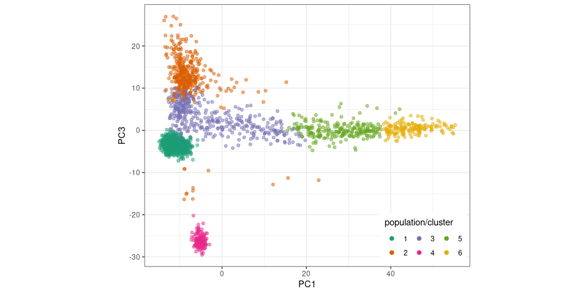
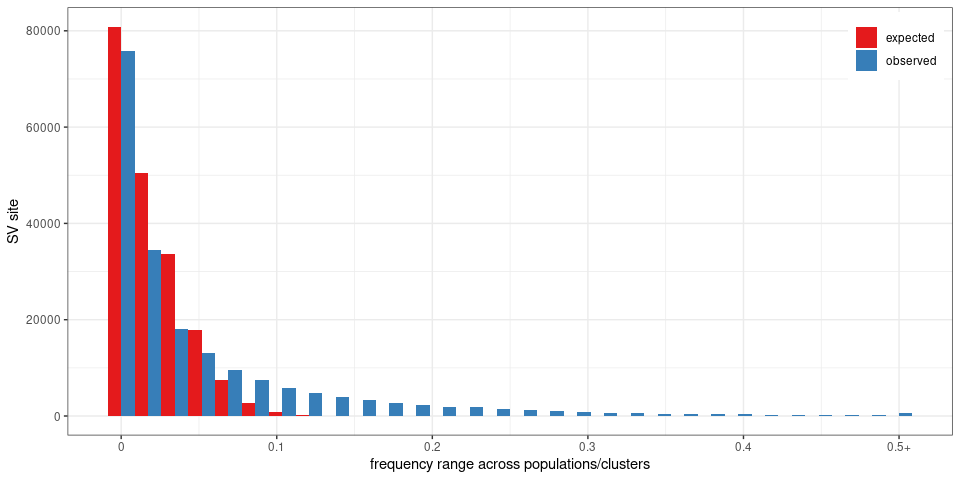
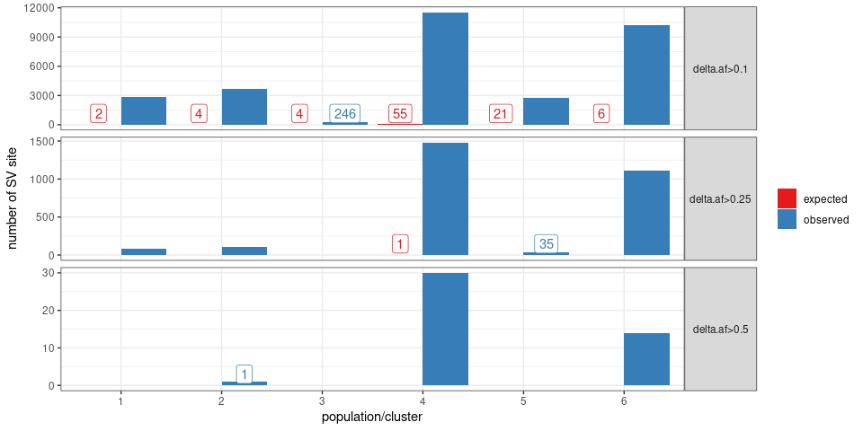
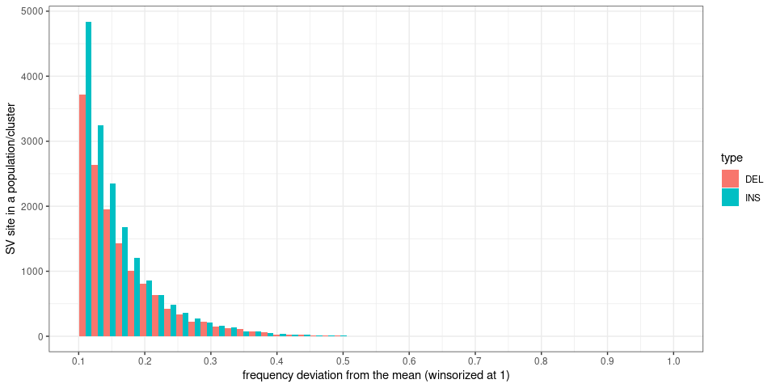
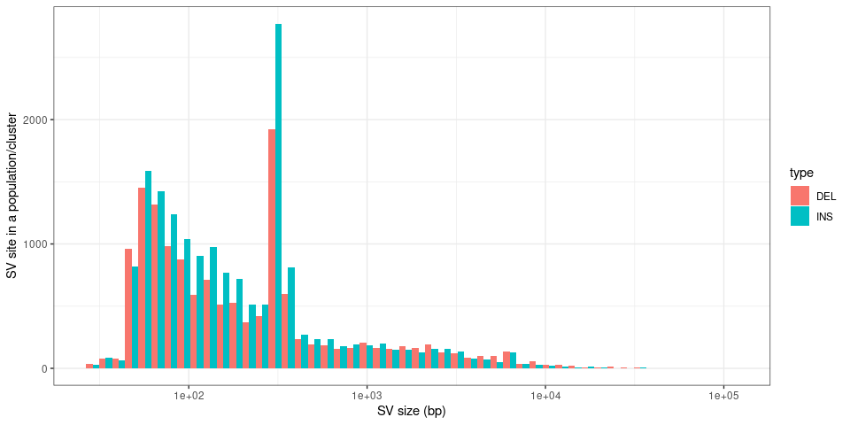
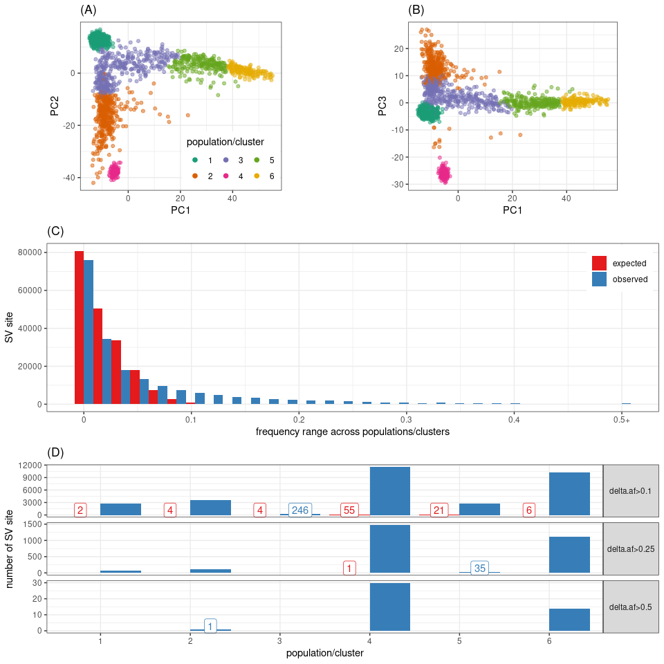

Frequency in populations from the MESA cohort
================

``` r
library(dplyr)
library(ggplot2)
library(gridExtra)
library(knitr)
winsor <- function(x, u){
  if(any(x>u)) x[x>u] = u
  x
}
## list of figures
ggp = list()
```

## Read PC results and reproduce clusters

For visualization

``` r
## PCs derived from SV genotypes or TOPMed SNVs/indels
pc.df = read.table('mesa2k-pcs-svs-topmed.tsv.gz', as.is=TRUE, header=TRUE)
pc.df = pc.df %>% arrange(PC1, PC2, PC3)
pc.d = pc.df %>% select(PC1, PC2, PC3) %>% as.matrix %>% dist
hc.o = hclust(pc.d, method='ward.D')
pc.df$hc = factor(cutree(hc.o, 6))
pc.df %>% group_by(hc) %>% summarize(n=n())
```

    ## # A tibble: 6 x 2
    ##   hc        n
    ## * <fct> <int>
    ## 1 1       751
    ## 2 2       373
    ## 3 3       378
    ## 4 4       126
    ## 5 5       223
    ## 6 6       149

``` r
ggp$pc12 = ggplot(pc.df, aes(x=PC1, y=PC2, color=hc)) +
  geom_point(alpha=.5) + theme_bw() +
  xlab('PC1') + ylab('PC2') +
  scale_color_brewer(palette='Dark2', name='population/cluster') +
  guides(colour=guide_legend(ncol=3, override.aes=list(alpha=1, size=2))) + 
  theme(legend.position=c(.99, .01), legend.justification=c(1,0)) +
  coord_fixed()
ggp$pc12
```

<!-- -->

``` r
ggp$pc13 = ggplot(pc.df, aes(x=PC1, y=PC3, color=hc)) +
  geom_point(alpha=.5) + theme_bw() + 
  xlab('PC1') + ylab('PC3') +
  scale_color_brewer(palette='Dark2', name='population/cluster') +
  guides(colour=guide_legend(ncol=3, override.aes=list(alpha=1, size=2))) + 
  theme(legend.position=c(.99, .01), legend.justification=c(1,0)) +
  coord_fixed()
ggp$pc13
```

<!-- -->

## Pre-compute frequencies in each cluster on Terra

Because is uses the genotype of the individuals in the MESA cohort, this
step was run on Terra. The resulting frequencies are saved in a file
used later in this report.

``` r
ac = as.matrix(read.table('mesa2k.svsite80al.ac.tsv.gz', as.is=TRUE))
freq.hc = lapply(unique(pc.df$hc), function(hcc){
    samps = pc.df %>% filter(hc==hcc) %>% .$sample
    ac.tot = rowSums(ac[, samps])
    tibble(svsite=rownames(ac), hc=hcc, af=ac.tot/(2*length(samps)))
}) %>% bind_rows

outf = gzfile('mesa2k.svsite80al.hcfreq.tsv.gz', 'w')
write.table(freq.hc, file=outf, sep='\t', quote=FALSE, row.names=FALSE)
close(outf)
```

Same for the “null” frequencies when permuting the labels:

``` r
set.seed(123)
pc.df$sample.null = sample(pc.df$sample)
freq.hc.n = lapply(unique(pc.df$hc), function(hcc){
    samps = pc.df %>% filter(hc==hcc) %>% .$sample.null
    ac.tot = rowSums(ac[, samps])
    tibble(svsite=rownames(ac), hc=hcc, af=ac.tot/(2*length(samps)))
}) %>% bind_rows

outf = gzfile('mesa2k.svsite80al.hcfreq.null.tsv.gz', 'w')
write.table(freq.hc.n, file=outf, sep='\t', quote=FALSE, row.names=FALSE)
close(outf)
```

## Read frequencies

``` r
## frequencies in different clusters (hc) for each SV site
freq.df = read.table('mesa2k.svsite80al.hcfreq.tsv.gz', as.is=TRUE, header=TRUE)
```

## Read null frequencies

To compute an expected distribution, sample labels were permuted.

``` r
freq.null = read.table('mesa2k.svsite80al.hcfreq.null.tsv.gz', as.is=TRUE, header=TRUE)

freq.df = rbind(
  freq.df %>% mutate(exp='observed'),
  freq.null %>% mutate(exp='expected'))
```

## Compute the minimum, median and maximum frequency

``` r
freq.s = freq.df %>% group_by(exp, svsite) %>%
  summarize(af.min=min(af), af.max=max(af), af.med=median(af), .groups='drop')

ggp$range = ggplot(freq.s, aes(winsor(af.max-af.min, .5), fill=exp)) +
  geom_histogram(position='dodge') + theme_bw() +
  xlab('frequency range across populations/clusters') +
  scale_fill_brewer(palette='Set1') +
  scale_x_continuous(breaks=seq(0,.5,.1), labels=c(seq(0,.4,.1), '0.5+')) + 
  theme(legend.title=element_blank(),
        legend.position=c(.99,.99), legend.justification=c(1,1)) + 
  ylab('SV site')
ggp$range
```

<!-- -->

``` r
lapply(c(.1,.25,.5), function(th){
  freq.s %>% group_by(exp) %>% summarize(svsite=sum(af.max-af.min>th), .groups='drop') %>% 
    mutate(min.af.range=th)
}) %>% bind_rows %>%
  select(min.af.range, exp, svsite) %>%
  kable()
```

| min.af.range | exp      | svsite |
| -----------: | :------- | -----: |
|         0.10 | expected |   1006 |
|         0.10 | observed |  34000 |
|         0.25 | expected |      3 |
|         0.25 | observed |   7594 |
|         0.50 | expected |      0 |
|         0.50 | observed |    469 |

The table shows the number of sites with a frequency range larger than
10%, 25%, and 50%.

## SV sites with large deviation from the median frequency

``` r
freq.df = freq.df %>% group_by(exp, svsite) %>% mutate(af.med=median(af))

bar.df = lapply(c(.1,.25,.5), function(th){
  freq.df %>% group_by(hc, exp) %>% summarize(sv=sum(abs(af.med-af)>th), .groups='drop') %>% 
    mutate(af.dev=paste0('delta.af>', th))
}) %>% bind_rows

ggp$olbar = bar.df %>% group_by(af.dev) %>%
  mutate(y.label=ifelse(sv>.05*max(sv) | sv==0, NA, .1*max(sv))) %>% 
  ggplot(aes(x=factor(hc), y=sv, fill=exp)) + 
  geom_bar(stat='identity', position='dodge') + theme_bw() +
  geom_label(aes(label=sv, color=exp, y=y.label),
             fill='white', position=position_dodge(.9), show.legend=FALSE) + 
  facet_grid(af.dev~., scales='free') + 
  scale_fill_brewer(palette='Set1', name='') + 
  scale_color_brewer(palette='Set1', name='') +
  theme(strip.text.y=element_text(angle=0)) + 
  xlab('population/cluster') +
  ylab('number of SV site')
ggp$olbar
```

<!-- -->

``` r
lapply(c(.1,.25,.5), function(th){
  freq.df %>% filter(abs(af.med-af)>th) %>%
    group_by(exp) %>%
    summarize(svsite=length(unique(svsite)), .groups='drop') %>% 
    mutate(min.af.dev=th)
}) %>% bind_rows %>%
  select(min.af.dev, exp, svsite) %>%
  kable()
```

| min.af.dev | exp      | svsite |
| ---------: | :------- | -----: |
|       0.10 | expected |     85 |
|       0.10 | observed |  21069 |
|       0.25 | expected |      1 |
|       0.25 | observed |   2667 |
|       0.50 | observed |     45 |

The table shows the number of sites with a population-specific frequency
pattern, defined as deviating form the median frequency by at least 10%,
25%, and 50%.

## Population-specific SVs by type and size

``` r
## SVs grouped by site ('svsite' and 'clique' columns)
svs = read.table('svs.mesa2k.svsite80al.tsv.gz', as.is=TRUE, header=TRUE)
svs = svs %>% group_by(svsite, type) %>% summarize(size=mean(size), .groups='drop')

ggp$devtype = freq.df %>% group_by(exp) %>%  filter(abs(af.med-af)>.1) %>% 
  merge(svs) %>%
  ggplot(aes(x=winsor(abs(af.med-af), 1), fill=type)) +
  geom_histogram(bins=50, position='dodge') +
  scale_x_continuous(breaks=seq(.1, 1, .1), limits=c(.1, 1)) + 
  theme_bw() +
  xlab('frequency deviation from the mean (winsorized at 1)') +
  ylab('SV site in a population/cluster')
ggp$devtype
```

<!-- -->

``` r
ggp$devsize = freq.df %>% group_by(exp) %>%  filter(abs(af.med-af)>.1) %>% 
  merge(svs) %>%
  ggplot(aes(x=size, fill=type)) +
  geom_histogram(bins=50, position='dodge') +
  scale_x_log10() + 
  theme_bw() +
  xlab('SV size (bp)') +
  ylab('SV site in a population/cluster')
ggp$devsize
```

<!-- -->

## Multi-panel figure

``` r
## adds a legend title: a), b), etc
plot_list <- function(ggp.l, gg.names=NULL){
  if(is.null(names(ggp.l))) names(ggp.l) = paste0('g', 1:length(ggp.l))
  if(is.null(gg.names)) gg.names = names(ggp.l)
  lapply(1:length(gg.names), function(ii) ggp.l[[gg.names[ii]]] + ggtitle(paste0('(', LETTERS[ii], ')')))
}

grid.arrange(grobs=plot_list(list(ggp$pc12, ggp$pc13 + guides(color=FALSE),
                                  ggp$range, ggp$olbar + guides(fill=FALSE))),
             layout_matrix=matrix(c(1,3,4,2,3,4), 3))
```

<!-- -->

``` r
pdf('figs/fig-pops-freq-mesa.pdf', 8, 8)
grid.arrange(grobs=plot_list(list(ggp$pc12, ggp$pc13 + guides(color=FALSE),
                                  ggp$range, ggp$olbar + guides(fill=FALSE))),
             layout_matrix=matrix(c(1,3,4,2,3,4), 3))
dev.off()
```

    ## png 
    ##   2
