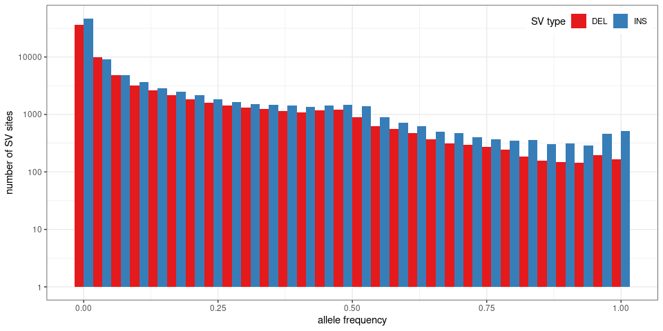

Summary stats for SVs in the MESA cohort
================

``` r
library(dplyr)
library(ggplot2)
library(gridExtra)
library(knitr)
library(GenomicRanges)
library(rtracklayer)
winsor <- function(x, u){
  if(any(x>u)) x[x>u] = u
  x
}
## list of graphs
ggp = list()
```

## Read population stats for each SV allele

``` r
## SVs grouped by site ('svsite' and 'clique' columns)
svs = read.table('svs.mesa2k.svsite80al.tsv.gz', as.is=TRUE, header=TRUE)

## stats for each SV locus
## use the most frequent allele (and then the largest) for ac/af/size
## also saves sum/max/min across all alleles
locs = svs %>% arrange(desc(af), desc(size)) %>%
  group_by(seqnames, svsite, type, clique) %>%
  summarize(start=start[1], end=end[1],
            ac.tot=sum(ac), ac=ac[1],
            af.tot=sum(af), af.top2=tail(head(af, 2), 1), af=af[1],
            af.top.fc=ifelse(af.top2==0, 10, af/af.top2),
            loc.n=n(),
            size.min=min(size), size.max=max(size), size=size[1],
            .groups='drop') %>%
  filter(size>=50)

sample_n(locs, 10) %>% as.data.frame
```

    ##    seqnames       svsite type clique     start       end ac.tot   ac  af.tot
    ## 1      chr2 sv_1739148_0  DEL   TRUE   1221537   1221603     58   58 0.01450
    ## 2     chr17  sv_465115_0  INS   TRUE  80665474  80665474     28   25 0.00700
    ## 3      chr2 sv_1867587_0  INS   TRUE 241875068 241875068    395  395 0.09875
    ## 4      chr9 sv_1041374_0  DEL   TRUE 129735941 129736048    250  250 0.06250
    ## 5     chr15  sv_585162_0  INS   TRUE  24184580  24184580     30   30 0.00750
    ## 6     chr14  sv_651663_0  INS   TRUE 105230460 105230460   1245 1046 0.31125
    ## 7     chr17  sv_449289_0  INS   TRUE  43296451  43296451      2    2 0.00050
    ## 8      chr4 sv_1610944_0  INS   TRUE 179130760 179130760     23   23 0.00575
    ## 9     chr18  sv_367075_0  DEL   TRUE  79550920  79551078      2    2 0.00050
    ## 10     chrX   sv_26486_0  DEL   TRUE   1789749   1789803    340  340 0.08500
    ##    af.top2      af af.top.fc loc.n size.min size.max size
    ## 1  0.01450 0.01450  1.000000     1       66       66   66
    ## 2  0.00075 0.00625  8.333333     2      115      136  136
    ## 3  0.09875 0.09875  1.000000     1       54       54   54
    ## 4  0.06250 0.06250  1.000000     1      107      107  107
    ## 5  0.00750 0.00750  1.000000     1      242      242  242
    ## 6  0.03200 0.26150  8.171875     4      202      203  202
    ## 7  0.00050 0.00050  1.000000     1       51       51   51
    ## 8  0.00575 0.00575  1.000000     1       86       86   86
    ## 9  0.00050 0.00050  1.000000     1      158      158  158
    ## 10 0.08500 0.08500  1.000000     1       54       54   54

## Allele/site numbers

``` r
## numbers by type
rbind(locs %>% mutate(type='all') %>% group_by(type) %>% summarize(alleles=sum(loc.n), sites=n()),
      locs %>% group_by(type) %>% summarize(alleles=sum(loc.n), sites=n())) %>%
  mutate(prop.alleles=alleles/alleles[1], prop.sites=sites/sites[1]) %>% 
  kable(digits=3, format.args=list(big.mark=','))
```

| type |   alleles |   sites | prop.alleles | prop.sites |
| :--- | --------: | ------: | -----------: | ---------: |
| all  | 1,662,301 | 166,959 |        1.000 |      1.000 |
| DEL  |   180,814 |  75,520 |        0.109 |      0.452 |
| INS  | 1,481,487 |  91,439 |        0.891 |      0.548 |

``` r
## numbers of cliques
locs %>% group_by(clique) %>% summarize(sites=n()) %>% ungroup %>% mutate(prop=sites/sum(sites)) %>%
  kable(digits=3, format.args=list(big.mark=','))
```

| clique |   sites |  prop |
| :----- | ------: | ----: |
| FALSE  |  16,381 | 0.098 |
| TRUE   | 150,578 | 0.902 |

``` r
## numbers of cliques by type
locs %>% group_by(type, clique) %>% summarize(sites=n()) %>%
  group_by(type) %>% mutate(prop.type=sites/sum(sites)) %>% 
  kable(digits=3, format.args=list(big.mark=','))
```

| type | clique |  sites | prop.type |
| :--- | :----- | -----: | --------: |
| DEL  | FALSE  |  5,162 |     0.068 |
| DEL  | TRUE   | 70,358 |     0.932 |
| INS  | FALSE  | 11,219 |     0.123 |
| INS  | TRUE   | 80,220 |     0.877 |

## Size

``` r
ggp$size = locs %>% as.data.frame %>%
  ggplot(aes(x=size, fill=type)) +
  geom_histogram(position='dodge', bins=60) +
  scale_fill_brewer(palette='Set1', name='SV type') + 
  theme_bw() +
  xlab('size (bp)') +
  scale_x_log10(breaks=c(0, 50, 100, 300, 1000, 6000, 1e4, 1e5),
                labels=c(0, 50, 100, 300, '1,000', '6,000', '10,000', '100,000')) + 
  ylab('number of variants') +
  theme(legend.title=element_blank()) + 
  ## theme(axis.text.x=element_text(angle=45, hjust=1)) + 
  theme(legend.position=c(.99, .99), legend.justification=c(1,1))
ggp$size
```

<!-- -->

``` r
locs %>% mutate(type='all') %>% rbind(locs) %>%
  group_by(type) %>%
  summarize(min.size=min(size), max.size=max(size),
    size.lt1kbp=mean(size<=1000), size.lt500=mean(size<=500))
```

    ## # A tibble: 3 x 5
    ##   type  min.size max.size size.lt1kbp size.lt500
    ##   <chr>    <int>    <int>       <dbl>      <dbl>
    ## 1 all         50   125187       0.944      0.897
    ## 2 DEL         50   114201       0.945      0.908
    ## 3 INS         50   125187       0.943      0.888

## Overlap with simple repeats, satellites or low-complexity regions

``` r
## simple repeats
if(!file.exists('simpleRepeat.hg38.txt.gz')){
  download.file('https://hgdownload.soe.ucsc.edu/goldenPath/hg38/database/simpleRepeat.txt.gz', 'simpleRepeat.hg38.txt.gz')
}
sr = read.table('simpleRepeat.hg38.txt.gz', as.is=TRUE)
sr = reduce(GRanges(sr$V2, IRanges(sr$V3, sr$V4)))
sr$repClass = 'Simple_repeat'
## repeat masker with low-complexity regions
if(!file.exists('rmsk.txt.gz')){
  download.file('https://hgdownload.soe.ucsc.edu/goldenPath/hg38/database/rmsk.txt.gz', 'rmsk.txt.gz')
}
rm = read.table('rmsk.txt.gz', as.is=TRUE,
                colClasses=c(rep("NULL", 5), 'character', 'integer', 'integer',
                             rep('NULL', 3), 'character',  rep('NULL', 5)))
colnames(rm) = c('chr', 'start', 'end', 'repClass')
rm = subset(rm, repClass %in% c('Low_complexity', 'Simple_repeat', 'Satellite'))
rm = makeGRangesFromDataFrame(rm, keep.extra.columns=TRUE)
rm = c(rm, sr)

locs.gr = makeGRangesFromDataFrame(locs)

olRep <- function(locs.gr, rm.r){
  rm.r = reduce(rm.r)
  findOverlaps(locs.gr, rm.r) %>% as.data.frame %>%
    mutate(sv.w=width(locs.gr[queryHits]), ol.w=width(pintersect(locs.gr[queryHits], rm.r[subjectHits])),
           ol.prop=ol.w/sv.w) %>%
    group_by(queryHits) %>% summarize(ol.prop=sum(ol.prop), .groups='drop')
}

## all: simple repeats, low complexity, satellites
ol.df = olRep(locs.gr, rm)
locs$rep.sr.lc.sat = 0
locs$rep.sr.lc.sat[ol.df$queryHits] = ol.df$ol.prop
## simple repeats + low-complexity
ol.df = olRep(locs.gr, subset(rm, repClass %in% c('Simple_repeat', 'Low_complexity')))
locs$rep.sr.lc = 0
locs$rep.sr.lc[ol.df$queryHits] = ol.df$ol.prop
## simple repeats
ol.df = olRep(locs.gr, subset(rm, repClass=='Simple_repeat'))
locs$rep.sr = 0
locs$rep.sr[ol.df$queryHits] = ol.df$ol.prop
## low complexity
ol.df = olRep(locs.gr, subset(rm, repClass=='Low_complexity'))
locs$rep.lc = 0
locs$rep.lc[ol.df$queryHits] = ol.df$ol.prop
## simple repeats
ol.df = olRep(locs.gr, subset(rm, repClass=='Satellite'))
locs$rep.sat = 0
locs$rep.sat[ol.df$queryHits] = ol.df$ol.prop

locs %>% mutate(type='all') %>% rbind(locs) %>%
  group_by(type) %>% 
  summarize(rep.sr.lc.sat.50=mean(rep.sr.lc.sat>=.50), rep.sr.lc.50=mean(rep.sr.lc>=.50),
                   rep.sr.50=mean(rep.sr>=.50),
                   rep.lc.50=mean(rep.lc>=.50), rep.sat.50=mean(rep.sat>=.50)) %>%
  kable(digits=3)
```

| type | rep.sr.lc.sat.50 | rep.sr.lc.50 | rep.sr.50 | rep.lc.50 | rep.sat.50 |
| :--- | ---------------: | -----------: | --------: | --------: | ---------: |
| all  |            0.840 |        0.839 |     0.838 |     0.016 |      0.016 |
| DEL  |            0.830 |        0.829 |     0.829 |     0.015 |      0.018 |
| INS  |            0.847 |        0.847 |     0.846 |     0.016 |      0.015 |

*sr*: simple repeat; *lc*: low-complexity; *sat*: satellite DNA. *.50*
means that at least 50% of the SV region overlaps repeats.

## Gene annotation

``` r
if(!file.exists('gencode.v35.annotation.gtf.gz')){
  download.file('ftp://ftp.ebi.ac.uk/pub/databases/gencode/Gencode_human/release_35/gencode.v35.annotation.gtf.gz', 'gencode.v35.annotation.gtf.gz')
}
genc = import('gencode.v35.annotation.gtf.gz')

genc.pc = subset(genc, type %in% c('CDS', 'UTR', 'gene') & gene_type=='protein_coding')
ol.gene = findOverlaps(locs.gr, genc.pc) %>% as.data.frame %>%
  mutate(gene=genc.pc$gene_name[subjectHits], type=genc.pc$type[subjectHits]) %>%
  group_by(queryHits) %>% summarize(cds=any(type=='CDS'), int.utr=any(type!='CDS'))

ol.gene %>% summarize(cds.int.utr=n(), cds=sum(cds)) %>% kable
```

| cds.int.utr |  cds |
| ----------: | ---: |
|       76443 | 1561 |

## Allele frequency

``` r
ggp$af = locs %>% as.data.frame %>%
  ggplot(aes(x=af, fill=type)) +
  geom_histogram(position='dodge') +
  scale_fill_brewer(palette='Set1', name='SV type') + 
  theme_bw() +
  xlab('allele frequency') +
  ylab('number of SV loci') +
  theme(legend.position=c(.99, .99), legend.justification=c(1,1))
ggp$af
```

<!-- -->

``` r
## comparing allele frequency between top 2 most frequent alleles in SV loci
locs.s.3 = locs %>% filter(loc.n>1, af.top.fc>3) %>%
  mutate(loc.n=cut(loc.n, breaks=c(1:5,100,Inf), labels=c(2:5, '5-100', '>100'))) %>% 
  group_by(loc.n) %>% summarize(n=n())
ggp$af.top = locs %>% filter(loc.n>1) %>%
  mutate(loc.n=cut(loc.n, breaks=c(1:5,100,Inf), labels=c(2:5, '5-100', '>100'))) %>% 
  ggplot(aes(x=loc.n, y=winsor(af.top.fc, 10))) +
  geom_violin(scale='width', fill='orange') +
  theme_bw() +
  scale_y_continuous(breaks=1:10, labels=c(1:9, '10+')) +
  ylab('frequency fold-change between\ntop 2 most frequent alleles') +
  xlab('number of SVs in locus') +
  theme(legend.title=element_blank()) + 
  geom_hline(yintercept=3, linetype=2) +
  geom_label(aes(label=n), y=6, data=locs.s.3, size=3)
ggp$af.top
```

<!-- -->

``` r
locs %>% filter(loc.n>1) %>%
  summarize(af.fc.3=sum(af.top.fc>3),
            af01.fc.3=sum(af.top.fc>3 & af>.01),
            af01.af2lt01=sum(af>=.01, af.top2<.01),
            major.al=sum(af>af.top2)) %>%
  kable
```

| af.fc.3 | af01.fc.3 | af01.af2lt01 | major.al |
| ------: | --------: | -----------: | -------: |
|   14720 |      9472 |        52507 |    37667 |

  - *af.fc.3*: SV sites where the most frequent allele is at least 3
    times more frequent than the seoncd most frequent allele.
  - *af01.fc.3*: SV sites where the most frequent allele has frequency
    \>1% and is at least 3 times more frequent than the seoncd most
    frequent allele.
  - *af01.af2lt01*: SV sites where most frequent allele with frequency
    \>1% but other alleles with \<1% frequency.
  - *major.al*: SV sites with one allele more frequent than the other
    alleles.

## Alleles per SV sites

``` r
## number of alleles per loci
ggp$loc.al = locs %>% mutate(loc.n=cut(loc.n, breaks=c(0:5,100,Inf), labels=c(1:5, '5-100', '>100'))) %>%
  group_by(loc.n, type) %>% summarize(n=n(), .groups='drop') %>%
  arrange(loc.n) %>% group_by(type) %>% mutate(cprop=cumsum(n)/sum(n)) %>% 
  ggplot(aes(x=loc.n, y=cprop, color=type, group=type)) +
  geom_line() + 
  geom_point() + 
  theme_bw() +
  ylim(0,1) + 
  scale_color_brewer(palette='Set1', name='SV type') + 
  ylab('cumulative proportion of SV loci') +
  xlab('number of SVs in locus') +
  theme(legend.title=element_blank()) + 
  theme(legend.position=c(.99, .01), legend.justification=c(1,0))
ggp$loc.al
```

<!-- -->

``` r
## proportion of cliques, i.e. all alleles similar, in a SV locus
ggp$loc.cl = locs %>% mutate(loc.n=cut(loc.n, breaks=c(0:5,100,Inf), labels=c(1:5, '5-100', '>100'))) %>%
  group_by(loc.n, type) %>% summarize(cl.prop=mean(clique)) %>% 
  ggplot(aes(x=loc.n, y=cl.prop, color=type, group=type)) +
  geom_line() + 
  geom_point() + 
  theme_bw() +
  ylim(0,1) + 
  scale_color_brewer(palette='Set1', name='SV type') + 
  ylab('proportion of SV loci with\nalleles in clique formation') +
  xlab('number of SVs in locus') +
  theme(legend.title=element_blank()) + 
  theme(legend.position=c(.99, .99), legend.justification=c(1,1))
ggp$loc.cl
```

<!-- -->

## Multi-panel figure

``` r
## adds a legend title: a), b), etc
plot_list <- function(ggp.l, gg.names=NULL){
  if(is.null(names(ggp.l))) names(ggp.l) = paste0('g', 1:length(ggp.l))
  if(is.null(gg.names)) gg.names = names(ggp.l)
  lapply(1:length(gg.names), function(ii) ggp.l[[gg.names[ii]]] + ggtitle(paste0('(', LETTERS[ii], ')')))
}

grid.arrange(grobs=plot_list(ggp, c("af", "size", "loc.al", "loc.cl", "af.top")),
             layout_matrix=matrix(c(1,1,1,2,2,2,3,4,5), nrow=3, byrow=TRUE))
```

<!-- -->

``` r
pdf('figs/fig-sv-mesa-stats.pdf', 10, 8)
grid.arrange(grobs=plot_list(ggp, c("af", "size", "loc.al", "loc.cl", "af.top")),
             layout_matrix=matrix(c(1,1,1,2,2,2,3,4,5), nrow=3, byrow=TRUE))
dev.off()
```

    ## png 
    ##   2

## Save TSV with SV site information

``` r
outf = gzfile('locs.mesa2k.svsite80al.tsv.gz', 'w')
write.table(locs, file=outf, row.names=FALSE, quote=FALSE, sep='\t')
close(outf)
```
