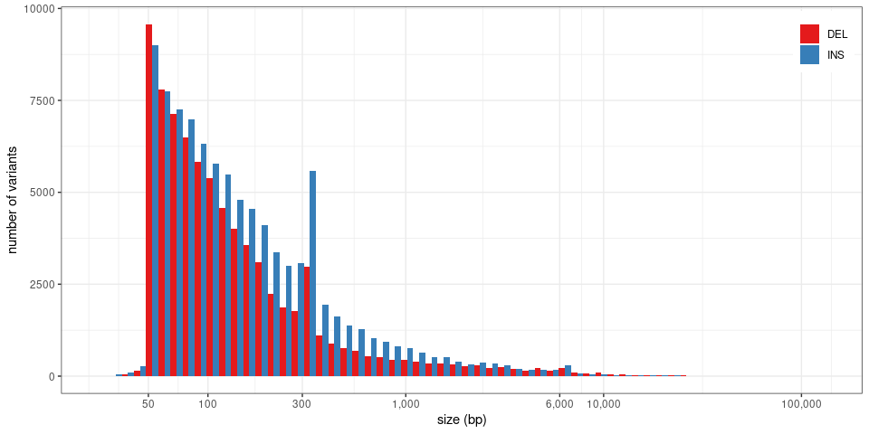
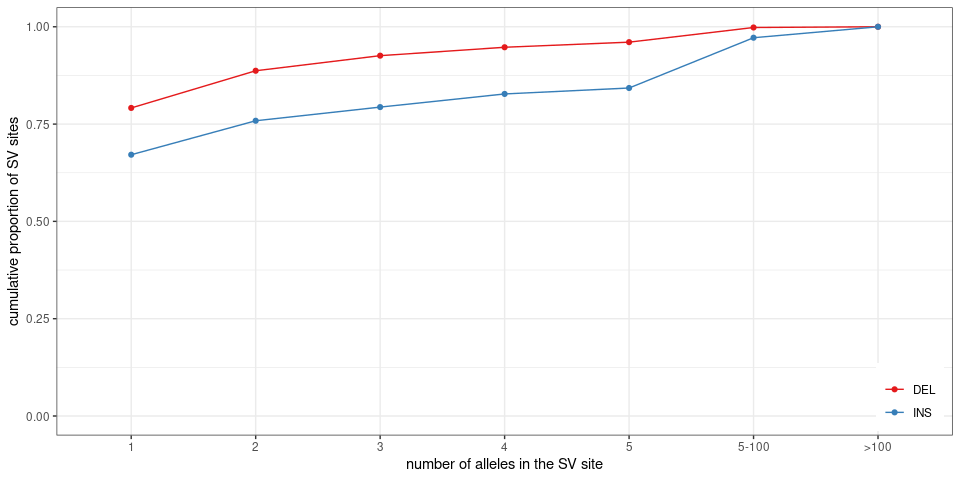
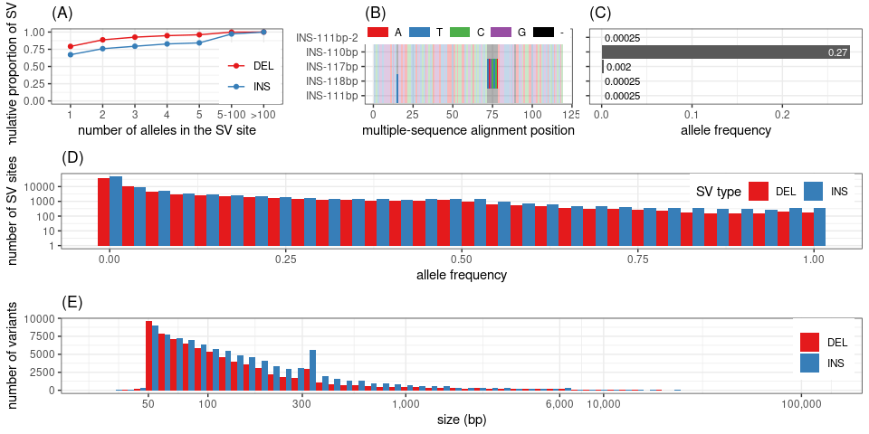
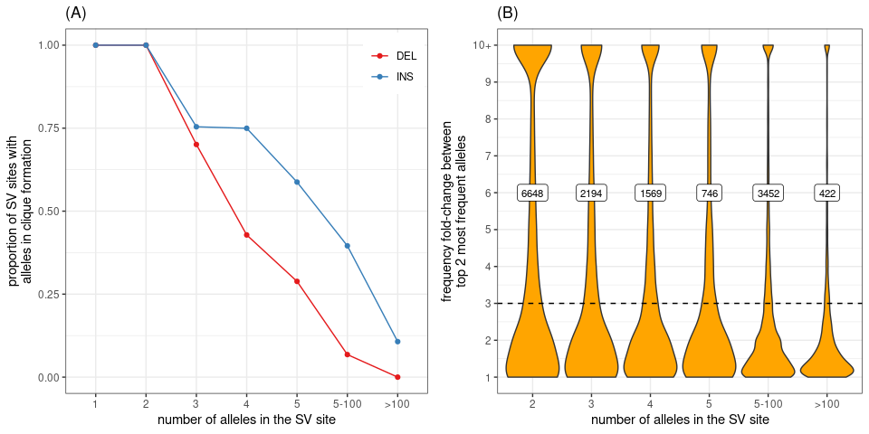

Summary stats for SVs in the MESA cohort
================

``` r
library(dplyr)
library(ggplot2)
library(gridExtra)
library(knitr)
library(GenomicRanges)
library(rtracklayer)
library(msa)
library(RColorBrewer)
winsor <- function(x, u){
  if(any(x>u)) x[x>u] = u
  x
}
## list of graphs
ggp = list()
```

## Read population stats for each SV allele

``` r
## SVs grouped by site ('svsite' and 'clique' columns)
svs = read.table('svs.mesa2k.svsite80al.tsv.gz', as.is=TRUE, header=TRUE)

## stats for each SV locus
## use the most frequent allele (and then the largest) for ac/af/size
## also saves sum/max/min across all alleles
locs = svs %>% arrange(desc(af), desc(size)) %>%
  group_by(seqnames, svsite, type, clique) %>%
  summarize(start=start[1], end=end[1],
            ac.tot=sum(ac), ac=ac[1],
            af.tot=sum(af), af.top2=tail(head(af, 2), 1), af=af[1],
            af.top.fc=ifelse(af.top2==0, 10, af/af.top2),
            loc.n=n(),
            size.min=min(size), size.max=max(size), size=size[1],
            .groups='drop') %>%
  filter(size.max>=50)

set.seed(123)
sample_n(locs, 10) %>% as.data.frame
```

    ##    seqnames       svsite type clique     start       end ac.tot   ac  af.tot
    ## 1      chr6 sv_1404088_0  DEL   TRUE 169918945 169919031   1210 1210 0.30250
    ## 2      chr5 sv_1517844_0  INS   TRUE 177703680 177703680    349  349 0.08725
    ## 3      chr9  sv_995307_0  INS   TRUE    400563    400563      2    2 0.00050
    ## 4      chr3 sv_1710591_0  INS  FALSE 195499124 195499124      6    2 0.00150
    ## 5      chr5 sv_1525026_0  INS   TRUE 178395247 178395247      3    3 0.00075
    ## 6     chr16  sv_502516_0  DEL   TRUE    903402    903542    570  570 0.14250
    ## 7     chr18  sv_370731_0  INS   TRUE  79620447  79620447     55   53 0.01375
    ## 8     chr16  sv_525849_0  INS   TRUE   9573835   9573835     62   62 0.01550
    ## 9      chr7 sv_1228775_0  INS   TRUE  83610445  83610445      3    3 0.00075
    ## 10    chr17  sv_462090_0  DEL   TRUE  80314366  80314455      1    1 0.00025
    ##    af.top2      af af.top.fc loc.n size.min size.max size
    ## 1  0.30250 0.30250       1.0     1       86       86   86
    ## 2  0.08725 0.08725       1.0     1      208      208  208
    ## 3  0.00050 0.00050       1.0     1       51       51   51
    ## 4  0.00025 0.00050       2.0     5     1505     1973 1505
    ## 5  0.00075 0.00075       1.0     1       88       88   88
    ## 6  0.14250 0.14250       1.0     1      140      140  140
    ## 7  0.00050 0.01325      26.5     2       59       59   59
    ## 8  0.01550 0.01550       1.0     1       74       74   74
    ## 9  0.00075 0.00075       1.0     1      155      155  155
    ## 10 0.00025 0.00025       1.0     1       89       89   89

## Allele/site numbers

``` r
## numbers by type
rbind(locs %>% mutate(type='all') %>% group_by(type) %>% summarize(alleles=sum(loc.n), sites=n()),
      locs %>% group_by(type) %>% summarize(alleles=sum(loc.n), sites=n())) %>%
  mutate(prop.alleles=alleles/alleles[1], prop.sites=sites/sites[1]) %>% 
  kable(digits=3, format.args=list(big.mark=','))
```

| type |   alleles |   sites | prop.alleles | prop.sites |
| :--- | --------: | ------: | -----------: | ---------: |
| all  | 1,745,642 | 167,858 |        1.000 |      1.000 |
| DEL  |   182,811 |  75,841 |        0.105 |      0.452 |
| INS  | 1,562,831 |  92,017 |        0.895 |      0.548 |

``` r
## numbers of cliques
locs %>% group_by(clique) %>% summarize(sites=n()) %>% ungroup %>% mutate(prop=sites/sum(sites)) %>%
  kable(digits=3, format.args=list(big.mark=','))
```

| clique |   sites |  prop |
| :----- | ------: | ----: |
| FALSE  |  16,975 | 0.101 |
| TRUE   | 150,883 | 0.899 |

``` r
## numbers of cliques by type
locs %>% group_by(type, clique) %>% summarize(sites=n()) %>%
  group_by(type) %>% mutate(prop.type=sites/sum(sites)) %>% 
  kable(digits=3, format.args=list(big.mark=','))
```

| type | clique |  sites | prop.type |
| :--- | :----- | -----: | --------: |
| DEL  | FALSE  |  5,327 |     0.070 |
| DEL  | TRUE   | 70,514 |     0.930 |
| INS  | FALSE  | 11,648 |     0.127 |
| INS  | TRUE   | 80,369 |     0.873 |

## Size

``` r
ggp$size = locs %>% as.data.frame %>%
  ggplot(aes(x=size, fill=type)) +
  geom_histogram(position='dodge', bins=60) +
  scale_fill_brewer(palette='Set1', name='SV type') + 
  theme_bw() +
  xlab('size (bp)') +
  scale_x_log10(breaks=c(0, 50, 100, 300, 1000, 6000, 1e4, 1e5),
                labels=c(0, 50, 100, 300, '1,000', '6,000', '10,000', '100,000')) + 
  ylab('number of variants') +
  theme(legend.title=element_blank()) + 
  ## theme(axis.text.x=element_text(angle=45, hjust=1)) + 
  theme(legend.position=c(.99, .99), legend.justification=c(1,1))
ggp$size
```

<!-- -->

``` r
locs %>% mutate(type='all') %>% rbind(locs) %>%
  group_by(type) %>%
  summarize(min.size=min(size), max.size=max(size),
    size.lt1kbp=mean(size<=1000), size.lt500=mean(size<=500))
```

    ## # A tibble: 3 x 5
    ##   type  min.size max.size size.lt1kbp size.lt500
    ## * <chr>    <int>    <int>       <dbl>      <dbl>
    ## 1 all         30   125187       0.944      0.898
    ## 2 DEL         31   114201       0.945      0.909
    ## 3 INS         30   125187       0.943      0.889

## Overlap with simple repeats, satellites or low-complexity regions

``` r
## simple repeats
if(!file.exists('simpleRepeat.hg38.txt.gz')){
  download.file('https://hgdownload.soe.ucsc.edu/goldenPath/hg38/database/simpleRepeat.txt.gz', 'simpleRepeat.hg38.txt.gz')
}
sr = read.table('simpleRepeat.hg38.txt.gz', as.is=TRUE)
sr = reduce(GRanges(sr$V2, IRanges(sr$V3, sr$V4)))
sr$repClass = 'Simple_repeat'
## repeat masker with low-complexity regions
if(!file.exists('rmsk.txt.gz')){
  download.file('https://hgdownload.soe.ucsc.edu/goldenPath/hg38/database/rmsk.txt.gz', 'rmsk.txt.gz')
}
rm = read.table('rmsk.txt.gz', as.is=TRUE,
                colClasses=c(rep("NULL", 5), 'character', 'integer', 'integer',
                             rep('NULL', 3), 'character',  rep('NULL', 5)))
colnames(rm) = c('chr', 'start', 'end', 'repClass')
rm = subset(rm, repClass %in% c('Low_complexity', 'Simple_repeat', 'Satellite'))
rm = makeGRangesFromDataFrame(rm, keep.extra.columns=TRUE)
rm = c(rm, sr)

locs.gr = makeGRangesFromDataFrame(locs)

olRep <- function(locs.gr, rm.r){
  rm.r = reduce(rm.r)
  findOverlaps(locs.gr, rm.r) %>% as.data.frame %>%
    mutate(sv.w=width(locs.gr[queryHits]), ol.w=width(pintersect(locs.gr[queryHits], rm.r[subjectHits])),
           ol.prop=ol.w/sv.w) %>%
    group_by(queryHits) %>% summarize(ol.prop=sum(ol.prop), .groups='drop')
}

## all: simple repeats, low complexity, satellites
ol.df = olRep(locs.gr, rm)
locs$rep.sr.lc.sat = 0
locs$rep.sr.lc.sat[ol.df$queryHits] = ol.df$ol.prop
## simple repeats + low-complexity
ol.df = olRep(locs.gr, subset(rm, repClass %in% c('Simple_repeat', 'Low_complexity')))
locs$rep.sr.lc = 0
locs$rep.sr.lc[ol.df$queryHits] = ol.df$ol.prop
## simple repeats
ol.df = olRep(locs.gr, subset(rm, repClass=='Simple_repeat'))
locs$rep.sr = 0
locs$rep.sr[ol.df$queryHits] = ol.df$ol.prop
## low complexity
ol.df = olRep(locs.gr, subset(rm, repClass=='Low_complexity'))
locs$rep.lc = 0
locs$rep.lc[ol.df$queryHits] = ol.df$ol.prop
## simple repeats
ol.df = olRep(locs.gr, subset(rm, repClass=='Satellite'))
locs$rep.sat = 0
locs$rep.sat[ol.df$queryHits] = ol.df$ol.prop

locs %>% mutate(type='all') %>% rbind(locs) %>%
  group_by(type) %>% 
  summarize(rep.sr.lc.sat.50=mean(rep.sr.lc.sat>=.50), rep.sr.lc.50=mean(rep.sr.lc>=.50),
                   rep.sr.50=mean(rep.sr>=.50),
                   rep.lc.50=mean(rep.lc>=.50), rep.sat.50=mean(rep.sat>=.50)) %>%
  kable(digits=3)
```

| type | rep.sr.lc.sat.50 | rep.sr.lc.50 | rep.sr.50 | rep.lc.50 | rep.sat.50 |
| :--- | ---------------: | -----------: | --------: | --------: | ---------: |
| all  |            0.840 |        0.840 |     0.839 |     0.016 |      0.016 |
| DEL  |            0.831 |        0.830 |     0.829 |     0.015 |      0.018 |
| INS  |            0.848 |        0.848 |     0.847 |     0.016 |      0.014 |

*sr*: simple repeat; *lc*: low-complexity; *sat*: satellite DNA. *.50*
means that at least 50% of the SV region overlaps repeats.

### Non-clique SV sites are repeat-rich

We expect most non-clique sites, i.e. with very different alleles, to be
repeat variation like short-tandem repeats variation (or VNTRs). Is it?

``` r
locs %>% mutate(type='all') %>% rbind(locs) %>%
  filter(!clique) %>% 
  group_by(type) %>% 
  summarize(rep.sr.lc.sat.50=mean(rep.sr.lc.sat>=.50), rep.sr.lc.50=mean(rep.sr.lc>=.50),
                   rep.sr.50=mean(rep.sr>=.50),
                   rep.lc.50=mean(rep.lc>=.50), rep.sat.50=mean(rep.sat>=.50)) %>%
  kable(digits=3)
```

| type | rep.sr.lc.sat.50 | rep.sr.lc.50 | rep.sr.50 | rep.lc.50 | rep.sat.50 |
| :--- | ---------------: | -----------: | --------: | --------: | ---------: |
| all  |            0.977 |        0.977 |     0.976 |     0.016 |      0.007 |
| DEL  |            0.987 |        0.987 |     0.987 |     0.009 |      0.008 |
| INS  |            0.972 |        0.972 |     0.971 |     0.019 |      0.007 |

Yes, almost all are within simple repeats. What are the ones that are
not?

``` r
locs.nc = locs %>% filter(!clique, rep.sr.lc.sat<=.5)

## distance to simple repeat
locs.nc.gr = makeGRangesFromDataFrame(locs.nc)
dd = distanceToNearest(locs.nc.gr, rm) %>% as.data.frame
locs.nc$rep.dist = NA
locs.nc$rep.dist[dd$queryHits] = dd$distance

## random subset
set.seed(123)
locs.nc %>%
  filter(size.min/size.max>.8) %>% 
  mutate(coord=paste0('[', seqnames, ':', start, '-', end,
                      '](https://genome.ucsc.edu/cgi-bin/hgTracks?db=hg38&position=',
                      seqnames, '%3A', start, '%2D', end, ')')) %>% 
  select(coord, svsite, type, size, loc.n, size.min, size.max, rep.dist, rep.sr.lc.sat) %>% sample_n(10) %>%
  kable
```

| coord                                                                                                              | svsite         | type | size | loc.n | size.min | size.max | rep.dist | rep.sr.lc.sat |
| :----------------------------------------------------------------------------------------------------------------- | :------------- | :--- | ---: | ----: | -------: | -------: | -------: | ------------: |
| [chr11:64237124-64237124](https://genome.ucsc.edu/cgi-bin/hgTracks?db=hg38&position=chr11%3A64237124%2D64237124)   | sv\_859480\_0  | INS  |  144 |    66 |      121 |      144 |        0 |     0.0000000 |
| [chr2:105485095-105485095](https://genome.ucsc.edu/cgi-bin/hgTracks?db=hg38&position=chr2%3A105485095%2D105485095) | sv\_1794130\_0 | INS  |  162 |    27 |      139 |      170 |     1034 |     0.0000000 |
| [chr17:43251137-43251546](https://genome.ucsc.edu/cgi-bin/hgTracks?db=hg38&position=chr17%3A43251137%2D43251546)   | sv\_447044\_0  | DEL  |  409 |     4 |      407 |      430 |        0 |     0.4073171 |
| [chr17:43268211-43268917](https://genome.ucsc.edu/cgi-bin/hgTracks?db=hg38&position=chr17%3A43268211%2D43268917)   | sv\_448845\_0  | DEL  |  706 |     3 |      573 |      712 |     1089 |     0.0000000 |
| [chr9:20225563-20225563](https://genome.ucsc.edu/cgi-bin/hgTracks?db=hg38&position=chr9%3A20225563%2D20225563)     | sv\_1009694\_0 | INS  |  311 |    11 |      249 |      311 |      358 |     0.0000000 |
| [chr17:43254597-43254971](https://genome.ucsc.edu/cgi-bin/hgTracks?db=hg38&position=chr17%3A43254597%2D43254971)   | sv\_447396\_0  | DEL  |  374 |     3 |      327 |      374 |      402 |     0.0000000 |
| [chr5:376063-376063](https://genome.ucsc.edu/cgi-bin/hgTracks?db=hg38&position=chr5%3A376063%2D376063)             | sv\_1434972\_0 | INS  |   81 |    22 |       69 |       81 |     1667 |     0.0000000 |
| [chr8:2269687-2269687](https://genome.ucsc.edu/cgi-bin/hgTracks?db=hg38&position=chr8%3A2269687%2D2269687)         | sv\_1101781\_0 | INS  |   83 |     8 |       80 |       90 |       20 |     0.0000000 |
| [chrX:135723989-135723989](https://genome.ucsc.edu/cgi-bin/hgTracks?db=hg38&position=chrX%3A135723989%2D135723989) | sv\_74677\_0   | INS  |  104 |     8 |      103 |      128 |       12 |     0.0000000 |
| [chrX:46497428-46497428](https://genome.ucsc.edu/cgi-bin/hgTracks?db=hg38&position=chrX%3A46497428%2D46497428)     | sv\_42546\_0   | INS  |   96 |    28 |       94 |      105 |     2426 |     0.0000000 |

Either very close to repeats, or in segmental duplication or
transposons, or slightly below the 80% threshold used to define matching
alleles.

## Gene annotation

``` r
if(!file.exists('gencode.v35.annotation.gtf.gz')){
  download.file('ftp://ftp.ebi.ac.uk/pub/databases/gencode/Gencode_human/release_35/gencode.v35.annotation.gtf.gz', 'gencode.v35.annotation.gtf.gz')
}
genc = import('gencode.v35.annotation.gtf.gz')

genc.pc = subset(genc, type %in% c('CDS', 'UTR', 'gene') & gene_type=='protein_coding')
prom = promoters(subset(genc.pc, type=='gene'))
prom$type = 'promoter'
genc.pc = c(genc.pc, prom)
ol.gene = findOverlaps(locs.gr, genc.pc) %>% as.data.frame %>%
  mutate(gene=genc.pc$gene_name[subjectHits], type=genc.pc$type[subjectHits]) %>%
  group_by(queryHits, gene) %>%
  summarize(cds=any(type=='CDS'))

rbind(ol.gene %>% filter(cds) %>% mutate(impact='cds'),
      ol.gene %>% mutate(impact='cds.prom.utr.intron')) %>%
  group_by(impact) %>%
  summarize(sv=length(unique(queryHits)), gene=length(unique(gene))) %>%
  kable
```

| impact              |    sv | gene |
| :------------------ | ----: | ---: |
| cds                 |  1563 |  408 |
| cds.prom.utr.intron | 78364 | 7740 |

## Allele frequency

``` r
ggp$af = locs %>% as.data.frame %>%
  ggplot(aes(x=af, fill=type)) +
  geom_histogram(position='dodge') +
  scale_fill_brewer(palette='Set1', name='SV type') +
  scale_y_log10() + 
  theme_bw() +
  xlab('allele frequency') +
  ylab('number of SV loci') +
  theme(legend.position=c(.99, .99), legend.justification=c(1,1)) +
  guides(fill=guide_legend(direction='horizontal'))
ggp$af
```

<!-- -->

``` r
## comparing allele frequency between top 2 most frequent alleles in SV loci
locs.s.3 = locs %>% filter(loc.n>1, af.top.fc>3) %>%
  mutate(loc.n=cut(loc.n, breaks=c(1:5,100,Inf), labels=c(2:5, '5-100', '>100'))) %>% 
  group_by(loc.n) %>% summarize(n=n())
ggp$af.top = locs %>% filter(loc.n>1) %>%
  mutate(loc.n=cut(loc.n, breaks=c(1:5,100,Inf), labels=c(2:5, '5-100', '>100'))) %>% 
  ggplot(aes(x=loc.n, y=winsor(af.top.fc, 10))) +
  geom_violin(scale='width', fill='orange') +
  theme_bw() +
  scale_y_continuous(breaks=1:10, labels=c(1:9, '10+')) +
  ylab('frequency fold-change between\ntop 2 most frequent alleles') +
  xlab('number of SVs in locus') +
  theme(legend.title=element_blank()) + 
  geom_hline(yintercept=3, linetype=2) +
  geom_label(aes(label=n), y=6, data=locs.s.3, size=3)
ggp$af.top
```

<!-- -->

``` r
locs %>% filter(loc.n>1) %>%
  summarize(af.fc.3=sum(af.top.fc>3),
            af01.af2lt01=sum(af>=.01 & af.top2<.01),
            af01.af2lt01.fc3=sum(af>=.01 & af.top2<.01 & af.top.fc>3),
            major.al=sum(af>af.top2)) %>%
  kable
```

| af.fc.3 | af01.af2lt01 | af01.af2lt01.fc3 | major.al |
| ------: | -----------: | ---------------: | -------: |
|   15031 |         7514 |             6063 |    38541 |

  - *af.fc.3*: SV sites where the most frequent allele is at least 3
    times more frequent than the seoncd most frequent allele.
  - *af01.af2lt01*: SV sites where most frequent allele with frequency
    \>1% but other alleles with \<1% frequency.
  - *af01.af2lt01.fc3*: Same + the most frequent allele is at least 3
    times more frequent than the seoncd most frequent allele.
  - *major.al*: SV sites with one allele more frequent than the other
    alleles.

## Alleles per SV sites

``` r
## number of alleles per loci
ggp$loc.al = locs %>% mutate(loc.n=cut(loc.n, breaks=c(0:5,100,Inf), labels=c(1:5, '5-100', '>100'))) %>%
  group_by(loc.n, type) %>% summarize(n=n(), .groups='drop') %>%
  arrange(loc.n) %>% group_by(type) %>% mutate(cprop=cumsum(n)/sum(n)) %>% 
  ggplot(aes(x=loc.n, y=cprop, color=type, group=type)) +
  geom_line() + 
  geom_point() + 
  theme_bw() +
  ylim(0,1) + 
  scale_color_brewer(palette='Set1', name='SV type') + 
  ylab('cumulative proportion of SV loci') +
  xlab('number of SVs in locus') +
  theme(legend.title=element_blank()) + 
  theme(legend.position=c(.99, .01), legend.justification=c(1,0))
ggp$loc.al
```

<!-- -->

``` r
## proportion of cliques, i.e. all alleles similar, in a SV locus
ggp$loc.cl = locs %>% mutate(loc.n=cut(loc.n, breaks=c(0:5,100,Inf), labels=c(1:5, '5-100', '>100'))) %>%
  group_by(loc.n, type) %>% summarize(cl.prop=mean(clique)) %>% 
  ggplot(aes(x=loc.n, y=cl.prop, color=type, group=type)) +
  geom_line() + 
  geom_point() + 
  theme_bw() +
  ylim(0,1) + 
  scale_color_brewer(palette='Set1', name='SV type') + 
  ylab('proportion of SV loci with\nalleles in clique formation') +
  xlab('number of SVs in locus') +
  theme(legend.title=element_blank()) + 
  theme(legend.position=c(.99, .99), legend.justification=c(1,1))
ggp$loc.cl
```

<!-- -->

## Multi-panel figure

``` r
## adds a legend title: a), b), etc
plot_list <- function(ggp.l, gg.names=NULL){
  if(is.null(names(ggp.l))) names(ggp.l) = paste0('g', 1:length(ggp.l))
  if(is.null(gg.names)) gg.names = names(ggp.l)
  lapply(1:length(gg.names), function(ii) ggp.l[[gg.names[ii]]] + ggtitle(paste0('(', LETTERS[ii], ')')))
}

## combined graph for a subset of SVs (e.g. SVs in particular locus)
plotSVs <-function(svs.cl, label.svs=TRUE){
  ## MSA
  seqs = ifelse(svs.cl$type=='INS', svs.cl$alt , svs.cl$ref)
  seqs = substr(seqs, 2, nchar(seqs)) # remove padding base
  seqs = DNAStringSet(seqs)
  names(seqs) = svs.cl$svid
  ## flag non-canonical SVs that might appear similar in MSA
  canonical = nchar(ifelse(svs.cl$type=='INS', svs.cl$ref , svs.cl$alt)) == 1
  names(seqs) = ifelse(canonical, names(seqs), paste0(names(seqs), '*'))
  capture.output({msa.o = msa(seqs, gapOpening=-1)})
  msa.o = as.matrix(msa.o)
  consSeq <- function(x) head(names(sort(table(x), decreasing=TRUE)), 1)
  df = lapply(1:ncol(msa.o), function(alc.ii){
    alc = msa.o[,alc.ii]
    tibble(position=alc.ii, seqn=rownames(msa.o), seq=alc, cons=alc==consSeq(alc))
  }) %>% bind_rows
  svids = svs.cl %>% as.data.frame %>%
    mutate(seqn=svid,
           svid=paste0(type, '-', size, 'bp')) %>%
    select(seqn, svid) %>%
    group_by(svid) %>% mutate(n=1:n(), svid=ifelse(n>1, paste(svid, n, sep='-'), svid)) %>%
    select(-n)
  df = df %>% mutate(seqn=factor(seqn, levels=unique(seqn)),
                     seq=factor(seq, levels=c('A','T','C','G','-'))) %>%
    merge(svids) %>% 
    arrange(seqn) %>%
    mutate(svid=factor(svid, levels=unique(svid)))
  pal = c(brewer.pal(4, 'Set1'), 'black')
  ggp.3 = ggplot(df, aes(x=position, y=svid)) +
    geom_tile(aes(fill=seq, alpha=cons)) +
    scale_alpha_manual(values=c(1,.3)) +
    guides(alpha=FALSE) +
    scale_fill_manual(values=pal, breaks=levels(df$seq)) +
    xlab('multiple-sequence alignment position') + 
    theme_bw() +
    guides(fill=guide_legend(keyheight=.5, ncol=5)) + 
    theme(axis.title.y=element_blank(), legend.position=c(.99,1.2), legend.justification=c(1,1),
          legend.title=element_blank())
  if(any(!canonical)){
    ggp.3 = ggp.3 + labs(caption='*non-canonical SV')
  }
  if(!label.svs){
    ggp.3 = ggp.3 + theme(axis.text.y=element_blank(), axis.title.y=element_text()) + ylab('SV')
  }
  ## allele frequencies
  ggp.af = svs.cl %>% as.data.frame %>%
    mutate(svid=factor(svid, levels=levels(df$seqn)),
           hj=ifelse(af>max(af)/2, 1, 0),
           label=ifelse(af>max(af)/2, paste0(signif(af, 2), ' '), paste0(' ', signif(af, 2)))) %>% 
    ggplot(aes(x=svid, y=af)) + geom_bar(stat='identity') +
    geom_text(aes(label=label, hjust=hj, color=factor(hj)), size=3) +
    scale_color_manual(values=c('black', 'white')) +
    guides(color=FALSE) + 
    theme_bw() +
    ylab('allele frequency') +
    coord_flip() + 
    theme(axis.text.y=element_blank(),
          axis.title.y=element_blank())  
  ## combine graphs
  list(ggp.3, ggp.af)
}

ex.sv = locs %>% filter(type=='INS', clique, loc.n==5, size>100) %>%
  arrange(desc(af.top.fc)) %>% head(1) %>% .$svsite

ggpf = c(ggp["loc.al"], subset(svs, svsite==ex.sv) %>% plotSVs, ggp[c("af", "size")])
names(ggpf) = 1:length(ggpf)

grid.arrange(grobs=plot_list(ggpf),
             layout_matrix=matrix(c(1,2,3,4,4,4,5,5,5), nrow=3, byrow=TRUE))
```

<!-- -->

``` r
grid.arrange(grobs=plot_list(ggp, c("loc.cl", "af.top")),
             layout_matrix=matrix(1:2,1))
```

<!-- -->

``` r
pdf('figs/fig-sv-mesa-stats.pdf', 10, 8)
grid.arrange(grobs=plot_list(ggpf),
             layout_matrix=matrix(c(1,2,3,4,4,4,5,5,5), nrow=3, byrow=TRUE),
             widths=c(2,3,1))
dev.off()
```

    ## png 
    ##   2

``` r
pdf('figs/fig-sv-mesa-stats-2.pdf', 9, 4)
grid.arrange(grobs=plot_list(ggp, c("loc.cl", "af.top")),
             layout_matrix=matrix(1:2,1))
dev.off()
```

    ## png 
    ##   2

## Save TSV with SV site information

``` r
outf = gzfile('locs.mesa2k.svsite80al.tsv.gz', 'w')
write.table(locs, file=outf, row.names=FALSE, quote=FALSE, sep='\t')
close(outf)
```
