SNV/indel/SV-eQTLs summary
================

``` r
library(rtracklayer)
library(dplyr)
library(ggplot2)
library(gridExtra)
library(knitr)
library(tidyr)
library(RColorBrewer)
## list of figures
ggp = list()
```

## Read eQTL results

Matrix-eQTL was ran on different sample sets (*all* samples,
*Eur*opeans, *YRI*) on the SV genotypes predicted by vg and the
SNV/indels called by the NYGC (phased VCF on autosomes).

``` r
load('eqtl-test-allvars-results.RData')
names(ll)
```

    ## [1] "me.lin.norm.all" "me.lin.norm.eur" "me.lin.norm.yri"

``` r
names(ll) = c('EUR + YRI', 'EUR', 'YRI')
```

## Gene annotation

``` r
if(!file.exists('../describe-svs/gencode.v35.annotation.gtf.gz')){
  download.file('ftp://ftp.ebi.ac.uk/pub/databases/gencode/Gencode_human/release_35/gencode.v35.annotation.gtf.gz', '../describe-svs/gencode.v35.annotation.gtf.gz')
}

genc.all = import('../describe-svs/gencode.v35.annotation.gtf.gz')
genc = subset(genc.all, type=='gene')
genc$gene_id = gsub('\\..*', '', genc$gene_id)
genc = genc %>% as.data.frame %>% mutate(gene=gene_id) %>% select(gene, gene_type, gene_name)

pc.geneids = genc %>% filter(gene_type=='protein_coding') %>% .$gene %>% unique
```

## QC: p-value distribution and QQ plots

``` r
qqplot_matrixeqtl <- function(me.o){
  pvs.s = tibble(n=me.o$cis$hist.counts,
                 pv.s=me.o$cis$hist.bins[-length(me.o$cis$hist.bins)],
                 pv.e=me.o$cis$hist.bins[-1])
  pvs.s$pv.s.exp = cumsum(pvs.s$n)/sum(pvs.s$n)
  pvs.s %>% filter(n>0) %>% 
    ggplot(aes(x=-log10(pv.s.exp), y=-log10(pv.s))) +
    geom_step() +
    ## geom_point(aes(size=cut(n, c(0,1,2,10,Inf), labels=c(1, 2, '3-10', '>10'))), alpha=.5) +
    theme_bw() +
    scale_size_manual(values=c(1,1.5,2,3), 'cis-eQTLs') + 
    geom_abline(linetype=2) +
    xlab('theoritical null p-value (-log10)') +
    ylab('p-value (-log10)')
}

pvhist_matrixeqtl <- function(me.o){
  pvs.s = tibble(n=me.o$cis$hist.counts,
                 pv.s=me.o$cis$hist.bins[-length(me.o$cis$hist.bins)])
  ## pv < 0.01 were split in multiple bins for the qqplot -> aggregate them
  pvs.h = pvs.s %>% mutate(pv.s=ifelse(pv.s<.01, 0, pv.s)) %>%
    group_by(pv.s) %>% summarize(n=sum(n))
  ## histogram
  ggplot(pvs.h, aes(x=pv.s+.005, y=n)) +
    geom_bar(stat='identity', width=.01) + theme_bw() +
    ylim(0, max(pvs.h$n)) +
    xlab('p-value') + ylab('SV-gene test')
}

ggp$hist.all = pvhist_matrixeqtl(ll[['EUR + YRI']])
ggp$hist.all + ggtitle('EUR + YRI')
```

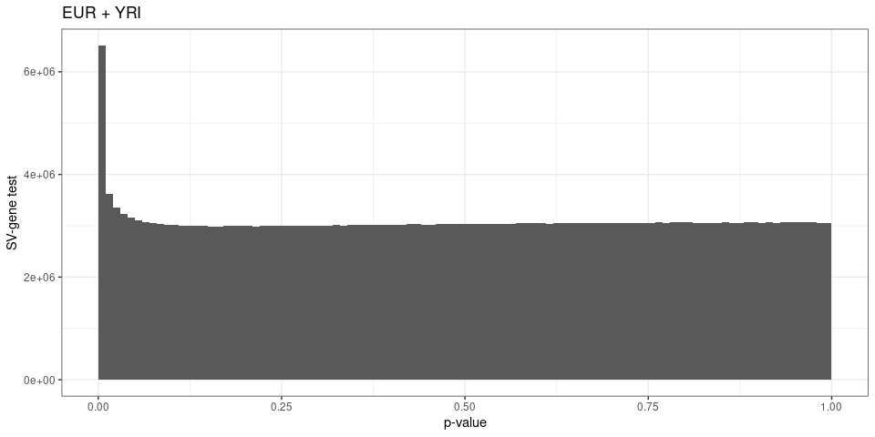<!-- -->

``` r
ggp$qq.all = qqplot_matrixeqtl(ll[['EUR + YRI']])
ggp$qq.all + ggtitle('EUR + YRI')
```

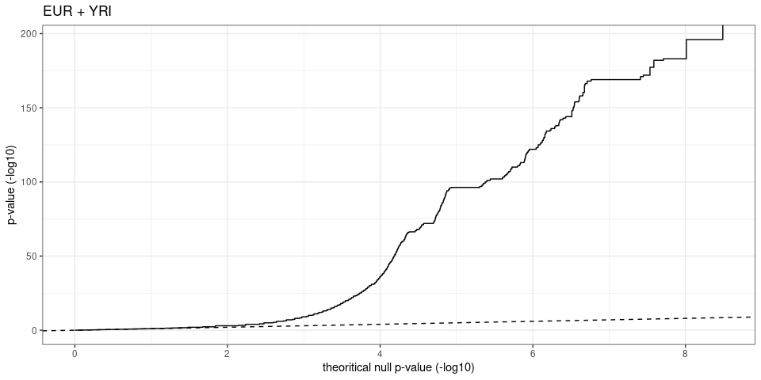<!-- -->

``` r
ggp$hist.eur = pvhist_matrixeqtl(ll[['EUR']])
ggp$hist.eur + ggtitle('EUR')
```

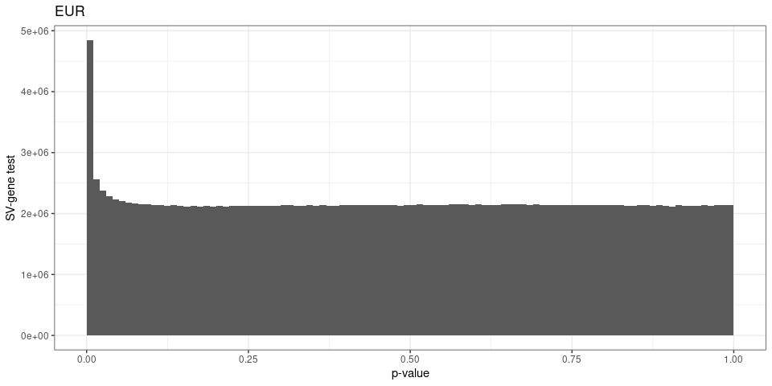<!-- -->

``` r
ggp$qq.eur = qqplot_matrixeqtl(ll[['EUR']])
ggp$qq.eur + ggtitle('EUR')
```

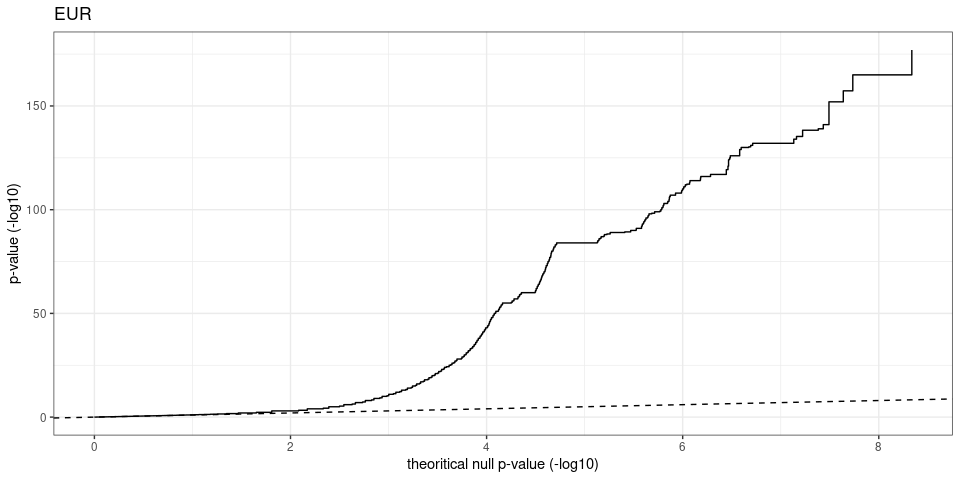<!-- -->

``` r
ggp$hist.yri = pvhist_matrixeqtl(ll[['YRI']])
ggp$hist.yri + ggtitle('YRI')
```

<!-- -->

``` r
ggp$qq.yri = qqplot_matrixeqtl(ll[['YRI']])
ggp$qq.yri + ggtitle('YRI')
```

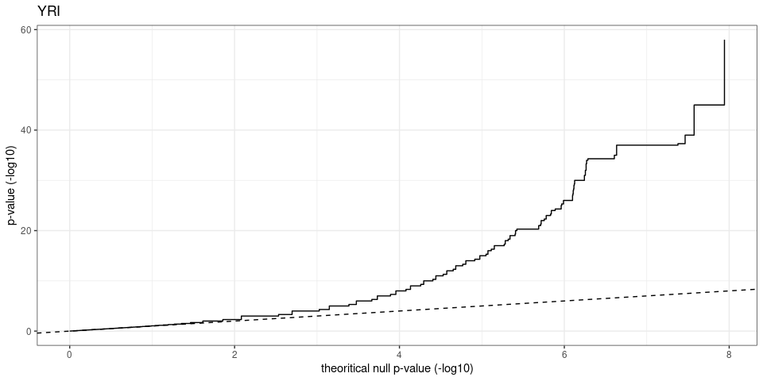<!-- -->

## Number of eQTLs and eGenes

``` r
eqtl.df = lapply(names(ll)[1:3], function(nn){
  ll[[nn]]$cis$eqtls %>% mutate(pop=nn)
}) %>% bind_rows

svs = read.table('../describe-svs/svs.2504kgp.svsite80al.tsv.gz', as.is=TRUE, header=TRUE)
svs = svs %>% select(svid, type, seqnames, start, end, size)
dels.svids = svs %>% filter(type=="DEL") %>% .$svid
inss.svids = svs %>% filter(type=="INS") %>% .$svid

eqtl.df = eqtl.df %>% mutate(pop=factor(pop, levels=c('EUR + YRI', 'EUR', 'YRI'))) %>%
  dplyr::rename(svid=snps) %>% 
  mutate(gene_type=ifelse(gene %in% pc.geneids, 'protein_coding', 'other'),
         gene_type=factor(gene_type, levels=c('protein_coding', 'other')),
         type=ifelse(svid %in% dels.svids, 'DEL', 'SNV-indel'),
         type=ifelse(svid %in% inss.svids, 'INS', type))

eqtl.df %>% filter(FDR<=.01) %>% 
  group_by(gene_type, pop, type) %>%
  summarize(eqtl.fdr01=n(),
            esv.fdr01=length(unique(svid)),
            egene.fdr01=length(unique(gene))) %>%
  kable(format.args=list(big.mark=','))
```

| gene\_type      | pop       | type      | eqtl.fdr01 | esv.fdr01 | egene.fdr01 |
| :-------------- | :-------- | :-------- | ---------: | --------: | ----------: |
| protein\_coding | EUR + YRI | DEL       |      1,057 |       796 |         592 |
| protein\_coding | EUR + YRI | INS       |      1,080 |       834 |         618 |
| protein\_coding | EUR + YRI | SNV-indel |    631,019 |   512,973 |      10,229 |
| protein\_coding | EUR       | DEL       |      1,109 |       840 |         635 |
| protein\_coding | EUR       | INS       |      1,133 |       888 |         672 |
| protein\_coding | EUR       | SNV-indel |    564,801 |   444,979 |       9,688 |
| protein\_coding | YRI       | DEL       |        205 |       181 |         130 |
| protein\_coding | YRI       | INS       |        155 |       149 |         102 |
| protein\_coding | YRI       | SNV-indel |     48,958 |    46,758 |       3,552 |
| other           | EUR + YRI | DEL       |        544 |       455 |         280 |
| other           | EUR + YRI | INS       |        490 |       418 |         279 |
| other           | EUR + YRI | SNV-indel |    302,479 |   231,191 |       4,307 |
| other           | EUR       | DEL       |        525 |       436 |         284 |
| other           | EUR       | INS       |        512 |       430 |         294 |
| other           | EUR       | SNV-indel |    278,404 |   209,396 |       3,986 |
| other           | YRI       | DEL       |        102 |       100 |          64 |
| other           | YRI       | INS       |         84 |        79 |          53 |
| other           | YRI       | SNV-indel |     25,078 |    23,597 |       1,424 |

``` r
eqtl.df %>% filter(FDR<=.05) %>% 
  group_by(gene_type, pop, type) %>%
  summarize(eqtl.fdr05=n(),
            esv.fdr05=length(unique(svid)),
            egene.fdr05=length(unique(gene))) %>%
  kable(format.args=list(big.mark=','))
```

| gene\_type      | pop       | type      | eqtl.fdr05 | esv.fdr05 | egene.fdr05 |
| :-------------- | :-------- | :-------- | ---------: | --------: | ----------: |
| protein\_coding | EUR + YRI | DEL       |      1,705 |     1,347 |         993 |
| protein\_coding | EUR + YRI | INS       |      1,800 |     1,428 |       1,090 |
| protein\_coding | EUR + YRI | SNV-indel |    981,934 |   798,079 |      13,278 |
| protein\_coding | EUR       | DEL       |      1,795 |     1,421 |       1,065 |
| protein\_coding | EUR       | INS       |      1,861 |     1,503 |       1,138 |
| protein\_coding | EUR       | SNV-indel |    866,230 |   676,028 |      12,988 |
| protein\_coding | YRI       | DEL       |        386 |       338 |         244 |
| protein\_coding | YRI       | INS       |        328 |       305 |         233 |
| protein\_coding | YRI       | SNV-indel |    100,413 |    94,535 |       6,578 |
| other           | EUR + YRI | DEL       |        892 |       741 |         472 |
| other           | EUR + YRI | INS       |        803 |       671 |         453 |
| other           | EUR + YRI | SNV-indel |    448,166 |   349,627 |       6,398 |
| other           | EUR       | DEL       |        879 |       747 |         478 |
| other           | EUR       | INS       |        826 |       683 |         466 |
| other           | EUR       | SNV-indel |    402,759 |   307,886 |       6,169 |
| other           | YRI       | DEL       |        197 |       191 |         123 |
| other           | YRI       | INS       |        162 |       153 |         109 |
| other           | YRI       | SNV-indel |     49,640 |    46,213 |       2,829 |

## Positively or negatively correlated with gene expression

``` r
eqtl.df %>% filter(FDR<=.01) %>%
  group_by(pop, type) %>% summarize(prop.pos.beta=mean(beta>0),
                                    mean.beta.pos=mean(beta[beta>0]),
                                    mean.beta.neg=mean(beta[beta<0])) %>% kable(digits=3)
```

| pop       | type      | prop.pos.beta | mean.beta.pos | mean.beta.neg |
| :-------- | :-------- | ------------: | ------------: | ------------: |
| EUR + YRI | DEL       |         0.641 |         0.031 |       \-0.010 |
| EUR + YRI | INS       |         0.655 |         0.028 |       \-0.009 |
| EUR + YRI | SNV-indel |         0.650 |         0.029 |       \-0.009 |
| EUR       | DEL       |         0.656 |         0.037 |       \-0.011 |
| EUR       | INS       |         0.667 |         0.033 |       \-0.011 |
| EUR       | SNV-indel |         0.613 |         0.028 |       \-0.011 |
| YRI       | DEL       |         0.866 |         0.213 |       \-0.042 |
| YRI       | INS       |         0.862 |         0.208 |       \-0.044 |
| YRI       | SNV-indel |         0.787 |         0.149 |       \-0.054 |

``` r
eqtl.df %>% filter(FDR<=.01) %>%
  ggplot(aes(beta)) +
  geom_vline(xintercept=0, linetype=2) + 
  geom_histogram(position='dodge') +
  theme_bw() + ylab('SV-eQTL') + 
  facet_wrap(.~type+pop, scales='free')
```

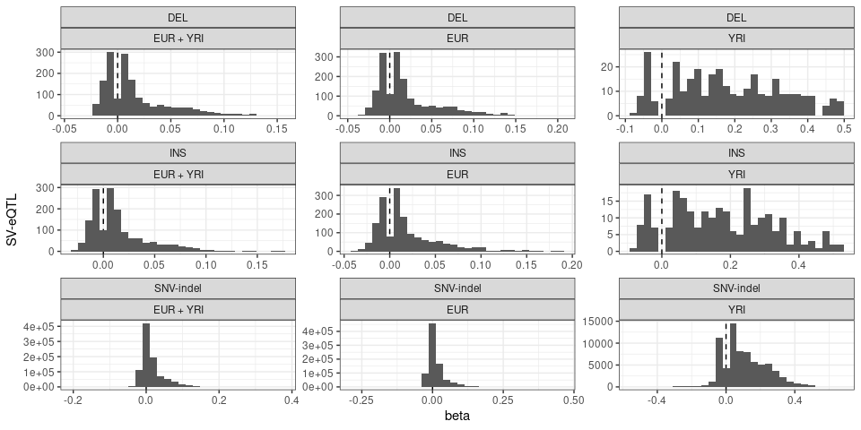<!-- -->

## eQTL lead: SNV-indel or SV?

``` r
eqtl.g = eqtl.df %>% filter(pop=='EUR + YRI', FDR<=.01) %>% 
  group_by(gene) %>%
  summarize(nb.sv=sum(type!='SNV-indel'),
            min.qv.sv=min(FDR[which(type!='SNV-indel')]),
            min.qv.sv=ifelse(nb.sv==0, NA, min.qv.sv),
            max.beta.sv=max(abs(beta[which(type!='SNV-indel')])),
            max.beta.sv=ifelse(nb.sv==0, NA, max.beta.sv),
            nb.snv.indel=sum(type=='SNV-indel'),
            min.qv.snv.indel=min(FDR[which(type=='SNV-indel')]),
            min.qv.snv.indel=ifelse(nb.snv.indel==0, NA, min.qv.snv.indel),
            max.beta.snv.indel=max(abs(beta[which(type=='SNV-indel')])),
            max.beta.snv.indel=ifelse(nb.snv.indel==0, NA, max.beta.snv.indel))

eqtl.g %>% filter(nb.sv>0, nb.snv.indel>0) %>%
  mutate(strongest.assoc=ifelse(min.qv.snv.indel<min.qv.sv, 'SNV-indel', 'SV'),
         strongest.assoc=ifelse(min.qv.snv.indel==min.qv.sv, 'SNV-indel-SV', strongest.assoc)) %>%
  group_by(strongest.assoc) %>% summarize(n=n()) %>% ungroup %>% mutate(prop=n/sum(n)) %>% arrange(desc(n))
```

    ## # A tibble: 3 x 3
    ##   strongest.assoc     n    prop
    ##   <chr>           <int>   <dbl>
    ## 1 SNV-indel        1338 0.936  
    ## 2 SV                 85 0.0594 
    ## 3 SNV-indel-SV        7 0.00490

``` r
## lead-eQTL
nb.lead.sv = eqtl.g %>% filter(nb.sv>0, nb.snv.indel>0, min.qv.snv.indel>min.qv.sv) %>% nrow
nb.lead.all = eqtl.g %>% filter(nb.sv>0, nb.snv.indel>0) %>% nrow
nb.lead.sv / nb.lead.all
```

    ## [1] 0.05944056

Permute the pvalue/FDR (or pick one variant randomly) within each gene
to have an idea of the expected number and compute a permutation
p-value.

``` r
## sample lead assoc within each gene that contains both SV and SNV-indel eQTLs
genes.both = eqtl.g %>% filter(nb.sv>0, nb.snv.indel>0) %>% .$gene %>% unique

N = 10000
lead.perm.df = eqtl.df %>% filter(pop=='EUR + YRI', FDR<=.01, gene %in% genes.both) %>% 
  group_by(gene) %>% do({tibble(perm=1:N, type=sample(.$type, N, replace=TRUE))}) %>%
  group_by(perm) %>% summarize(nb.all=n(), nb.sv=sum(type!='SNV-indel'), prop.sv=nb.sv/nb.all)

summary(lead.perm.df$prop.sv)
```

    ##    Min. 1st Qu.  Median    Mean 3rd Qu.    Max. 
    ## 0.03147 0.04545 0.04895 0.04876 0.05175 0.07203

``` r
pv.perm = (1+sum(nb.lead.sv/nb.lead.all <= lead.perm.df$prop.sv)) / (1+nrow(lead.perm.df))
pv.perm
```

    ## [1] 0.0219978

Out of curiosity how many SVs are tested or in eQTLs compared to
SNV-indels?

``` r
## out of all variants tested
pars = ll[['EUR + YRI']]$input
pars$svs / pars$variants
```

    ## [1] 0.004854845

``` r
## out of all eQTLs
eqtl.df %>% filter(pop=='EUR + YRI', FDR<=.01) %>% summarize(prop.sv=mean(type!='SNV-indel'))
```

    ##       prop.sv
    ## 1 0.003385401

``` r
## out of all eQTLs in genes with both SV and SNV/indel eQTLs
eqtl.g %>% filter(nb.sv>0, nb.snv.indel>0) %>% summarize(pop.sv=sum(nb.sv)/sum(nb.sv+nb.snv.indel))
```

    ## # A tibble: 1 x 1
    ##    pop.sv
    ##     <dbl>
    ## 1 0.00696

  - Only 0.49% of the variants tested were SVs.
  - Only 0.34% of the eQTLs were SVs.
  - Only 0.7% of the eQTLs with both SNV/indel-eQTLs and SV-eQTLs were
    SVs.
  - But 5.94% of the lead-eQTLs were SVs (permutation pvalue: 0.022)

### Examples of lead SV-eQTLs

``` r
load('./eqtl-lead-examples.RData')

ccres = read.table('GRCh38-ccREs.bed.gz', as.is=TRUE, sep='\t')
ccres = ccres[,c(1:3, 6)]
colnames(ccres) = c('chr', 'start', 'end', 'regtype')
ccres = makeGRangesFromDataFrame(ccres, keep.extra.columns=TRUE)

formatEx <- function(df){
  df %>% select(-type) %>% 
    dplyr::rename(svid=snps) %>% merge(svs) %>% 
    mutate(coord=paste0('[', seqnames, ':', start, '-', end,
                        '](https://genome.ucsc.edu/cgi-bin/hgTracks?db=hg38&position=',
                        seqnames, '%3A', start, '%2D', end, ')')) %>% 
    select(coord, svid, type, size, gene, gene_name, beta, pvalue, FDR) %>%
    mutate(pvalue=signif(pvalue, 3), FDR=signif(FDR, 3), beta=signif(beta, 3))
}
plotEx <- function(ex){
  df = merge(
    tibble(sample=colnames(ge.ex), ge=ge.ex[ex$gene[1],]),
    tibble(sample=colnames(ac.ex), ac=ac.ex[ex$svid[1],]))
  df.n = df %>% group_by(ac) %>% summarize(ge=median(ge), n=n())
  ggplot(df, aes(x=factor(ac), y=ge, group=paste(ac))) +
    geom_boxplot() +
    ## geom_label(aes(label=n), data=df.n, position=position_dodge(.75), show.legend=FALSE) + 
    theme_bw() +
    xlab('allele count') +
    ylab('gene expression (RPKM)') +
    ggtitle(paste(ex$gene_name[1], paste0(ex$size[1], ' bp'), ex$type[1]))
}
plotQtls <-function(ex, gene.annotation=FALSE, flank.bp=NULL, reg.annotation=FALSE){
  ## extract position for each variant associated with this gene
  ex.pos = eqtl.df %>% filter(pop=='EUR + YRI', gene==ex$gene)
  ex.pos = svs %>% select(seqnames, start, end, svid) %>%
    merge(ex.pos, all.y=TRUE) %>%
    mutate(seqnames=ifelse(is.na(seqnames), gsub('(.*):.*:.*:.*', 'chr\\1', svid), seqnames),
           start=ifelse(is.na(start), as.numeric(gsub('.*:(.*):.*:.*', '\\1', svid)), start),
           end=ifelse(is.na(end), start, end),
           pt.size=ifelse(type=='SNV-indel', 1, 2),
           type=factor(type,
                       levels=c('DEL', 'INS', 'SNV-indel'),
                       labels=c('deletion', 'insertion', 'SNV-indel')))
  r.start = min(ex.pos$start)
  r.end = max(ex.pos$start)
  ## custom region defined by a flank size around the lead eQTL?
  if(!is.null(flank.bp)){
    ex = svs %>% select(svid, start) %>% merge(ex)
    ex.pos = ex.pos %>% filter(end>ex$start-flank.bp, start<ex$start+flank.bp)
    r.start = ex$start-flank.bp
    r.end = ex$start+flank.bp
  }
  ## prepare consistent color palette for variant types
  pal = brewer.pal(3, 'Set1')
  names(pal) = c('deletion', 'insertion', 'SNV-indel')
  ## if the size should highligh overlap with reg region
  if(reg.annotation){
    ex.pos$pt.size = overlapsAny(makeGRangesFromDataFrame(ex.pos), ccres)
  }
  ## graph
  ggp = ggplot(ex.pos) +
    geom_point(aes(x=start/1e6, y=-log10(pvalue), colour=type, size=pt.size), alpha=.8) + theme_bw() +
    geom_segment(aes(x=start/1e6, y=-log10(pvalue), colour=type,
                     xend=end/1e6, yend=-log10(pvalue)), data=subset(ex.pos, type!='SNV-indel')) + 
    scale_colour_manual(name='variant\ntype', values=pal[levels(ex.pos$type)]) +
    xlab('position (Mbp)') +
    theme(legend.position=c(.99,.99), legend.justification=c(1,1), legend.title=element_blank()) + 
    ylim(0, max(-log10(ex.pos$pvalue)))
  ## show the size legend or not
  if(reg.annotation){
    ggp = ggp + scale_size_discrete(name='overlaps candidate-cis\nregulatory element', range=c(1,3))
  } else {
    ## size is just to highlight SVs, no legend
    ggp = ggp + scale_size_continuous(range=c(1,3)) + guides(size=FALSE)
  }
  ## gene body and coding regions display?
  if(gene.annotation){
    body.gr = subset(genc.all, gene_name==ex$gene_name[1] & type=='gene')
    cds.gr = subset(genc.all, gene_name==ex$gene_name[1] & type=='CDS')
    tss.gr = resize(body.gr, 1)
    gene.y.position = 0 ## slighty below y=0
    ggp = ggp + geom_segment(aes(x=start/1e6, xend=end/1e6, y=gene.y.position, yend=gene.y.position),
                             data=as.data.frame(body.gr), size=1) +
      geom_segment(aes(x=start/1e6, xend=end/1e6, y=gene.y.position, yend=gene.y.position),
                   data=as.data.frame(cds.gr), size=4) +
      geom_label(aes(x=start/1e6, y=gene.y.position, label=gene_name),
                 data=as.data.frame(tss.gr), size=4, hjust=0, vjust=.5)
  }
  ## force the range to be the custom region (if defined)
  if(!is.null(flank.bp)){
    ggp = ggp + xlim(r.start/1e6, r.end/1e6)
  }
  ## return final graph
  ggp
}

genes.sv.lead = eqtl.g %>% filter(nb.sv>0, nb.snv.indel>20, min.qv.snv.indel>min.qv.sv) %>% .$gene %>% as.character %>% unique

## positive association
ex = ex.lead %>% merge(genc) %>% filter(beta>0, gene_type=='protein_coding', gene %in% genes.sv.lead) %>%
  arrange(FDR) %>% head(1) %>% formatEx
ex %>% select(-gene) %>% kable
```

| coord                                                                                                              | svid           | type |  size | gene\_name |  beta | pvalue | FDR |
| :----------------------------------------------------------------------------------------------------------------- | :------------- | :--- | ----: | :--------- | ----: | -----: | --: |
| [chr6:166285974-166285974](https://genome.ucsc.edu/cgi-bin/hgTracks?db=hg38&position=chr6%3A166285974%2D166285974) | sv\_1466188\_0 | INS  | 10083 | PRR18      | 0.028 |      0 |   0 |

``` r
ggp$ex.lead.pos.ge = plotEx(ex)
ggp$ex.lead.pos.ge
```

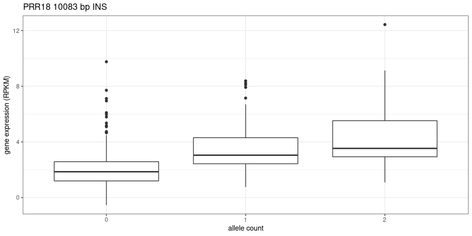<!-- -->

``` r
ggp$ex.lead.pos.pos = plotQtls(ex, gene.annotation=TRUE, flank.bp=28000)
ggp$ex.lead.pos.pos
```

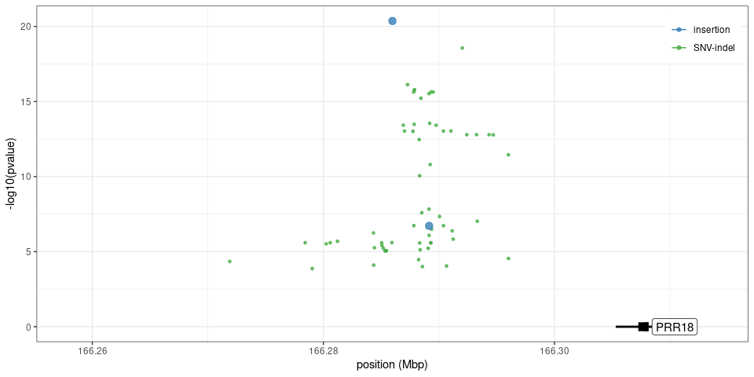<!-- -->

``` r
## positive association
ex = ex.lead %>% merge(genc) %>% filter(beta<0, gene_type=='protein_coding', gene %in% genes.sv.lead) %>%
  arrange(FDR) %>% head(1) %>% formatEx
ex %>% select(-gene) %>% kable
```

| coord                                                                                                          | svid           | type | size | gene\_name |     beta | pvalue | FDR |
| :------------------------------------------------------------------------------------------------------------- | :------------- | :--- | ---: | :--------- | -------: | -----: | --: |
| [chr1:75377083-75382488](https://genome.ucsc.edu/cgi-bin/hgTracks?db=hg38&position=chr1%3A75377083%2D75382488) | sv\_2058613\_0 | DEL  | 5405 | SLC44A5    | \-0.0226 |      0 |   0 |

``` r
ggp$ex.lead.neg.ge = plotEx(ex)
ggp$ex.lead.neg.ge
```

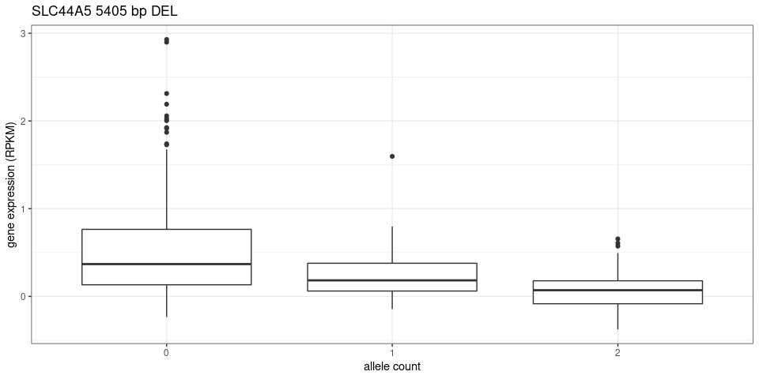<!-- -->

``` r
ggp$ex.lead.neg.pos = plotQtls(ex, gene.annotation=TRUE, flank.bp=3e5)
ggp$ex.lead.neg.pos
```

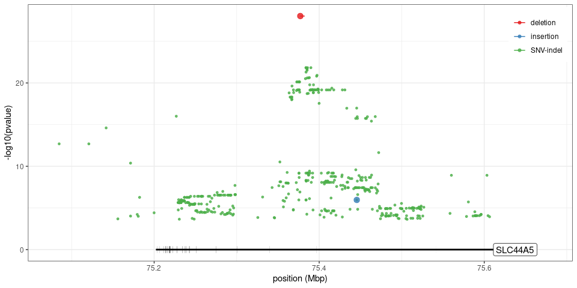<!-- -->

## Effect size stronger for SV-eQTL?

``` r
eqtl.df %>% filter(pop=='EUR + YRI', FDR<=.01) %>% group_by(type) %>% summarize(beta=mean(abs(beta)))
```

    ## # A tibble: 3 x 2
    ##   type        beta
    ## * <chr>      <dbl>
    ## 1 DEL       0.0234
    ## 2 INS       0.0218
    ## 3 SNV-indel 0.0220

Not really when we look at the beta values after standardization. We
used to see a stronger effect before, most likely because SVs were
associated with genes that were more expressed (hence larger betas).

## More SV-eQTLs in genes with higher expression?

``` r
ge.df = read.table('geuvadis.median.ge.tsv.gz', header=TRUE, as.is=TRUE)

n.quant = 20
ge.df = ge.df %>%
  mutate(ge=cut(median.ge, quantile(ge.df$median.ge, seq(0,1,1/n.quant)), include.lowest=TRUE)) %>%
  select(-median.ge)

eqtl.ge = eqtl.df %>% filter(pop=='EUR + YRI', FDR<=.01) %>%
  mutate(type=ifelse(type!='SNV-indel', 'SV', type)) %>% 
  merge(ge.df) %>%
  group_by(type) %>% mutate(n=n()) %>%
  group_by(type, ge) %>% summarize(prop=n()/n[1])

## permute gene expression levels
ge.sum.for.perm = eqtl.df %>% filter(pop=='EUR + YRI', FDR<=.01) %>%
  mutate(type=ifelse(type!='SNV-indel', 'SV', type)) %>% 
  merge(ge.df) %>%
  group_by(gene, ge) %>%
  summarize(nb.sv=sum(type=='SV'), nb.snv=sum(type=='SNV-indel')) %>% ungroup

eqtl.ge.perm = lapply(1:10000, function(ii){
  ge.sum.for.perm %>% mutate(ge=sample(ge)) %>% 
    group_by(ge) %>% summarize(nb.sv=sum(nb.sv), nb.snv=sum(nb.snv)) %>%
    ungroup %>% mutate(SV=nb.sv/sum(nb.sv), SNV=nb.snv/sum(nb.snv)) %>%
    mutate(perm=ii)
}) %>% bind_rows

eqtl.ge.perm = eqtl.ge.perm %>%
  select(perm, ge, SV, SNV) %>%
  pivot_longer(cols=c(SV, SNV), names_to='type', values_to='prop.perm') %>% 
  mutate(type=ifelse(type=='SNV', 'SNV-indel', type))

## enrichment in any expression class?
sig.df = eqtl.ge.perm %>% merge(eqtl.ge) %>%
  group_by(ge, type) %>% summarize(pv=(1+sum(prop<=prop.perm))/(1+n()),
                                   fc=prop[1]/median(prop.perm)) %>%
  ungroup %>% mutate(qv=p.adjust(pv, 'BH'))
sig.df %>% filter(qv<.05) %>% kable
```

| ge               | type      |    pv |       fc |        qv |
| :--------------- | :-------- | ----: | -------: | --------: |
| (84.1,1.14e+04\] | SNV-indel | 3e-04 | 1.726650 | 0.0059994 |
| (84.1,1.14e+04\] | SV        | 1e-04 | 4.037736 | 0.0039996 |

``` r
## graph
ggp$ge.enr = eqtl.ge %>% merge(sig.df) %>% mutate(sig=cut(qv, c(0,.01,.05,1))) %>% 
  ggplot(aes(x=ge, colour=type)) +
  theme_bw() +
  theme(axis.text.x=element_text(angle=45, hjust=1),
        legend.justification=c(0,1), legend.position=c(.01,.99)) +
  geom_hline(yintercept=1/n.quant, linetype=2) +
  geom_point(aes(y=prop, size=sig)) + geom_line(aes(y=prop, group=type), size=1, alpha=.5) +
  scale_y_continuous(breaks=seq(0, 10/n.quant, 1/(2*n.quant))) +
  scale_colour_brewer(name='variant type', palette='Set1') +
  scale_size_manual(values=c(4,2,1), name='adjusted permuted p-value') + 
  xlab(paste0('gene expression (RPKM, ', n.quant, ' quantiles)')) +
  ylab('proportion of eQTLs')
ggp$ge.enr
```

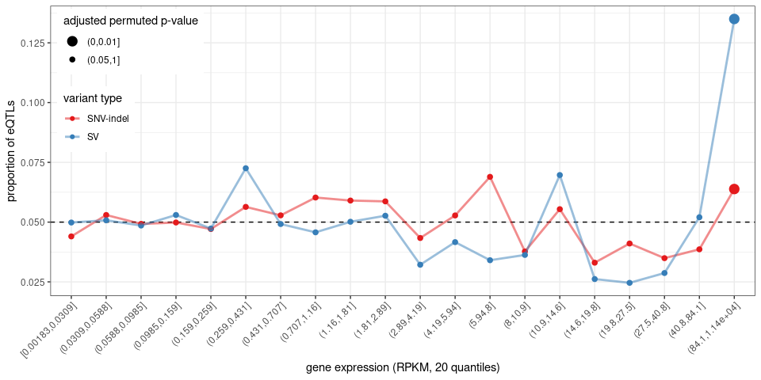<!-- -->

Enrichment in the genes with highest expression.

## eGenes with SV-eQTLs only

``` r
eqtl.sv.only = eqtl.df %>% filter(FDR<=.01) %>% 
  group_by(gene) %>%
  filter(all(type!='SNV-indel'))

length(unique(eqtl.sv.only$gene))
```

    ## [1] 39

``` r
merge(svs, eqtl.sv.only) %>% select(-gene_type) %>% merge(genc) %>%
  arrange(gene_type, gene_name, pop) %>%
  select(gene_type, gene_name, pop, beta, FDR, svid, type, size, seqnames, start, end) %>% 
  kable
```

| gene\_type                           | gene\_name | pop       |        beta |       FDR | svid           | type | size | seqnames |     start |       end |
| :----------------------------------- | :--------- | :-------- | ----------: | --------: | :------------- | :--- | ---: | :------- | --------: | --------: |
| lncRNA                               | AC106779.1 | EUR       |   0.0502254 | 0.0092901 | sv\_593031\_0  | INS  |   50 | chr16    |  56808153 |  56808153 |
| lncRNA                               | AP006621.1 | EUR + YRI |   0.0390210 | 0.0017181 | sv\_894741\_0  | INS  | 2182 | chr11    |    965241 |    965241 |
| lncRNA                               | AP006621.1 | EUR       |   0.0431932 | 0.0019601 | sv\_894741\_0  | INS  | 2182 | chr11    |    965241 |    965241 |
| lncRNA                               | LINC01063  | YRI       |   0.2113754 | 0.0017714 | sv\_1828642\_0 | INS  |   56 | chr3     | 197391048 | 197391048 |
| lncRNA                               | LINC01824  | EUR       | \-0.0320093 | 0.0012594 | sv\_1857023\_0 | DEL  |  302 | chr2     |   7488527 |   7488829 |
| processed\_pseudogene                | AL807752.1 | YRI       |   0.2122839 | 0.0080696 | sv\_1118372\_0 | DEL  |  399 | chr9     | 135981605 | 135982004 |
| processed\_pseudogene                | CICP4      | YRI       |   0.1407502 | 0.0053454 | sv\_270436\_0  | DEL  |   51 | chr20    |  64173781 |  64173832 |
| processed\_pseudogene                | CICP4      | YRI       |   0.1504417 | 0.0007986 | sv\_270987\_0  | DEL  |   53 | chr20    |  64174613 |  64174666 |
| processed\_pseudogene                | RPL28P2    | EUR + YRI |   0.0379736 | 0.0097495 | sv\_1941674\_0 | DEL  |   89 | chr2     | 231845945 | 231846034 |
| processed\_pseudogene                | RPL28P2    | EUR       |   0.0461133 | 0.0040528 | sv\_1941674\_0 | DEL  |   89 | chr2     | 231845945 | 231846034 |
| protein\_coding                      | ATP11A     | EUR + YRI |   0.0164444 | 0.0095501 | sv\_776909\_0  | INS  |   92 | chr13    | 113737293 | 113737293 |
| protein\_coding                      | CHTF18     | EUR       |   0.0236979 | 0.0013501 | sv\_538026\_0  | DEL  |   37 | chr16    |    769193 |    769230 |
| protein\_coding                      | COA8       | EUR + YRI |   0.0300639 | 0.0044238 | sv\_706404\_0  | INS  |   95 | chr14    | 104251773 | 104251773 |
| protein\_coding                      | CUL4A      | EUR       | \-0.0060872 | 0.0067986 | sv\_757026\_0  | INS  |   56 | chr13    | 112863698 | 112863698 |
| protein\_coding                      | EP300      | EUR + YRI |   0.0025797 | 0.0085284 | sv\_103274\_0  | DEL  |   91 | chr22    |  40726495 |  40726586 |
| protein\_coding                      | EP300      | EUR       | \-0.0135464 | 0.0090029 | sv\_103271\_0  | INS  |   72 | chr22    |  40538214 |  40538214 |
| protein\_coding                      | EXOC3      | EUR + YRI |   0.0110046 | 0.0037975 | sv\_1521010\_0 | DEL  |  531 | chr5     |    164382 |    164913 |
| protein\_coding                      | GPR89A     | EUR       |   0.0061784 | 0.0038774 | sv\_2069252\_0 | DEL  | 1581 | chr1     | 146085163 | 146086744 |
| protein\_coding                      | GZF1       | EUR       |   0.0088011 | 0.0020438 | sv\_220829\_0  | DEL  |   58 | chr20    |  23054497 |  23054555 |
| protein\_coding                      | IFITM1     | YRI       |   0.0547616 | 0.0045845 | sv\_881237\_0  | DEL  |  146 | chr11    |    186361 |    186507 |
| protein\_coding                      | IL17D      | EUR       | \-0.0077415 | 0.0040118 | sv\_714921\_0  | INS  |  120 | chr13    |  20391210 |  20391210 |
| protein\_coding                      | ING5       | EUR + YRI | \-0.0042485 | 0.0062007 | sv\_1981785\_0 | DEL  |  462 | chr2     | 242006989 | 242007451 |
| protein\_coding                      | KDM3A      | EUR       | \-0.0121269 | 0.0086451 | sv\_1892050\_0 | INS  |   65 | chr2     |  87416354 |  87416354 |
| protein\_coding                      | KIFAP3     | EUR       |   0.0103375 | 0.0077486 | sv\_2075207\_0 | INS  |  129 | chr1     | 170913279 | 170913279 |
| protein\_coding                      | NAA60      | EUR       |   0.0113083 | 0.0074362 | sv\_566509\_0  | INS  |   59 | chr16    |   3197941 |   3197941 |
| protein\_coding                      | NADK       | EUR       |   0.0280811 | 0.0045526 | sv\_1994428\_0 | DEL  |   30 | chr1     |   1078651 |   1078681 |
| protein\_coding                      | NFKBIL1    | EUR + YRI |   0.0081656 | 0.0018692 | sv\_1413415\_0 | DEL  |  259 | chr6     |  31429092 |  31429351 |
| protein\_coding                      | NFKBIL1    | EUR       |   0.0095816 | 0.0023172 | sv\_1413415\_0 | DEL  |  259 | chr6     |  31429092 |  31429351 |
| protein\_coding                      | PLEKHB2    | EUR       |   0.0278774 | 0.0051519 | sv\_1909599\_0 | DEL  |   49 | chr2     | 131771010 | 131771059 |
| protein\_coding                      | PRMT2      | YRI       |   0.0378208 | 0.0077765 | sv\_196783\_0  | INS  |   53 | chr21    |  46699879 |  46699879 |
| protein\_coding                      | PSMC2      | EUR + YRI |   0.0053092 | 0.0061060 | sv\_1309448\_0 | INS  |   57 | chr7     | 102490792 | 102490792 |
| protein\_coding                      | PSMC2      | EUR       |   0.0062385 | 0.0095105 | sv\_1309448\_0 | INS  |   57 | chr7     | 102490792 | 102490792 |
| protein\_coding                      | PSMG3      | EUR       | \-0.0135460 | 0.0054415 | sv\_1267729\_0 | INS  |  111 | chr7     |   1117361 |   1117361 |
| protein\_coding                      | RGPD2      | EUR + YRI | \-0.0024489 | 0.0070404 | sv\_1888165\_0 | INS  | 1487 | chr2     |  87364986 |  87364986 |
| protein\_coding                      | SIRPA      | EUR       |   0.0666504 | 0.0009090 | sv\_200133\_0  | DEL  |   63 | chr20    |   1258860 |   1258923 |
| protein\_coding                      | TCTE3      | EUR + YRI |   0.0339784 | 0.0003411 | sv\_1501904\_0 | INS  |   45 | chr6     | 170219017 | 170219017 |
| protein\_coding                      | TCTE3      | EUR       |   0.0376289 | 0.0003097 | sv\_1501904\_0 | INS  |   45 | chr6     | 170219017 | 170219017 |
| protein\_coding                      | TIGAR      | EUR       |   0.0119023 | 0.0085594 | sv\_801582\_0  | DEL  |   81 | chr12    |   4973588 |   4973669 |
| protein\_coding                      | ZBTB22     | EUR       | \-0.0066381 | 0.0014408 | sv\_1415524\_0 | DEL  |   61 | chr6     |  32651506 |  32651567 |
| protein\_coding                      | ZMYND11    | EUR       |   0.0157136 | 0.0029279 | sv\_964739\_0  | DEL  |  114 | chr10    |    455677 |    455791 |
| protein\_coding                      | ZNF416     | EUR       |   0.0119048 | 0.0092977 | sv\_345135\_0  | DEL  |   65 | chr19    |  57017652 |  57017717 |
| transcribed\_unprocessed\_pseudogene | AC008267.2 | EUR + YRI |   0.0326540 | 0.0007384 | sv\_1297097\_0 | DEL  |   60 | chr7     |  66865876 |  66865936 |
| transcribed\_unprocessed\_pseudogene | AC136944.3 | EUR + YRI |   0.0105565 | 0.0049657 | sv\_582472\_0  | DEL  |  106 | chr16    |  33337929 |  33338035 |
| unprocessed\_pseudogene              | IL9RP3     | EUR + YRI | \-0.0119754 | 0.0037650 | sv\_523868\_0  | DEL  |  126 | chr16    |     33449 |     33575 |
| unprocessed\_pseudogene              | MTCO2P12   | EUR       |   0.0244250 | 0.0079085 | sv\_1996860\_0 | DEL  |  411 | chr1     |   1288397 |   1288808 |
| unprocessed\_pseudogene              | WASH7P     | EUR       |   0.0085774 | 0.0097310 | sv\_1987338\_0 | DEL  |   50 | chr1     |    820919 |    820969 |

## Figure

``` r
## adds a legend title: a), b), etc
plot_list <- function(ggp.l, gg.names=NULL, gg.titles=NULL){
  if(is.null(names(ggp.l))) names(ggp.l) = paste0('g', 1:length(ggp.l))
  if(is.null(gg.names)) gg.names = names(ggp.l)
  if(is.null(gg.titles)){
    gg.titles = rep('', length(gg.names))
  } else {
    gg.titles = paste0(' ', gg.titles)
  }
  lapply(1:length(gg.names), function(ii) ggp.l[[gg.names[ii]]] + ggtitle(paste0('(', LETTERS[ii], ')', gg.titles[ii])))
}

grid.arrange(grobs=plot_list(ggp, gg.names=c('ex.lead.pos.ge', 'ex.lead.pos.pos', 'ex.lead.neg.ge', 'ex.lead.neg.pos')),
             layout_matrix=matrix(1:4, 2, byrow=TRUE),
             widths=c(2, 5))
```

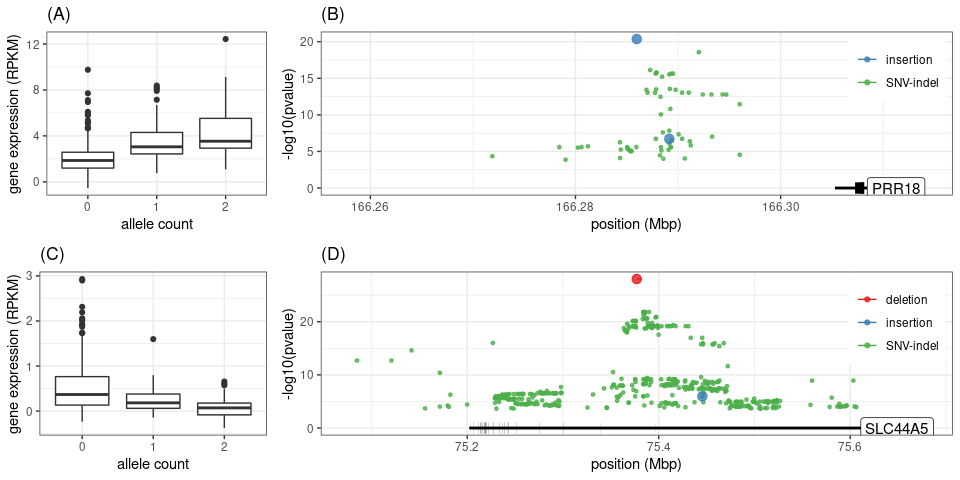<!-- -->

``` r
pdf('fig-sv-snv-indel-eqtl.pdf', 9, 5)
ggp$ge.enr
grid.arrange(grobs=plot_list(ggp, gg.names=c('ex.lead.pos.ge', 'ex.lead.pos.pos', 'ex.lead.neg.ge', 'ex.lead.neg.pos')),
             layout_matrix=matrix(1:4, 2, byrow=TRUE),
             widths=c(2, 5))
dev.off()
```

    ## png 
    ##   2

## Save genes with only SV-eQTLs

``` r
genc.s = subset(genc, gene %in% eqtl.df$gene)
                
eqtl.df %>% filter(FDR<=.01, pop=='EUR + YRI') %>%
  merge(svs, all.x=TRUE) %>%
  mutate(seqnames=ifelse(is.na(seqnames), gsub('(.*):.*:.*:.*', '\\1', svid), seqnames),
         start=ifelse(is.na(start), as.numeric(gsub('.*:(.*):.*:.*', '\\1', svid)), start),
         end=ifelse(is.na(end), start+nchar(gsub('.*:.*:(.*):.*', '\\1', svid)), end),
         id=svid) %>%
  select(-gene_type) %>% merge(genc.s) %>% 
  select(seqnames, start, end, id, type, size, 
         gene, gene_name, gene_type, beta, pvalue, FDR) %>%
  arrange(FDR) %>% 
  write.table(file='vggiraffe-geuvadis-eqtl-snv-indel-svs.csv', sep=',', quote=FALSE, row.names=FALSE)

merge(svs, eqtl.sv.only) %>% select(-gene_type) %>% merge(genc) %>%
  arrange(gene_type, gene_name, pop) %>%
  select(gene_type, gene_name, gene, pop, beta, FDR, svid, type, size, seqnames, start, end) %>% 
  write.table(file='vggiraffe-geuvadis-eqtl-svonly.csv', sep=',', quote=FALSE, row.names=FALSE)
```
