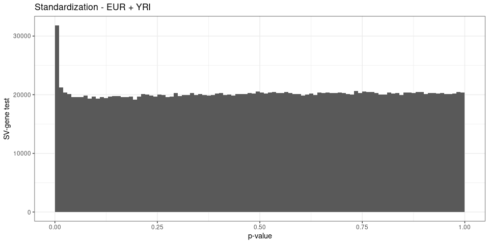
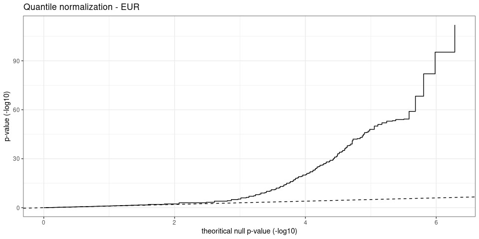
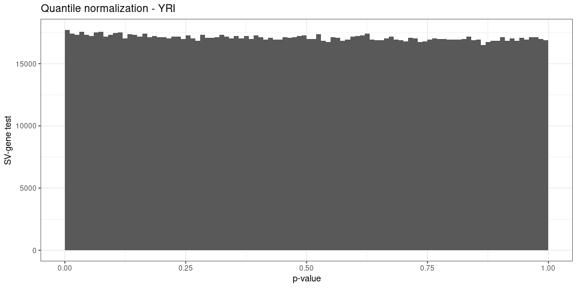

SV-eQTLs summary
================

``` r
library(dplyr)
library(ggplot2)
library(gridExtra)
library(knitr)
## list of figures
ggp = list()
```

## Read eQTL results

Matrix-eQTL was ran on different sample sets (*all* samples,
*Eur*opeans, *YRI*) and using different gene expression normalization
(*nonorm*: no additional normalization, *norm*: standardized normal
distribution, *quant*: quantile normalization).

``` r
load('eqtl-test-results.RData')
names(ll)
```

    ## [1] "me.lin.nonorm.all" "me.lin.nonorm.eur" "me.lin.nonorm.yri"
    ## [4] "me.lin.quant.all"  "me.lin.quant.eur"  "me.lin.quant.yri"

``` r
names(ll) = paste(
  rep(c('No additional normalization', 'Quantile normalization'),each=3),
  rep(c('EUR + YRI', 'EUR', 'YRI'), 2), sep=' - ')
```

## QC: p-value distribution and QQ plots

``` r
qqplot_matrixeqtl <- function(me.o){
  pvs.s = tibble(n=me.o$cis$hist.counts,
                 pv.s=me.o$cis$hist.bins[-length(me.o$cis$hist.bins)],
                 pv.e=me.o$cis$hist.bins[-1])
  pvs.s$pv.s.exp = cumsum(pvs.s$n)/sum(pvs.s$n)
  pvs.s %>% filter(n>0) %>% 
    ggplot(aes(x=-log10(pv.s.exp), y=-log10(pv.s))) +
    geom_step() +
    ## geom_point(aes(size=cut(n, c(0,1,2,10,Inf), labels=c(1, 2, '3-10', '>10'))), alpha=.5) +
    theme_bw() +
    scale_size_manual(values=c(1,1.5,2,3), 'cis-eQTLs') + 
    geom_abline(linetype=2) +
    xlab('theoritical null p-value (-log10)') +
    ylab('p-value (-log10)')
}

pvhist_matrixeqtl <- function(me.o){
  pvs.s = tibble(n=me.o$cis$hist.counts,
                 pv.s=me.o$cis$hist.bins[-length(me.o$cis$hist.bins)])
  ## pv < 0.01 were split in multiple bins for the qqplot -> aggregate them
  pvs.h = pvs.s %>% mutate(pv.s=ifelse(pv.s<.01, 0, pv.s)) %>%
    group_by(pv.s) %>% summarize(n=sum(n))
  ## histogram
  ggplot(pvs.h, aes(x=pv.s+.005, y=n)) +
    geom_bar(stat='identity', width=.01) + theme_bw() +
    ylim(0, max(pvs.h$n)) +
    xlab('p-value') + ylab('SV-gene test')
}

ggp$hist.all = pvhist_matrixeqtl(ll[['No additional normalization - EUR + YRI']])
ggp$hist.all + ggtitle('EUR + YRI')
```

<!-- -->

``` r
ggp$qq.all = qqplot_matrixeqtl(ll[['No additional normalization - EUR + YRI']])
ggp$qq.all + ggtitle('EUR + YRI')
```

<!-- -->

``` r
ggp$hist.eur = pvhist_matrixeqtl(ll[['No additional normalization - EUR']])
ggp$hist.eur + ggtitle('EUR')
```

<!-- -->

``` r
ggp$qq.eur = qqplot_matrixeqtl(ll[['No additional normalization - EUR']])
ggp$qq.eur + ggtitle('EUR')
```

<!-- -->

``` r
ggp$hist.yri = pvhist_matrixeqtl(ll[['No additional normalization - YRI']])
ggp$hist.yri + ggtitle('YRI')
```

<!-- -->

``` r
ggp$qq.yri = qqplot_matrixeqtl(ll[['No additional normalization - YRI']])
ggp$qq.yri + ggtitle('YRI')
```

<!-- -->

## Number of eQTLs and eGenes

``` r
eqtl.df = lapply(names(ll)[1:3], function(nn){
  ll[[nn]]$cis$eqtls %>% mutate(exp=nn)
}) %>% bind_rows

eqtl.df = eqtl.df %>% mutate(pop=gsub('.* - (.*)', '\\1', exp),
                             pop=factor(pop, levels=c('EUR + YRI', 'EUR', 'YRI')))

eqtl.df %>% group_by(pop) %>%
  summarize(eqtl.fdr01=sum(FDR<=.01),
            esv.fdr01=length(unique(snps[FDR<=.01])),
            egene.fdr01=length(unique(gene[FDR<=.01])),
            eqtl.fdr05=sum(FDR<=.05),
            esv.fdr05=length(unique(snps[FDR<=.05])),
            egene.fdr05=length(unique(gene[FDR<=.05]))) %>%
  kable(format.args=list(big.mark=','))
```

| pop       | eqtl.fdr01 | esv.fdr01 | egene.fdr01 | eqtl.fdr05 | esv.fdr05 | egene.fdr05 |
| :-------- | ---------: | --------: | ----------: | ---------: | --------: | ----------: |
| EUR + YRI |      2,059 |     1,319 |         909 |      2,909 |     1,910 |       1,358 |
| EUR       |      1,998 |     1,290 |         879 |      2,864 |     1,904 |       1,332 |
| YRI       |        173 |       145 |         102 |        352 |       294 |         227 |

### Specific to EUR or YRI

``` r
## frequencies in different super-populations for each SV site
freq.df = read.table('../describe-svs/2504kgp.svsite80al.superpopfreq.tsv.gz', as.is=TRUE, header=TRUE)
freq.df = freq.df %>% group_by(svsite) %>% mutate(af.med=median(af))

## eqtl in eur but not yri or eur+yri
eqtl.eur = eqtl.df %>% group_by(snps, gene) %>%
  filter(n()==1, pop=='EUR', FDR<=.01)

eur.freq = freq.df %>%
  filter(svsite %in% eqtl.eur$snps, abs(af.med-af)>.1, Superpopulation %in% c('AFR', 'EUR'))

## ex: eqtl in yri but not eur or eur+yri
eqtl.yri = eqtl.df %>% group_by(snps, gene) %>%
  filter(n()==1, pop=='YRI', FDR<=.01)

yri.freq = freq.df %>%
  filter(svsite %in% eqtl.yri$snps, abs(af.med-af)>.1, Superpopulation %in% c('AFR', 'EUR'))

rbind(
  eqtl.eur %>% mutate(pop='EUR', pop.af=snps %in% eur.freq$svsite),
  eqtl.yri %>% mutate(pop='YRI', pop.af=snps %in% yri.freq$svsite)) %>%
  group_by(pop) %>%
  summarize(eqtl.fdr01=sum(FDR<=.01),
            esv.fdr01=length(unique(snps[FDR<=.01])),
            esv.fdr01.popaf=length(unique(snps[FDR<=.01 & pop.af])),
            egene.fdr01=length(unique(gene[FDR<=.01]))) %>%
  kable
```

| pop | eqtl.fdr01 | esv.fdr01 | esv.fdr01.popaf | egene.fdr01 |
| :-- | ---------: | --------: | --------------: | ----------: |
| EUR |         58 |        48 |              24 |          53 |
| YRI |         58 |        57 |              10 |          53 |

*esv.fdr01.popaf*: number of SVs that are eQTLs (FDR\<=0.01) and with
specific frequency patterns (in EUR or AFR populations).

## Effect of different normalization on the gene expression

``` r
eqtl.all.df = lapply(names(ll), function(nn){
  print(qqplot_matrixeqtl(ll[[nn]]) + ggtitle(nn))
  print(pvhist_matrixeqtl(ll[[nn]]) + ggtitle(nn))
  return(ll[[nn]]$cis$eqtls %>% mutate(exp=nn) %>% filter(FDR<.01))
}) %>% bind_rows
```

<!-- --><!-- --><!-- --><!-- --><!-- --><!-- --><!-- --><!-- --><!-- --><!-- --><!-- --><!-- -->

``` r
eqtl.all.df %>% group_by(exp) %>%
  summarize(eqtl.fdr01=sum(FDR<=.01),
            esv.fdr01=length(unique(snps[FDR<=.01])),
            egene.fdr01=length(unique(gene[FDR<=.01]))) %>%
  kable(format.args=list(big.mark=','))
```

| exp                                     | eqtl.fdr01 | esv.fdr01 | egene.fdr01 |
| :-------------------------------------- | ---------: | --------: | ----------: |
| No additional normalization - EUR       |      1,998 |     1,290 |         879 |
| No additional normalization - EUR + YRI |      2,059 |     1,319 |         909 |
| No additional normalization - YRI       |        173 |       145 |         102 |
| Quantile normalization - EUR            |      2,090 |     1,278 |         871 |
| Quantile normalization - EUR + YRI      |      2,143 |     1,303 |         899 |
| Quantile normalization - YRI            |        121 |        87 |          45 |

## Examples

``` r
load('./eqtl-examples.RData')

plotEx <- function(gene, svid){
  df = merge(
    tibble(sample=colnames(ge.ex), ge=ge.ex[gene,]),
    tibble(sample=colnames(ac.ex), ac=ac.ex[svid,])) %>%
    mutate(pop=ifelse(sample%in% yri.samples, 'YRI', 'EUR'))
  df.n = df %>% group_by(ac, pop) %>% summarize(ge=median(ge), n=n())
  ggplot(df, aes(x=factor(ac), y=ge, group=paste(ac, pop))) +
    geom_boxplot(aes(fill=pop)) +
    geom_label(aes(label=n), data=df.n, position=position_dodge(.75)) + 
    theme_bw() +
    scale_fill_brewer(palette='Set2', name='population') +
    xlab('allele count') +
    ylab('gene expression (RPKM)') +
    ggtitle(paste(gene, svid))
}

## most significant positive association in subset of 100 eQTLs
ex = ex.all %>% filter(statistic>0) %>% arrange(FDR) %>% head(1) %>% select(-pop)
kable(as.matrix(ex))
```

| snps           | gene            | statistic | pvalue        | FDR          | beta     |
| :------------- | :-------------- | :-------- | :------------ | :----------- | :------- |
| sv\_2083394\_0 | ENSG00000198468 | 36.90249  | 1.699143e-136 | 1.13354e-130 | 3.844799 |

``` r
ggp$ex.all.pos = plotEx(ex$gene, ex$snps)
ggp$ex.all.pos
```

<!-- -->

``` r
## most significant negative association in subset of 100 eQTLs
ex = ex.all %>% filter(statistic<0) %>% arrange(FDR) %>% head(1) %>% select(-pop)
kable(as.matrix(ex))
```

| snps           | gene            | statistic  | pvalue       | FDR          | beta       |
| :------------- | :-------------- | :--------- | :----------- | :----------- | :--------- |
| sv\_1415534\_0 | ENSG00000179344 | \-19.91856 | 2.532182e-63 | 2.598893e-58 | \-191.9349 |

``` r
ggp$ex.all.neg = plotEx(ex$gene, ex$snps)
ggp$ex.all.neg
```

<!-- -->

``` r
## most significant positive association in YRI-specific eQTLs
ex = ex.yri %>% filter(statistic>0) %>% arrange(FDR) %>% head(1) %>% select(-pop)
kable(as.matrix(ex))
```

| snps           | gene            | statistic | pvalue       | FDR          | beta      |
| :------------- | :-------------- | :-------- | :----------- | :----------- | :-------- |
| sv\_1479136\_0 | ENSG00000229921 | 10.03917  | 8.108229e-16 | 7.602067e-11 | 0.1032301 |

``` r
ggp$ex.yri.pos = plotEx(ex$gene, ex$snps)
ggp$ex.yri.pos
```

<!-- -->

``` r
## most significant negative association in YRI-specific eQTLs
ex = ex.yri %>% filter(statistic<0) %>% arrange(FDR) %>% head(1) %>% select(-pop)
kable(as.matrix(ex))
```

| snps          | gene            | statistic  | pvalue       | FDR          | beta        |
| :------------ | :-------------- | :--------- | :----------- | :----------- | :---------- |
| sv\_949208\_0 | ENSG00000064199 | \-7.043589 | 5.850222e-10 | 2.194007e-05 | \-0.9605566 |

``` r
ggp$ex.yri.neg = plotEx(ex$gene, ex$snps)
ggp$ex.yri.neg
```

<!-- -->

## Multi-panel figure

``` r
## adds a legend title: a), b), etc
plot_list <- function(ggp.l, gg.names=NULL, gg.titles=NULL){
  if(is.null(names(ggp.l))) names(ggp.l) = paste0('g', 1:length(ggp.l))
  if(is.null(gg.names)) gg.names = names(ggp.l)
  if(is.null(gg.titles)){
    gg.titles = rep('', length(gg.names))
  } else {
    gg.titles = paste0(' ', gg.titles)
  }
  lapply(1:length(gg.names), function(ii) ggp.l[[gg.names[ii]]] + ggtitle(paste0('(', LETTERS[ii], ')', gg.titles[ii])))
}

grid.arrange(grobs=plot_list(ggp,
                             gg.names=names(ggp)[1:6],
                             gg.titles=rep(c('EUR+YRI', 'EUR', 'YRI'), each=2)),
             layout_matrix=matrix(1:6, 2),
             heights=c(3, 5))
```

<!-- -->

``` r
## grid.arrange(grobs=plot_list(ggp,
##                              gg.names=names(ggp)[7:10],
##                              gg.titles=rep(c('EUR+YRI', 'YRI'), each=2)),
##              layout_matrix=matrix(1:4, 2))

pdf('fig-sv-eqtl.pdf', 9, 5)
grid.arrange(grobs=plot_list(ggp,
                             gg.names=names(ggp)[1:6],
                             gg.titles=rep(c('EUR+YRI', 'EUR', 'YRI'), each=2)),
             layout_matrix=matrix(1:6, 2),
             heights=c(3, 5))
dev.off()
```

    ## png 
    ##   2

## Save table

``` r
eqtl.df %>% group_by(pop) %>%
  summarize(eQTL=sum(FDR<=.01),
            eSV=length(unique(snps[FDR<=.01])),
            eGene=length(unique(gene[FDR<=.01]))) %>%
  kable(format.args=list(big.mark=','))
```

| pop       |  eQTL |   eSV | eGene |
| :-------- | ----: | ----: | ----: |
| EUR + YRI | 2,059 | 1,319 |   909 |
| EUR       | 1,998 | 1,290 |   879 |
| YRI       |   173 |   145 |   102 |

``` r
eqtl.df %>% group_by(pop) %>%
  summarize(eQTL=sum(FDR<=.01),
            eSV=length(unique(snps[FDR<=.01])),
            eGene=length(unique(gene[FDR<=.01]))) %>%
  kable(format.args=list(big.mark=','), format='latex') %>%
  cat(file='eqtl-summary.tex')
```

## Save eQTL information

``` r
eqtl.df %>% filter(FDR<=.01) %>% mutate(svid=snps) %>%
  select(pop, svid, gene, statistic, pvalue, FDR, beta) %>%
  write.table(file='eqtl-svs.tsv', sep='\t', quote=FALSE, row.names=FALSE)
```
