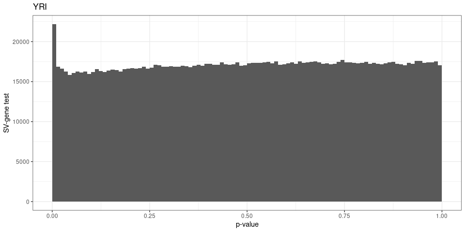
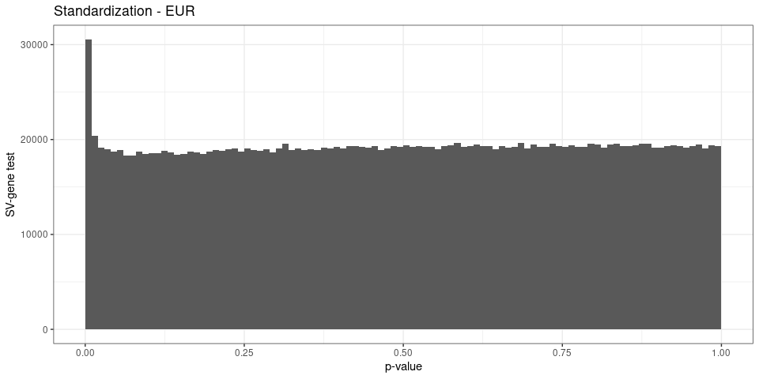
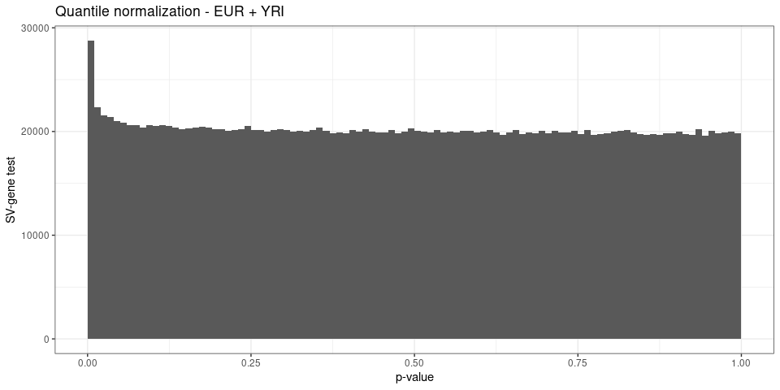
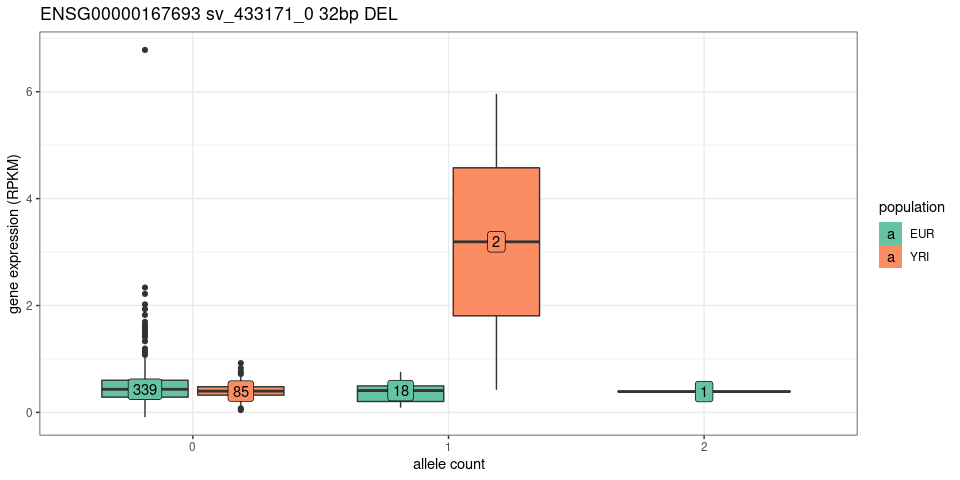
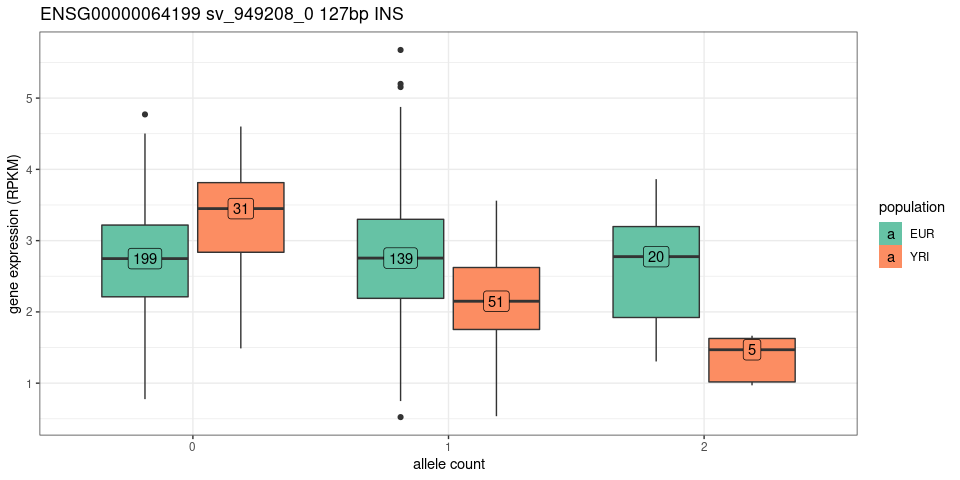

SV-eQTLs summary
================

``` r
library(rtracklayer)
library(dplyr)
library(ggplot2)
library(gridExtra)
library(knitr)
## list of figures
ggp = list()
```

## Read eQTL results

Matrix-eQTL was ran on different sample sets (*all* samples,
*Eur*opeans, *YRI*) and using different gene expression normalization
(*nonorm*: no additional normalization, *norm*: standardized normal
distribution, *quant*: quantile normalization).

``` r
load('eqtl-test-results.RData')
names(ll)
```

    ## [1] "me.lin.norm.all"  "me.lin.norm.eur"  "me.lin.norm.yri"  "me.lin.quant.all"
    ## [5] "me.lin.quant.eur" "me.lin.quant.yri"

``` r
names(ll) = paste(
  rep(c('Standardization', 'Quantile normalization'),each=3),
  rep(c('EUR + YRI', 'EUR', 'YRI'), 2), sep=' - ')

## list of all genes tested
genes.tested = scan('eqtl-genes.txt', '', quiet=TRUE)
```

## Gene annotation

``` r
if(!file.exists('../describe-svs/gencode.v35.annotation.gtf.gz')){
  download.file('ftp://ftp.ebi.ac.uk/pub/databases/gencode/Gencode_human/release_35/gencode.v35.annotation.gtf.gz', '../describe-svs/gencode.v35.annotation.gtf.gz')
}

genc = import('../describe-svs/gencode.v35.annotation.gtf.gz')
genc = subset(genc, type=='gene')
genc$gene_id = gsub('\\..*', '', genc$gene_id)
genc = genc %>% as.data.frame %>% mutate(gene=gene_id) %>% select(gene, gene_type, gene_name)
```

## Gene families

The gene families were downloaded from
[HGNC](https://biomart.genenames.org/martform/#!/default/HGNC?datasets=hgnc_family_mart).

``` r
genef = read.table('hgnc-families.txt', sep='\t', header=TRUE, quote='')
genef = genef %>% mutate(gene_name=Approved.symbol, gene_family=Family.name) %>%
  select(gene_name, gene_family) %>%
  merge(genc) %>% select(gene, gene_name, gene_family) %>%
  group_by(gene_family) %>%
  mutate(genes.fam=n(), genes.fam.tested=length(unique(intersect(genes.tested, gene))))
```

It contain 1552 gene families. For example, a few of the families with
more than 100 genes:

``` r
genef %>% select(gene_family, genes.fam, genes.fam.tested) %>% unique %>% as.data.frame %>% 
  filter(genes.fam.tested>100) %>% sample_n(10) %>% kable
```

| gene\_family                                  | genes.fam | genes.fam.tested |
| :-------------------------------------------- | --------: | ---------------: |
| G protein-coupled receptors                   |      1330 |              276 |
| BTB domain containing                         |       134 |              124 |
| Solute carriers                               |       433 |              318 |
| Ankyrin repeat domain containing              |       244 |              199 |
| Glycosyltransferases                          |       211 |              157 |
| Small nucleolar RNA protein coding host genes |       146 |              140 |
| MicroRNA host genes                           |       918 |              784 |
| Protein phosphatase 1 regulatory subunits     |       181 |              159 |
| Helicases                                     |       109 |              104 |
| EF-hand domain containing                     |       232 |              176 |

## QC: p-value distribution and QQ plots

``` r
qqplot_matrixeqtl <- function(me.o){
  pvs.s = tibble(n=me.o$cis$hist.counts,
                 pv.s=me.o$cis$hist.bins[-length(me.o$cis$hist.bins)],
                 pv.e=me.o$cis$hist.bins[-1])
  pvs.s$pv.s.exp = cumsum(pvs.s$n)/sum(pvs.s$n)
  pvs.s %>% filter(n>0) %>% 
    ggplot(aes(x=-log10(pv.s.exp), y=-log10(pv.s))) +
    geom_step() +
    ## geom_point(aes(size=cut(n, c(0,1,2,10,Inf), labels=c(1, 2, '3-10', '>10'))), alpha=.5) +
    theme_bw() +
    scale_size_manual(values=c(1,1.5,2,3), 'cis-eQTLs') + 
    geom_abline(linetype=2) +
    xlab('theoritical null p-value (-log10)') +
    ylab('p-value (-log10)')
}

pvhist_matrixeqtl <- function(me.o){
  pvs.s = tibble(n=me.o$cis$hist.counts,
                 pv.s=me.o$cis$hist.bins[-length(me.o$cis$hist.bins)])
  ## pv < 0.01 were split in multiple bins for the qqplot -> aggregate them
  pvs.h = pvs.s %>% mutate(pv.s=ifelse(pv.s<.01, 0, pv.s)) %>%
    group_by(pv.s) %>% summarize(n=sum(n))
  ## histogram
  ggplot(pvs.h, aes(x=pv.s+.005, y=n)) +
    geom_bar(stat='identity', width=.01) + theme_bw() +
    ylim(0, max(pvs.h$n)) +
    xlab('p-value') + ylab('SV-gene test')
}

ggp$hist.all = pvhist_matrixeqtl(ll[['Standardization - EUR + YRI']])
ggp$hist.all + ggtitle('EUR + YRI')
```

<!-- -->

``` r
ggp$qq.all = qqplot_matrixeqtl(ll[['Standardization - EUR + YRI']])
ggp$qq.all + ggtitle('EUR + YRI')
```

<!-- -->

``` r
ggp$hist.eur = pvhist_matrixeqtl(ll[['Standardization - EUR']])
ggp$hist.eur + ggtitle('EUR')
```

<!-- -->

``` r
ggp$qq.eur = qqplot_matrixeqtl(ll[['Standardization - EUR']])
ggp$qq.eur + ggtitle('EUR')
```

<!-- -->

``` r
ggp$hist.yri = pvhist_matrixeqtl(ll[['Standardization - YRI']])
ggp$hist.yri + ggtitle('YRI')
```

<!-- -->

``` r
ggp$qq.yri = qqplot_matrixeqtl(ll[['Standardization - YRI']])
ggp$qq.yri + ggtitle('YRI')
```

<!-- -->

## Number of eQTLs and eGenes

``` r
eqtl.df = lapply(names(ll)[1:3], function(nn){
  ll[[nn]]$cis$eqtls %>% mutate(exp=nn)
}) %>% bind_rows

eqtl.df = eqtl.df %>% mutate(pop=gsub('.* - (.*)', '\\1', exp),
                             pop=factor(pop, levels=c('EUR + YRI', 'EUR', 'YRI'))) %>%
  select(-exp) %>% dplyr::rename(svid=snps) %>% merge(genc)

svs = read.table('../describe-svs/svs.2504kgp.svsite80al.tsv.gz', as.is=TRUE, header=TRUE)
eqtl.df = svs %>% select(seqnames, start, end, type, size, svid) %>% merge(eqtl.df)

eqtl.df %>% mutate(type='all') %>% rbind(eqtl.df) %>%
  mutate(gene_type=ifelse(gene_type!='protein_coding', 'other', gene_type),
         gene_type=factor(gene_type, levels=c('protein_coding', 'other'))) %>% 
  group_by(gene_type, pop, type) %>%
  summarize(eqtl.fdr01=sum(FDR<=.01),
            esv.fdr01=length(unique(svid[FDR<=.01])),
            egene.fdr01=length(unique(gene[FDR<=.01])),
            eqtl.fdr05=sum(FDR<=.05),
            esv.fdr05=length(unique(svid[FDR<=.05])),
            egene.fdr05=length(unique(gene[FDR<=.05]))) %>%
  kable(format.args=list(big.mark=','))
```

| gene\_type      | pop       | type | eqtl.fdr01 | esv.fdr01 | egene.fdr01 | eqtl.fdr05 | esv.fdr05 | egene.fdr05 |
| :-------------- | :-------- | :--- | ---------: | --------: | ----------: | ---------: | --------: | ----------: |
| protein\_coding | EUR + YRI | all  |      1,845 |     1,395 |         878 |      2,758 |     2,139 |       1,333 |
| protein\_coding | EUR + YRI | DEL  |        910 |       677 |         510 |      1,357 |     1,048 |         777 |
| protein\_coding | EUR + YRI | INS  |        935 |       718 |         530 |      1,401 |     1,091 |         830 |
| protein\_coding | EUR       | all  |      1,795 |     1,375 |         851 |      2,779 |     2,172 |       1,356 |
| protein\_coding | EUR       | DEL  |        880 |       663 |         498 |      1,373 |     1,059 |         790 |
| protein\_coding | EUR       | INS  |        915 |       712 |         533 |      1,406 |     1,113 |         850 |
| protein\_coding | YRI       | all  |        376 |       344 |         211 |        748 |       673 |         433 |
| protein\_coding | YRI       | DEL  |        214 |       188 |         136 |        405 |       355 |         251 |
| protein\_coding | YRI       | INS  |        162 |       156 |         106 |        343 |       318 |         243 |
| other           | EUR + YRI | all  |        916 |       772 |         392 |      1,376 |     1,146 |         600 |
| other           | EUR + YRI | DEL  |        481 |       399 |         247 |        721 |       597 |         382 |
| other           | EUR + YRI | INS  |        435 |       373 |         250 |        655 |       549 |         371 |
| other           | EUR       | all  |        856 |       711 |         372 |      1,297 |     1,091 |         559 |
| other           | EUR       | DEL  |        444 |       365 |         235 |        678 |       567 |         364 |
| other           | EUR       | INS  |        412 |       346 |         240 |        619 |       524 |         349 |
| other           | YRI       | all  |        190 |       183 |         105 |        377 |       361 |         213 |
| other           | YRI       | DEL  |        103 |       101 |          65 |        207 |       200 |         129 |
| other           | YRI       | INS  |         87 |        82 |          54 |        170 |       161 |         115 |

## Positively or negatively correlated with gene expression

``` r
eqtl.df %>% filter(FDR<=.01) %>%
  group_by(pop, type) %>% summarize(prop.pos.beta=mean(beta>0),
                                    mean.beta.pos=mean(beta[beta>0]),
                                    mean.beta.neg=mean(beta[beta<0])) %>% kable(digits=3)
```

| pop       | type | prop.pos.beta | mean.beta.pos | mean.beta.neg |
| :-------- | :--- | ------------: | ------------: | ------------: |
| EUR + YRI | DEL  |         0.629 |         0.032 |       \-0.010 |
| EUR + YRI | INS  |         0.642 |         0.029 |       \-0.010 |
| EUR       | DEL  |         0.638 |         0.039 |       \-0.011 |
| EUR       | INS  |         0.644 |         0.034 |       \-0.011 |
| YRI       | DEL  |         0.864 |         0.211 |       \-0.041 |
| YRI       | INS  |         0.863 |         0.204 |       \-0.044 |

``` r
eqtl.df %>% filter(FDR<=.01) %>%
  ggplot(aes(beta, fill=type)) +
  geom_histogram(position='dodge') +
  theme_bw() + ylab('SV-eQTL') + 
  facet_grid(pop~., scales='free')
```

<!-- -->

More eQTL are associated with an increase in gene expression than a
decrease. The effect size is also stronger.

## Families with eGenes

``` r
## ordered by proportion of family with eQTL
eqtl.fam.df = eqtl.df %>% filter(FDR<=.01) %>% merge(genef) %>%
  group_by(pop) %>% 
  mutate(ntot.egenes=length(unique(gene_name))) %>% 
  group_by(pop, gene_family) %>% summarize(egenes=length(unique(gene_name)),
                                           esvs=length(unique(svid)),
                                           prop=egenes/genes.fam[1],
                                           pv.hyper=1-phyper(q=egenes, m=genes.fam.tested[1],
                                                           n=length(genes.tested)-genes.fam.tested[1],
                                                           k=ntot.egenes[1]),
                                           .groups='drop'
                                           ) %>%
  filter(egenes>1) %>% 
  group_by(pop) %>% mutate(qv.hyper=p.adjust(pv.hyper, method='BH'))

eqtl.fam.df %>% group_by(pop) %>% summarize(qv01=sum(qv.hyper<.01), qv05=sum(qv.hyper<.05))
```

    ## # A tibble: 3 x 3
    ##   pop        qv01  qv05
    ## * <fct>     <int> <int>
    ## 1 EUR + YRI    83   145
    ## 2 EUR          91   146
    ## 3 YRI          45    55

``` r
## top families enriched in the EUR+YRI analysis
eqtl.fam.df %>% filter(qv.hyper<.01, pop=='EUR + YRI', egenes>2, prop>.1) %>%
  arrange(qv.hyper, desc(prop)) %>% ungroup %>% select(-pop) %>% kable
```

| gene\_family                                               | egenes | esvs |      prop |  pv.hyper |  qv.hyper |
| :--------------------------------------------------------- | -----: | ---: | --------: | --------: | --------: |
| Histocompatibility complex                                 |     19 |  155 | 0.5135135 | 0.0000000 | 0.0000000 |
| Immunoglobulin heavy locus at 14q32.33                     |     30 |   50 | 0.1734104 | 0.0000000 | 0.0000000 |
| Immunoglobulin heavy                                       |     31 |   51 | 0.1490385 | 0.0000000 | 0.0000000 |
| Immunoglobulins                                            |     45 |   66 | 0.1097561 | 0.0000000 | 0.0000000 |
| C1-set domain containing                                   |     14 |  142 | 0.3500000 | 0.0000000 | 0.0000000 |
| T cell receptor gamma locus at 7p14                        |      6 |    6 | 0.2857143 | 0.0000000 | 0.0000000 |
| Immunoglobulin kappa                                       |     11 |   12 | 0.1009174 | 0.0000002 | 0.0000024 |
| Immunoglobulin kappa locus at 2p11.2                       |      9 |    9 | 0.1097561 | 0.0000017 | 0.0000179 |
| Membrane spanning 4-domains                                |      4 |    4 | 0.2222222 | 0.0000098 | 0.0000953 |
| Mitochondrial ribosomal proteins                           |     11 |   16 | 0.1392405 | 0.0000106 | 0.0000988 |
| NLR family                                                 |      5 |    6 | 0.2000000 | 0.0000197 | 0.0001712 |
| Anoctamins                                                 |      3 |    7 | 0.3000000 | 0.0000830 | 0.0005886 |
| C1q and TNF related                                        |      3 |    4 | 0.1666667 | 0.0000830 | 0.0005886 |
| Taste 2 receptors                                          |      4 |    9 | 0.1333333 | 0.0001011 | 0.0006759 |
| interferon induced transmembrane protein domain containing |      3 |    7 | 0.1764706 | 0.0001454 | 0.0009196 |
| Pyrin domain containing                                    |      4 |    4 | 0.1538462 | 0.0001429 | 0.0009196 |
| Large subunit mitochondrial ribosomal proteins             |      7 |    8 | 0.1458333 | 0.0001666 | 0.0009998 |
| Aminopeptidases                                            |      4 |    4 | 0.2352941 | 0.0001969 | 0.0010713 |
| Taste receptors                                            |      4 |    9 | 0.1212121 | 0.0001969 | 0.0010713 |
| Serpin peptidase inhibitors                                |      4 |    4 | 0.1081081 | 0.0001969 | 0.0010713 |
| SMN complex                                                |      3 |    6 | 0.3000000 | 0.0002358 | 0.0012262 |
| Mucins                                                     |      3 |   16 | 0.1578947 | 0.0002358 | 0.0012262 |
| Tetraspanins                                               |      5 |    9 | 0.1515152 | 0.0002998 | 0.0014925 |
| G protein-coupled receptors, Class B secretin-like         |      5 |    6 | 0.1041667 | 0.0002998 | 0.0014925 |
| M1 metallopeptidases                                       |      3 |    3 | 0.2307692 | 0.0005264 | 0.0021996 |
| Chloride calcium-activated channels                        |      3 |    7 | 0.2142857 | 0.0005264 | 0.0021996 |
| Apolipoproteins                                            |      3 |    7 | 0.1428571 | 0.0005264 | 0.0021996 |
| Blood group antigens                                       |      5 |    8 | 0.1190476 | 0.0007628 | 0.0029260 |
| Anaphase promoting complex                                 |      3 |    3 | 0.2142857 | 0.0010082 | 0.0036864 |
| Lipases                                                    |      3 |    4 | 0.1363636 | 0.0010082 | 0.0036864 |
| HAD Asp-based phosphatases                                 |      4 |    5 | 0.1428571 | 0.0022942 | 0.0071580 |
| Aldehyde dehydrogenases                                    |      3 |    8 | 0.1578947 | 0.0027660 | 0.0079374 |

Mostly families around immunity (histocompatibility complex,
immunoglobulin) and zinc fingers. Also anoctamins, mucins, tetraspanins,
apolipoproteins.

``` r
eqtl.df %>% filter(FDR<=.01, pop=='EUR + YRI') %>% merge(genef) %>%
  filter(gene_family %in% c('Anoctamins', 'Tetraspanins', 'Apolipoproteins', 'Mucins', 'Aldehyde dehydrogenases')) %>%
  select(gene_family, gene_name, seqnames, start, type, size, beta) %>%
  arrange(gene_family, seqnames, gene_name) %>% 
  kable
```

| gene\_family            | gene\_name | seqnames |     start | type | size |        beta |
| :---------------------- | :--------- | :------- | --------: | :--- | ---: | ----------: |
| Aldehyde dehydrogenases | ALDH16A1   | chr19    |  49444131 | DEL  |   66 | \-0.0104892 |
| Aldehyde dehydrogenases | ALDH16A1   | chr19    |  49444252 | DEL  |   62 | \-0.0061015 |
| Aldehyde dehydrogenases | ALDH16A1   | chr19    |  49461467 | INS  |  108 |   0.0033561 |
| Aldehyde dehydrogenases | ALDH16A1   | chr19    |  49461445 | INS  |  180 | \-0.0045857 |
| Aldehyde dehydrogenases | ALDH16A1   | chr19    |  49462851 | DEL  |  108 | \-0.0090007 |
| Aldehyde dehydrogenases | ALDH16A1   | chr19    |  49461220 | INS  |  108 | \-0.0057941 |
| Aldehyde dehydrogenases | ALDH7A1    | chr5     | 126584672 | INS  |  838 |   0.0243975 |
| Aldehyde dehydrogenases | ALDH8A1    | chr6     | 134908004 | DEL  |   66 |   0.0076587 |
| Anoctamins              | ANO1       | chr11    |  70121899 | INS  |   98 |   0.0717910 |
| Anoctamins              | ANO9       | chr11    |    469295 | DEL  |  108 |   0.0078429 |
| Anoctamins              | ANO9       | chr11    |    482976 | DEL  |  168 |   0.0070758 |
| Anoctamins              | ANO9       | chr11    |    321550 | INS  |  234 |   0.0436254 |
| Anoctamins              | ANO9       | chr11    |    475267 | INS  |   76 |   0.0096433 |
| Anoctamins              | ANO10      | chr3     |  43278703 | INS  |  326 |   0.0380483 |
| Anoctamins              | ANO10      | chr3     |  43550707 | INS  |  241 |   0.0464485 |
| Apolipoproteins         | APOC1      | chr19    |  45648362 | INS  |   51 |   0.0728893 |
| Apolipoproteins         | APOC2      | chr19    |  45648342 | INS  |   49 |   0.0501342 |
| Apolipoproteins         | APOD       | chr3     | 195143875 | DEL  |  410 |   0.0318533 |
| Apolipoproteins         | APOD       | chr3     | 195502571 | INS  |   76 |   0.0507688 |
| Apolipoproteins         | APOD       | chr3     | 195503036 | DEL  |   76 |   0.0738814 |
| Apolipoproteins         | APOD       | chr3     | 195496520 | DEL  |  938 |   0.0366200 |
| Apolipoproteins         | APOD       | chr3     | 195501916 | INS  |   41 |   0.0586790 |
| Mucins                  | OVGP1      | chr1     | 111414892 | DEL  |   69 | \-0.0078155 |
| Mucins                  | MUC20      | chr3     | 195880618 | DEL  |  150 |   0.0705258 |
| Mucins                  | MUC20      | chr3     | 195486658 | DEL  |  228 |   0.0115704 |
| Mucins                  | MUC4       | chr3     | 195499631 | INS  |   38 |   0.0718136 |
| Mucins                  | MUC4       | chr3     | 195787935 | INS  |   47 |   0.0377623 |
| Mucins                  | MUC4       | chr3     | 195500119 | INS  |   76 |   0.0718136 |
| Mucins                  | MUC4       | chr3     | 195490259 | INS  |   76 |   0.0494645 |
| Mucins                  | MUC4       | chr3     | 195499259 | INS  |   34 |   0.0718136 |
| Mucins                  | MUC4       | chr3     | 195499472 | INS  |   76 |   0.0718136 |
| Mucins                  | MUC4       | chr3     | 196145342 | INS  |   66 |   0.0633496 |
| Mucins                  | MUC4       | chr3     | 195788276 | DEL  |   76 |   0.0625583 |
| Mucins                  | MUC4       | chr3     | 195500058 | INS  |   37 |   0.0718136 |
| Mucins                  | MUC4       | chr3     | 195787916 | INS  |   30 |   0.0793129 |
| Mucins                  | MUC4       | chr3     | 195490973 | INS  |   38 |   0.0890110 |
| Mucins                  | MUC4       | chr3     | 195499679 | INS  |   38 |   0.0718136 |
| Mucins                  | MUC4       | chr3     | 195487232 | DEL  |  227 |   0.0471158 |
| Tetraspanins            | CD151      | chr11    |    879497 | INS  |   84 | \-0.0074774 |
| Tetraspanins            | CD151      | chr11    |    833814 | INS  |   74 |   0.0181779 |
| Tetraspanins            | CD9        | chr12    |   6247321 | INS  |   91 |   0.0171804 |
| Tetraspanins            | TSPAN9     | chr12    |   2106175 | INS  |  160 |   0.0247396 |
| Tetraspanins            | TSPAN3     | chr15    |  77469237 | INS  |  328 |   0.0052201 |
| Tetraspanins            | TSPAN3     | chr15    |  77038405 | DEL  | 1975 |   0.0043734 |
| Tetraspanins            | TSPAN3     | chr15    |  77077567 | DEL  |  154 |   0.0044163 |
| Tetraspanins            | TSPAN10    | chr17    |  81652798 | DEL  |   53 |   0.0167368 |
| Tetraspanins            | TSPAN10    | chr17    |  81643313 | DEL  |  315 |   0.0170408 |

## SVs associated with multiple genes

``` r
eqtl.df %>% filter(FDR<=.01, gene_type=='protein_coding') %>% 
  group_by(pop, svid) %>%
  mutate(egenes=length(unique(gene_name))) %>%
  filter(egenes>1) %>%
  group_by(pop) %>% summarize(svs=length(unique(svid)), genes=length(unique(gene_name)))
```

    ## # A tibble: 3 x 3
    ##   pop         svs genes
    ## * <fct>     <int> <int>
    ## 1 EUR + YRI   245   219
    ## 2 EUR         227   195
    ## 3 YRI          24    28

``` r
eqtl.df %>% filter(FDR<=.01, gene_type=='protein_coding') %>% 
  group_by(pop, svid) %>%
  mutate(egenes=length(unique(gene_name))) %>%
  filter(pop=='EUR + YRI', egenes>1, !any(grepl('HLA', gene_name))) %>%
  arrange(desc(egenes), svid) %>%
  ungroup %>%
    mutate(svid=paste0('[', svid,
                        '](https://genome.ucsc.edu/cgi-bin/hgTracks?db=hg38&position=',
                        seqnames, '%3A', start, '%2D', end, ')')) %>% 
    select(egenes, svid, type, size, gene_name, beta) %>% 
    head(20) %>% kable
```

| egenes | svid                                                                                                     | type | size | gene\_name |        beta |
| -----: | :------------------------------------------------------------------------------------------------------- | :--- | ---: | :--------- | ----------: |
|      5 | [sv\_1587264\_0](https://genome.ucsc.edu/cgi-bin/hgTracks?db=hg38&position=chr5%3A70191533%2D70192960)   | DEL  | 1427 | SERF1B     | \-0.0079715 |
|      5 | [sv\_1587264\_0](https://genome.ucsc.edu/cgi-bin/hgTracks?db=hg38&position=chr5%3A70191533%2D70192960)   | DEL  | 1427 | NAIP       | \-0.0082940 |
|      5 | [sv\_1587264\_0](https://genome.ucsc.edu/cgi-bin/hgTracks?db=hg38&position=chr5%3A70191533%2D70192960)   | DEL  | 1427 | SERF1A     | \-0.0071315 |
|      5 | [sv\_1587264\_0](https://genome.ucsc.edu/cgi-bin/hgTracks?db=hg38&position=chr5%3A70191533%2D70192960)   | DEL  | 1427 | SMN1       | \-0.0074750 |
|      5 | [sv\_1587264\_0](https://genome.ucsc.edu/cgi-bin/hgTracks?db=hg38&position=chr5%3A70191533%2D70192960)   | DEL  | 1427 | SMN2       | \-0.0062923 |
|      4 | [sv\_1587261\_0](https://genome.ucsc.edu/cgi-bin/hgTracks?db=hg38&position=chr5%3A70017992%2D70017992)   | INS  |  320 | SMN2       | \-0.0050543 |
|      4 | [sv\_1587261\_0](https://genome.ucsc.edu/cgi-bin/hgTracks?db=hg38&position=chr5%3A70017992%2D70017992)   | INS  |  320 | SERF1B     | \-0.0060188 |
|      4 | [sv\_1587261\_0](https://genome.ucsc.edu/cgi-bin/hgTracks?db=hg38&position=chr5%3A70017992%2D70017992)   | INS  |  320 | SERF1A     | \-0.0053418 |
|      4 | [sv\_1587261\_0](https://genome.ucsc.edu/cgi-bin/hgTracks?db=hg38&position=chr5%3A70017992%2D70017992)   | INS  |  320 | SMN1       | \-0.0056715 |
|      4 | [sv\_2109997\_0](https://genome.ucsc.edu/cgi-bin/hgTracks?db=hg38&position=chr1%3A248676257%2D248677608) | DEL  | 1351 | OR2G6      |   0.0132029 |
|      4 | [sv\_2109997\_0](https://genome.ucsc.edu/cgi-bin/hgTracks?db=hg38&position=chr1%3A248676257%2D248677608) | DEL  | 1351 | OR2T34     |   0.0126991 |
|      4 | [sv\_2109997\_0](https://genome.ucsc.edu/cgi-bin/hgTracks?db=hg38&position=chr1%3A248676257%2D248677608) | DEL  | 1351 | OR2T10     | \-0.0162634 |
|      4 | [sv\_2109997\_0](https://genome.ucsc.edu/cgi-bin/hgTracks?db=hg38&position=chr1%3A248676257%2D248677608) | DEL  | 1351 | OR2T3      |   0.0115239 |
|      4 | [sv\_320853\_0](https://genome.ucsc.edu/cgi-bin/hgTracks?db=hg38&position=chr19%3A9701510%2D9701685)     | DEL  |  175 | ZNF561     | \-0.0060042 |
|      4 | [sv\_320853\_0](https://genome.ucsc.edu/cgi-bin/hgTracks?db=hg38&position=chr19%3A9701510%2D9701685)     | DEL  |  175 | ZNF846     |   0.0085815 |
|      4 | [sv\_320853\_0](https://genome.ucsc.edu/cgi-bin/hgTracks?db=hg38&position=chr19%3A9701510%2D9701685)     | DEL  |  175 | OR7D2      |   0.0209749 |
|      4 | [sv\_320853\_0](https://genome.ucsc.edu/cgi-bin/hgTracks?db=hg38&position=chr19%3A9701510%2D9701685)     | DEL  |  175 | ZNF266     | \-0.0045235 |
|      4 | [sv\_345314\_0](https://genome.ucsc.edu/cgi-bin/hgTracks?db=hg38&position=chr19%3A58410525%2D58410763)   | DEL  |  238 | SLC27A5    |   0.0076733 |
|      4 | [sv\_345314\_0](https://genome.ucsc.edu/cgi-bin/hgTracks?db=hg38&position=chr19%3A58410525%2D58410763)   | DEL  |  238 | ZNF324B    |   0.0022828 |
|      4 | [sv\_345314\_0](https://genome.ucsc.edu/cgi-bin/hgTracks?db=hg38&position=chr19%3A58410525%2D58410763)   | DEL  |  238 | ZNF584     | \-0.0036872 |

### Specific to EUR or YRI

``` r
## frequencies in different super-populations for each SV site
freq.df = read.table('../describe-svs/2504kgp.svsite80al.superpopfreq.tsv.gz', as.is=TRUE, header=TRUE)
freq.df = freq.df %>% group_by(svsite) %>% mutate(af.med=median(af))

pop.spec = freq.df %>%
  filter(abs(af.med-af)>.1, Superpopulation %in% c('AFR', 'EUR'))

## eqtl in eur but not yri or eur+yri
eqtl.eur = eqtl.df %>% group_by(svid, gene) %>%
  filter(n()==1, pop=='EUR', FDR<=.01)

## ex: eqtl in yri but not eur or eur+yri
eqtl.yri = eqtl.df %>% group_by(svid, gene) %>%
  filter(n()==1, pop=='YRI', FDR<=.01)

rbind(
  eqtl.eur %>% mutate(pop='EUR', pop.af=svid %in% pop.spec$svsite),
  eqtl.yri %>% mutate(pop='YRI', pop.af=svid %in% pop.spec$svsite)) %>%
  merge(genc) %>% 
  mutate(gene_type=ifelse(gene_type!='protein_coding', 'other', gene_type),
         gene_type=factor(gene_type, levels=c('protein_coding', 'other'))) %>% 
  group_by(gene_type, pop) %>%
  summarize(eqtl.fdr01=sum(FDR<=.01),
            esv.fdr01=length(unique(svid[FDR<=.01])),
            esv.fdr01.popaf=length(unique(svid[FDR<=.01 & pop.af])),
            egene.fdr01=length(unique(gene[FDR<=.01]))) %>%
  kable
```

| gene\_type      | pop | eqtl.fdr01 | esv.fdr01 | esv.fdr01.popaf | egene.fdr01 |
| :-------------- | :-- | ---------: | --------: | --------------: | ----------: |
| protein\_coding | EUR |         45 |        44 |              19 |          43 |
| protein\_coding | YRI |        144 |       139 |              10 |         106 |
| other           | EUR |         21 |        18 |              11 |          17 |
| other           | YRI |         71 |        70 |               0 |          49 |

*esv.fdr01.popaf*: number of SVs that are eQTLs (FDR\<=0.01) and with
specific frequency patterns (in EUR or AFR populations).

## Effect of different normalization on the gene expression

``` r
eqtl.all.df = lapply(names(ll), function(nn){
  print(qqplot_matrixeqtl(ll[[nn]]) + ggtitle(nn))
  print(pvhist_matrixeqtl(ll[[nn]]) + ggtitle(nn))
  return(ll[[nn]]$cis$eqtls %>% mutate(exp=nn) %>% filter(FDR<=.01))
}) %>% bind_rows %>% dplyr::rename(svid=snps)
```

<!-- --><!-- --><!-- --><!-- --><!-- --><!-- --><!-- --><!-- --><!-- --><!-- --><!-- --><!-- -->

``` r
eqtl.all.df %>% merge(genc) %>%
  mutate(gene_type=ifelse(gene_type!='protein_coding', 'other', gene_type),
         gene_type=factor(gene_type, levels=c('protein_coding', 'other'))) %>% 
  group_by(gene_type, exp) %>%
  summarize(eqtl.fdr01=sum(FDR<=.01),
            esv.fdr01=length(unique(svid[FDR<=.01])),
            egene.fdr01=length(unique(gene[FDR<=.01]))) %>%
  kable(format.args=list(big.mark=','))
```

| gene\_type      | exp                                | eqtl.fdr01 | esv.fdr01 | egene.fdr01 |
| :-------------- | :--------------------------------- | ---------: | --------: | ----------: |
| protein\_coding | Quantile normalization - EUR       |      1,392 |       950 |         588 |
| protein\_coding | Quantile normalization - EUR + YRI |      1,434 |       978 |         623 |
| protein\_coding | Quantile normalization - YRI       |         87 |        67 |          32 |
| protein\_coding | Standardization - EUR              |      1,795 |     1,375 |         851 |
| protein\_coding | Standardization - EUR + YRI        |      1,845 |     1,395 |         878 |
| protein\_coding | Standardization - YRI              |        376 |       344 |         211 |
| other           | Quantile normalization - EUR       |        688 |       540 |         260 |
| other           | Quantile normalization - EUR + YRI |        712 |       575 |         255 |
| other           | Quantile normalization - YRI       |         34 |        33 |          12 |
| other           | Standardization - EUR              |        856 |       711 |         372 |
| other           | Standardization - EUR + YRI        |        916 |       772 |         392 |
| other           | Standardization - YRI              |        190 |       183 |         105 |

## Examples

``` r
load('./eqtl-examples.RData')

plotEx <- function(ex){
  df = merge(
    tibble(sample=colnames(ge.ex), ge=ge.ex[ex$gene[1],]),
    tibble(sample=colnames(ac.ex), ac=ac.ex[ex$svid[1],])) %>%
    mutate(pop=ifelse(sample %in% yri.samples, 'YRI', 'EUR'))
  df.n = df %>% group_by(ac, pop) %>% summarize(ge=median(ge), n=n())
  ggplot(df, aes(x=factor(ac), y=ge, group=paste(ac, pop))) +
    geom_boxplot(aes(fill=pop)) +
    geom_label(aes(label=n, fill=pop), data=df.n, position=position_dodge(.75)) + 
    theme_bw() +
    scale_fill_brewer(palette='Set2', name='population') +
    xlab('allele count') +
    ylab('gene expression (RPKM)') +
    ggtitle(paste(ex$gene[1], ex$svid[1], paste0(ex$size[1], 'bp'), ex$type[1]))
}
formatEx <- function(df){
  df %>% select(-pop) %>%
    dplyr::rename(svid=snps) %>% merge(svs) %>% 
    mutate(coord=paste0('[', seqnames, ':', start, '-', end,
                        '](https://genome.ucsc.edu/cgi-bin/hgTracks?db=hg38&position=',
                        seqnames, '%3A', start, '%2D', end, ')')) %>% 
    select(coord, svid, type, size, gene, gene_name, beta, pvalue, FDR) %>%
    mutate(pvalue=signif(pvalue, 3), FDR=signif(FDR, 3), beta=signif(beta, 3))
}

## most significant positive association in subset of 100 eQTLs
ex = ex.all %>% merge(genc) %>% filter(statistic>0, gene_type=='protein_coding') %>%
  arrange(FDR) %>% head(1) %>% formatEx
ex %>% select(-gene) %>% kable
```

| coord                                                                                                    | svid          | type | size | gene\_name |   beta | pvalue | FDR |
| :------------------------------------------------------------------------------------------------------- | :------------ | :--- | ---: | :--------- | -----: | -----: | --: |
| [chr17:215908-216007](https://genome.ucsc.edu/cgi-bin/hgTracks?db=hg38&position=chr17%3A215908%2D216007) | sv\_422440\_0 | DEL  |   99 | RPH3AL     | 0.0362 |      0 |   0 |

``` r
ggp$ex.all.pos = plotEx(ex)
ggp$ex.all.pos
```

<!-- -->

``` r
## most significant negative association in subset of 100 eQTLs
ex = ex.all %>% merge(genc) %>% filter(statistic<0, gene_type=='protein_coding', !grepl('HLA', gene_name)) %>%
  arrange(FDR) %>% head(1) %>% formatEx
ex %>% select(-gene) %>% kable
```

| coord                                                                                                            | svid          | type | size | gene\_name |     beta | pvalue | FDR |
| :--------------------------------------------------------------------------------------------------------------- | :------------ | :--- | ---: | :--------- | -------: | -----: | --: |
| [chr18:62061428-62061539](https://genome.ucsc.edu/cgi-bin/hgTracks?db=hg38&position=chr18%3A62061428%2D62061539) | sv\_366165\_0 | DEL  |  111 | PIGN       | \-0.0038 |      0 |   0 |

``` r
ggp$ex.all.neg = plotEx(ex)
ggp$ex.all.neg
```

<!-- -->

``` r
## most significant positive association in YRI-specific eQTLs
ex = ex.yri %>% merge(genc) %>% filter(statistic>0, gene_type=='protein_coding') %>%
  arrange(FDR) %>% head(1) %>% formatEx
ex %>% select(-gene) %>% kable
```

| coord                                                                                                    | svid          | type | size | gene\_name |  beta | pvalue | FDR |
| :------------------------------------------------------------------------------------------------------- | :------------ | :--- | ---: | :--------- | ----: | -----: | --: |
| [chr17:304948-304980](https://genome.ucsc.edu/cgi-bin/hgTracks?db=hg38&position=chr17%3A304948%2D304980) | sv\_433171\_0 | DEL  |   32 | NXN        | 0.384 |      0 |   0 |

``` r
ggp$ex.yri.pos = plotEx(ex)
ggp$ex.yri.pos
```

<!-- -->

``` r
## most significant negative association in YRI-specific eQTLs
ex = ex.yri %>% merge(genc) %>% filter(statistic<0, gene_type=='protein_coding') %>%
  arrange(FDR) %>% head(1) %>% formatEx
ex %>% select(-gene) %>% kable
```

| coord                                                                                                                | svid          | type | size | gene\_name |     beta | pvalue |     FDR |
| :------------------------------------------------------------------------------------------------------------------- | :------------ | :--- | ---: | :--------- | -------: | -----: | ------: |
| [chr11:124704774-124704774](https://genome.ucsc.edu/cgi-bin/hgTracks?db=hg38&position=chr11%3A124704774%2D124704774) | sv\_949208\_0 | INS  |  127 | SPA17      | \-0.0385 |      0 | 9.6e-06 |

``` r
ggp$ex.yri.neg = plotEx(ex)
ggp$ex.yri.neg
```

<!-- -->

## Multi-panel figure

``` r
## adds a legend title: a), b), etc
plot_list <- function(ggp.l, gg.names=NULL, gg.titles=NULL){
  if(is.null(names(ggp.l))) names(ggp.l) = paste0('g', 1:length(ggp.l))
  if(is.null(gg.names)) gg.names = names(ggp.l)
  if(is.null(gg.titles)){
    gg.titles = rep('', length(gg.names))
  } else {
    gg.titles = paste0(' ', gg.titles)
  }
  lapply(1:length(gg.names), function(ii) ggp.l[[gg.names[ii]]] + ggtitle(paste0('(', LETTERS[ii], ')', gg.titles[ii])))
}

grid.arrange(grobs=plot_list(ggp,
                             gg.names=names(ggp)[1:6],
                             gg.titles=rep(c('EUR+YRI', 'EUR', 'YRI'), each=2)),
             layout_matrix=matrix(1:6, 2),
             heights=c(3, 5))
```

<!-- -->

``` r
## grid.arrange(grobs=plot_list(ggp,
##                              gg.names=names(ggp)[7:10],
##                              gg.titles=rep(c('EUR+YRI', 'YRI'), each=2)),
##              layout_matrix=matrix(1:4, 2))

pdf('fig-sv-eqtl.pdf', 9, 5)
grid.arrange(grobs=plot_list(ggp,
                             gg.names=names(ggp)[1:6],
                             gg.titles=rep(c('EUR+YRI', 'EUR', 'YRI'), each=2)),
             layout_matrix=matrix(1:6, 2),
             heights=c(3, 5))
dev.off()
```

    ## png 
    ##   2

## Save table

``` r
tab = eqtl.df %>% mutate(type='all') %>% rbind(eqtl.df) %>%
  mutate(gene_type=ifelse(gene_type!='protein_coding', 'other', gene_type),
         gene_type=factor(gene_type, levels=c('protein_coding', 'other'))) %>% 
  group_by(gene_type, pop, type) %>%
  summarize(eQTL=sum(FDR<=.01),
            eSV=length(unique(svid[FDR<=.01])),
            eGene=length(unique(gene[FDR<=.01])))

kable(tab, format.args=list(big.mark=','))
```

| gene\_type      | pop       | type |  eQTL |   eSV | eGene |
| :-------------- | :-------- | :--- | ----: | ----: | ----: |
| protein\_coding | EUR + YRI | all  | 1,845 | 1,395 |   878 |
| protein\_coding | EUR + YRI | DEL  |   910 |   677 |   510 |
| protein\_coding | EUR + YRI | INS  |   935 |   718 |   530 |
| protein\_coding | EUR       | all  | 1,795 | 1,375 |   851 |
| protein\_coding | EUR       | DEL  |   880 |   663 |   498 |
| protein\_coding | EUR       | INS  |   915 |   712 |   533 |
| protein\_coding | YRI       | all  |   376 |   344 |   211 |
| protein\_coding | YRI       | DEL  |   214 |   188 |   136 |
| protein\_coding | YRI       | INS  |   162 |   156 |   106 |
| other           | EUR + YRI | all  |   916 |   772 |   392 |
| other           | EUR + YRI | DEL  |   481 |   399 |   247 |
| other           | EUR + YRI | INS  |   435 |   373 |   250 |
| other           | EUR       | all  |   856 |   711 |   372 |
| other           | EUR       | DEL  |   444 |   365 |   235 |
| other           | EUR       | INS  |   412 |   346 |   240 |
| other           | YRI       | all  |   190 |   183 |   105 |
| other           | YRI       | DEL  |   103 |   101 |    65 |
| other           | YRI       | INS  |    87 |    82 |    54 |

``` r
kable(tab, format.args=list(big.mark=','), format='latex') %>% cat(file='eqtl-summary.tex')
```

## Save eQTL information

``` r
eqtl.df %>% filter(FDR<=.01) %>% 
  select(seqnames, start, end, svid, type, size, pop,
         gene, gene_name, gene_type, statistic, beta, pvalue, FDR) %>%
  arrange(FDR) %>% 
  write.table(file='eqtl-svs.tsv', sep='\t', quote=FALSE, row.names=FALSE)

## enriched families
eqtl.fam.df %>% filter(qv.hyper<=.01, pop=='EUR + YRI', egenes>1) %>%
  arrange(qv.hyper, desc(prop)) %>% ungroup %>% select(-pop) %>%
    write.table(file='eqtl-enriched-gene-families.tsv', sep='\t', quote=FALSE, row.names=FALSE)
```
