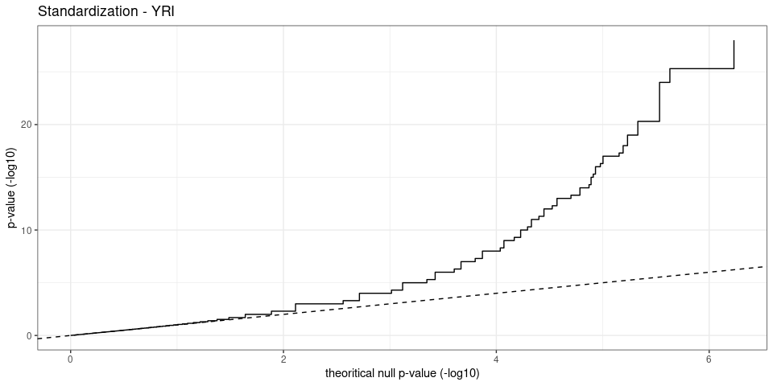
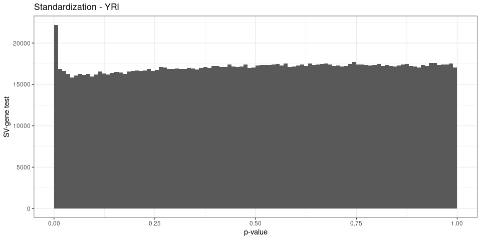
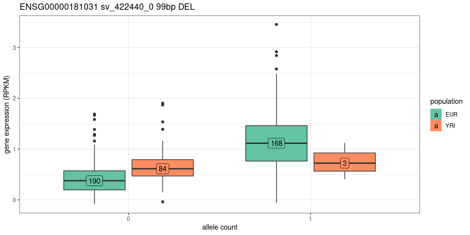

SV-eQTLs summary
================

``` r
library(rtracklayer)
library(dplyr)
library(ggplot2)
library(gridExtra)
library(knitr)
## list of figures
ggp = list()
```

## Read eQTL results

Matrix-eQTL was ran on different sample sets (*all* samples,
*Eur*opeans, *YRI*) and using different gene expression normalization
(*nonorm*: no additional normalization, *norm*: standardized normal
distribution, *quant*: quantile normalization).

``` r
load('eqtl-test-results.RData')
names(ll)
```

    ## [1] "me.lin.nonorm.all" "me.lin.nonorm.eur" "me.lin.nonorm.yri"
    ## [4] "me.lin.quant.all"  "me.lin.quant.eur"  "me.lin.quant.yri"

``` r
names(ll) = paste(
  rep(c('No additional normalization', 'Quantile normalization'),each=3),
  rep(c('EUR + YRI', 'EUR', 'YRI'), 2), sep=' - ')
```

## Gene annotation

``` r
if(!file.exists('../describe-svs/gencode.v35.annotation.gtf.gz')){
  download.file('ftp://ftp.ebi.ac.uk/pub/databases/gencode/Gencode_human/release_35/gencode.v35.annotation.gtf.gz', '../describe-svs/gencode.v35.annotation.gtf.gz')
}

genc = import('../describe-svs/gencode.v35.annotation.gtf.gz')
genc = subset(genc, type=='gene')
genc$gene_id = gsub('\\..*', '', genc$gene_id)
genc = genc %>% as.data.frame %>% mutate(gene=gene_id) %>% select(gene, gene_type, gene_name)
```

## QC: p-value distribution and QQ plots

``` r
qqplot_matrixeqtl <- function(me.o){
  pvs.s = tibble(n=me.o$cis$hist.counts,
                 pv.s=me.o$cis$hist.bins[-length(me.o$cis$hist.bins)],
                 pv.e=me.o$cis$hist.bins[-1])
  pvs.s$pv.s.exp = cumsum(pvs.s$n)/sum(pvs.s$n)
  pvs.s %>% filter(n>0) %>% 
    ggplot(aes(x=-log10(pv.s.exp), y=-log10(pv.s))) +
    geom_step() +
    ## geom_point(aes(size=cut(n, c(0,1,2,10,Inf), labels=c(1, 2, '3-10', '>10'))), alpha=.5) +
    theme_bw() +
    scale_size_manual(values=c(1,1.5,2,3), 'cis-eQTLs') + 
    geom_abline(linetype=2) +
    xlab('theoritical null p-value (-log10)') +
    ylab('p-value (-log10)')
}

pvhist_matrixeqtl <- function(me.o){
  pvs.s = tibble(n=me.o$cis$hist.counts,
                 pv.s=me.o$cis$hist.bins[-length(me.o$cis$hist.bins)])
  ## pv < 0.01 were split in multiple bins for the qqplot -> aggregate them
  pvs.h = pvs.s %>% mutate(pv.s=ifelse(pv.s<.01, 0, pv.s)) %>%
    group_by(pv.s) %>% summarize(n=sum(n))
  ## histogram
  ggplot(pvs.h, aes(x=pv.s+.005, y=n)) +
    geom_bar(stat='identity', width=.01) + theme_bw() +
    ylim(0, max(pvs.h$n)) +
    xlab('p-value') + ylab('SV-gene test')
}

ggp$hist.all = pvhist_matrixeqtl(ll[['No additional normalization - EUR + YRI']])
ggp$hist.all + ggtitle('EUR + YRI')
```

<!-- -->

``` r
ggp$qq.all = qqplot_matrixeqtl(ll[['No additional normalization - EUR + YRI']])
ggp$qq.all + ggtitle('EUR + YRI')
```

<!-- -->

``` r
ggp$hist.eur = pvhist_matrixeqtl(ll[['No additional normalization - EUR']])
ggp$hist.eur + ggtitle('EUR')
```

<!-- -->

``` r
ggp$qq.eur = qqplot_matrixeqtl(ll[['No additional normalization - EUR']])
ggp$qq.eur + ggtitle('EUR')
```

<!-- -->

``` r
ggp$hist.yri = pvhist_matrixeqtl(ll[['No additional normalization - YRI']])
ggp$hist.yri + ggtitle('YRI')
```

<!-- -->

``` r
ggp$qq.yri = qqplot_matrixeqtl(ll[['No additional normalization - YRI']])
ggp$qq.yri + ggtitle('YRI')
```

<!-- -->

## Number of eQTLs and eGenes

``` r
eqtl.df = lapply(names(ll)[1:3], function(nn){
  ll[[nn]]$cis$eqtls %>% mutate(exp=nn)
}) %>% bind_rows

eqtl.df = eqtl.df %>% mutate(pop=gsub('.* - (.*)', '\\1', exp),
                             pop=factor(pop, levels=c('EUR + YRI', 'EUR', 'YRI'))) %>%
  select(-exp) %>% dplyr::rename(svid=snps) %>% merge(genc)

svs = read.table('../describe-svs/svs.2504kgp.svsite80al.tsv.gz', as.is=TRUE, header=TRUE)
eqtl.df = svs %>% select(seqnames, start, end, type, size, svid) %>% merge(eqtl.df)

eqtl.df %>% mutate(type='all') %>% rbind(eqtl.df) %>%
  mutate(gene_type=ifelse(gene_type!='protein_coding', 'other', gene_type)) %>% 
  group_by(gene_type, pop, type) %>%
  summarize(eqtl.fdr01=sum(FDR<=.01),
            esv.fdr01=length(unique(svid[FDR<=.01])),
            egene.fdr01=length(unique(gene[FDR<=.01])),
            eqtl.fdr05=sum(FDR<=.05),
            esv.fdr05=length(unique(svid[FDR<=.05])),
            egene.fdr05=length(unique(gene[FDR<=.05]))) %>%
  kable(format.args=list(big.mark=','))
```

| gene\_type      | pop       | type | eqtl.fdr01 | esv.fdr01 | egene.fdr01 | eqtl.fdr05 | esv.fdr05 | egene.fdr05 |
| :-------------- | :-------- | :--- | ---------: | --------: | ----------: | ---------: | --------: | ----------: |
| other           | EUR + YRI | all  |        686 |       566 |         280 |        982 |       798 |         419 |
| other           | EUR + YRI | DEL  |        349 |       283 |         176 |        506 |       408 |         266 |
| other           | EUR + YRI | INS  |        337 |       283 |         182 |        476 |       390 |         262 |
| other           | EUR       | all  |        675 |       546 |         281 |        959 |       782 |         413 |
| other           | EUR       | DEL  |        339 |       273 |         175 |        484 |       392 |         256 |
| other           | EUR       | INS  |        336 |       273 |         188 |        475 |       390 |         266 |
| other           | YRI       | all  |         54 |        53 |          31 |        108 |       107 |          67 |
| other           | YRI       | DEL  |         28 |        27 |          21 |         56 |        55 |          42 |
| other           | YRI       | INS  |         26 |        26 |          15 |         52 |        52 |          34 |
| protein\_coding | EUR + YRI | all  |      1,373 |       949 |         629 |      1,927 |     1,370 |         939 |
| protein\_coding | EUR + YRI | DEL  |        680 |       460 |         356 |        938 |       659 |         525 |
| protein\_coding | EUR + YRI | INS  |        693 |       489 |         387 |        989 |       711 |         587 |
| protein\_coding | EUR       | all  |      1,323 |       935 |         598 |      1,905 |     1,373 |         919 |
| protein\_coding | EUR       | DEL  |        646 |       443 |         340 |        936 |       655 |         512 |
| protein\_coding | EUR       | INS  |        677 |       492 |         381 |        969 |       718 |         587 |
| protein\_coding | YRI       | all  |        119 |       103 |          71 |        244 |       212 |         160 |
| protein\_coding | YRI       | DEL  |         75 |        61 |          44 |        139 |       116 |          94 |
| protein\_coding | YRI       | INS  |         44 |        42 |          31 |        105 |        96 |          77 |

### Specific to EUR or YRI

``` r
## frequencies in different super-populations for each SV site
freq.df = read.table('../describe-svs/2504kgp.svsite80al.superpopfreq.tsv.gz', as.is=TRUE, header=TRUE)
freq.df = freq.df %>% group_by(svsite) %>% mutate(af.med=median(af))

pop.spec = freq.df %>%
  filter(abs(af.med-af)>.1, Superpopulation %in% c('AFR', 'EUR'))

## eqtl in eur but not yri or eur+yri
eqtl.eur = eqtl.df %>% group_by(svid, gene) %>%
  filter(n()==1, pop=='EUR', FDR<=.01)

## ex: eqtl in yri but not eur or eur+yri
eqtl.yri = eqtl.df %>% group_by(svid, gene) %>%
  filter(n()==1, pop=='YRI', FDR<=.01)

rbind(
  eqtl.eur %>% mutate(pop='EUR', pop.af=svid %in% pop.spec$svsite),
  eqtl.yri %>% mutate(pop='YRI', pop.af=svid %in% pop.spec$svsite)) %>%
  merge(genc) %>% 
  mutate(gene_type=ifelse(gene_type!='protein_coding', 'other', gene_type)) %>% 
  group_by(gene_type, pop) %>%
  summarize(eqtl.fdr01=sum(FDR<=.01),
            esv.fdr01=length(unique(svid[FDR<=.01])),
            esv.fdr01.popaf=length(unique(svid[FDR<=.01 & pop.af])),
            egene.fdr01=length(unique(gene[FDR<=.01]))) %>%
  kable
```

| gene\_type      | pop | eqtl.fdr01 | esv.fdr01 | esv.fdr01.popaf | egene.fdr01 |
| :-------------- | :-- | ---------: | --------: | --------------: | ----------: |
| other           | EUR |         24 |        20 |              11 |          20 |
| other           | YRI |         20 |        20 |               2 |          16 |
| protein\_coding | EUR |         34 |        32 |              16 |          33 |
| protein\_coding | YRI |         38 |        37 |               8 |          37 |

*esv.fdr01.popaf*: number of SVs that are eQTLs (FDR\<=0.01) and with
specific frequency patterns (in EUR or AFR populations).

## Effect of different normalization on the gene expression

``` r
eqtl.all.df = lapply(names(ll), function(nn){
  print(qqplot_matrixeqtl(ll[[nn]]) + ggtitle(nn))
  print(pvhist_matrixeqtl(ll[[nn]]) + ggtitle(nn))
  return(ll[[nn]]$cis$eqtls %>% mutate(exp=nn) %>% filter(FDR<.01))
}) %>% bind_rows %>% dplyr::rename(svid=snps)
```

<!-- --><!-- --><!-- --><!-- --><!-- --><!-- --><!-- --><!-- --><!-- --><!-- --><!-- --><!-- -->

``` r
eqtl.all.df %>% merge(genc) %>%
  mutate(gene_type=ifelse(gene_type!='protein_coding', 'other', gene_type)) %>% 
  group_by(gene_type, exp) %>%
  summarize(eqtl.fdr01=sum(FDR<=.01),
            esv.fdr01=length(unique(svid[FDR<=.01])),
            egene.fdr01=length(unique(gene[FDR<=.01]))) %>%
  kable(format.args=list(big.mark=','))
```

| gene\_type      | exp                                     | eqtl.fdr01 | esv.fdr01 | egene.fdr01 |
| :-------------- | :-------------------------------------- | ---------: | --------: | ----------: |
| other           | No additional normalization - EUR       |        675 |       546 |         281 |
| other           | No additional normalization - EUR + YRI |        686 |       566 |         280 |
| other           | No additional normalization - YRI       |         54 |        53 |          31 |
| other           | Quantile normalization - EUR            |        688 |       539 |         266 |
| other           | Quantile normalization - EUR + YRI      |        707 |       560 |         267 |
| other           | Quantile normalization - YRI            |         34 |        33 |          13 |
| protein\_coding | No additional normalization - EUR       |      1,323 |       935 |         598 |
| protein\_coding | No additional normalization - EUR + YRI |      1,373 |       949 |         629 |
| protein\_coding | No additional normalization - YRI       |        119 |       103 |          71 |
| protein\_coding | Quantile normalization - EUR            |      1,402 |       947 |         605 |
| protein\_coding | Quantile normalization - EUR + YRI      |      1,436 |       956 |         632 |
| protein\_coding | Quantile normalization - YRI            |         87 |        67 |          32 |

## Examples

``` r
load('./eqtl-examples.RData')

plotEx <- function(ex){
  df = merge(
    tibble(sample=colnames(ge.ex), ge=ge.ex[ex$gene[1],]),
    tibble(sample=colnames(ac.ex), ac=ac.ex[ex$svid[1],])) %>%
    mutate(pop=ifelse(sample%in% yri.samples, 'YRI', 'EUR'))
  df.n = df %>% group_by(ac, pop) %>% summarize(ge=median(ge), n=n())
  ggplot(df, aes(x=factor(ac), y=ge, group=paste(ac, pop))) +
    geom_boxplot(aes(fill=pop)) +
    geom_label(aes(label=n), data=df.n, position=position_dodge(.75)) + 
    theme_bw() +
    scale_fill_brewer(palette='Set2', name='population') +
    xlab('allele count') +
    ylab('gene expression (RPKM)') +
    ggtitle(paste(ex$gene[1], ex$svid[1], paste0(ex$size[1], 'bp'), ex$type[1]))
}
formatEx <- function(df){
  df %>% select(-pop) %>%
    dplyr::rename(svid=snps) %>% merge(svs) %>% 
    mutate(coord=paste0('[', seqnames, ':', start, '-', end,
                        '](https://genome.ucsc.edu/cgi-bin/hgTracks?db=hg38&position=',
                        seqnames, '%3A', start, '%2D', end, ')')) %>% 
    select(coord, svid, type, size, gene, gene_name, beta, pvalue, FDR) %>%
    mutate(pvalue=signif(pvalue, 3), FDR=signif(FDR, 3), beta=signif(beta, 3))
}

## most significant positive association in subset of 100 eQTLs
ex = ex.all %>% merge(genc) %>% filter(statistic>0, gene_type=='protein_coding') %>%
  arrange(FDR) %>% head(1) %>% formatEx
ex %>% select(-gene) %>% kable
```

| coord                                                                                                        | svid          | type | size | gene\_name | beta | pvalue | FDR |
| :----------------------------------------------------------------------------------------------------------- | :------------ | :--- | ---: | :--------- | ---: | -----: | --: |
| [chr19:9408967-9409025](https://genome.ucsc.edu/cgi-bin/hgTracks?db=hg38&position=chr19%3A9408967%2D9409025) | sv\_320847\_0 | DEL  |   58 | ZNF266     | 2.04 |      0 |   0 |

``` r
ggp$ex.all.pos = plotEx(ex)
ggp$ex.all.pos
```

<!-- -->

``` r
## most significant negative association in subset of 100 eQTLs
ex = ex.all %>% merge(genc) %>% filter(statistic<0, gene_type=='protein_coding', !grepl('HLA', gene_name)) %>%
  arrange(FDR) %>% head(1) %>% formatEx
ex %>% select(-gene) %>% kable
```

| coord                                                                                                            | svid          | type | size | gene\_name |  beta | pvalue | FDR |
| :--------------------------------------------------------------------------------------------------------------- | :------------ | :--- | ---: | :--------- | ----: | -----: | --: |
| [chr14:92120589-92120589](https://genome.ucsc.edu/cgi-bin/hgTracks?db=hg38&position=chr14%3A92120589%2D92120589) | sv\_690749\_0 | INS  |  285 | NDUFB1     | \-6.9 |      0 |   0 |

``` r
ggp$ex.all.neg = plotEx(ex)
ggp$ex.all.neg
```

<!-- -->

``` r
## most significant positive association in YRI-specific eQTLs
ex = ex.yri %>% merge(genc) %>% filter(statistic>0, gene_type=='protein_coding') %>%
  arrange(FDR) %>% head(1) %>% formatEx
ex %>% select(-gene) %>% kable
```

| coord                                                                                                            | svid          | type | size | gene\_name | beta | pvalue |   FDR |
| :--------------------------------------------------------------------------------------------------------------- | :------------ | :--- | ---: | :--------- | ---: | -----: | ----: |
| [chr17:43317181-43317181](https://genome.ucsc.edu/cgi-bin/hgTracks?db=hg38&position=chr17%3A43317181%2D43317181) | sv\_484152\_0 | INS  |  610 | TMEM106A   | 2.08 |      0 | 4e-07 |

``` r
ggp$ex.yri.pos = plotEx(ex)
ggp$ex.yri.pos
```

<!-- -->

``` r
## most significant negative association in YRI-specific eQTLs
ex = ex.yri %>% merge(genc) %>% filter(statistic<0, gene_type=='protein_coding') %>%
  arrange(FDR) %>% head(1) %>% formatEx
ex %>% select(-gene) %>% kable
```

| coord                                                                                                                | svid          | type | size | gene\_name |    beta | pvalue |      FDR |
| :------------------------------------------------------------------------------------------------------------------- | :------------ | :--- | ---: | :--------- | ------: | -----: | -------: |
| [chr11:124704774-124704774](https://genome.ucsc.edu/cgi-bin/hgTracks?db=hg38&position=chr11%3A124704774%2D124704774) | sv\_949208\_0 | INS  |  127 | SPA17      | \-0.961 |      0 | 2.19e-05 |

``` r
ggp$ex.yri.neg = plotEx(ex)
ggp$ex.yri.neg
```

<!-- -->

## Multi-panel figure

``` r
## adds a legend title: a), b), etc
plot_list <- function(ggp.l, gg.names=NULL, gg.titles=NULL){
  if(is.null(names(ggp.l))) names(ggp.l) = paste0('g', 1:length(ggp.l))
  if(is.null(gg.names)) gg.names = names(ggp.l)
  if(is.null(gg.titles)){
    gg.titles = rep('', length(gg.names))
  } else {
    gg.titles = paste0(' ', gg.titles)
  }
  lapply(1:length(gg.names), function(ii) ggp.l[[gg.names[ii]]] + ggtitle(paste0('(', LETTERS[ii], ')', gg.titles[ii])))
}

grid.arrange(grobs=plot_list(ggp,
                             gg.names=names(ggp)[1:6],
                             gg.titles=rep(c('EUR+YRI', 'EUR', 'YRI'), each=2)),
             layout_matrix=matrix(1:6, 2),
             heights=c(3, 5))
```

<!-- -->

``` r
## grid.arrange(grobs=plot_list(ggp,
##                              gg.names=names(ggp)[7:10],
##                              gg.titles=rep(c('EUR+YRI', 'YRI'), each=2)),
##              layout_matrix=matrix(1:4, 2))

pdf('fig-sv-eqtl.pdf', 9, 5)
grid.arrange(grobs=plot_list(ggp,
                             gg.names=names(ggp)[1:6],
                             gg.titles=rep(c('EUR+YRI', 'EUR', 'YRI'), each=2)),
             layout_matrix=matrix(1:6, 2),
             heights=c(3, 5))
dev.off()
```

    ## png 
    ##   2

## Save table

``` r
tab = eqtl.df %>% mutate(type='all') %>% rbind(eqtl.df) %>%
  mutate(gene_type=ifelse(gene_type!='protein_coding', 'other', gene_type),
         gene_type=factor(gene_type, levels=c('protein_coding', 'other'))) %>% 
  group_by(gene_type, pop, type) %>%
  summarize(eQTL=sum(FDR<=.01),
            eSV=length(unique(svid[FDR<=.01])),
            eGene=length(unique(gene[FDR<=.01])))

kable(tab, format.args=list(big.mark=','))
```

| gene\_type      | pop       | type |  eQTL | eSV | eGene |
| :-------------- | :-------- | :--- | ----: | --: | ----: |
| protein\_coding | EUR + YRI | all  | 1,373 | 949 |   629 |
| protein\_coding | EUR + YRI | DEL  |   680 | 460 |   356 |
| protein\_coding | EUR + YRI | INS  |   693 | 489 |   387 |
| protein\_coding | EUR       | all  | 1,323 | 935 |   598 |
| protein\_coding | EUR       | DEL  |   646 | 443 |   340 |
| protein\_coding | EUR       | INS  |   677 | 492 |   381 |
| protein\_coding | YRI       | all  |   119 | 103 |    71 |
| protein\_coding | YRI       | DEL  |    75 |  61 |    44 |
| protein\_coding | YRI       | INS  |    44 |  42 |    31 |
| other           | EUR + YRI | all  |   686 | 566 |   280 |
| other           | EUR + YRI | DEL  |   349 | 283 |   176 |
| other           | EUR + YRI | INS  |   337 | 283 |   182 |
| other           | EUR       | all  |   675 | 546 |   281 |
| other           | EUR       | DEL  |   339 | 273 |   175 |
| other           | EUR       | INS  |   336 | 273 |   188 |
| other           | YRI       | all  |    54 |  53 |    31 |
| other           | YRI       | DEL  |    28 |  27 |    21 |
| other           | YRI       | INS  |    26 |  26 |    15 |

``` r
kable(tab, format.args=list(big.mark=','), format='latex') %>% cat(file='eqtl-summary.tex')
```

## Save eQTL information

``` r
eqtl.df %>% filter(FDR<=.01) %>% 
  select(seqnames, start, end, svid, type, size, pop,
         gene, gene_name, gene_type, statistic, beta, pvalue, FDR) %>%
  arrange(FDR) %>% 
  write.table(file='eqtl-svs.tsv', sep='\t', quote=FALSE, row.names=FALSE)
```
