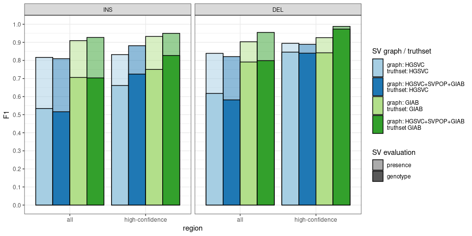

Evaluation of the SV genotypes
================

``` r
library(dplyr)
library(ggplot2)
library(knitr)
library(sveval)
## graph list
ggp = list()
```

## Results from sveval

``` r
pr.df = rbind(
  read.table('./hgsvc-hsvlr-sveval-prcurve.tsv', header=TRUE, as.is=TRUE),
  read.table('./hgsvc-hsvlr-40x-sveval-prcurve.tsv', header=TRUE, as.is=TRUE) %>% mutate(method='hsvlr_graph_40x'),
  read.table('./hgsvc-map-sveval-prcurve.tsv', header=TRUE, as.is=TRUE),
  read.table('./giab6_hg37-sveval-prcurve.tsv', header=TRUE, as.is=TRUE),
  read.table('./giab6_hg38-sveval-prcurve.tsv', header=TRUE, as.is=TRUE)
)

pr.df %>% select(exp, method, sample) %>% unique %>% arrange(exp, method, sample) %>% kable(row.names=FALSE)
```

| exp         | method            | sample       |
| :---------- | :---------------- | :----------- |
| giab6\_hg37 | giab\_graph       | HG002        |
| giab6\_hg37 | giab\_graph\_map  | HG002        |
| giab6\_hg38 | hsvlr\_graph      | HG002        |
| hgsvc       | hgsvc\_graph      | HG00514      |
| hgsvc       | hgsvc\_graph      | HG00733      |
| hgsvc       | hgsvc\_graph      | NA19240      |
| hgsvc       | hgsvc\_graph\_map | HG00514      |
| hgsvc       | hsvlr\_graph      | HG00514      |
| hgsvc       | hsvlr\_graph      | HG00733      |
| hgsvc       | hsvlr\_graph      | NA19240      |
| hgsvc       | hsvlr\_graph\_40x | HG00514\_40x |

``` r
qual.bestf1 = pr.df %>% filter(type=='Total') %>%
  select(exp, method, sample, region, eval, min.cov, F1, qual) %>%
  group_by(exp, method, sample, region, eval, min.cov) %>%
  arrange(desc(F1)) %>% do(head(., 1)) %>% select(-F1)

pr.df = pr.df %>%
  filter(type!='Total', type!='INV', min.cov==.5,
         region%in%c('all', 'highconf')) %>% arrange(qual) %>%
  merge(qual.bestf1)
```

## vg map vs vg giraffe

``` r
## HG00514 only for HGSVC
ggp$map = pr.df %>%
  mutate(exp=paste(method, exp, sample),
         exp=factor(exp,
                    levels=c('hgsvc_graph_map hgsvc HG00514',
                             'hgsvc_graph hgsvc HG00514',
                             'giab_graph_map giab6_hg37 HG002',
                                    'giab_graph giab6_hg37 HG002'),
                    labels=c('HGSVC graph - vg map',
                             'HGSVC graph - vg giraffe',
                             'GIAB graph - vg map',
                             'GIAB graph - vg giraffe')),
         type=factor(type, levels=c('Total', 'INS', 'DEL', 'INV')),
         region=factor(region, levels=c('all','highconf'), labels=c('all', 'high-confidence')),
         eval=factor(eval, levels=c('call','geno'), labels=c('presence', 'genotype'))) %>%
  filter(!is.na(exp)) %>% 
  ggplot(aes(x=region, y=F1, fill=exp, alpha=eval, group=exp)) +
  geom_bar(stat='identity', position=position_dodge(), color='black') +
  facet_grid(.~type, scales='free', space='free') +
  scale_fill_brewer(palette='Paired', name='SV graph - mapper') +
  scale_alpha_manual(name='SV evaluation', values=c(.5,1)) +
  scale_y_continuous(breaks=seq(0,1,.1), limits=0:1) + 
  theme_bw() + 
  guides(fill=guide_legend(keyheight=1))
ggp$map
```

<!-- -->

## Individual graph vs combined graph

``` r
## aggregate across samples (hgsvc has 3 samples)
ggp$graphs = pr.df %>%
  mutate(exp=paste(method, exp),
         exp=factor(exp,
                    levels=c('hgsvc_graph hgsvc',
                             'hsvlr_graph hgsvc',
                             'giab_graph giab6_hg37',
                             'hsvlr_graph giab6_hg38'),
                    labels=c('graph: HGSVC\ntruthset: HGSVC',
                             'graph: HGSVC+SVPOP+GIAB\ntruthset: HGSVC',
                             'graph: GIAB\ntruthset: GIAB',
                             'graph: HGSVC+SVPOP+GIAB\ntruthset GIAB')),
         type=factor(type, levels=c('Total', 'INS', 'DEL', 'INV')),
         region=factor(region, levels=c('all','highconf'), labels=c('all', 'high-confidence')),
         eval=factor(eval, levels=c('call','geno'), labels=c('presence', 'genotype'))) %>%
  filter(!is.na(exp)) %>% 
  group_by(exp, type, qual, method, region, eval) %>%
  select(TP, TP.baseline, FN, FP) %>% summarize_all(sum) %>%
  prf %>% 
  ggplot(aes(x=region, y=F1, fill=exp, alpha=eval, group=exp)) +
  geom_bar(stat='identity', position=position_dodge(), color='black') +
  facet_grid(.~type, scales='free', space='free') +
  scale_fill_brewer(palette='Paired', name='SV graph / truthset') +
  scale_alpha_manual(name='SV evaluation', values=c(.5,1)) +
  theme_bw() + 
  scale_y_continuous(breaks=seq(0,1,.1), limits=0:1) + 
  guides(fill=guide_legend(keyheight=2))
ggp$graphs
```

<!-- -->

## 20x vs 40x

``` r
## here we just compare 
ggp$depth = pr.df %>%
  mutate(exp=paste(method, exp, sample),
         exp=factor(exp,
                    levels=c('hsvlr_graph hgsvc HG00514',
                             'hsvlr_graph_40x hgsvc HG00514_40x'),
                    labels=c('20x',
                             '40x')),
         type=factor(type, levels=c('Total', 'INS', 'DEL', 'INV')),
         region=factor(region, levels=c('all','highconf'), labels=c('all', 'high-confidence')),
         eval=factor(eval, levels=c('call','geno'), labels=c('presence', 'genotype'))) %>%
  filter(!is.na(exp)) %>% 
  ggplot(aes(x=region, y=F1, fill=exp, alpha=eval, group=exp)) +
  geom_bar(stat='identity', position=position_dodge(), color='black') +
  facet_grid(.~type, scales='free', space='free') +
  scale_fill_brewer(palette='Paired', name='depth') +
  scale_alpha_manual(name='SV evaluation', values=c(.5,1)) +
  scale_y_continuous(breaks=seq(0,1,.1), limits=0:1) + 
  theme_bw() + 
  guides(fill=guide_legend(keyheight=1))
ggp$depth
```

<!-- -->

## Figures

``` r
pdf('fig-sveval.pdf', 7, 4)
ggp
```

    ## $map

    ## 
    ## $graphs

    ## 
    ## $depth

``` r
dev.off()
```

    ## png 
    ##   2
