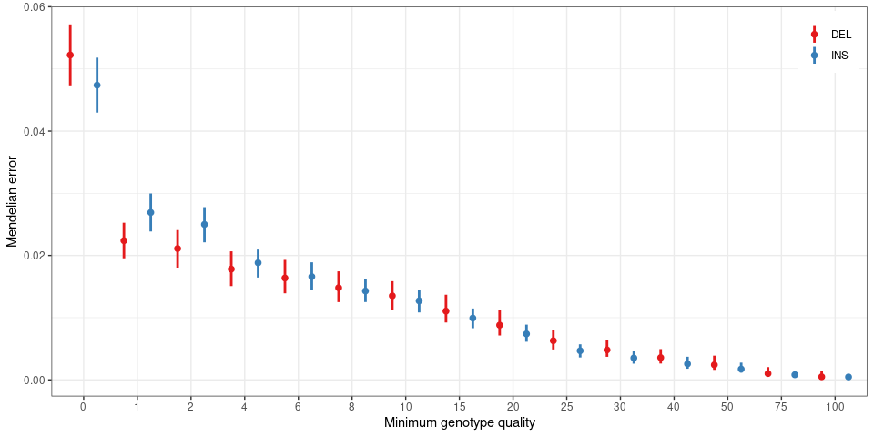
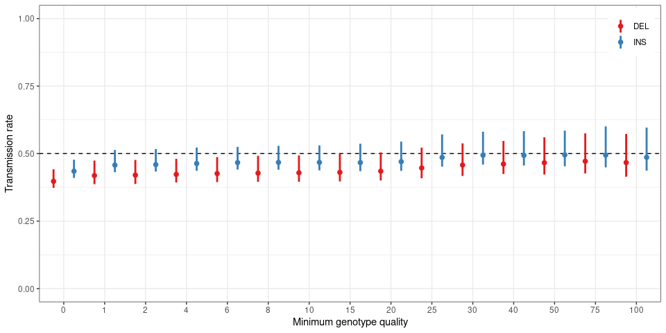
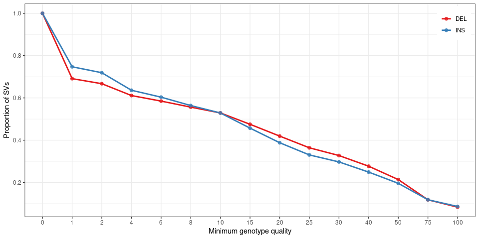
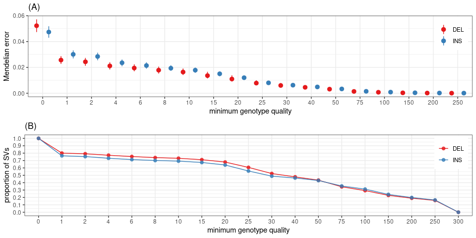

Evaluation of the SV genotypes in trios from the 1000GP
================

``` r
library(dplyr)
library(ggplot2)
library(parallel)
library(gridExtra)
library(knitr)
library(tidyr)
## graph list
ggp = list()
```

## Load genotypes, genotype qualities and trio information

``` r
## allele counts
ac.mat = read.table('relkgp.svsite80al.ac.tsv.gz', as.is=TRUE)
ac.mat = as.matrix(ac.mat)

## genotype qualities
gq.mat = read.table('relkgp.svsite80al.gq.tsv.gz', as.is=TRUE)
gq.mat = as.matrix(gq.mat)

## sv types
svs = read.table('svs.relkgp.svsite80al.tsv.gz', as.is=TRUE, header=TRUE) %>%
  select(svsite, type) %>% unique

## pedigree with population/gender information
if(!file.exists('20130606_g1k.ped')){
  download.file('ftp://ftp.1000genomes.ebi.ac.uk/vol1/ftp/technical/working/20130606_sample_info/20130606_g1k.ped', '20130606_g1k.ped')
}

ped = read.table('20130606_g1k.ped', as.is=TRUE, header=TRUE, sep='\t')

## list mendelian errors
me = c('1_0_0', '2_0_0', ## false "de novo"
       '2_0_1', '2_1_0', '2_2_0', '2_0_2', ## being hom while one parent was hom ref
       '1_2_2', ## being only het when both parents are homs
       '0_2_2', '0_2_0', '0_2_1', '0_0_2', '0_1_2') ## no allele when at least one parent was hom

## minimum GQ thresholds to compute the Mendelian error on
gq.ths = c(0:2, seq(4, 10, 2), seq(15, 30, 5), 40, 50, 75, 100)
```

## Analyze variants in each trio

``` r
## trios that have genotypes/allele counts
trios = ped %>% filter(Paternal.ID %in% colnames(ac.mat),
                       Individual.ID %in% colnames(ac.mat),
                       Maternal.ID %in% colnames(ac.mat))

## loop over each trio
trio.o = mclapply(1:nrow(trios), function(ii){
  trio1 = trios[ii,]
  ## allele counts for the offspring_father_mother
  ac = ac.mat[,c(trio1$Individual.ID, trio1$Paternal.ID, trio1$Maternal.ID)]
  ac.v = apply(ac, 1, paste, collapse='_')
  ## minimum genotype quality at each site
  gq = gq.mat[,c(trio1$Individual.ID, trio1$Paternal.ID, trio1$Maternal.ID)]
  gq = apply(gq, 1, function(x) min(x[x!=-1]))
  ## mendelian error stats for different minimum GQ thresholds
  me.all = tibble(sample=trio1$Individual.ID, svsite=rownames(ac),
                  ac=ac.v, gq=gq) %>%
    mutate(error=ac%in%me, ac.par=gsub('._(._.)', '\\1', ac),
           ac.os=gsub('(.)_._.', '\\1', ac)) %>% merge(svs)
  me.s = lapply(gq.ths, function(gq.th){
    me.all %>% filter(gq>=gq.th) %>%
      group_by(type) %>% mutate(tot=n()) %>% filter(error) %>% 
      group_by(sample, type, ac, tot) %>% summarize(prop=n()/tot[1], .groups='drop') %>%
      arrange(desc(prop)) %>% mutate(gq.th=gq.th)
  }) %>% bind_rows
  ## transmission of het alleles. 50%
  tr.s = lapply(gq.ths, function(gq.th){
    me.all %>% filter(gq>=gq.th) %>% group_by(sample, type) %>% 
      summarize(nt1=sum(ac=='0_1_0'), p1=sum(ac.par=='1_0'),
                nt2=sum(ac=='0_0_1'), p2=sum(ac.par=='0_1'),
                .groups='drop') %>%
      mutate(gq.th=gq.th)
  }) %>% bind_rows
  ## number of variants in offspring for each GQ threshold
  nb.s = lapply(gq.ths, function(gq.th){
    me.all %>% filter(gq>=gq.th, ac.os!='0') %>% group_by(sample, type) %>% 
      summarize(n=n(), .groups='drop') %>%
      mutate(gq.th=gq.th)
  }) %>% bind_rows
  ## return results
  return(list(me=me.s, tr=tr.s, nb=nb.s))
}, mc.cores=12)

me.df = bind_rows(lapply(trio.o, function(e)e$me))
outf = gzfile('relkgp-mendelian-error.tsv.gz', 'w')
write.table(me.df, file=outf, sep='\t', quote=FALSE, row.names=FALSE)
close(outf)

tr.df = bind_rows(lapply(trio.o, function(e)e$tr))
outf = gzfile('relkgp-transmission-rate.tsv.gz', 'w')
write.table(tr.df, file=outf, sep='\t', quote=FALSE, row.names=FALSE)
close(outf)

gq.n = bind_rows(lapply(trio.o, function(e)e$nb))
outf = gzfile('relkgp-gq-nb-variants.tsv.gz', 'w')
write.table(gq.n, file=outf, sep='\t', quote=FALSE, row.names=FALSE)
close(outf)
```

## Load pre-computed results

The code above was pre-computed on a larger computing server. We then
load the results:

``` r
me.df = read.table('relkgp-mendelian-error.tsv.gz', as.is=TRUE, header=TRUE)
tr.df = read.table('relkgp-transmission-rate.tsv.gz', as.is=TRUE, header=TRUE)
gq.n = read.table('relkgp-gq-nb-variants.tsv.gz', as.is=TRUE, header=TRUE)
```

## Mendelian error for each genotype quality threshold

``` r
ggp$me = me.df %>% group_by(sample, type, gq.th) %>% summarize(prop=sum(prop)) %>%
  group_by(type, gq.th) %>% summarize(prop.m=median(prop), prop.u=min(prop),
                                      prop.l=max(prop)) %>% 
  ggplot(aes(x=factor(gq.th), y=prop.m, colour=type)) +
  theme_bw() +
  geom_linerange(aes(ymin=prop.l, ymax=prop.u), size=1, position=position_dodge(1)) + 
  geom_point(position=position_dodge(1), size=2) +
  scale_colour_brewer(palette="Set1") + 
  ylab('Mendelian error') + xlab('Minimum genotype quality') +
  theme(legend.position=c(.99, .99), legend.justification=c(1,1),
        legend.title=element_blank())
ggp$me
```

<!-- -->

``` r
me.df %>% group_by(sample, gq.th, type) %>% summarize(prop=sum(prop)) %>%
  group_by(type, gq.th) %>% summarize(prop=mean(prop)) %>%
  pivot_wider(names_from=type, values_from=prop) %>% 
  kable
```

| gq.th |       DEL |       INS |
| ----: | --------: | --------: |
|     0 | 0.0523099 | 0.0474160 |
|     1 | 0.0224063 | 0.0269124 |
|     2 | 0.0211356 | 0.0249870 |
|     4 | 0.0178175 | 0.0188407 |
|     6 | 0.0163653 | 0.0166184 |
|     8 | 0.0148200 | 0.0142871 |
|    10 | 0.0135030 | 0.0126983 |
|    15 | 0.0110712 | 0.0099283 |
|    20 | 0.0088318 | 0.0074040 |
|    25 | 0.0063127 | 0.0046903 |
|    30 | 0.0048362 | 0.0035137 |
|    40 | 0.0035991 | 0.0025780 |
|    50 | 0.0024315 | 0.0017434 |
|    75 | 0.0010262 | 0.0008191 |
|   100 | 0.0005026 | 0.0004692 |

Range spanned by all samples. Point: median Mendelian error across
samples.

## Most common Mendelian error?

For all the variants (no minimum GQ), what is the configuration that
contributes the most to the Mendelian error?

``` r
me.df %>% filter(gq.th==0) %>% 
  group_by(ac, type) %>% summarize(prop=mean(prop)) %>%
  arrange(desc(prop)) %>% head %>% kable
```

| ac      | type |      prop |
| :------ | :--- | --------: |
| 1\_0\_0 | DEL  | 0.0255409 |
| 1\_0\_0 | INS  | 0.0224647 |
| 0\_2\_0 | DEL  | 0.0052011 |
| 0\_0\_2 | DEL  | 0.0049499 |
| 1\_2\_2 | INS  | 0.0045391 |
| 2\_0\_0 | DEL  | 0.0042598 |

The most common error is `1_0_0` which means heterozygous in the
offspring but absent from the parents. These are likely not real *de
novo* variants because we are genotyping known variants not discovering
them in those samples. It’s not that surprising that rare false
positives would be enriched in this configuration. Of note, a false
negative in the parents could also create this error.

## Transmission rate

``` r
ggp$tr = tr.df %>% group_by(sample, type, gq.th) %>% summarize(prop=1-sum(nt1+nt2)/sum(p1+p2)) %>%
  group_by(type, gq.th) %>% summarize(prop.m=median(prop), prop.u=min(prop),
                                      prop.l=max(prop)) %>% 
  ggplot(aes(x=factor(gq.th), y=prop.m, colour=type)) +
  theme_bw() +
  geom_hline(yintercept=.5, linetype=2) +
  geom_linerange(aes(ymin=prop.l, ymax=prop.u), size=1, position=position_dodge(1)) + 
  geom_point(position=position_dodge(1), size=2) +
  scale_colour_brewer(palette="Set1") +
  ylim(0,1) + 
  ylab('Transmission rate') + xlab('Minimum genotype quality') +
  theme(legend.position=c(.99, .99), legend.justification=c(1,1),
        legend.title=element_blank())
ggp$tr
```

<!-- -->

``` r
tr.df %>% group_by(sample, type, gq.th) %>% summarize(prop=1-sum(nt1+nt2)/sum(p1+p2)) %>%
  group_by(type, gq.th) %>% summarize(prop=median(prop)) %>% 
  pivot_wider(names_from=type, values_from=prop) %>% 
  kable
```

| gq.th |       DEL |       INS |
| ----: | --------: | --------: |
|     0 | 0.3973296 | 0.4348114 |
|     1 | 0.4185781 | 0.4574167 |
|     2 | 0.4203377 | 0.4592304 |
|     4 | 0.4228796 | 0.4632646 |
|     6 | 0.4260492 | 0.4666815 |
|     8 | 0.4276523 | 0.4673955 |
|    10 | 0.4289237 | 0.4674510 |
|    15 | 0.4304986 | 0.4666898 |
|    20 | 0.4349393 | 0.4701311 |
|    25 | 0.4466917 | 0.4858340 |
|    30 | 0.4574950 | 0.4938066 |
|    40 | 0.4612941 | 0.4932924 |
|    50 | 0.4661905 | 0.4950998 |
|    75 | 0.4716520 | 0.4944120 |
|   100 | 0.4667694 | 0.4861361 |

## Total number of variants for each GQ threshold

``` r
ggp$sv.gq = gq.n %>% group_by(type, sample) %>% mutate(prop=n/n[gq.th==0]) %>%
  group_by(type, gq.th) %>% summarize(prop=mean(prop)) %>% 
  ggplot(aes(factor(gq.th), y=prop, colour=type)) +
  geom_line(aes(group=type), size=1) +
  geom_point(size=2, alpha=.8) +
  theme_bw() +
  scale_colour_brewer(palette="Set1") + 
  ylab('Proportion of SVs') + xlab('Minimum genotype quality') +
  scale_y_continuous(breaks=seq(0,1,.2)) + 
  theme(legend.position=c(.99, .99), legend.justification=c(1,1),
        legend.title=element_blank())
ggp$sv.gq
```

<!-- -->

``` r
gq.n %>% group_by(type, sample) %>% mutate(prop=n/n[gq.th==0]) %>%
  group_by(type, gq.th) %>% summarize(prop=mean(prop)) %>%
  arrange(type, gq.th) %>%
  pivot_wider(names_from=type, values_from=c(prop)) %>% 
  kable
```

| gq.th |       DEL |       INS |
| ----: | --------: | --------: |
|     0 | 1.0000000 | 1.0000000 |
|     1 | 0.6911222 | 0.7472080 |
|     2 | 0.6671537 | 0.7190536 |
|     4 | 0.6111523 | 0.6362052 |
|     6 | 0.5849228 | 0.6035542 |
|     8 | 0.5563813 | 0.5638378 |
|    10 | 0.5289474 | 0.5286740 |
|    15 | 0.4751996 | 0.4570475 |
|    20 | 0.4194023 | 0.3880225 |
|    25 | 0.3640906 | 0.3303878 |
|    30 | 0.3274556 | 0.2972566 |
|    40 | 0.2770445 | 0.2492014 |
|    50 | 0.2137829 | 0.1960758 |
|    75 | 0.1182280 | 0.1184594 |
|   100 | 0.0834867 | 0.0866172 |

## Figures

``` r
## adds a legend title: a), b), etc
plot_list <- function(ggp.l, gg.names=NULL){
  if(is.null(names(ggp.l))) names(ggp.l) = paste0('g', 1:length(ggp.l))
  if(is.null(gg.names)) gg.names = names(ggp.l)
  lapply(1:length(gg.names), function(ii) ggp.l[[gg.names[ii]]] + ggtitle(paste0('(', LETTERS[ii], ')')))
}

ggp$tr = ggp$tr + guides(color=FALSE)
ggp$sv.gq = ggp$sv.gq + guides(color=FALSE)
grid.arrange(grobs=plot_list(ggp))
```

<!-- -->

``` r
pdf('fig-sv-trio-eval.pdf', 7, 7)
grid.arrange(grobs=plot_list(ggp))
dev.off()
```

    ## png 
    ##   2
