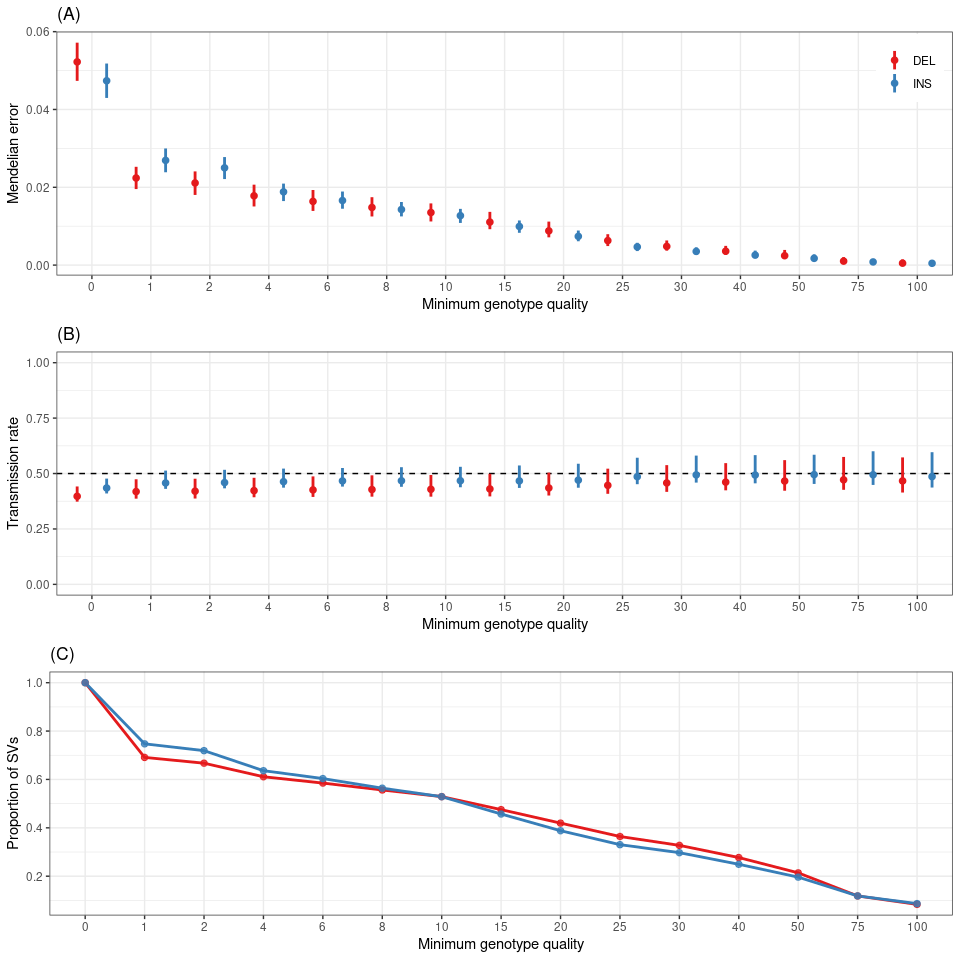

Evaluation of the SV genotypes in trios from the 1000GP
================

``` r
library(dplyr)
library(ggplot2)
library(parallel)
library(gridExtra)
library(knitr)
library(tidyr)
## graph list
ggp = list()
```

## Load genotypes, genotype qualities and trio information

``` r
## allele counts
ac.mat = read.table('relkgp.svsite80al.ac.tsv.gz', as.is=TRUE)
ac.mat = as.matrix(ac.mat)

## genotype qualities
gq.mat = read.table('relkgp.svsite80al.gq.tsv.gz', as.is=TRUE)
gq.mat = as.matrix(gq.mat)

## sv types
svs = read.table('svs.relkgp.svsite80al.tsv.gz', as.is=TRUE, header=TRUE) %>%
  select(svsite, type) %>% unique

## pedigree with population/gender information
if(!file.exists('20130606_g1k.ped')){
  download.file('ftp://ftp.1000genomes.ebi.ac.uk/vol1/ftp/technical/working/20130606_sample_info/20130606_g1k.ped', '20130606_g1k.ped')
}

ped = read.table('20130606_g1k.ped', as.is=TRUE, header=TRUE, sep='\t')

## list mendelian errors
me = c('1_0_0', '2_0_0', ## false "de novo"
       '2_0_1', '2_1_0', '2_2_0', '2_0_2', ## being hom while one parent was hom ref
       '1_2_2', ## being only het when both parents are homs
       '0_2_2', '0_2_0', '0_2_1', '0_0_2', '0_1_2') ## no allele when at least one parent was hom

## minimum GQ thresholds to compute the Mendelian error on
gq.ths = c(0:2, seq(4, 10, 2), seq(15, 30, 5), 40, 50, 75, seq(100, 300, 50))
```

## Number of variants for each GQ threshold

The Mendelian error will be computed for different GQ threshold. We want
to know how many variants each threshold represent.

``` r
gq.max.tot = tibble(svsite=rownames(ac.mat), gq.max=apply(gq.mat, 1, max))
gq.max.tot = merge(gq.max.tot, svs)

gq.n = lapply(gq.ths, function(gq.th){
  gq.max.tot %>% group_by(type) %>% summarize(n=sum(gq.max>=gq.th), .groups='drop') %>% mutate(gq.th=gq.th)
}) %>% bind_rows

write.table(gq.n, file='relkgp-gq-nb-variants.tsv', sep='\t', quote=FALSE, row.names=FALSE)
```

## Analyze variants in each trio

``` r
## trios that have genotypes/allele counts
trios = ped %>% filter(Paternal.ID %in% colnames(ac.mat),
                       Individual.ID %in% colnames(ac.mat),
                       Maternal.ID %in% colnames(ac.mat))

## loop over each trio
me.df = mclapply(1:nrow(trios), function(ii){
  trio1 = trios[ii,]
  ## allele counts for the offspring_father_mother
  ac = ac.mat[,c(trio1$Individual.ID, trio1$Paternal.ID, trio1$Maternal.ID)]
  ac.v = apply(ac, 1, paste, collapse='_')
  ## maximum genotype quality at each site
  gq = gq.mat[,c(trio1$Individual.ID, trio1$Paternal.ID, trio1$Maternal.ID)]
  gq.max = apply(gq, 1, max)
  ## mendelian error stats for different minimum GQ thresholds
  me.all = tibble(sample=trio1$Individual.ID, svsite=rownames(ac),
                  ac=ac.v, gq.max=gq.max) %>%
    mutate(error=ac%in%me) %>% merge(svs)
  me.s = lapply(gq.ths, function(gq.th){
    me.all %>% filter(gq.max<0 | gq.max>=gq.th) %>%
      group_by(type) %>% mutate(tot=n()) %>% filter(error) %>% 
      group_by(sample, type, ac, tot) %>% summarize(prop=n()/tot[1], .groups='drop') %>%
      arrange(desc(prop)) %>% mutate(gq.th=gq.th)
  }) %>% bind_rows
  ## return results
  return(me.s)
}, mc.cores=12) %>% bind_rows

write.table(me.df, file='relkgp-mendelian-error.tsv', sep='\t', quote=FALSE, row.names=FALSE)
```

## Load pre-computed results

The code above was pre-computed on a larger computing server. We then
load the results:

``` r
me.df = read.table('relkgp-mendelian-error.tsv.gz', as.is=TRUE, header=TRUE)
gq.n = read.table('relkgp-gq-nb-variants.tsv', as.is=TRUE, header=TRUE)
```

## Mendelian error for each genotype quality threshold

``` r
ggp$me = me.df %>% group_by(sample, type, gq.th) %>% summarize(prop=sum(prop)) %>%
  group_by(type, gq.th) %>% summarize(prop.m=median(prop), prop.u=min(prop),
                                      prop.l=max(prop)) %>% 
  ggplot(aes(x=factor(gq.th), y=prop.m, colour=type)) +
  theme_bw() +
  geom_pointrange(aes(ymin=prop.l, ymax=prop.u), position=position_dodge(1)) + 
  geom_point(position=position_dodge(1), alpha=.8) +
  scale_colour_brewer(palette="Set1") + 
  ylab('Mendelian error') + xlab('minimum genotype quality') +
  theme(legend.position=c(.99, .99), legend.justification=c(1,1),
        legend.title=element_blank())
ggp$me
```

<!-- -->

``` r
me.df %>% group_by(sample, gq.th, type) %>% summarize(prop=sum(prop)) %>%
  group_by(type, gq.th) %>% summarize(prop=mean(prop)) %>%
  pivot_wider(names_from=type, values_from=prop) %>% 
  kable
```

| gq.th |       DEL |       INS |
| ----: | --------: | --------: |
|     0 | 0.0523099 | 0.0474160 |
|     1 | 0.0257107 | 0.0300483 |
|     2 | 0.0243828 | 0.0284474 |
|     4 | 0.0211534 | 0.0235920 |
|     6 | 0.0195146 | 0.0214538 |
|     8 | 0.0178872 | 0.0193847 |
|    10 | 0.0164086 | 0.0178791 |
|    15 | 0.0136586 | 0.0151009 |
|    20 | 0.0110237 | 0.0120355 |
|    25 | 0.0078604 | 0.0080290 |
|    30 | 0.0060612 | 0.0062629 |
|    40 | 0.0046188 | 0.0048885 |
|    50 | 0.0031845 | 0.0033450 |
|    75 | 0.0014254 | 0.0014965 |
|   100 | 0.0007927 | 0.0008761 |
|   150 | 0.0003241 | 0.0003705 |
|   200 | 0.0001674 | 0.0001874 |
|   250 | 0.0000900 | 0.0000977 |

Range spanned by all samples. Point: median Mendelian error across
samples.

## Most common Mendelian error?

For all the variants (no minimum GQ), what is the configuration that
contributes the most to the Mendelian error?

``` r
me.df %>% filter(gq.th==0) %>% 
  group_by(ac, type) %>% summarize(prop=mean(prop)) %>%
  arrange(desc(prop)) %>% head %>% kable
```

| ac      | type |      prop |
| :------ | :--- | --------: |
| 1\_0\_0 | DEL  | 0.0255409 |
| 1\_0\_0 | INS  | 0.0224647 |
| 0\_2\_0 | DEL  | 0.0052011 |
| 0\_0\_2 | DEL  | 0.0049499 |
| 1\_2\_2 | INS  | 0.0045391 |
| 2\_0\_0 | DEL  | 0.0042598 |

The most common error is `1_0_0` which means heterozygous in the
offspring but absent from the parents. These are likely not real *de
novo* variants because we are genotyping known variants not discovering
them in those samples. It’s not that surprising that rare false
positives would be enriched in this configuration. Of note, a false
negative in the parents could also create this error.

## Total number of variants for each GQ threshold

``` r
ggp$sv.gq = gq.n %>% group_by(type) %>% mutate(prop=n/n[gq.th==0]) %>%
  ggplot(aes(factor(gq.th), y=prop, colour=type)) +
  geom_line(aes(group=type)) +
  geom_point(size=2, alpha=.8) +
  theme_bw() +
  scale_colour_brewer(palette="Set1") + 
  ylab('proportion of SVs') + xlab('minimum genotype quality') +
  scale_y_continuous(breaks=seq(0,1,.1)) + 
  theme(legend.position=c(.99, .99), legend.justification=c(1,1),
        legend.title=element_blank())
ggp$sv.gq
```

<!-- -->

``` r
gq.n %>% group_by(type) %>% mutate(prop=n/n[gq.th==0]) %>%
  arrange(type, gq.th) %>%
  pivot_wider(names_from=type, values_from=c(n,prop)) %>% 
  kable
```

| gq.th | n\_DEL | n\_INS | prop\_DEL | prop\_INS |
| ----: | -----: | -----: | --------: | --------: |
|     0 |  87293 | 101989 | 1.0000000 | 1.0000000 |
|     1 |  69843 |  77917 | 0.8000985 | 0.7639745 |
|     2 |  69075 |  76846 | 0.7913006 | 0.7534734 |
|     4 |  67349 |  74497 | 0.7715281 | 0.7304415 |
|     6 |  65832 |  72698 | 0.7541498 | 0.7128024 |
|     8 |  64562 |  71448 | 0.7396011 | 0.7005461 |
|    10 |  63765 |  70577 | 0.7304709 | 0.6920060 |
|    15 |  62082 |  68710 | 0.7111910 | 0.6737001 |
|    20 |  59283 |  65216 | 0.6791266 | 0.6394415 |
|    25 |  52955 |  56926 | 0.6066351 | 0.5581582 |
|    30 |  45721 |  49791 | 0.5237648 | 0.4881997 |
|    40 |  41768 |  47238 | 0.4784805 | 0.4631676 |
|    50 |  37895 |  43777 | 0.4341127 | 0.4292326 |
|    75 |  30030 |  36211 | 0.3440138 | 0.3550481 |
|   100 |  25568 |  31851 | 0.2928986 | 0.3122984 |
|   150 |  19931 |  24551 | 0.2283230 | 0.2407220 |
|   200 |  16565 |  20246 | 0.1897632 | 0.1985116 |
|   250 |  13964 |  16874 | 0.1599670 | 0.1654492 |
|   300 |      0 |      0 | 0.0000000 | 0.0000000 |

## Figures

``` r
## adds a legend title: a), b), etc
plot_list <- function(ggp.l, gg.names=NULL){
  if(is.null(names(ggp.l))) names(ggp.l) = paste0('g', 1:length(ggp.l))
  if(is.null(gg.names)) gg.names = names(ggp.l)
  lapply(1:length(gg.names), function(ii) ggp.l[[gg.names[ii]]] + ggtitle(paste0('(', LETTERS[ii], ')')))
}

grid.arrange(grobs=plot_list(ggp))
```

<!-- -->

``` r
pdf('fig-sv-trio-eval.pdf', 7, 6)
grid.arrange(grobs=plot_list(ggp))
dev.off()
```

    ## png 
    ##   2
