Compare SV genotypes with public SV catalogs
================

``` r
library(dplyr)
library(sveval)
library(GenomicRanges)
library(ggplot2)
library(gridExtra)
library(knitr)
winsor <- function(x, u){
  if(any(x>u)) x[x>u] = u
  x
}
```

## Simple repeat annotation

Can be used to rescue misplaced SVs within simple repeats.

``` r
if(!file.exists('simpleRepeat.hg38.txt.gz')){
  download.file('https://hgdownload.soe.ucsc.edu/goldenPath/hg38/database/simpleRepeat.txt.gz', 'simpleRepeat.hg38.txt.gz')
}
sr = read.table('simpleRepeat.hg38.txt.gz', as.is=TRUE)
sr = reduce(GRanges(sr$V2, IRanges(sr$V3, sr$V4)))
```

## SV catalog from the 1000 Genomes Project phase 3

``` r
if(!file.exists('ALL.wgs.mergedSV.v8.20130502.svs.genotypes.GRCh38.vcf.gz')){
  download.file('http://ftp.1000genomes.ebi.ac.uk/vol1/ftp/phase3/integrated_sv_map/supporting/GRCh38_positions/ALL.wgs.mergedSV.v8.20130502.svs.genotypes.GRCh38.vcf.gz', 'ALL.wgs.mergedSV.v8.20130502.svs.genotypes.GRCh38.vcf.gz')
}

kgp3 = readSVvcf.multisamps('ALL.wgs.mergedSV.v8.20130502.svs.genotypes.GRCh38.vcf.gz')
kgp3$ac = 1

## DEL_LINE1 etc -> DEL
kgp3$type = ifelse(grepl('DEL', kgp3$type), 'DEL', kgp3$type)
## ALU etc -> INS
kgp3$type = ifelse(kgp3$type %in% c('ALU', 'LINE1', 'SVA'), 'INS', kgp3$type)
## CNV -> DEL or DUP
kgp3$type = ifelse(kgp3$type=='CNV' & kgp3$alt %in% c('<CN0>','<CN1>'), 'DEL', kgp3$type)
kgp3$type = ifelse(kgp3$type=='CNV', 'DUP', kgp3$type)
kgp3 = subset(kgp3, alt != '<CN2>')

## rename chromosome names
seqlevels(kgp3) = paste0('chr', seqlevels(kgp3))

## convert DUP to INS?
kgp3$type = ifelse(kgp3$type=='DUP', 'INS', kgp3$type)

table(kgp3$type)
```

    ## 
    ##   DEL   INS   INV 
    ## 44986 17088   786

``` r
length(kgp3)
```

    ## [1] 62860

## gnomAD-SV catalog

``` r
if(!file.exists('gnomad_v2_sv.sites.pass.lifted.vcf.gz')){
  download.file('https://storage.googleapis.com/jmonlong-vg-wdl-dev-test/gnomad_v2_sv.sites.pass.lifted.vcf.gz', 'gnomad_v2_sv.sites.pass.lifted.vcf.gz')
}

gnomad = readSVvcf('gnomad_v2_sv.sites.pass.lifted.vcf.gz', other.field='AF')
gnomad$ac = 1

## convert DUP to INS?
gnomad$type = ifelse(gnomad$type=='DUP', 'INS', gnomad$type)

table(gnomad$type)
```

    ## 
    ##    CPX    DEL    INS    INV 
    ##   5106 173830 163130    636

``` r
length(gnomad)
```

    ## [1] 342702

## SVPOP

``` r
if(!file.exists('EEE_SV-Pop_1.ALL.genotypes.20181204.vcf.gz')){
  download.file('http://ftp.1000genomes.ebi.ac.uk/vol1/ftp/data_collections/hgsv_sv_discovery/working/20181025_EEE_SV-Pop_1/VariantCalls_EEE_SV-Pop_1/EEE_SV-Pop_1.ALL.genotypes.20181204.vcf.gz', 'EEE_SV-Pop_1.ALL.genotypes.20181204.vcf.gz')
}

## svpop = readSVvcf('EEE_SV-Pop_1.ALL.sites.20181204.vcf.gz', sample.name=NULL)
## svpop$ac = 1

svpop = readSVvcf('EEE_SV-Pop_1.ALL.genotypes.20181204.vcf.gz', sample.name=NULL, other.field='AF')
svpop$ac = 1

table(svpop$type)
```

    ## 
    ##   DEL   INS 
    ## 41388 57994

``` r
length(svpop)
```

    ## [1] 99382

## SVs genotyped using vg

### SVs genotyped in MESA

``` r
## SVs grouped by site ('svsite' and 'clique' columns)
mesa = read.table('svs.mesa2k.svsite80al.tsv.gz', as.is=TRUE, header=TRUE)

## stats for each SV locus
## use the most frequent allele (and then the largest) for ac/af/size
## also saves sum/max/min across all alleles
mesa.s = mesa %>% arrange(desc(af), desc(size)) %>%
  group_by(seqnames, svsite, type, clique) %>%
  summarize(start=start[1], end=end[1], ac=ac[1], af=af[1], size=size[1], .groups='drop') %>%
  filter(size>=50) %>% makeGRangesFromDataFrame(keep.extra.columns=TRUE)
```

### SVs genotyped in 2,504 samples from 1000 Genomes Project

``` r
## SVs grouped by site ('svsite' and 'clique' columns)
kgp = read.table('svs.2504kgp.svsite80al.tsv.gz', as.is=TRUE, header=TRUE)

## stats for each SV locus
## use the most frequent allele (and then the largest) for ac/af/size
## also saves sum/max/min across all alleles
kgp.s = kgp %>% arrange(desc(af), desc(size)) %>%
  group_by(seqnames, svsite, type, clique) %>%
  summarize(start=start[1], end=end[1], ac=ac[1], af=af[1], size=size[1], .groups='drop') %>%
  filter(size>=50) %>% makeGRangesFromDataFrame(keep.extra.columns=TRUE)
```

## Comparison with the 1000 Genomes Project phase 3 catalog

``` r
olcatstats = function(sites.gr, cat.gr, min.ol=.1, max.ins.dist=200, use.sr=FALSE){
  if(!use.sr){
    sr = NULL
  }
  sites.gr$ac = 1
  cat.gr$ac = 1
  ol.gr = suppressWarnings(svOverlap(sites.gr, cat.gr, min.ol=min.ol, max.ins.dist=max.ins.dist, simprep=sr))
  ## compute proportions
  tibble(prop.vgsite=length(unique(ol.gr$queryHits)) / length(sites.gr),
         prop.cat=length(unique(ol.gr$subjectHits)) / length(cat.gr))
}

rbind(
  olcatstats(mesa.s, kgp3) %>% mutate(set='MESA vs 1000GP'),
  olcatstats(subset(mesa.s, af>=.05), subset(kgp3, af>=.05)) %>% mutate(set='MESA freq>=5% vs 1000GP freq>=5%'),
  olcatstats(kgp.s, kgp3) %>% mutate(set='vg-1000GP vs 1000GP'),
  olcatstats(subset(kgp.s, af>=.05), subset(kgp3, af>=.05)) %>% mutate(set='vg-1000GP freq>=5% vs 1000GP freq>=5%')
) %>% select(set, prop.vgsite, prop.cat) %>% kable(digits=3)
```

| set                                     | prop.vgsite | prop.cat |
| :-------------------------------------- | ----------: | -------: |
| MESA vs 1000GP                          |       0.068 |    0.165 |
| MESA freq\>=5% vs 1000GP freq\>=5%      |       0.087 |    0.792 |
| vg-1000GP vs 1000GP                     |       0.068 |    0.166 |
| vg-1000GP freq\>=5% vs 1000GP freq\>=5% |       0.090 |    0.819 |

``` r
ol.gr = suppressWarnings(svOverlap(mesa.s, kgp3, min.ol=.1, max.ins.dist=200))
freq.mesa.kgp3.df = ol.gr %>% as.data.frame %>%
  mutate(af=mesa.s$af[queryHits], cat.af=kgp3$af[subjectHits])

ggplot(freq.mesa.kgp3.df, aes(x=af, y=cat.af)) +
  geom_point(alpha=.3) +
  xlab('allele frequency in MESA') + ylab('allele frequency in 1000GP phase 3') + 
  theme_bw()
```

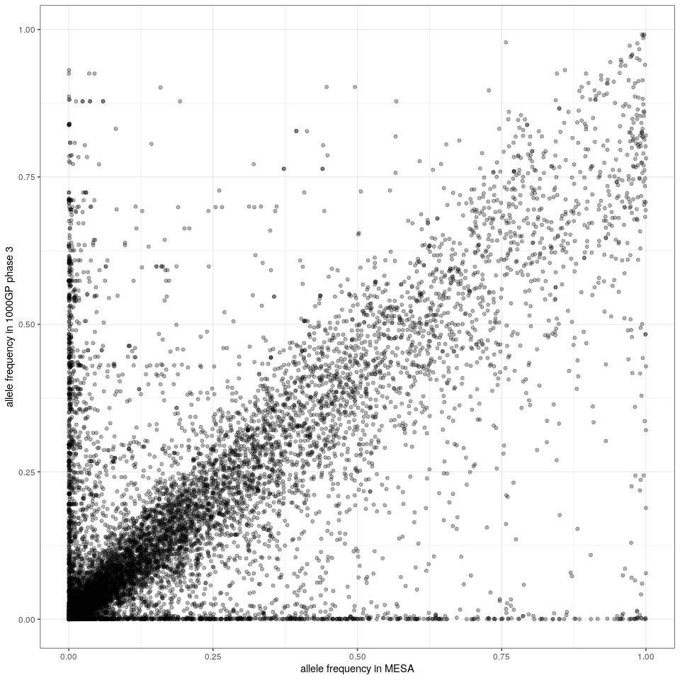<!-- -->

``` r
ol.gr = suppressWarnings(svOverlap(kgp.s, kgp3, min.ol=.1, max.ins.dist=200))
freq.kgp.kgp3.df = ol.gr %>% as.data.frame %>%
  mutate(af=kgp.s$af[queryHits], cat.af=kgp3$af[subjectHits])

ggplot(freq.kgp.kgp3.df, aes(x=af, y=cat.af)) +
  geom_point(alpha=.3) +
  xlab('allele frequency in vg-1000GP') + ylab('allele frequency in 1000GP phase 3') + 
  theme_bw()
```

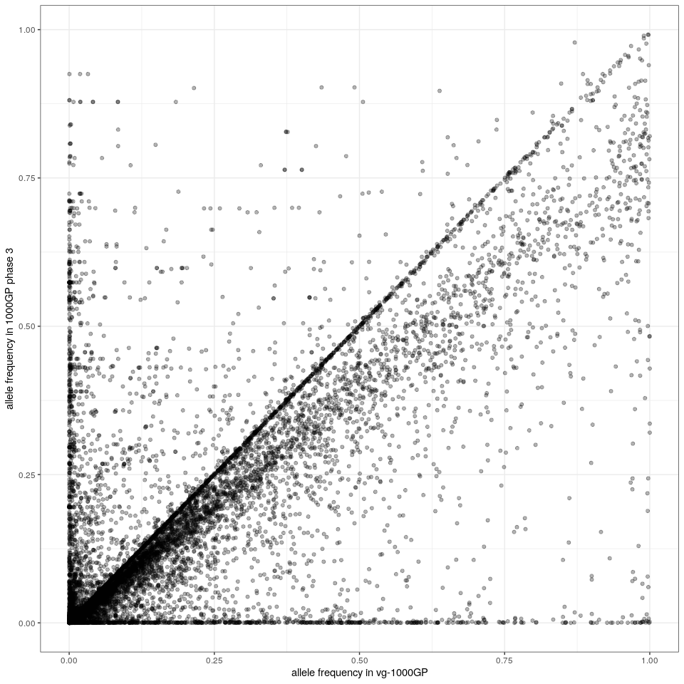<!-- -->

## Comparison with the gnomAD-SV catalog

``` r
rbind(
  olcatstats(mesa.s, gnomad) %>% mutate(set='MESA vs gnomAD-SV'),
  olcatstats(subset(mesa.s, af>=.05), subset(gnomad, AF>=.05)) %>% mutate(set='MESA freq>=5% vs gnomAD-SV freq>=5%'),
  olcatstats(kgp.s, gnomad) %>% mutate(set='vg-1000GP vs gnomAD-SV'),
  olcatstats(subset(kgp.s, af>=.05), subset(gnomad, AF>=.05)) %>% mutate(set='vg-1000GP freq>=5% vs gnomAD-SV freq>=5%')
) %>% select(set, prop.vgsite, prop.cat) %>% kable(digits=3)
```

| set                                        | prop.vgsite | prop.cat |
| :----------------------------------------- | ----------: | -------: |
| MESA vs gnomAD-SV                          |       0.283 |    0.092 |
| MESA freq\>=5% vs gnomAD-SV freq\>=5%      |       0.151 |    0.588 |
| vg-1000GP vs gnomAD-SV                     |       0.284 |    0.091 |
| vg-1000GP freq\>=5% vs gnomAD-SV freq\>=5% |       0.154 |    0.599 |

``` r
ol.gr = suppressWarnings(svOverlap(mesa.s, gnomad, min.ol=.1, max.ins.dist=200))
freq.mesa.gnomad.df = ol.gr %>% as.data.frame %>%
  mutate(af=mesa.s$af[queryHits], cat.af=gnomad$AF[subjectHits])

ggplot(freq.mesa.gnomad.df, aes(x=af, y=cat.af)) +
  geom_point(alpha=.3) +
  xlab('allele frequency in MESA') + ylab('allele frequency in gnomAD-SV') + 
  theme_bw()
```

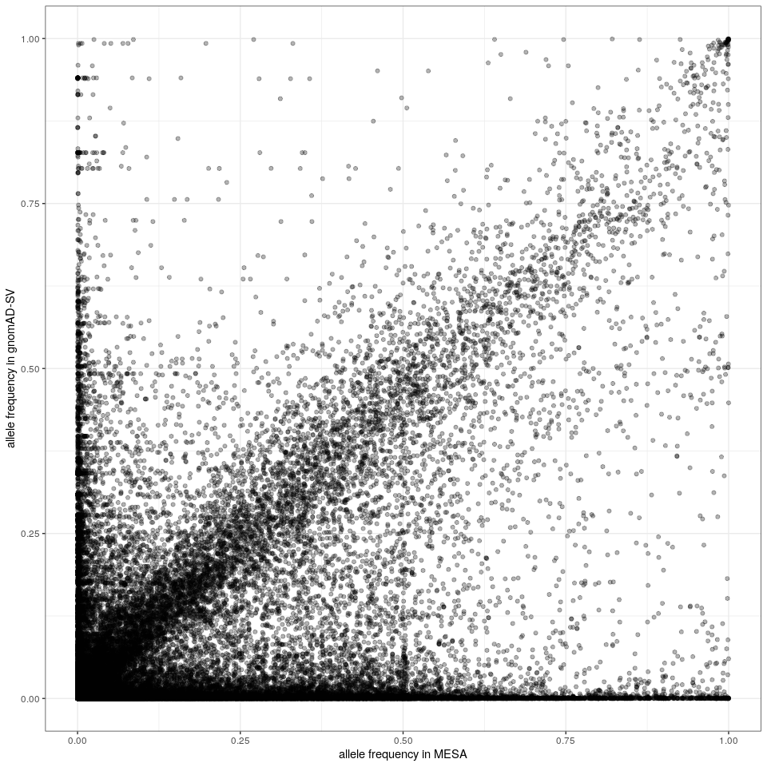<!-- -->

``` r
ol.gr = suppressWarnings(svOverlap(kgp.s, gnomad, min.ol=.1, max.ins.dist=200))
freq.kgp.gnomad.df = ol.gr %>% as.data.frame %>%
  mutate(af=kgp.s$af[queryHits], cat.af=gnomad$AF[subjectHits])

ggplot(freq.kgp.gnomad.df, aes(x=af, y=cat.af)) +
  geom_point(alpha=.3) +
  xlab('allele frequency in vg-1000GP') + ylab('allele frequency in gnomAD-SV') + 
  theme_bw()
```

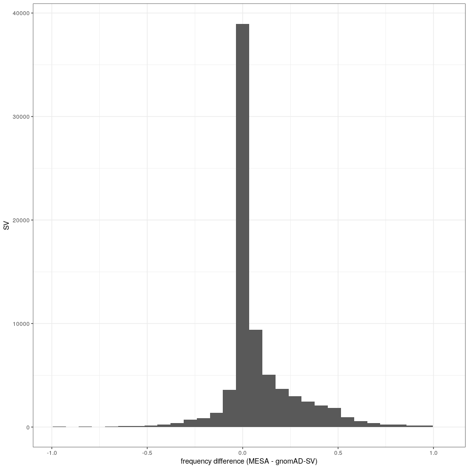<!-- -->

## Comparison with SVPOP

``` r
rbind(
  olcatstats(mesa.s, svpop) %>% mutate(set='MESA vs SVPOP'),
  olcatstats(kgp.s, svpop) %>% mutate(set='vg-1000GP vs SVPOP')
) %>% select(set, prop.vgsite, prop.cat) %>% kable(digits=3)
```

| set                | prop.vgsite | prop.cat |
| :----------------- | ----------: | -------: |
| MESA vs SVPOP      |       0.901 |    0.940 |
| vg-1000GP vs SVPOP |       0.900 |    0.927 |

``` r
ol.gr = suppressWarnings(svOverlap(mesa.s, svpop, min.ol=.1, max.ins.dist=200))
freq.mesa.svpop.df = ol.gr %>% as.data.frame %>%
  mutate(af=mesa.s$af[queryHits], cat.af=svpop$AF[subjectHits])

ggplot(freq.mesa.svpop.df, aes(x=af, y=cat.af)) +
  geom_point(alpha=.3) +
  xlab('allele frequency in MESA') + ylab('allele frequency in SVPOP') + 
  theme_bw()
```

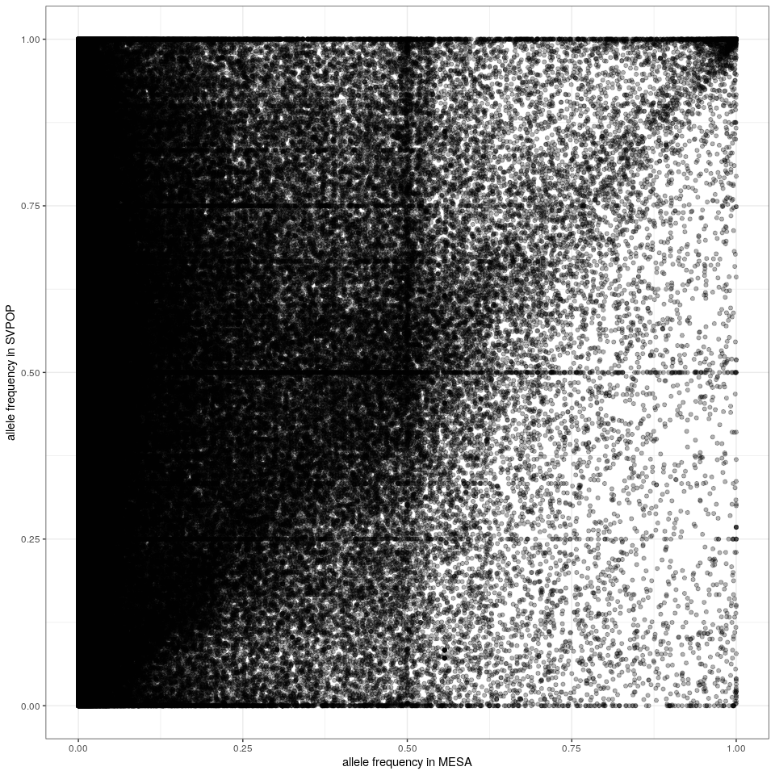<!-- -->

``` r
ol.gr = suppressWarnings(svOverlap(kgp.s, svpop, min.ol=.1, max.ins.dist=200))
freq.kgp.svpop.df = ol.gr %>% as.data.frame %>%
  mutate(af=kgp.s$af[queryHits], cat.af=svpop$AF[subjectHits])

freq.kgp.svpop.df %>% filter(af>.05, cat.af>.05) %>% 
  ggplot(aes(x=af, y=cat.af)) +
  geom_point(alpha=.5) +
  xlab('allele frequency in vg-1000GP') + ylab('allele frequency in SVPOP') + 
  ## geom_bin2d() +
  theme_bw()
```

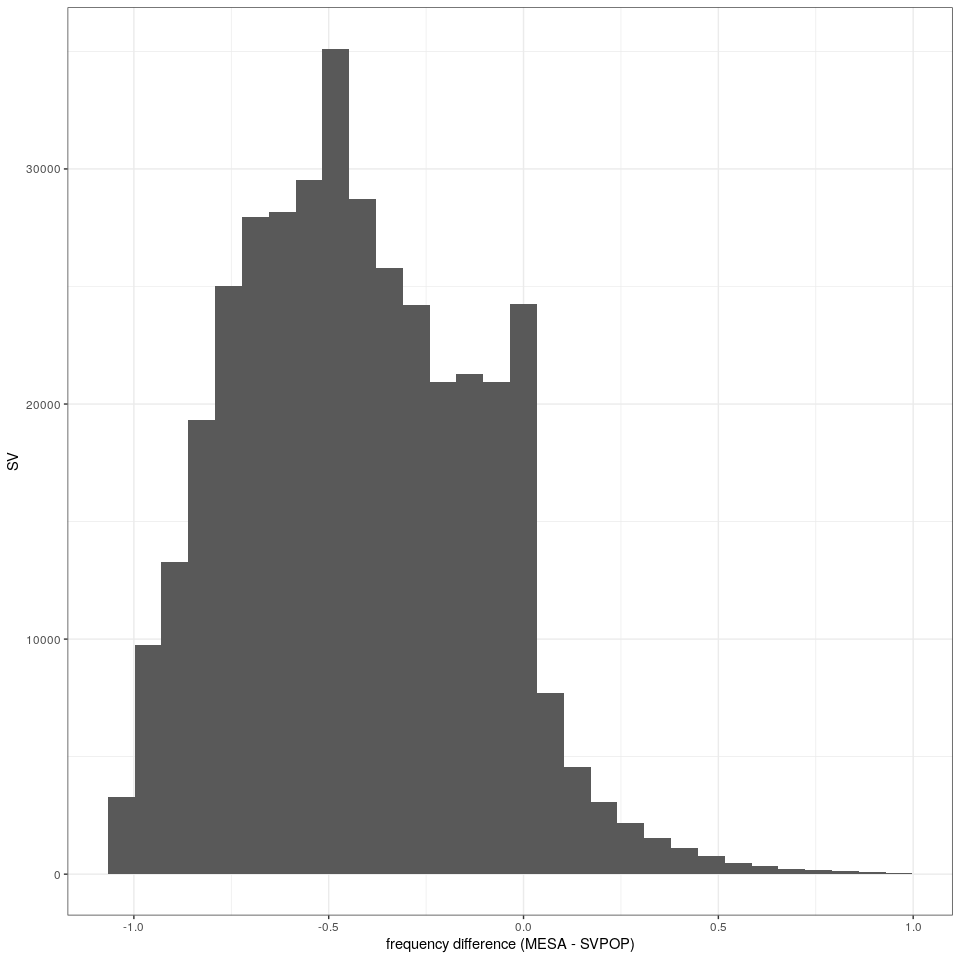<!-- -->

``` r
ggplot(freq.mesa.kgp3.df, aes(x=cat.af)) + geom_histogram() + theme_bw() +
  ylab('1000GP phase 3 variants') + xlab('allele frequency')
```

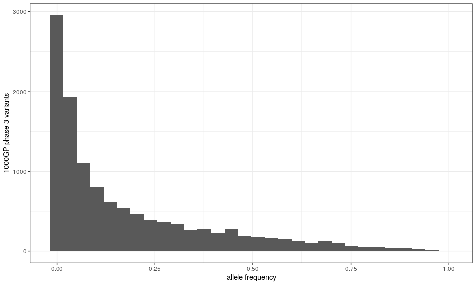<!-- -->

``` r
ggplot(freq.mesa.gnomad.df, aes(x=cat.af)) + geom_histogram() + theme_bw() +
  ylab('gnomAD-SV variants') + xlab('allele frequency')
```

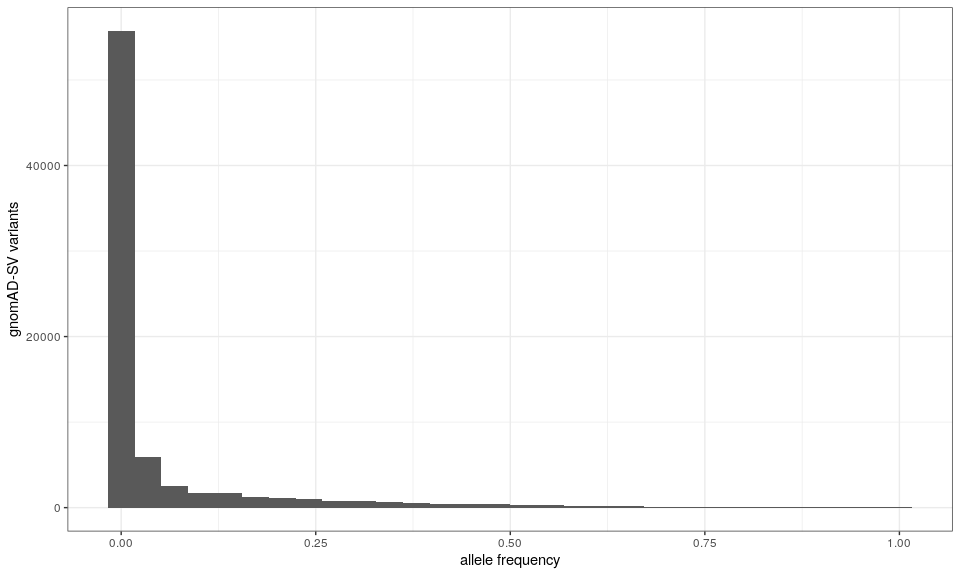<!-- -->

``` r
ggplot(freq.mesa.svpop.df, aes(x=cat.af)) + geom_histogram() + theme_bw() +
  ylab('SVPOP variants') + xlab('allele frequency')
```

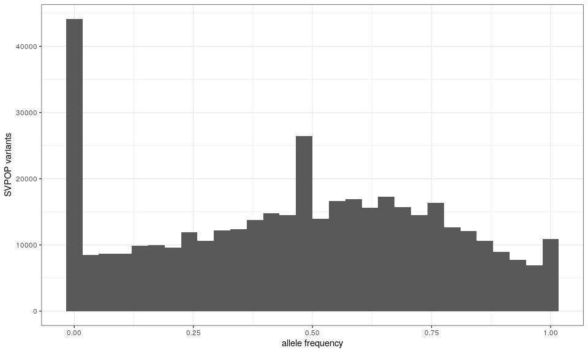<!-- -->

``` r
ggplot(freq.mesa.svpop.df, aes(x=af)) + geom_histogram() + theme_bw() +
  ylab('MESA variants') + xlab('allele frequency')
```

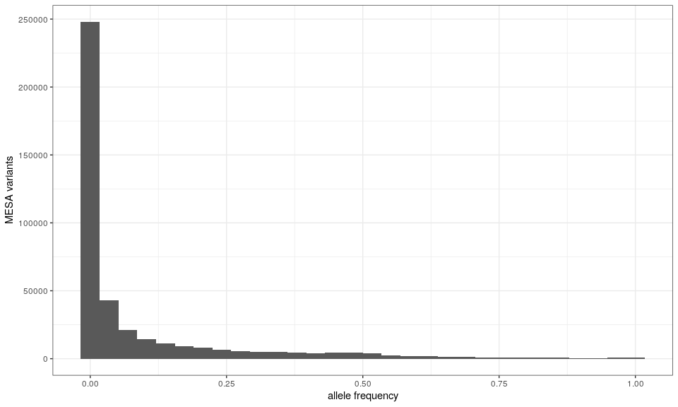<!-- -->

### SVPOP vs gnomAD-SV/1000GP

``` r
ol.gr = suppressWarnings(svOverlap(kgp3, svpop, min.ol=.1, max.ins.dist=200))
freq.kgp3.svpop.df = ol.gr %>% as.data.frame %>%
  mutate(af=kgp3$af[queryHits], cat.af=svpop$AF[subjectHits])

ggplot(freq.kgp3.svpop.df, aes(x=af, y=cat.af)) +
  geom_point(alpha=.3) +
  xlab('allele frequency in SVPOP') + ylab('allele frequency in 1000GP phase 3') +
  theme_bw()
```

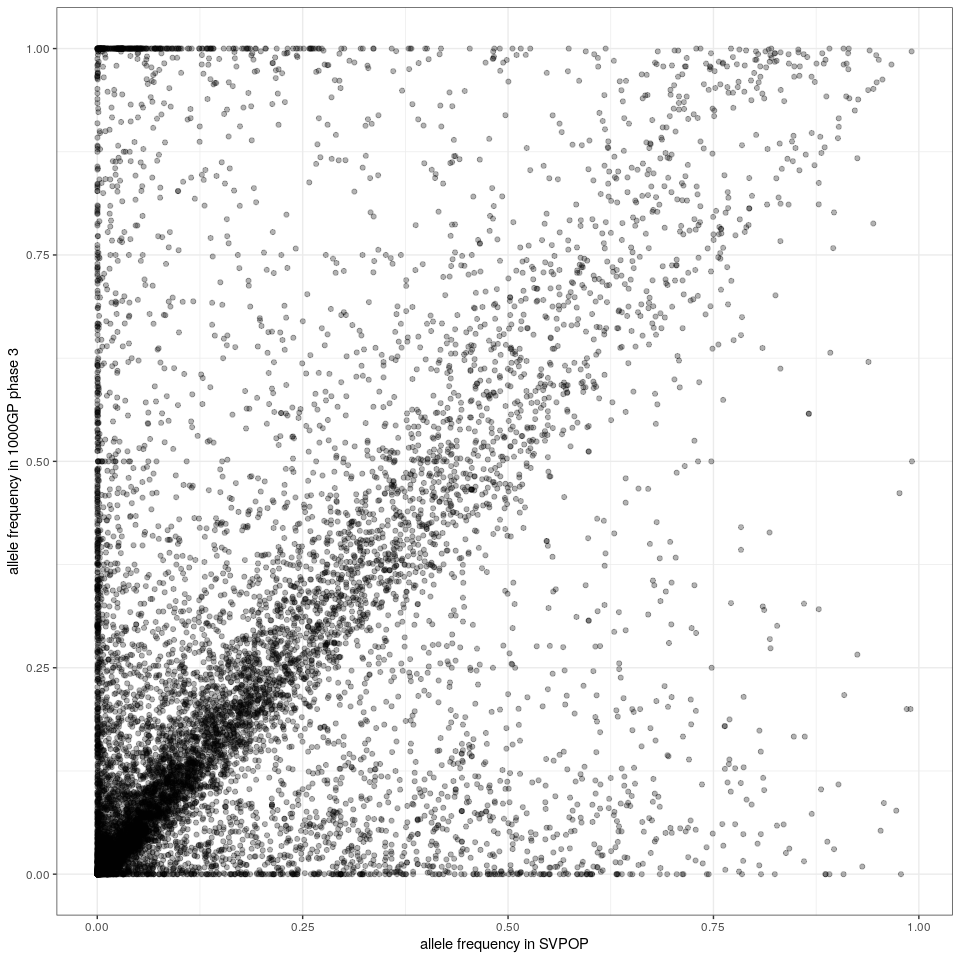<!-- -->

``` r
ol.gr = suppressWarnings(svOverlap(gnomad, svpop, min.ol=.1, max.ins.dist=200))
freq.gnomad.svpop.df = ol.gr %>% as.data.frame %>%
  mutate(af=gnomad$AF[queryHits], cat.af=svpop$AF[subjectHits])

ggplot(freq.gnomad.svpop.df, aes(x=af, y=cat.af)) +
  geom_point(alpha=.3) +
  xlab('allele frequency in SVPOP') + ylab('allele frequency in gnomAD-SV') +
  theme_bw()
```

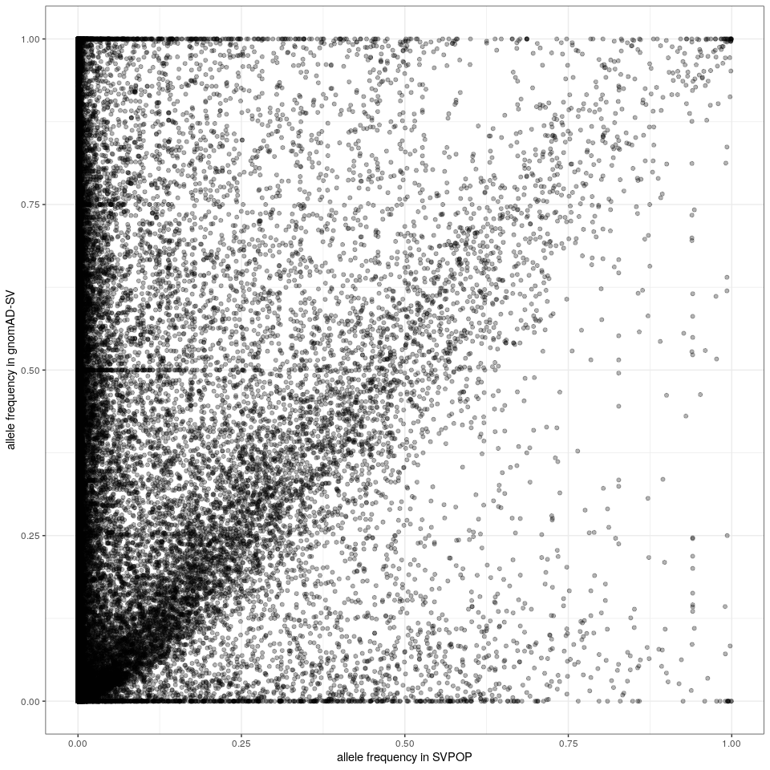<!-- -->
