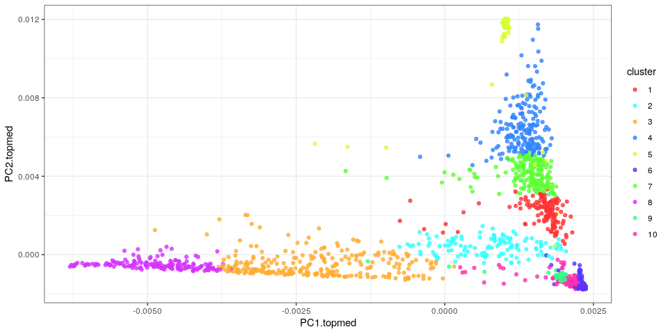
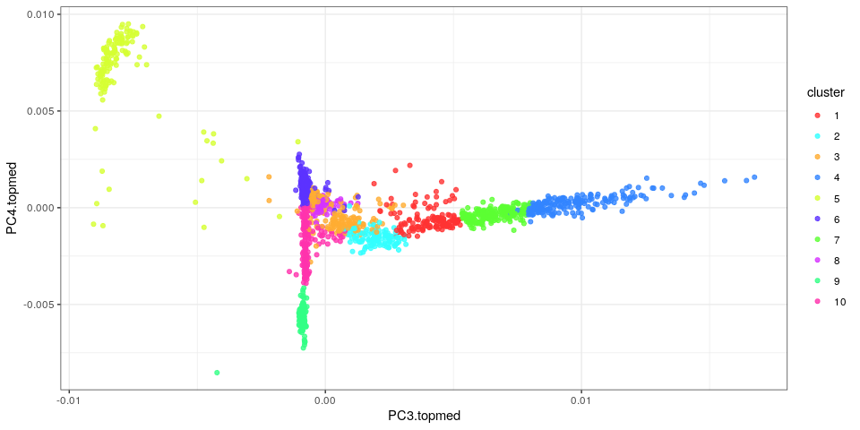
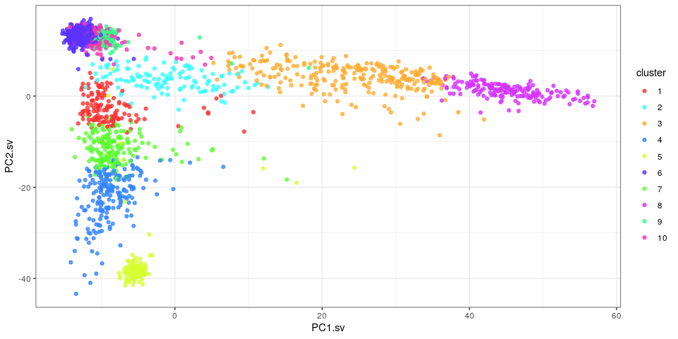
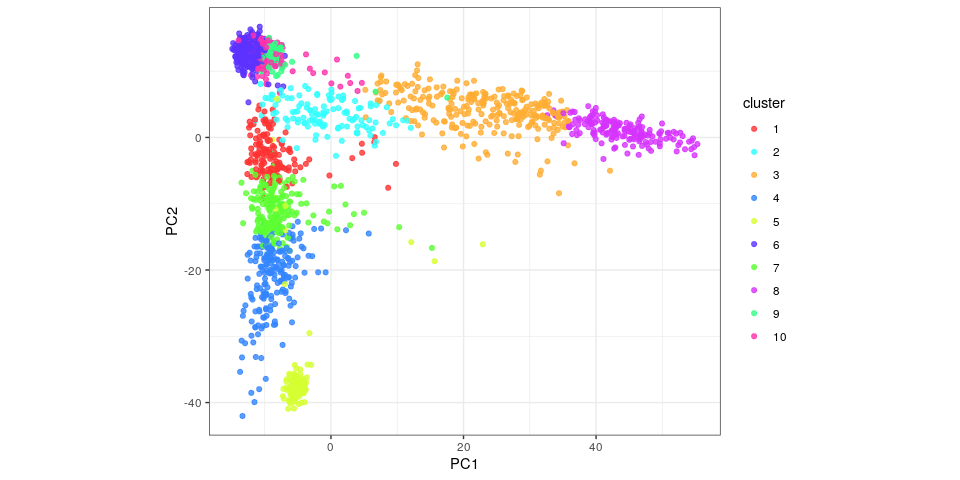
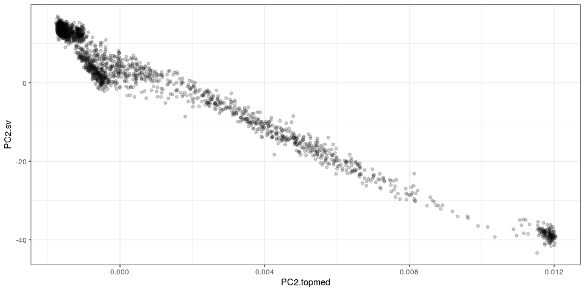
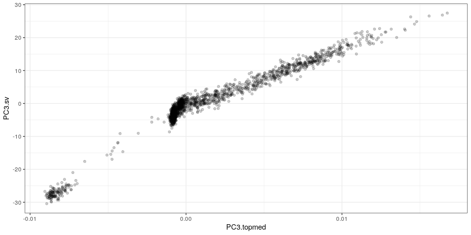
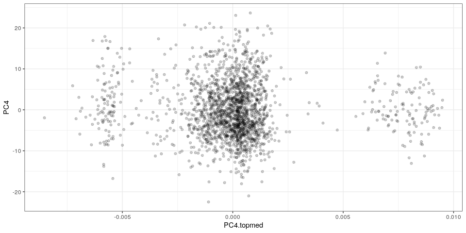
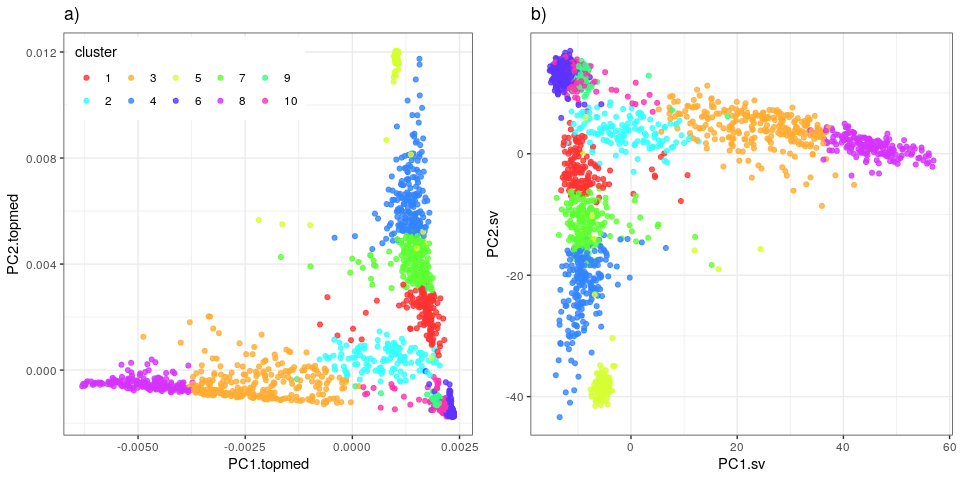
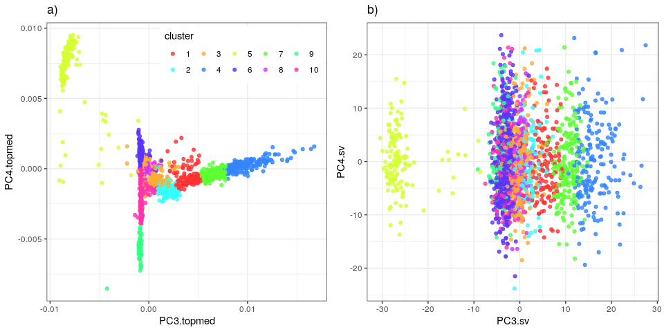

Principal component analysis using SV genotypes in the MESA cohort
================

``` r
library(dplyr)
library(ggplot2)
library(gridExtra)
## color palette with clear separation between consecutive groups
interk <- function(x, k=4){ # Interleaves elements in x
  idx = unlist(lapply(1:k, function(kk) seq(kk, length(x), k)))
  x[idx]
}
pal <- function(n){
  pal = interk(rainbow(n, s=.8), 5)
}
## list of figures
ggp = list()
```

## Read PC results

``` r
## PCs derived from SV genotypes or TOPMed SNVs/indels
pc.df = read.table('mesa2k-pcs-svs-topmed.tsv.gz', as.is=TRUE, header=TRUE)
```

## Color samples based on TOPMed PCs

``` r
pc.tm.d = pc.df %>% select(PC1.topmed, PC2.topmed, PC3.topmed, PC4.topmed) %>% as.matrix %>% dist
hc.tm = hclust(pc.tm.d, method='ward.D')
cl.k = 10
pc.df$topmed.cl = cutree(hc.tm, cl.k)

ggp$topmed = ggplot(pc.df, aes(x=PC1.topmed, y=PC2.topmed, color=factor(topmed.cl))) +
  geom_point(alpha=.8) +
  scale_color_manual(name='cluster', values=pal(cl.k)) + 
  theme_bw()
ggp$topmed
```

<!-- -->

``` r
ggp$topmed.3.4 = ggplot(pc.df, aes(x=PC3.topmed, y=PC4.topmed, color=factor(topmed.cl))) +
  geom_point(alpha=.8) +
  scale_color_manual(name='cluster', values=pal(cl.k)) + 
  theme_bw()
ggp$topmed.3.4
```

<!-- -->

## PCs from SV genotypes

``` r
ggp$sv = ggplot(pc.df, aes(x=PC1.sv, y=PC2.sv, color=factor(topmed.cl))) +
  geom_point(alpha=.8) +
  scale_color_manual(name='cluster', values=pal(cl.k)) + 
  theme_bw()
ggp$sv
```

<!-- -->

``` r
ggp$sv.3.4 = ggplot(pc.df, aes(x=PC3.sv, y=PC4.sv, color=factor(topmed.cl))) +
  geom_point(alpha=.8) +
  scale_color_manual(name='cluster', values=pal(cl.k)) + 
  theme_bw()
ggp$sv.3.4
```

<!-- -->

## Direct PC comparison

``` r
ggp$pc1 = ggplot(pc.df, aes(x=PC1.topmed, y=PC1.sv)) + geom_point(alpha=.2) + theme_bw()
ggp$pc1
```

<!-- -->

``` r
ggp$pc2 = ggplot(pc.df, aes(x=PC2.topmed, y=PC2.sv)) + geom_point(alpha=.2) + theme_bw()
ggp$pc2
```

<!-- -->

``` r
ggp$pc3 = ggplot(pc.df, aes(x=PC3.topmed, y=PC3.sv)) + geom_point(alpha=.2) + theme_bw()
ggp$pc3
```

<!-- -->

``` r
ggp$pc4 = ggplot(pc.df, aes(x=PC4.topmed, y=PC4.sv)) + geom_point(alpha=.2) + theme_bw()
ggp$pc4
```

<!-- -->

## Multi-panel figure

``` r
## adds a legend title: a), b), etc
plot_list <- function(ggp.l, gg.names=NULL){
  if(is.null(names(ggp.l))) names(ggp.l) = paste0('g', 1:length(ggp.l))
  if(is.null(gg.names)) gg.names = names(ggp.l)
  lapply(1:length(gg.names), function(ii) ggp.l[[gg.names[ii]]] + ggtitle(paste0(letters[ii], ')')))
}

ggp$sv.f = ggp$sv + guides(color=FALSE)
ggp$topmed.f = ggp$topmed + theme(legend.position=c(.01, .99), legend.justification=c(0, 1)) +
  guides(color=guide_legend(ncol=5))
grid.arrange(grobs=plot_list(ggp, c('topmed.f', 'sv.f')),
             layout_matrix=matrix(c(1,2),1))
```

<!-- -->

``` r
ggp$sv.3.4.f = ggp$sv.3.4 + guides(color=FALSE)
ggp$topmed.3.4.f = ggp$topmed.3.4 + theme(legend.position=c(.99, .99), legend.justification=c(1,1)) +
  guides(color=guide_legend(ncol=5))
grid.arrange(grobs=plot_list(ggp, c('topmed.3.4.f', 'sv.3.4.f')),
             layout_matrix=matrix(c(1,2),1))
```

<!-- -->

``` r
grid.arrange(grobs=plot_list(ggp, c('pc1', 'pc2', 'pc3')),
             layout_matrix=matrix(c(1:3),1))
```

<!-- -->

``` r
pdf('fig-sv-mesa-pcs.pdf', 9, 4)
grid.arrange(grobs=plot_list(ggp, c('topmed.f', 'sv.f')),
             layout_matrix=matrix(c(1,2),1))
grid.arrange(grobs=plot_list(ggp, c('topmed.3.4.f', 'sv.3.4.f')),
             layout_matrix=matrix(c(1,2),1))
grid.arrange(grobs=plot_list(ggp, c('pc1', 'pc2', 'pc3')),
             layout_matrix=matrix(c(1:3),1))
dev.off()
```

    ## png 
    ##   2
