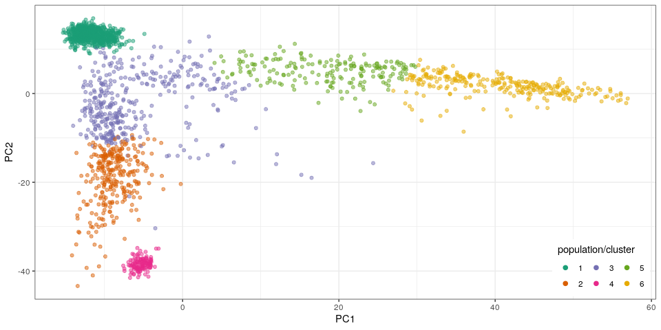
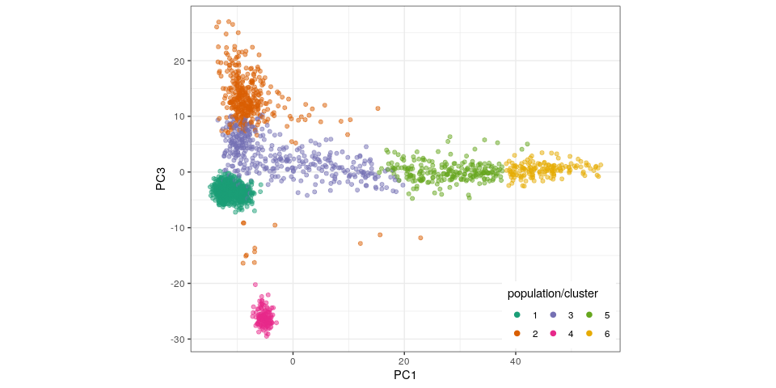
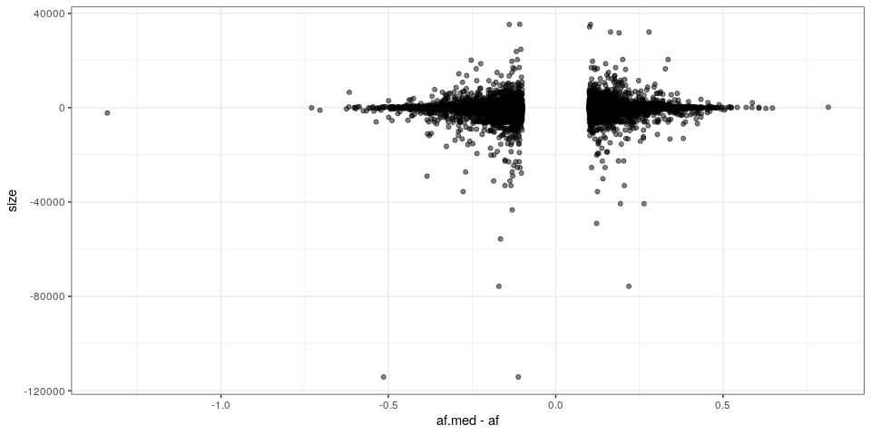
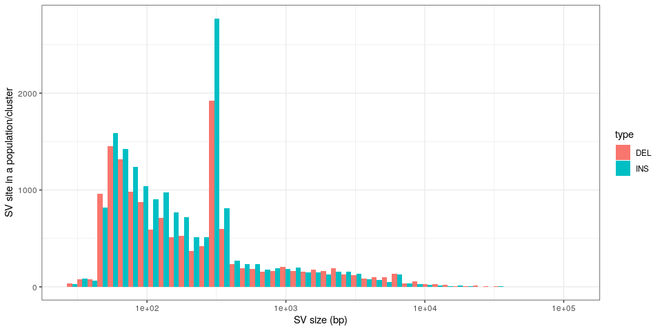
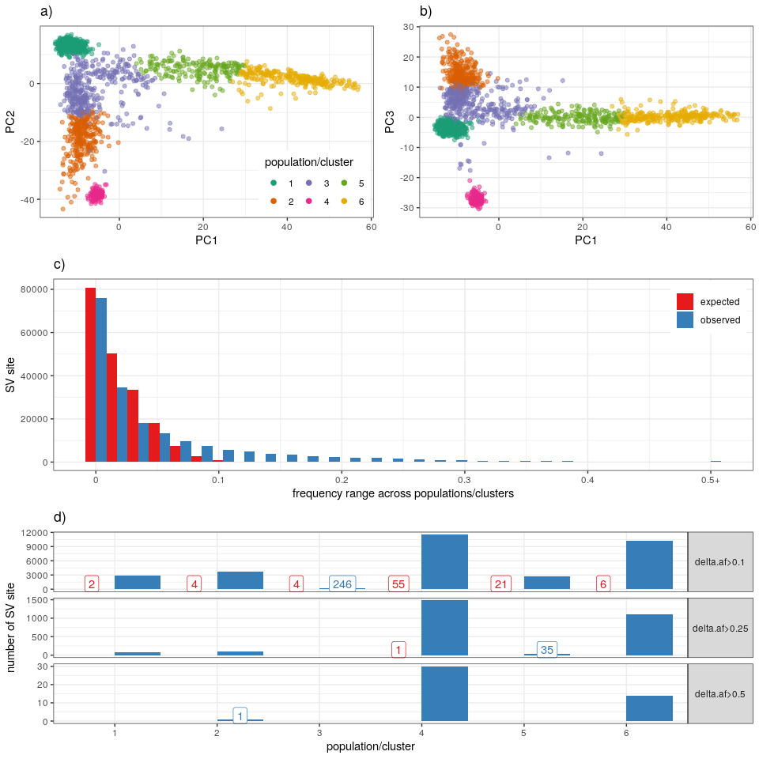

Frequency in populations from the MESA cohort
================

``` r
library(dplyr)
library(ggplot2)
library(gridExtra)
library(knitr)
winsor <- function(x, u){
  if(any(x>u)) x[x>u] = u
  x
}
## list of figures
ggp = list()
```

## Read frequencies

``` r
## frequencies in different clusters (hc) for each SV site
freq.df = read.table('mesa2k.svsite80al.hcfreq.tsv.gz', as.is=TRUE, header=TRUE)
```

## Read PC results and reproduce clusters

For visualization

``` r
## PCs derived from SV genotypes or TOPMed SNVs/indels
pc.df = read.table('mesa2k-pcs-svs-topmed.tsv.gz', as.is=TRUE, header=TRUE)
pc.df = pc.df %>% arrange(PC1.sv, PC2.sv, PC3.sv)
pc.d = pc.df %>% select(PC1.sv, PC2.sv, PC3.sv) %>% as.matrix %>% dist
hc.o = hclust(pc.d, method='ward.D')
pc.df$hc = factor(cutree(hc.o, 6))
pc.df %>% group_by(hc) %>% summarize(n=n())
```

    ## # A tibble: 6 x 2
    ##   hc        n
    ##   <fct> <int>
    ## 1 1       752
    ## 2 2       291
    ## 3 3       376
    ## 4 4       126
    ## 5 5       191
    ## 6 6       264

``` r
ggp$pc12 = ggplot(pc.df, aes(x=PC1.sv, y=PC2.sv, color=hc)) +
  geom_point(alpha=.5) + theme_bw() +
  xlab('PC1') + ylab('PC2') +
  scale_color_brewer(palette='Dark2', name='population/cluster') +
  guides(colour=guide_legend(ncol=3, override.aes=list(alpha=1, size=2))) + 
  theme(legend.position=c(.99, .01), legend.justification=c(1,0))
ggp$pc12
```

<!-- -->

``` r
ggp$pc13 = ggplot(pc.df, aes(x=PC1.sv, y=PC3.sv, color=hc)) +
  geom_point(alpha=.5) + theme_bw() + 
  xlab('PC1') + ylab('PC3') +
  scale_color_brewer(palette='Dark2', name='population/cluster') +
  guides(colour=guide_legend(ncol=3, override.aes=list(alpha=1, size=2))) + 
  theme(legend.position=c(.99, .01), legend.justification=c(1,0))
ggp$pc13
```

<!-- -->

## Read null frequencies

To compute an expected distribution, sample labels were permuted.

``` r
freq.null = read.table('mesa2k.svsite80al.hcfreq.null.tsv.gz', as.is=TRUE, header=TRUE)

freq.df = rbind(
  freq.df %>% mutate(exp='observed'),
  freq.null %>% mutate(exp='expected'))
```

## Compute the minimum, median and maximum frequency

``` r
freq.s = freq.df %>% group_by(exp, svsite) %>%
  summarize(af.min=min(af), af.max=max(af), af.med=median(af), .groups='drop')

ggp$range = ggplot(freq.s, aes(winsor(af.max-af.min, .5), fill=exp)) +
  geom_histogram(position='dodge') + theme_bw() +
  xlab('frequency range across populations/clusters') +
  scale_fill_brewer(palette='Set1') +
  scale_x_continuous(breaks=seq(0,.5,.1), labels=c(seq(0,.4,.1), '0.5+')) + 
  theme(legend.title=element_blank(),
        legend.position=c(.99,.99), legend.justification=c(1,1)) + 
  ylab('SV site')
ggp$range
```

<!-- -->

``` r
lapply(c(.1,.25,.5), function(th){
  freq.s %>% group_by(exp) %>% summarize(svsite=sum(af.max-af.min>th), .groups='drop') %>% 
    mutate(min.af.range=th)
}) %>% bind_rows %>%
  select(min.af.range, exp, svsite) %>%
  kable()
```

| min.af.range | exp      | svsite |
| -----------: | :------- | -----: |
|         0.10 | expected |   1006 |
|         0.10 | observed |  34000 |
|         0.25 | expected |      3 |
|         0.25 | observed |   7594 |
|         0.50 | expected |      0 |
|         0.50 | observed |    469 |

The table shows the number of sites with a frequency range larger than
10%, 25%, and 50%.

## SV sites with large deviation from the median frequency

``` r
freq.df = freq.df %>% group_by(exp, svsite) %>% mutate(af.med=median(af))

bar.df = lapply(c(.1,.25,.5), function(th){
  freq.df %>% group_by(hc, exp) %>% summarize(sv=sum(abs(af.med-af)>th), .groups='drop') %>% 
    mutate(af.dev=paste0('delta.af>', th))
}) %>% bind_rows

ggp$olbar = bar.df %>% group_by(af.dev) %>%
  mutate(y.label=ifelse(sv>.05*max(sv) | sv==0, NA, .1*max(sv))) %>% 
  ggplot(aes(x=factor(hc), y=sv, fill=exp)) + 
  geom_bar(stat='identity', position='dodge') + theme_bw() +
  geom_label(aes(label=sv, color=exp, y=y.label),
             fill='white', position=position_dodge(.9), show.legend=FALSE) + 
  facet_grid(af.dev~., scales='free') + 
  scale_fill_brewer(palette='Set1', name='') + 
  scale_color_brewer(palette='Set1', name='') +
  theme(strip.text.y=element_text(angle=0)) + 
  xlab('population/cluster') +
  ylab('number of SV site')
ggp$olbar
```

<!-- -->

``` r
lapply(c(.1,.25,.5), function(th){
  freq.df %>% filter(af.med-af>th) %>%
    group_by(exp) %>%
    summarize(svsite=length(unique(svsite)), .groups='drop') %>% 
    mutate(min.af.dev=th)
}) %>% bind_rows %>%
  select(min.af.dev, exp, svsite) %>%
  kable()
```

| min.af.dev | exp      | svsite |
| ---------: | :------- | -----: |
|       0.10 | expected |     38 |
|       0.10 | observed |  11264 |
|       0.25 | observed |   1049 |
|       0.50 | observed |     15 |

The table shows the number of sites with a population-specific frequency
pattern, defined as deviating form the median frequency by at least 10%,
25%, and 50%.

## Population-specific SVs by type and size

``` r
## SVs grouped by site ('svsite' and 'clique' columns)
svs = read.table('svs.mesa2k.svsite80al.tsv.gz', as.is=TRUE, header=TRUE)
svs = svs %>% group_by(svsite, type) %>% summarize(size=mean(size), .groups='drop')

ggp$devtype = freq.df %>% group_by(exp) %>%  filter(abs(af.med-af)>.1) %>% 
  merge(svs) %>%
  ggplot(aes(x=winsor(abs(af.med-af), 1), fill=type)) +
  geom_histogram(bins=50, position='dodge') +
  scale_x_continuous(breaks=seq(.1, 1, .1), limits=c(.1, 1)) + 
  theme_bw() +
  xlab('frequency deviation from the mean (winsorized at 1)') +
  ylab('SV site in a population/cluster')
ggp$devtype
```

<!-- -->

``` r
ggp$devsize = freq.df %>% group_by(exp) %>%  filter(abs(af.med-af)>.1) %>% 
  merge(svs) %>%
  ggplot(aes(x=size, fill=type)) +
  geom_histogram(bins=50, position='dodge') +
  scale_x_log10() + 
  theme_bw() +
  xlab('SV size (bp)') +
  ylab('SV site in a population/cluster')
ggp$devsize
```

<!-- -->

## Multi-panel figure

``` r
## adds a legend title: a), b), etc
plot_list <- function(ggp.l, gg.names=NULL){
  if(is.null(names(ggp.l))) names(ggp.l) = paste0('g', 1:length(ggp.l))
  if(is.null(gg.names)) gg.names = names(ggp.l)
  lapply(1:length(gg.names), function(ii) ggp.l[[gg.names[ii]]] + ggtitle(paste0(letters[ii], ')')))
}

grid.arrange(grobs=plot_list(list(ggp$pc12, ggp$pc13 + guides(color=FALSE),
                                  ggp$range, ggp$olbar + guides(fill=FALSE))),
             layout_matrix=matrix(c(1,3,4,2,3,4), 3))
```

<!-- -->

``` r
pdf('fig-pops-freq-mesa.pdf', 8, 8)
grid.arrange(grobs=plot_list(list(ggp$pc12, ggp$pc13 + guides(color=FALSE),
                                  ggp$range, ggp$olbar + guides(fill=FALSE))),
             layout_matrix=matrix(c(1,3,4,2,3,4), 3))
dev.off()
```

    ## png 
    ##   2
