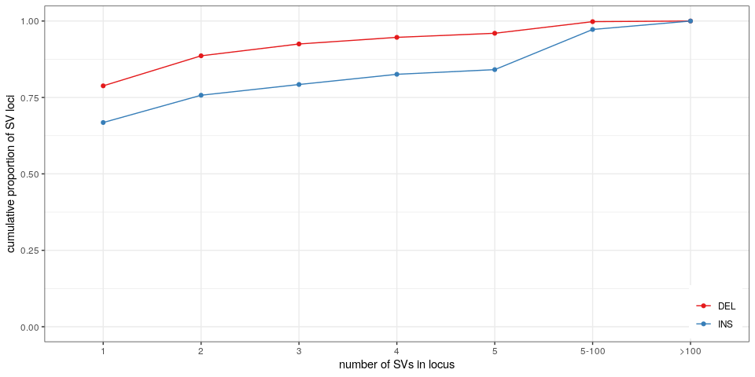

Summary stats for SVs in the 2,504 unrelated samples from the 1000
Genomes Project
================

``` r
library(dplyr)
library(ggplot2)
library(gridExtra)
library(knitr)
winsor <- function(x, u){
  if(any(x>u)) x[x>u] = u
  x
}
```

## Read population stats for each SV allele

``` r
## SVs grouped by site ('svsite' and 'clique' columns)
svs = read.table('svs.2504kgp.svsite80al.tsv.gz', as.is=TRUE, header=TRUE)

## stats for each SV locus
## use the most frequent allele (and then the largest) for ac/af/size
## also saves sum/max/min across all alleles
locs = svs %>% arrange(desc(af), desc(size)) %>%
  group_by(seqnames, svsite, type, clique) %>%
  summarize(ac.tot=sum(ac), ac=ac[1],
            af.tot=sum(af), af.top2=tail(head(af, 2), 1), af=af[1],
            af.top.fc=ifelse(af.top2==0, 10, af/af.top2),
            loc.n=n(),
            size.min=min(size), size.max=max(size), size=size[1],
            .groups='drop') %>%
  filter(size>=50)

sample_n(locs, 10) %>% as.data.frame
```

    ##    seqnames       svsite type clique ac.tot  ac       af.tot      af.top2
    ## 1      chr5 sv_1532899_0  DEL   TRUE      1   1 0.0001996805 0.0001996805
    ## 2      chr5 sv_1613994_0  DEL  FALSE     11   3 0.0021964856 0.0003993610
    ## 3      chr1 sv_1993386_0  DEL   TRUE      2   2 0.0003993610 0.0003993610
    ## 4      chr2 sv_1917750_0  DEL   TRUE    443 443 0.0884584665 0.0884584665
    ## 5      chr2 sv_1914328_0  INS   TRUE     63  63 0.0125798722 0.0125798722
    ## 6      chr1 sv_2087716_0  INS  FALSE   2850 338 0.5690894569 0.0431309904
    ## 7     chr21  sv_181295_0  INS   TRUE      9   2 0.0017971246 0.0001996805
    ## 8     chr16  sv_618071_0  INS   TRUE      1   1 0.0001996805 0.0001996805
    ## 9     chr10 sv_1059841_0  DEL  FALSE     95  43 0.0189696486 0.0073881789
    ## 10     chr7 sv_1249562_0  DEL  FALSE    464 203 0.0926517572 0.0119808307
    ##              af af.top.fc loc.n size.min size.max size
    ## 1  0.0001996805  1.000000     1       53       53   53
    ## 2  0.0005990415  1.500000     7       54       65   65
    ## 3  0.0003993610  1.000000     1       91       91   91
    ## 4  0.0884584665  1.000000     1     1764     1764 1764
    ## 5  0.0125798722  1.000000     1      346      346  346
    ## 6  0.0674920128  1.564815   109       62       82   64
    ## 7  0.0003993610  2.000000     8      262      266  263
    ## 8  0.0001996805  1.000000     1       64       64   64
    ## 9  0.0085862620  1.162162     4       84       85   85
    ## 10 0.0405351438  3.383333    32       81       90   83

## Allele/site numbers

``` r
## numbers by type
rbind(locs %>% mutate(type='all') %>% group_by(type) %>% summarize(alleles=sum(loc.n), sites=n()),
      locs %>% group_by(type) %>% summarize(alleles=sum(loc.n), sites=n())) %>%
  mutate(prop.alleles=alleles/alleles[1], prop.sites=sites/sites[1]) %>% 
  kable(digits=3, format.args=list(big.mark=','))
```

| type |   alleles |   sites | prop.alleles | prop.sites |
| :--- | --------: | ------: | -----------: | ---------: |
| all  | 1,788,216 | 166,199 |        1.000 |      1.000 |
| DEL  |   188,299 |  74,594 |        0.105 |      0.449 |
| INS  | 1,599,917 |  91,605 |        0.895 |      0.551 |

``` r
## numbers of cliques
locs %>% group_by(clique) %>% summarize(sites=n()) %>% ungroup %>% mutate(prop=sites/sum(sites)) %>%
  kable(digits=3, format.args=list(big.mark=','))
```

| clique |   sites |  prop |
| :----- | ------: | ----: |
| FALSE  |  16,788 | 0.101 |
| TRUE   | 149,411 | 0.899 |

``` r
## numbers of cliques by type
locs %>% group_by(type, clique) %>% summarize(sites=n()) %>%
  group_by(type) %>% mutate(prop.type=sites/sum(sites)) %>% 
  kable(digits=3, format.args=list(big.mark=','))
```

| type | clique |  sites | prop.type |
| :--- | :----- | -----: | --------: |
| DEL  | FALSE  |  5,245 |     0.070 |
| DEL  | TRUE   | 69,349 |     0.930 |
| INS  | FALSE  | 11,543 |     0.126 |
| INS  | TRUE   | 80,062 |     0.874 |

## Graphs

``` r
## list of graphs
ggp = list()

## allele distribution
ggp$af = locs %>% as.data.frame %>%
  ggplot(aes(x=af, fill=type)) +
  geom_histogram(position='dodge') +
  scale_fill_brewer(palette='Set1', name='SV type') + 
  theme_bw() +
  xlab('allele frequency') +
  ylab('number of SV loci') +
  theme(legend.position=c(.99, .99), legend.justification=c(1,1))
ggp$af
```

<!-- -->

``` r
## size distribution
ggp$size = locs %>% as.data.frame %>%
  ggplot(aes(x=size, fill=type)) +
  geom_histogram(position='dodge', bins=60) +
  scale_fill_brewer(palette='Set1', name='SV type') + 
  theme_bw() +
  xlab('size (bp)') +
  scale_x_log10(breaks=c(0, 50, 100, 300, 1000, 6000, 1e4, 1e5),
                labels=c(0, 50, 100, 300, '1,000', '6,000', '10,000', '100,000')) + 
  ylab('number of variants') +
  theme(legend.title=element_blank()) + 
  ## theme(axis.text.x=element_text(angle=45, hjust=1)) + 
  theme(legend.position=c(.99, .99), legend.justification=c(1,1))
ggp$size
```

<!-- -->

``` r
## comparing allele frequency between top 2 most frequent alleles in SV loci
locs.s.3 = locs %>% filter(loc.n>1) %>%
  mutate(loc.n=cut(loc.n, breaks=c(1:5,100,Inf), labels=c(2:5, '5-100', '>100'))) %>% 
  filter(af.top.fc>3) %>% group_by(loc.n) %>% summarize(n=n())
ggp$af.top = locs %>% filter(loc.n>1) %>%
  mutate(loc.n=cut(loc.n, breaks=c(1:5,100,Inf), labels=c(2:5, '5-100', '>100'))) %>% 
  ggplot(aes(x=loc.n, y=winsor(af.top.fc, 10))) +
  geom_violin(scale='width', fill='orange') +
  theme_bw() +
  scale_y_continuous(breaks=1:10, labels=c(1:9, '10+')) +
  ylab('frequency fold-change between\ntop 2 most frequent alleles') +
  xlab('number of SVs in locus') +
  theme(legend.title=element_blank()) + 
  geom_hline(yintercept=3, linetype=2) +
  geom_label(aes(label=n), y=6, data=locs.s.3, size=3)
ggp$af.top
```

<!-- -->

``` r
## number of alleles per loci
ggp$loc.al = locs %>% mutate(loc.n=cut(loc.n, breaks=c(0:5,100,Inf), labels=c(1:5, '5-100', '>100'))) %>%
  group_by(loc.n, type) %>% summarize(n=n(), .groups='drop') %>%
  arrange(loc.n) %>% group_by(type) %>% mutate(cprop=cumsum(n)/sum(n)) %>% 
  ggplot(aes(x=loc.n, y=cprop, color=type, group=type)) +
  geom_line() + 
  geom_point() + 
  theme_bw() +
  ylim(0,1) + 
  scale_color_brewer(palette='Set1', name='SV type') + 
  ylab('cumulative proportion of SV loci') +
  xlab('number of SVs in locus') +
  theme(legend.title=element_blank()) + 
  theme(legend.position=c(.99, .01), legend.justification=c(1,0))
ggp$loc.al
```

<!-- -->

``` r
## proportion of cliques, i.e. all alleles similar, in a SV locus
ggp$loc.cl = locs %>% mutate(loc.n=cut(loc.n, breaks=c(0:5,100,Inf), labels=c(1:5, '5-100', '>100'))) %>%
  group_by(loc.n, type) %>% summarize(cl.prop=mean(clique)) %>% 
  ggplot(aes(x=loc.n, y=cl.prop, color=type, group=type)) +
  geom_line() + 
  geom_point() + 
  theme_bw() +
  ylim(0,1) + 
  scale_color_brewer(palette='Set1', name='SV type') + 
  ylab('proportion of SV loci with\nalleles in clique formation') +
  xlab('number of SVs in locus') +
  theme(legend.title=element_blank()) + 
  theme(legend.position=c(.99, .99), legend.justification=c(1,1))
ggp$loc.cl
```

<!-- -->

## Multi-panel figure

``` r
## adds a legend title: a), b), etc
plot_list <- function(ggp.l, gg.names=NULL){
  if(is.null(names(ggp.l))) names(ggp.l) = paste0('g', 1:length(ggp.l))
  if(is.null(gg.names)) gg.names = names(ggp.l)
  lapply(1:length(gg.names), function(ii) ggp.l[[gg.names[ii]]] + ggtitle(paste0(letters[ii], ')')))
}

grid.arrange(grobs=plot_list(ggp, c("af", "size", "loc.al", "loc.cl", "af.top")),
             layout_matrix=matrix(c(1,1,1,2,2,2,3,4,5), nrow=3, byrow=TRUE))
```

<!-- -->

``` r
pdf('fig-sv-1kgp-stats.pdf', 10, 8)
grid.arrange(grobs=plot_list(ggp, c("af", "size", "loc.al", "loc.cl", "af.top")),
             layout_matrix=matrix(c(1,1,1,2,2,2,3,4,5), nrow=3, byrow=TRUE))
dev.off()
```

    ## png 
    ##   2

## Save TSV with SV site information

``` r
outf = gzfile('locs.2504kgp.svsite80al.tsv.gz', 'w')
write.table(locs, file=outf, row.names=FALSE, quote=FALSE, sep='\t')
close(outf)
```
